# Functor：容器與映射的藝術

> 📝 TL;DR
- Functor = 可 map 的容器；保持結構，只變散內容。
- 需滿足同態法則 (`map(x=>x)=functor`) 和組合法則 (`map(f).map(g)=map(x=>g(f(x)))`) 。
- 實務：Maybe (null 安全)、Box (組合轉換)、Task (非同步)；JS 陣列就是 Functor。

## 前置知識
- 高階函數：接收/回傳函數
- 鍵鎖調用 (method chaining)
- 純函數概念與不可變更新

## 什麼是 Functor？

Functor（函子）是函數式程式設計中的一個核心概念，它來自於範疇論（Category Theory）。簡單來說，**Functor 是一個可以被映射（map）的容器**。

更具體地說，Functor 是：
- 一個**容器**，包裝了某些值
- 提供一個 **map 方法**，可以對包裝的值應用函數
- **保持容器的結構不變**，只變換其中的值

## 基本概念

### Functor 必須滿足的條件

一個數據結構要成為 Functor，必須實現 `map` 方法並滿足兩個重要的法則：

1. **同態法則（Identity Law）**：`functor.map(x => x)` 應該等於 `functor`
2. **組合法則（Composition Law）**：`functor.map(f).map(g)` 應該等於 `functor.map(x => g(f(x)))`

### 最簡單的 Functor 範例

```javascript
// 最基本的 Functor 實現
class Container {
  constructor(value) {
    this.value = value;
  }
  
  // 實現 map 方法
  map(fn) {
    return new Container(fn(this.value));
  }
  
  // 輔助方法來檢視值
  inspect() {
    return `Container(${this.value})`;
  }
}

// 創建一個 Container
const container = new Container(5);
console.log(container.inspect()); // Container(5)

// 使用 map 來轉換值
const doubled = container.map(x => x * 2);
console.log(doubled.inspect()); // Container(10)

// 鏈式調用
const result = container
  .map(x => x * 2)
  .map(x => x + 1)
  .map(x => `結果是: ${x}`);
console.log(result.inspect()); // Container(結果是: 11)
```

## JavaScript 中的內建 Functor

### Array - 最常見的 Functor

JavaScript 的陣列就是一個 Functor，它的 `map` 方法符合 Functor 的定義：

```javascript
const numbers = [1, 2, 3, 4, 5];

// Array 的 map 方法就是 Functor 的 map
const doubled = numbers.map(x => x * 2);
console.log(doubled); // [2, 4, 6, 8, 10]

// 驗證同態法則
const identity = x => x;
console.log(numbers.map(identity)); // [1, 2, 3, 4, 5] (與原陣列相同)

// 驗證組合法則
const add1 = x => x + 1;
const multiply2 = x => x * 2;

const method1 = numbers.map(add1).map(multiply2);
const method2 = numbers.map(x => multiply2(add1(x)));
console.log(method1); // [4, 6, 8, 10, 12]
console.log(method2); // [4, 6, 8, 10, 12] (結果相同)
```

## 實用的 Functor 實現

### 1. Maybe Functor - 處理可能為空的值

Maybe Functor 用於安全地處理可能為 `null` 或 `undefined` 的值：

```javascript
class Maybe {
  constructor(value) {
    this.value = value;
  }
  
  static of(value) {
    return new Maybe(value);
  }
  
  static nothing() {
    return new Maybe(null);
  }
  
  isNothing() {
    return this.value === null || this.value === undefined;
  }
  
  map(fn) {
    // 如果值為空，直接返回空的 Maybe
    if (this.isNothing()) {
      return Maybe.nothing();
    }
    // 否則應用函數並包裝結果
    return Maybe.of(fn(this.value));
  }
  
  getOrElse(defaultValue) {
    return this.isNothing() ? defaultValue : this.value;
  }
  
  inspect() {
    return this.isNothing() ? 'Nothing' : `Just(${this.value})`;
  }
}

// 使用 Maybe Functor
const safeUser = Maybe.of({ name: '小明', age: 25 });
const noUser = Maybe.nothing();

// 安全地鏈式操作
const userName = safeUser
  .map(user => user.name)
  .map(name => name.toUpperCase())
  .map(name => `Hello, ${name}!`);

console.log(userName.inspect()); // Just(Hello, 小明!)

// 對空值的處理
const emptyResult = noUser
  .map(user => user.name)
  .map(name => name.toUpperCase());

console.log(emptyResult.inspect()); // Nothing

// 實際應用範例：安全的屬性訪問
function safeProp(property, obj) {
  return obj && obj[property] !== undefined 
    ? Maybe.of(obj[property]) 
    : Maybe.nothing();
}

const user = { profile: { name: '小花', email: 'test@example.com' } };

const email = safeProp('profile', user)
  .map(profile => profile.email)
  .map(email => email.toLowerCase())
  .getOrElse('未提供郵箱');

console.log(email); // test@example.com
```

### 2. Box Functor - 通用容器

```javascript
class Box {
  constructor(value) {
    this.value = value;
  }
  
  static of(value) {
    return new Box(value);
  }
  
  map(fn) {
    return Box.of(fn(this.value));
  }
  
  // fold 方法用於從容器中取出值
  fold(fn) {
    return fn(this.value);
  }
  
  inspect() {
    return `Box(${this.value})`;
  }
}

// 實際應用：字串處理管道
const processString = str => 
  Box.of(str)
    .map(s => s.trim())                    // 去除空白
    .map(s => s.toLowerCase())             // 轉小寫
    .map(s => s.replace(/\s+/g, '-'))      // 空格替換為連字號
    .map(s => s.substring(0, 10))          // 限制長度
    .fold(s => s);                         // 取出值

console.log(processString('  Hello World From JavaScript  '));
// hello-worl

// 數字計算管道
const calculate = num =>
  Box.of(num)
    .map(x => x * 2)
    .map(x => x + 10)
    .map(x => x / 3)
    .fold(x => Math.round(x));

console.log(calculate(5)); // 7
```

### 3. Task Functor - 處理非同步操作

```javascript
class Task {
  constructor(computation) {
    this.computation = computation;
  }
  
  static of(value) {
    return new Task(resolve => resolve(value));
  }
  
  map(fn) {
    return new Task(resolve => {
      this.computation(value => resolve(fn(value)));
    });
  }
  
  run(onSuccess, onError = console.error) {
    try {
      this.computation(onSuccess);
    } catch (error) {
      onError(error);
    }
  }
  
  // 輔助方法：創建延遲任務
  static delay(ms, value) {
    return new Task(resolve => {
      setTimeout(() => resolve(value), ms);
    });
  }
  
  // 輔助方法：創建 HTTP 請求任務
  static fromPromise(promise) {
    return new Task(resolve => {
      promise.then(resolve).catch(resolve);
    });
  }
}

// 使用 Task Functor
const delayedGreeting = Task.delay(1000, 'Hello')
  .map(greeting => `${greeting}, World!`)
  .map(message => message.toUpperCase())
  .map(message => `>>> ${message} <<<`);

delayedGreeting.run(result => {
  console.log(result); // >>> HELLO, WORLD! <<<
});

// HTTP 請求範例
const userTask = Task.fromPromise(fetch('/api/user/1'))
  .map(response => response.json())
  .map(user => ({ ...user, fullName: `${user.firstName} ${user.lastName}` }))
  .map(user => user.fullName);

userTask.run(fullName => console.log(fullName));
```

## Functor 的實際應用

### 1. 數據轉換管道

```javascript
// 使用 Maybe 和 Array Functor 處理用戶數據
const users = [
  { id: 1, name: '小明', email: 'ming@test.com', age: 25 },
  { id: 2, name: null, email: 'hua@test.com', age: 30 },
  { id: 3, name: '小華', email: null, age: 28 },
  { id: 4, name: '小李', email: 'li@test.com', age: 22 }
];

// 安全地處理用戶數據
const processUsers = users =>
  users
    .map(user => ({
      id: user.id,
      name: Maybe.of(user.name).getOrElse('無名氏'),
      email: Maybe.of(user.email).getOrElse('未提供'),
      isAdult: user.age >= 18,
      displayName: Maybe.of(user.name)
        .map(name => `${name} (${user.age}歲)`)
        .getOrElse(`用戶${user.id} (${user.age}歲)`)
    }));

console.log(processUsers(users));
```

### 2. 表單驗證

```javascript
class Validation {
  constructor(value, errors = []) {
    this.value = value;
    this.errors = errors;
  }
  
  static of(value) {
    return new Validation(value);
  }
  
  static error(message) {
    return new Validation(null, [message]);
  }
  
  isValid() {
    return this.errors.length === 0;
  }
  
  map(fn) {
    if (!this.isValid()) {
      return this;
    }
    try {
      return Validation.of(fn(this.value));
    } catch (error) {
      return Validation.error(error.message);
    }
  }
  
  validate(predicate, errorMessage) {
    if (!this.isValid()) {
      return this;
    }
    return predicate(this.value) 
      ? this 
      : Validation.error(errorMessage);
  }
  
  getResult() {
    return this.isValid() 
      ? { success: true, value: this.value }
      : { success: false, errors: this.errors };
  }
}

// 表單驗證範例
const validateEmail = email =>
  Validation.of(email)
    .map(e => e.trim())
    .validate(e => e.length > 0, '郵箱不能為空')
    .validate(e => e.includes('@'), '郵箱格式不正確')
    .map(e => e.toLowerCase());

const validateAge = age =>
  Validation.of(age)
    .validate(a => typeof a === 'number', '年齡必須是數字')
    .validate(a => a >= 0, '年齡不能為負數')
    .validate(a => a <= 120, '年齡不能超過120歲');

// 使用驗證
console.log(validateEmail('Test@Example.COM').getResult());
// { success: true, value: 'test@example.com' }

console.log(validateEmail('invalid-email').getResult());
// { success: false, errors: ['郵箱格式不正確'] }

console.log(validateAge(-5).getResult());
// { success: false, errors: ['年齡不能為負數'] }
```

## Functor 的組合

不同的 Functor 可以組合使用，創建更複雜的數據處理管道：

```javascript
// 組合 Maybe 和 Array
const processUserList = users =>
  Maybe.of(users)
    .map(userList => userList.filter(user => user.active))
    .map(activeUsers => activeUsers.map(user => ({
      ...user,
      displayName: `${user.firstName} ${user.lastName}`.trim()
    })))
    .map(processedUsers => processedUsers.slice(0, 10))
    .getOrElse([]);

// 組合 Box 和 Task
const processDataAsync = data =>
  Task.of(data)
    .map(d => Box.of(d)
      .map(x => x.toString())
      .map(x => x.toUpperCase())
      .fold(x => x))
    .map(processed => `處理結果: ${processed}`);
```

## Functor 的優點

1. **安全性**：提供了安全的數據轉換方式
2. **組合性**：可以鏈式組合多個操作
3. **可預測性**：符合數學法則，行為一致
4. **抽象性**：隱藏了具體的實現細節
5. **重用性**：可以重用相同的轉換函數

## 何時使用 Functor

- 需要安全地處理可能為空的值時
- 需要構建數據轉換管道時
- 希望保持代碼的函數式風格時
- 需要統一處理不同類型容器的轉換時

## 總結

Functor 是函數式程式設計中的一個強大抽象，它讓我們能夠以統一的方式處理各種類型的容器。通過 `map` 方法，我們可以：

- 安全地轉換數據
- 構建優雅的處理管道
- 避免深層嵌套的條件判斷
- 保持代碼的純函數特性

雖然 Functor 的概念來自於數學，但在實際編程中，它提供了非常實用的解決方案。掌握 Functor 的使用，將讓您的 JavaScript 代碼更加健壯和優雅。
## Functor 法則

```mermaid
graph LR
  A[Functor法則] --> B[同態法則]
  A --> C[組合法則]
  B --> D[functor.map（x=>x） = functor]
  C --> E[map（f）.map（g） = map（x=>g（f（x）））]
```



## 實戰練習

### 練習 1：Maybe 安全存取（簡單）⭐
> 使用 Maybe 從 user.profile.email 取值，無效時回傳 'no-email'。

:::details 💡 參考答案
```javascript
const user = { profile: { email: 'test@example.com' } }
const email = Maybe.of(user.profile)
  .map(p => p.email)
  .getOrElse('no-email')
```
:::

### 練習 2：Box 鎖鏈轉換（簡單）⭐
> 使用 Box 將字串轉大寫、分割、取長度。

:::details 💡 參考答案
```javascript
Box.of('hello world')
  .map(s => s.toUpperCase())
  .map(s => s.split(' '))
  .map(arr => arr.length)
  .fold(x => x) // 2
```
:::

### 練習 3：自建 Functor（中等）⭐⭐
> 建立 Result functor，有 Success/Failure 兩種狀態，並實作 map。

:::details 💡 參考答案與提示
```javascript
class Result {
  constructor(isSuccess, value) {
    this.isSuccess = isSuccess
    this.value = value
  }
  static success(v) { return new Result(true, v) }
  static failure(v) { return new Result(false, v) }
  map(fn) {
    return this.isSuccess ? Result.success(fn(this.value)) : this
  }
}
```
:::

## 延伸閱讀
- [Fantasyland Spec](https://github.com/fantasyland/fantasy-land#functor) - JS functor 規範
- folktale / sanctuary / ramda-fantasy：Functor 實作庫
- [Category Theory for Programmers](https://bartoszmilewski.com/2014/10/28/category-theory-for-programmers-the-preface/)

## FAQ
- Q: Array 和 Maybe 都是 Functor，有什麼差別？
  - A: 都有 map，但語意不同：Array 處理多值，Maybe 處理無值情況。
- Q: 為何需要法則？
  - A: 確保行為一致、可組合、可預測；法則是 Functor 的本質。
- Q: map 和 flatMap 差在哪？
  - A: map 是 Functor，flatMap 是 Monad；後者有扔平功能（解決嵌套）。