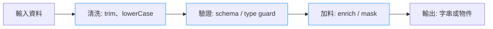

# 函數組合、Point-Free 與管線化（Pipe/Compose）

> 📝 TL;DR
- `compose` 自右向左、`pipe` 自左向右，本質都是把小函數串成「資料處理工廠」。
- Point-Free 聚焦意圖、減少暫存變數，但過度會難除錯；加 `tap/log` 與好的命名降低風險。
- 實務上可結合 Ramda 自動柯里化、RxJS/TaskEither 處理 async 與錯誤，資料大時用 lazy/transducer 減少重複迭代。

## 前置知識
- 箭頭函式與柯里化
- 陣列高階函式：`map`、`filter`、`reduce`
- Promise / async-await 基本用法

## 一圖看懂資料流



## Pipe vs Compose：怎麼選？

| 觀點       | Compose             | Pipe                   |
| :--------- | :------------------ | :--------------------- |
| 方向       | 右 → 左（數學寫法） | 左 → 右（敘事友善）    |
| 可讀性     | 適合短鏈或學術背景  | 適合長鏈、團隊合作     |
| Ramda 介面 | `compose`           | `pipe` / `flow`        |
| 推薦場景   | 與既有 compose 串接 | 新功能、需要插入除錯時 |

> 習慣：新增功能盡量用 `pipe`，因為閱讀方向與除錯點插入都比較直覺。

## 手寫 Pipe / Compose（同步版）

```javascript
const compose = (...fns) => x => fns.reduceRight((acc, fn) => fn(acc), x);
const pipe = (...fns) => x => fns.reduce((acc, fn) => fn(acc), x);

const add1 = x => x + 1;
const square = x => x * x;

pipe(add1, square)(2);   // 9
compose(square, add1)(2); // 9
```

> 多參數函數請先柯里化成「單參數版」，才能安全丟進 pipe。

```javascript
const add = a => b => a + b;
const multiply = a => b => a * b;

pipe(add(2), multiply(3))(4); // 18
```

## Point-Free：少打參數，多說意圖

```javascript
// 傳統寫法
const shout = str => str.trim().toUpperCase() + '!';

// Point-Free（搭配自動柯里化）
import { pipe, trim, toUpper, concat } from 'ramda';
const shout = pipe(trim, toUpper, concat('!'));
```

優點：移除暫存變數、聚焦邏輯；缺點：堆疊深，除錯需 `tap(console.log)` 或 `pipeWith` 注入 logger。

## 進階：非同步 + 型別守護

```typescript
import { pipe } from 'ramda';
import * as TE from 'fp-ts/TaskEither';

const fetchUsers = () => TE.tryCatch(
  () => fetch('/api/users').then(r => r.json()),
  e => `network error: ${String(e)}`
);

const normalize = u => ({ name: u.name?.trim(), email: u.email?.toLowerCase() });
const isValid = u => Boolean(u.email);

const program = pipe(
  fetchUsers,
  TE.map(users => users.filter(isValid).map(normalize)),
  TE.map(users => users.map(u => `${u.name} <${u.email}>`).join('\n'))
)();

program().then(console.log);
```

- `TaskEither` 讓錯誤路徑也在管線內，對齊 async / success / failure 三者的行為。
- 若用 RxJS，思路相同：`pipe(map, filter, tap)` 連接 Observable；最後才做副作用。

## 效能與可維護性
- 避免多次中間陣列：多個 `map/filter` 可改 transducer，合併為一次迭代。
- 長鏈加觀測點：`pipe(step1, tap(log), step2...)`，壞資料一眼看出。
- 副作用留在末端，前段保持純函數以利測試。
- 資料量大或只取前幾筆時，改用 lazy（生成器 / RxJS）減少記憶體壓力。

## 實戰練習

### 練習 1：Pipe 重構（簡單）⭐
> 把下列程式改成 `pipe`：
> ```javascript
> const format = str => str.trim().toLowerCase();
> const addTag = str => `[tag] ${str}`;
> const result = addTag(format(input));
> ```

:::details 💡 參考答案
```javascript
import { pipe } from 'ramda';

const format = pipe(
  str => str.trim(),
  str => str.toLowerCase(),
  str => `[tag] ${str}`
);

format(input);
```
:::

### 練習 2：Point-Free 判斷（簡單）⭐
> 寫一個 `isAdult`，資料格式 `{ age: number }`，要求 Point-Free。

:::details 💡 參考答案
```javascript
import { pipe, prop, gte } from 'ramda';

const isAdult = pipe(prop('age'), gte(18));

isAdult({ age: 20 }); // true
```
:::

### 練習 3：非同步管線（中等）⭐⭐
> 需求：取得 `/api/posts`，
> 1) 篩掉沒有 `title` 的項目；
> 2) 只保留 `title` 與 `slug`；
> 3) 回傳字串，每行一篇；
> 請用 `TaskEither` 或 Promise + `pipe` 完成。

:::details 💡 參考答案與提示
```typescript
import { pipe, filter, map, pick, join } from 'ramda';
import * as TE from 'fp-ts/TaskEither';

const pipeline = pipe(
  filter(p => p.title),
  map(pick(['title', 'slug'])),
  posts => join('\n', posts.map(p => `${p.title} - /blog/${p.slug}`))
);

const program = TE.tryCatch(
  () => fetch('/api/posts').then(r => r.json()).then(pipeline),
  e => `fetch failed: ${String(e)}`
);

program().then(console.log);
```
:::

## FAQ
- Pipe 與 Compose 有性能差嗎？差異極小，效能取決於每個函數做的事與迭代次數。
- Point-Free 很難 debug？加 `tap(console.log)` 或 `pipeWith` 注入 logger；必要時退回具名參數版。
- 何時用惰性求值？資料量大、只需前幾筆或要避免多次中間陣列時，改用生成器/RxJS。

## 延伸閱讀
- Ramda 官方文件：`pipe` / `compose`
- RxJS 官方文件：`pipe` 與常用 operators
- fp-ts `TaskEither` 指南：把錯誤路徑納入型別
- Kyle Shevlin：Just Enough FP 系列（Composition、Point-Free）

## 小結
- `pipe/compose` 讓小函數拼成可讀的資料流，適合逐步重構既有迴圈。
- Point-Free 提升意圖清晰，但務必搭配除錯鉤子與良好命名。
- 副作用後置、必要時用 lazy/transducer，讓管線同時兼顧性能與可測試性。---
