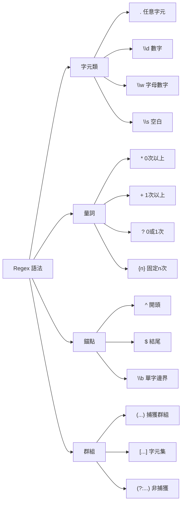

---
head:
  - - meta
    - name: author
      content: 許恩綸
  - - meta
    - name: keywords
      content: JavaScript,Regex,正規表達式,RegExp,pattern,matchAll
  - - meta
    - property: og:title
      content: JavaScript 正規表達式完全指南：從基礎到實戰
  - - meta
    - property: og:description
      content: 詳解 JavaScript Regex 語法、常用模式、matchAll/exec/test 方法，包含實戰案例與線上工具
  - - meta
    - property: og:type
      content: article
---

# JavaScript 正規表達式（Regex）

> 📝 TL;DR：正規表達式（Regular Expression）用於文字比對與搜尋。核心語法：`.`（任意字元）、`\d`（數字）、`\w`（字母數字）、`+`（1次以上）、`*`（0次以上）、`?`（0或1次）。JavaScript 提供 `test()`、`match()`、`matchAll()`、`exec()` 等方法。推薦使用 [regex101.com](https://regex101.com/) 線上測試。

##  前置知識
- 了解 JavaScript 字串操作
- 知道迴圈與陣列方法
- 會使用瀏覽器開發者工具

##  Regex 基礎語法



### 常用模式速查表

| 模式     | 說明               | 範例        | 符合                | 不符合       |
| -------- | ------------------ | ----------- | ------------------- | ------------ |
| `\d`     | 數字（0-9）        | `/\d{3}/`   | `123`               | `abc`        |
| `\w`     | 字母數字底線       | `/\w+/`     | `hello_123`         | `@#$`        |
| `\s`     | 空白字元           | `/\s+/`     | 空格、Tab           | `abc`        |
| `.`      | 任意字元（除換行） | `/a.c/`     | `abc`, `a1c`        | `ac`         |
| `[abc]`  | a 或 b 或 c        | `/[aeiou]/` | `a`, `e`            | `x`          |
| `[^abc]` | 非 a、b、c         | `/[^0-9]/`  | `a`, `#`            | `5`          |
| `^`      | 開頭錨點           | `/^Hello/`  | `Hello World`       | `Say Hello`  |
| `$`      | 結尾錨點           | `/\.com$/`  | `google.com`        | `com.tw`     |
| `*`      | 0 次以上           | `/ab*c/`    | `ac`, `abc`, `abbc` | `a`          |
| `+`      | 1 次以上           | `/ab+c/`    | `abc`, `abbc`       | `ac`         |
| `?`      | 0 或 1 次          | `/colou?r/` | `color`, `colour`   | `colouur`    |
| `{n}`    | 固定 n 次          | `/\d{3}/`   | `123`               | `12`, `1234` |
| `{n,m}`  | n 到 m 次          | `/\d{2,4}/` | `12`, `123`, `1234` | `1`          |

##  JavaScript Regex 方法

### 1. `test()` - 檢查是否符合

```javascript
const regex = /hello/i; // i = 不分大小寫
console.log(regex.test('Hello World')); // true
console.log(regex.test('Goodbye'));     // false
```

### 2. `match()` - 取得符合結果

```javascript
const text = 'My phone: 0912-345-678';
const result = text.match(/\d{4}-\d{3}-\d{3}/);
console.log(result[0]); // '0912-345-678'
```

### 3. `matchAll()` - 取得所有符合結果（需要 g 旗標）

```javascript
const text = 'Email: john@example.com, mary@test.org';
const regex = /\w+@\w+\.\w+/g; // g = 全域搜尋

const matches = [...text.matchAll(regex)];
matches.forEach(match => {
  console.log(match[0]); // john@example.com, mary@test.org
});
```

### 4. `replace()` - 替換符合內容

```javascript
const text = '聯絡電話：0912-345-678';
const hidden = text.replace(/\d{4}-(\d{3})-\d{3}/, '****-$1-***');
console.log(hidden); // '聯絡電話：****-345-***'
```

##  實戰案例

### 案例 1：解析文章標籤

```javascript
const article = `
這篇文章的標籤：#JavaScript #Regex #教學 #Web開發
記得追蹤 @LucasHsu 獲取更多內容！
`;

// 提取所有 hashtag
const hashtagRegex = /#[\w\u4e00-\u9fa5]+/g;
const hashtags = [...article.matchAll(hashtagRegex)].map(m => m[0]);
console.log(hashtags); 
// ['#JavaScript', '#Regex', '#教學', '#Web開發']

// 提取所有 mention
const mentionRegex = /@\w+/g;
const mentions = [...article.matchAll(mentionRegex)].map(m => m[0]);
console.log(mentions); 
// ['@LucasHsu']
```

**知識點：**
- `\u4e00-\u9fa5`：Unicode 範圍，匹配中文字元
- `map(m => m[0])`：提取每個 match 的完整字串

---

### 案例 2：驗證表單輸入

```javascript
// Email 驗證
function validateEmail(email) {
  const regex = /^[a-zA-Z0-9._-]+@[a-zA-Z0-9.-]+\.[a-zA-Z]{2,}$/;
  return regex.test(email);
}

console.log(validateEmail('lucas@example.com')); // true
console.log(validateEmail('invalid-email'));     // false

// 台灣手機號碼驗證（09開頭，共10碼）
function validateTWPhone(phone) {
  const regex = /^09\d{8}$/;
  return regex.test(phone);
}

console.log(validateTWPhone('0912345678')); // true
console.log(validateTWPhone('0812345678')); // false（非09開頭）

// 密碼強度檢查（至少8碼，包含大小寫、數字）
function validatePassword(password) {
  const hasLower = /[a-z]/.test(password);
  const hasUpper = /[A-Z]/.test(password);
  const hasNumber = /\d/.test(password);
  const isLongEnough = password.length >= 8;
  
  return hasLower && hasUpper && hasNumber && isLongEnough;
}

console.log(validatePassword('Abc12345')); // true
console.log(validatePassword('abc12345')); // false（缺大寫）
```

---

### 案例 3：處理檔案路徑

```javascript
const fs = require('fs');

// 讀取檔案並提取所有圖片路徑
fs.readFile('article.md', 'utf-8', (err, data) => {
  if (err) throw err;
  
  // Markdown 圖片語法：
  const imgRegex = /!\[.*?\]\((.*?)\)/g;
  const images = [...data.matchAll(imgRegex)].map(m => m[1]);
  
  console.log('文章中的圖片：', images);
  // ['./images/cover.jpg', './images/diagram.png', ...]
});
```

**知識點：**
- `.*?`：非貪婪匹配（最短符合）
- `(.*?)`：捕獲群組，透過 `m[1]` 取得
- `\(...\)`：跳脫括號字元

---

### 案例 4：批次處理檔名

```javascript
const fs = require('fs');

// 批次重命名檔案（移除空格、統一小寫）
fs.readdir('./', (err, files) => {
  if (err) throw err;
  
  files.forEach(file => {
    // 只處理圖片檔
    if (!/\.(jpg|png|gif)$/i.test(file)) return;
    
    // 移除空格並轉小寫
    const newName = file.replace(/\s+/g, '_').toLowerCase();
    
    if (file !== newName) {
      fs.rename(file, newName, err => {
        if (err) throw err;
        console.log(`重命名: ${file}  ${newName}`);
      });
    }
  });
});
```

**執行結果：**
```
重命名: My Photo 2024.JPG  my_photo_2024.jpg
重命名: Screenshot 01.png  screenshot_01.png
```

---

### 案例 5：從 HTML 中提取連結

```javascript
const html = `
<a href="https://example.com">Example</a>
<a href="/about">About</a>

`;

// 提取所有 href 屬性
const linkRegex = /href=["'](.*?)["']/g;
const links = [...html.matchAll(linkRegex)].map(m => m[1]);

console.log(links); 
// ['https://example.com', '/about']
```

##  線上工具推薦

| 工具         | 網址                                      | 特色                         |
| ------------ | ----------------------------------------- | ---------------------------- |
| **Regex101** | [regex101.com](https://regex101.com/)     | 即時測試、詳細解釋、社群範例 |
| **RegExr**   | [regexr.com](https://regexr.com/)         | 視覺化比對、參考手冊         |
| **RegexPal** | [regexpal.com](https://www.regexpal.com/) | 簡潔介面、即時反饋           |

##  實戰練習

### 練習 1（簡單）
寫一個函式驗證「身分證字號」：
- 第一碼為大寫英文字母
- 後面9碼為數字
- 共10碼

:::details 參考答案
```javascript
function validateID(id) {
  const regex = /^[A-Z]\d{9}$/;
  return regex.test(id);
}

console.log(validateID('A123456789')); // true
console.log(validateID('1234567890')); // false（開頭非字母）
console.log(validateID('A12345678'));  // false（不足10碼）
```

**知識點：**
- `^` 和 `$` 確保完整比對
- `[A-Z]` 只匹配大寫字母
- `\d{9}` 固定9個數字
:::

### 練習 2（簡單）
寫一個函式，將文字中的「電話號碼」隱藏（只顯示最後4碼）。

:::details 參考答案
```javascript
function maskPhone(text) {
  // 匹配 09 開頭的10碼電話
  const regex = /(09\d{2})-?(\d{3})-?(\d{3})/g;
  
  return text.replace(regex, '****-***-$3');
}

console.log(maskPhone('我的電話是 0912-345-678'));
// '我的電話是 ****-***-678'

console.log(maskPhone('聯絡方式：0987654321'));
// '聯絡方式：****-***-321'
```

**知識點：**
- `-?` 表示連字號可有可無
- `$3` 引用第三個捕獲群組
:::

### 練習 3（中等）
寫一個函式解析「日誌檔」，提取所有錯誤訊息（格式：`[ERROR] 訊息內容`），並統計錯誤次數。

:::details 參考答案與思路
```javascript
function parseErrorLog(logText) {
  // 匹配 [ERROR] 開頭的行
  const errorRegex = /\[ERROR\]\s+(.+)/g;
  
  // 提取所有錯誤訊息
  const errors = [...logText.matchAll(errorRegex)].map(m => m[1]);
  
  // 統計各錯誤出現次數
  const errorCount = {};
  errors.forEach(error => {
    errorCount[error] = (errorCount[error] || 0) + 1;
  });
  
  return {
    total: errors.length,
    errors: errorCount
  };
}

// 測試
const log = `
[INFO] 伺服器啟動
[ERROR] 資料庫連線失敗
[WARN] 記憶體使用率過高
[ERROR] 資料庫連線失敗
[ERROR] 找不到設定檔
`;

const result = parseErrorLog(log);
console.log(result);
/*
{
  total: 3,
  errors: {
    '資料庫連線失敗': 2,
    '找不到設定檔': 1
  }
}
*/
```

**思路：**
1. 用 `matchAll` 找出所有 [ERROR] 行
2. 用 `map(m => m[1])` 提取錯誤訊息（群組1）
3. 用物件統計各錯誤出現次數
4. 回傳總數與詳細統計

**進階：篩選特定錯誤**
```javascript
function filterErrors(logText, keyword) {
  const errorRegex = /\[ERROR\]\s+(.+)/g;
  const errors = [...logText.matchAll(errorRegex)].map(m => m[1]);
  return errors.filter(err => err.includes(keyword));
}

console.log(filterErrors(log, '資料庫'));
// ['資料庫連線失敗', '資料庫連線失敗']
```
:::

##  FAQ

### Q: Regex 的 `g`、`i`、`m` 旗標是什麼？
- `g`（global）：全域搜尋，找出所有符合項目
- `i`（ignore case）：不分大小寫
- `m`（multiline）：多行模式，`^` 和 `$` 匹配每行開頭/結尾

```javascript
const regex = /hello/gi; // 全域 + 不分大小寫
```

### Q: `.*` 和 `.*?` 的差異？
- `.*`：**貪婪匹配**（盡可能長）
- `.*?`：**非貪婪匹配**（盡可能短）

```javascript
const text = '<div>Hello</div><div>World</div>';
console.log(text.match(/<div>.*<\/div>/)[0]);  // '<div>Hello</div><div>World</div>'
console.log(text.match(/<div>.*?<\/div>/)[0]); // '<div>Hello</div>'
```

### Q: 如何匹配中文字元？
使用 Unicode 範圍：`[\u4e00-\u9fa5]`

```javascript
const regex = /[\u4e00-\u9fa5]+/g;
console.log('Hello你好123'.match(regex)); // ['你好']
```

##  延伸閱讀
- [MDN: 正規表達式](https://developer.mozilla.org/docs/Web/JavaScript/Guide/Regular_Expressions)
- [Regex101](https://regex101.com/) - 線上測試工具
- [RegexOne](https://regexone.com/) - 互動式教學
- [JavaScript.info: 正規表達式](https://javascript.info/regular-expressions)

##  總結
1. Regex 是強大的文字處理工具，適用於驗證、提取、替換。
2. 基礎語法：`\d` 數字、`\w` 字母、`+` 1次以上、`*` 0次以上。
3. JavaScript 方法：`test()` 檢查、`match()`/`matchAll()` 提取、`replace()` 替換。
4. 善用線上工具（regex101.com）測試與學習。
5. 避免過度複雜的 Regex，可讀性比效能更重要。
