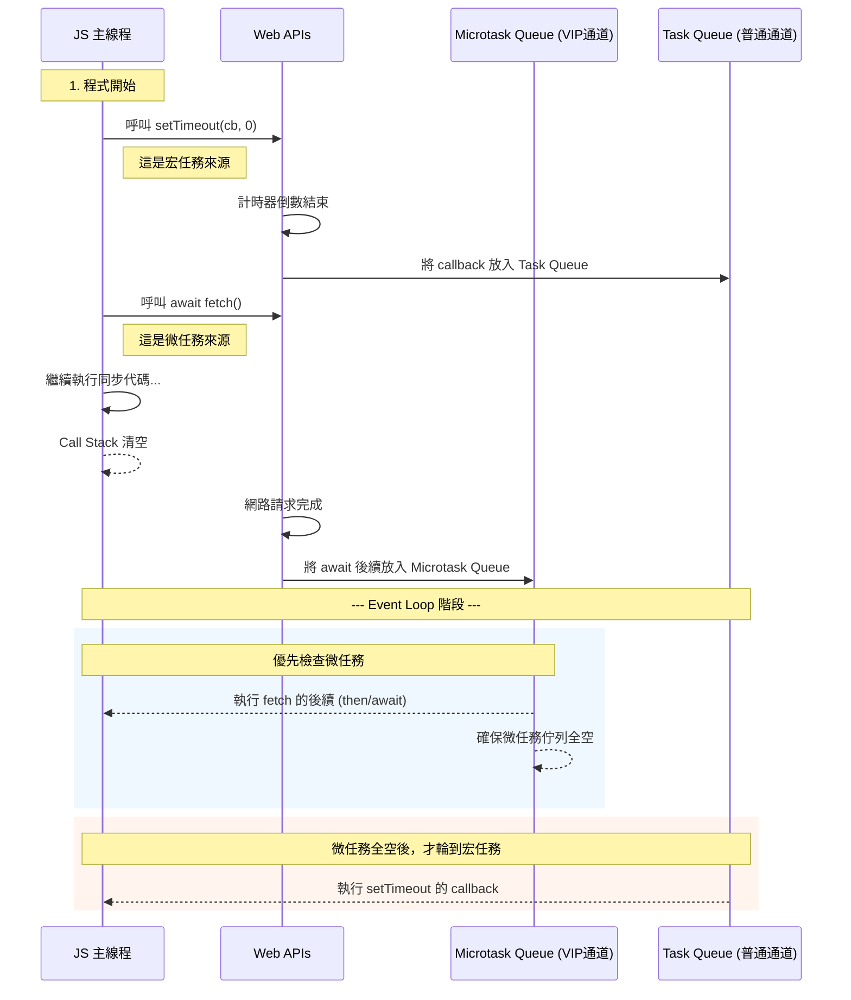

---
head:
  - - meta
    - name: author
      content: 許恩綸
  - - meta
    - name: keywords
      content: 非同步,異同步,promise,javascript,async,await
  - - meta
    - property: og:title
      content: 非同步是什麼?能吃嗎?
  - - meta
    - property: og:description
      content: 利用準備早餐的例子，快速了解異步（Asynchronous）與同步（Synchronous）的差別
  - - meta
    - property: og:type
      content: article
  - - meta
    - property: og:image
      content: https://lucashsu95.github.io/LucasHsu.dev/images/javascript-cover.jpg
  - - meta
    - name: description
      content: 用早餐流程解釋同步與異步、Promise、async/await，含錯誤處理、事件迴圈與練習題。
---

# 異同步 - Asynchronous

> 📝 TL;DR

- 同步會阻塞主執行緒；異步把耗時工作交給背景，主流程繼續跑。
- Promise 是「未來值」的容器，`then/catch` 或 `async/await` 都在等它 resolve/reject。
- 實務要處理：錯誤傳遞、執行順序（串行/並行）、取消與逾時（例如 `AbortController`）。

## 前置知識

- JavaScript 單執行緒、事件迴圈、工作佇列（task queue、microtask queue）。
- ES6 模組與 `import` 基本用法。
- HTTP 會花時間且可能失敗：請求逾時、連線中斷。

## 什麼是異步編程？

在 JavaScript 中，異步（Asynchronous）與同步（Synchronous）相對。

同步編程是指代碼按順序執行，而異步編程則允許某些任務在後台進行，主程序可以繼續執行其他代碼。

例如，當你從網路獲取資料時，如果使用同步方式，程式會停下來等資料回來；而使用異步方式，程式可以在等待資料的同時做其他事情。

## 準備早餐的例子

想像一下，你早上起床後決定準備早餐~~不要跟我說你不吃早餐~~。你有幾個任務需要完成：

1. 煮咖啡
2. 烤吐司
3. 煎蛋

### 同步方式

如果你使用同步方式，你會這樣做：

1. 開始煮咖啡，等咖啡煮好（這可能需要幾分鐘）。
2. 然後開始烤吐司，等吐司烤好。
3. 最後煎蛋。

在這種情況下，你必須等每個任務完成後才能開始下一個，這樣會**浪費時間**。

### 異步方式

如果使用異步方式，你可以這樣做：

1. 開始煮咖啡（這是耗時的任務），然後把鍋子放在爐子上。
2. 同時開始烤吐司（也放進烤箱）。
3. 最後開始煎蛋。

在這種情況下，你不需要等咖啡煮好就去烤吐司和煎蛋，所有任務可以同時進行，這樣可以更快地完成早餐。

## Promise

先把基本操作講完，後面再來實作

**Promise** 是一種用於處理異步操作的物件，它代表了一個尚未完成但預計會在將來完成的操作。Promise 有三種狀態：待定（pending）、已解決（fulfilled）、已拒絕（rejected）。

### 什麼時候用 Promise？

- 需要等待的任務：打 API、讀檔案、計時器。
- 想避免巢狀回呼，讓成功與失敗集中處理。

### 常見錯誤處理手法

- `then().catch()`：簡單串接即可。
- `async/await` + `try/catch`：直覺，適合長流程。
- 逾時保護：`Promise.race([work, timeoutPromise])`。

### 範例

```javascript
let myPromise = new Promise((resolve, reject) => {
    let success = true; // 假設這是一個隨機結果(可以是true或是false)
    setTimeout(() => {
        if (success) {
            resolve("成功！"); // 當任務成功時調用 resolve
        } else {
            reject("失敗！"); // 當任務失敗時調用 reject
        }
    }, 2000); // 模擬一個耗時的操作
});

// 使用 .then() 處理結果
myPromise.then(result => {
    console.log(result); // 輸出: 成功！
}).catch(error => {
    console.log(error); // 輸出: 失敗！
});
```

在這個範例中，我們創建了一個 Promise，模擬了一個耗時兩秒的操作。當操作成功時，會調用 `resolve`，並在 `.then()` 中處理結果；如果失敗，則調用 `reject`，並在 `.catch()` 中處理錯誤。

### 錯誤包裝與逾時保護

```javascript
const delay = (ms) => new Promise((resolve) => setTimeout(resolve, ms));

const fetchWithTimeout = (url, { timeout = 3000 } = {}) => {
    const controller = new AbortController();
    const timer = delay(timeout).then(() => controller.abort());

    const request = fetch(url, { signal: controller.signal });

    return Promise.race([request, timer]).catch((error) => {
        if (error.name === "AbortError") return Promise.reject("請求逾時");
        return Promise.reject(error.message || "未知錯誤");
    });
};
```

這段示範了：
- 用 `Promise.race` 做逾時保護；
- 透過 `AbortController` 取消請求，避免資源浪費。

## async/await

**async/await** 是基於 Promise 的語法糖，使得異步代碼看起來更像同步代碼。使用 `async` 關鍵字定義一個函數為異步函數，而 `await` 用來暫停函數的執行直到 Promise 被解決。

### 範例

```javascript
async function fetchData() {
    try {
        let result = await myPromise; // 等待 myPromise 完成
        console.log(result); // 輸出: 成功！
    } catch (error) {
        console.log(error); // 輸出: 失敗！
    }
}

fetchData(); // 調用異步函數
```

在這個範例中，我們定義了一個 `fetchData` 的異步函數。在這裡，我們使用 `await` 來等待 `myPromise` 的結果。如果 Promise 被解決，就會輸出成功的訊息；如果被拒絕，就會捕獲錯誤並輸出。

### 串行 vs 並行

```javascript
// 串行：依序等待，總時間 ≈ 所有任務時間總和
async function serial() {
    const coffee = await makeCoffee();
    const toast = await makeToast();
    return [coffee, toast];
}

// 並行：同時開工，總時間 ≈ 最慢任務
async function parallel() {
    const [coffee, toast] = await Promise.all([makeCoffee(), makeToast()]);
    return [coffee, toast];
}
```

選擇原則：
- 有相依性就串行（例如先拿 token 再打 API）。
- 沒相依性就並行（例如多支列表 API）。


## 實作 - 準備早餐

前面看不懂嗎?沒關係~~我也不懂~~，在最面前有個早餐的例子我們來實作它

### 同步版本

使用同步版本就是**等一件事做好才做下一件事**，很浪費時間，但我們先來實作這個方法

### 範例一：同步方式準備早餐

在這個範例中，我們將使用同步方式來準備早餐。這意味著每個任務都必須等前一個任務完成後才能開始。

```javascript
function makeCoffee() {
    console.log("開始煮咖啡...");
    // 模擬煮咖啡需要2秒
    const start = Date.now();
    while (Date.now() - start < 2000) {} // 等待2秒
    console.log("咖啡好了！");
}

function makeToast() {
    console.log("開始烤吐司...");
    // 模擬烤吐司需要1.5秒
    const start = Date.now();
    while (Date.now() - start < 1500) {} // 等待1.5秒
    console.log("吐司烤好了！");
}

function fryEgg() {
    console.log("開始煎蛋...");
    // 模擬煎蛋需要1秒
    const start = Date.now();
    while (Date.now() - start < 1000) {} // 等待1秒
    console.log("蛋煎好了！");
}

// 同步執行所有任務
function prepareBreakfastSync() {
    makeCoffee();
    makeToast();
    fryEgg();
    
    console.log("早餐準備完成，可以享用了！");
}

// 調用同步準備早餐的函數
prepareBreakfastSync();
```

#### 同步範例解說

在這個範例中，`makeCoffee`、`makeToast` 和 `fryEgg` 函數都使用了 `while` 迴圈來模擬耗時操作。這意味著在每個任務完成之前，程式會被阻塞，無法執行其他任何操作。最終的輸出會是：

```
開始煮咖啡...
咖啡好了！
開始烤吐司...
吐司烤好了！
開始煎蛋...
蛋煎好了！
早餐準備完成，可以享用了！
```

### 範例二：異步方式準備早餐

在這個範例中，我們將使用異步方式來準備早餐。這樣可以在等待某個任務完成的同時執行其他任務。

::: info 小知識
`setTimeout()`是一個非同步的函數喔。當你使用`setTimeout()`設定一段延遲後執行某個函數時，JavaScript 不會等待這段時間結束，而是會繼續執行後面的程式碼。這使得 `setTimeout()` 能夠在背景中計時，同時不會阻塞主執行緒。
:::

```javascript
function makeCoffee() {
    return new Promise((resolve) => {
        console.log("開始煮咖啡...");
        setTimeout(() => {
            resolve("咖啡好了！"); // 模擬煮咖啡需要2秒
        }, 2000);
    });
}

function makeToast() {
    return new Promise((resolve) => {
        console.log("開始烤吐司...");
        setTimeout(() => {
            resolve("吐司烤好了！"); // 模擬烤吐司需要1.5秒
        }, 1500);
    });
}

function fryEgg() {
    return new Promise((resolve) => {
        console.log("開始煎蛋...");
        setTimeout(() => {
            resolve("蛋煎好了！"); // 模擬煎蛋需要1秒
        }, 1000);
    });
}

// 使用 async/await 函數來準備早餐
async function prepareBreakfastAsync() {
    const coffee = await makeCoffee(); // 等待咖啡做好
    console.log(coffee); // 輸出: 咖啡好了！

    const toast = await makeToast(); // 等待吐司烤好
    console.log(toast); // 輸出: 吐司烤好了！

    const egg = await fryEgg(); // 等待蛋煎好
    console.log(egg); // 輸出: 蛋煎好了！

    console.log("早餐準備完成，可以享用了！");
}

// 調用異步準備早餐的函數
prepareBreakfastAsync();
```

#### 異步範例解說

在這個範例中，`makeCoffee`、`makeToast` 和 `fryEgg` 函數返回 Promise，並使用 `setTimeout` 來模擬耗時操作。在 `prepareBreakfastAsync` 函數中，我們使用 `await` 等待每個任務完成，但因為每個任務都是異步的，所以整體過程不會被阻塞。

#### 最終輸出

當你執行這段異步代碼時，你會看到類似以下的輸出（大約需要 2 秒）：

```
開始煮咖啡...
開始烤吐司...
開始煎蛋...
咖啡好了！
吐司烤好了！
蛋煎好了！
早餐準備完成，可以享用了！
```

透過以上兩個範例，我們可以清楚地看到異步編程的優勢。<br>
在同步方式中，每個任務必須等前一個完成後才能開始，導致整體過程變慢。<br>
而在異步方式中，所有任務可以同時進行，提高了效率，使得整體流程更加流暢。

## 事件迴圈視覺化



## 實戰練習

### 練習 1：錯誤處理（簡單）⭐
> 使用 `fetch("https://hp-api.onrender.com/api/spells")`，加上 3 秒逾時機制與錯誤提示。

:::details 💡 參考答案
```javascript
const withTimeout = (promise, ms = 3000) =>
    Promise.race([
        promise,
        new Promise((_, reject) =>
            setTimeout(() => reject(new Error("請求逾時")), ms)
        ),
    ]);

withTimeout(fetch("https://hp-api.onrender.com/api/spells"))
    .then((res) => res.json())
    .then((data) => console.log("spells", data.length))
    .catch((err) => console.error(err.message));
```
:::

### 練習 2：並行請求（簡單）⭐
> 同時請求兩個公開 API，合併後印出各自的資料筆數。

:::details 💡 參考答案
```javascript
const spellPromise = fetch("https://hp-api.onrender.com/api/spells").then((r) =>
    r.json()
);
const nationPromise = fetch(
    "https://datausa.io/api/data?drilldowns=Nation&measures=Population"
).then((r) => r.json());

Promise.all([spellPromise, nationPromise])
    .then(([spells, nations]) => {
        console.log("spells:", spells.length);
        console.log("nations:", nations.data.length);
    })
    .catch((err) => console.error(err));
```
:::

### 練習 3：取消請求（中等）⭐⭐
> 使用 `AbortController` 在 1 秒內取消 fetch，並在 UI 顯示「已取消」。

:::details 💡 參考答案與提示
**提示：**
1. 建立 `const controller = new AbortController()`。
2. 將 `signal` 傳給 `fetch`。
3. 用 `setTimeout(() => controller.abort(), 1000)` 取消。

**參考答案：**
```javascript
const controller = new AbortController();
const timer = setTimeout(() => controller.abort(), 1000);

fetch("https://hp-api.onrender.com/api/spells", { signal: controller.signal })
    .then((res) => res.json())
    .then((data) => console.log("success", data.length))
    .catch((err) => {
        if (err.name === "AbortError") console.log("已取消");
        else console.error(err.message);
    })
    .finally(() => clearTimeout(timer));
```
:::

## 延伸閱讀

- [使用 fetch() 進行非同步資料獲取的基礎教學](./fetch)
- [Axios - next.js](./axios)
- [MDN: Event loop](https://developer.mozilla.org/en-US/docs/Web/JavaScript/Event_loop)

## FAQ

- `then/catch` 與 `async/await` 差在哪？
    - 兩者等價；`async/await` 讀起來像同步，適合長流程；`then` 適合簡單鏈結或動態處理。
- `Promise.all` 和 `Promise.allSettled` 差異？
    - `all` 遇到一個 reject 就中斷；`allSettled` 會等待所有完成並回報狀態，適合「盡量收集結果」。
- 什麼時候需要取消請求？
    - 使用者切頁、輸入框快速輸入導致舊請求過時，或行動裝置節省流量時，可用 `AbortController` 取消。

