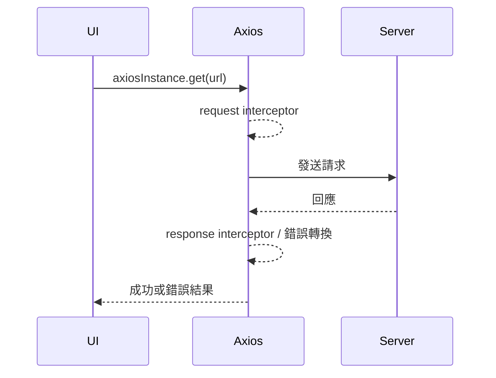

---
head:
  - - meta
    - name: author
      content: 許恩綸
  - - meta
    - name: keywords
      content: axios,javascript,next.js,react
  - - meta
    - property: og:title
      content: next.js - axios
  - - meta
    - property: og:description
      content: 使用axios實作 User CURD by Next.js - react
  - - meta
    - property: og:type
      content: article
  - - meta
    - property: og:image
      content: https://lucashsu95.github.io/LucasHsu.dev/images/javascript-cover.jpg
  - - meta
    - name: description
      content: Axios 基礎到進階：安裝、GET/POST、攔截器、錯誤處理、實戰範例與練習題。
---

# Axios - next.js

## TL;DR

- Axios 是基於 Promise 的 HTTP 客戶端，支援攔截器、預設值、取消請求與自動 JSON 轉換。
- 建議建立共用實例：設定 `baseURL`、`timeout`、標頭與錯誤攔截器。
- 與 fetch 相比：自動轉 JSON、內建逾時、攔截器好用；但需額外安裝套件。

## 前置知識

- Promise、async/await 的基本用法。
- HTTP 方法（GET/POST/PUT/PATCH/DELETE）與狀態碼。
- React/Next.js 基礎 Hook（`useEffect`/`useState`）。

## 下載

::: code-group

```bash [npm]
npm i axios
```
```bash [pnpm]
pnpm add axios
```
```bash [yarn]
yarn add axios
```
:::

## 初始化

創建`src/lib/axios.ts`

```tsx
import axios, { AxiosInstance } from "axios";

const axiosInstance: AxiosInstance = axios.create({
  baseURL: "",
  timeout: 5000,
  headers: {
    "Content-Type": "application/json",
  },
});

export default axiosInstance;
```

### 建議的錯誤攔截器

```ts
import axios from "axios";

const instance = axios.create({
  baseURL: "",
  timeout: 8000,
});

instance.interceptors.response.use(
  (res) => res,
  (error) => {
    if (error.code === "ECONNABORTED") {
      return Promise.reject("請求逾時");
    }
    if (error.response) {
      return Promise.reject(
        `HTTP ${error.response.status}: ${error.response.statusText}`
      );
    }
    return Promise.reject(error.message || "未知錯誤");
  }
);

export default instance;
```

## Get！發送請求

- api:`https://hp-api.onrender.com/api/spells`
- file_path:`/src/pages/spells.tsx`

::: code-group

```tsx [.then]
import { useEffect, useState } from "react";
import axiosInstance from "@/lib/axios";

interface ApiResponse {
  id: number;
  name: string;
  description: string;
}

export default function Sec1() {
  const [data, setData] = useState<ApiResponse[] | null>(null);
  const [error, setError] = useState<string | null>(null);
  useEffect(() => {
    const fetchData = () => {
      axiosInstance
        .get("https://hp-api.onrender.com/api/spells")
        .then((response) => {
          setData(response.data);
        })
        .catch((err) => {
          setError(
            err instanceof Error ? err.message : "An unknown error occurred"
          );
        });
    };
    fetchData();
  }, []);

  if (error) return <div>Error: {error}</div>;
  if (!data)
    return (
      <div className="h-screen w-screen z-50 bg-slate-200/75 flex justify-center items-center font-bold text-xl">
        Loading...
      </div>
    );

  return (
    <>
      <table className="border border-slate-600 m-5">
        <tbody>
          <tr>
            <td className="border-[5px] p-[5px] ">ID</td>
            <td className="border-[5px] p-[5px] ">name</td>
            <td className="border-[5px] p-[5px] ">description</td>
          </tr>
          {data.map((d) => (
            <tr key={d.id}>
              <td className="border-[5px] p-[5px] ">{d.id}</td>
              <td className="border-[5px] p-[5px] ">{d.name}</td>
              <td className="border-[5px] p-[5px] ">{d.description}</td>
            </tr>
          ))}
        </tbody>
      </table>
    </>
  );
}
```

```tsx [async await]
import { useEffect, useState } from "react";
import axiosInstance from "@/lib/axios";

interface ApiResponse {
  id: number;
  name: string;
  description: string;
}

export default function Sec1() {
  const [data, setData] = useState<ApiResponse[] | null>(null);
  const [error, setError] = useState<string | null>(null);
  useEffect(() => {
    const fetchData = async () => {
      try {
        const response = await axiosInstance.get(
          "https://hp-api.onrender.com/api/spells"
        );
        setData(response.data);
      } catch (err: unknown) {
        setError(
          err instanceof Error ? err.message : "An unknown error occurred"
        );
      }
    };
    fetchData();
  }, []);

  if (error) return <div>Error: {error}</div>;
  if (!data)
    return (
      <div className="h-screen w-screen z-50 bg-slate-200/75 flex justify-center items-center font-bold text-xl">
        Loading...
      </div>
    );
  return (
    <>
      <table className="border border-slate-600 m-5">
        <tbody>
          <tr>
            <td className="border-[5px] p-[5px] ">ID</td>
            <td className="border-[5px] p-[5px] ">name</td>
            <td className="border-[5px] p-[5px] ">description</td>
          </tr>
          {data.map((d) => (
            <tr key={d.id}>
              <td className="border-[5px] p-[5px] ">{d.id}</td>
              <td className="border-[5px] p-[5px] ">{d.name}</td>
              <td className="border-[5px] p-[5px] ">{d.description}</td>
            </tr>
          ))}
        </tbody>
      </table>
    </>
  );
}
```

:::

依上面的方式

換成打這支`https://datausa.io/api/data?drilldowns=Nation&measures=Population`來做做看
::: details 看答案
::: code-group

```tsx [.then]
import axiosInstance from "@/lib/axios";
import { useEffect, useState } from "react";

interface ApiData {
  ["ID Nation"]: string;
  Nation: string;
  ["ID Year"]: number;
  Year: string;
  Population: number;
  ["Slug Nation"]: string;
}

export default function Sec2() {
  const [data, setData] = useState<ApiData[] | null>(null);
  const [error, setError] = useState<string | null>(null);

  useEffect(() => {
    const fetchData = () => {
      axiosInstance
        .get(
          "https://datausa.io/api/data?drilldowns=Nation&measures=Population"
        )
        .then((response) => {
          console.log(response.data);
          setData(response.data.data);
        })

      ## POST 範例（帶錯誤處理與取消）

      ```ts
      import { useEffect, useState } from "react";
      import axiosInstance from "@/lib/axios";

      interface CreatePayload {
        title: string;
        body: string;
      }

      export default function CreatePost() {
        const [result, setResult] = useState<string>("");
        const [error, setError] = useState<string>("");

        useEffect(() => {
          const controller = new AbortController();
          const create = async () => {
            try {
              const payload: CreatePayload = { title: "demo", body: "hello" };
              const res = await axiosInstance.post(
                "https://jsonplaceholder.typicode.com/posts",
                payload,
                { signal: controller.signal }
              );
              setResult(`created id: ${res.data.id}`);
            } catch (err: unknown) {
              if ((err as Error).name === "CanceledError") return setError("已取消");
              setError((err as Error).message || "發生錯誤");
            }
          };
          create();
          return () => controller.abort();
        }, []);

        return <div>{error || result || "Submitting..."}</div>;
      }
      ```

      說明：
      - `signal` 可取消請求（React 卸載時避免 memory leak）。
      - 透過 `error.name` 區分取消與其他錯誤。
        .catch((err) => {
          setError(
            err instanceof Error ? err.message : "An unknown error occurred"
          );
        });
    };
    fetchData();
  }, []);

  if (error) return <div>Error: {error}</div>;
  if (!data)
    return (
      <div className="h-screen w-screen z-50 bg-slate-200/75 flex justify-center items-center font-bold text-xl">
        Loading...
      </div>
    );

  return (
    <>
      <table className="border border-slate-600 m-5">
        <tbody>
          <tr>
            <td className="border-[5px] p-[5px] ">ID Nation</td>
            <td className="border-[5px] p-[5px] ">Nation</td>
            <td className="border-[5px] p-[5px] ">ID Year</td>
            <td className="border-[5px] p-[5px] ">Year</td>
            <td className="border-[5px] p-[5px] ">Population</td>
            <td className="border-[5px] p-[5px] ">Slug Nation</td>
          </tr>
          {data.map((v) => (
            <tr key={v.Population}>
              <td className="border-[5px] p-[5px] ">{v["ID Nation"]}</td>
              <td className="border-[5px] p-[5px] ">{v.Nation}</td>
              <td className="border-[5px] p-[5px] ">{v["ID Year"]}</td>
              <td className="border-[5px] p-[5px] ">{v.Year}</td>
              <td className="border-[5px] p-[5px] ">{v.Population}</td>
              <td className="border-[5px] p-[5px] ">{v["Slug Nation"]}</td>
            </tr>
          ))}
        </tbody>
      </table>
    </>
  );
}
```

```tsx [async await]
import axiosInstance from "@/lib/axios";
import { useEffect, useState } from "react";

interface ApiData {
  ["ID Nation"]: string;
  Nation: string;
  ["ID Year"]: number;
  Year: string;
  Population: number;
  ["Slug Nation"]: string;
}

export default function Sec2() {
  const [data, setData] = useState<ApiData[] | null>(null);
  const [error, setError] = useState<string | null>(null);

  useEffect(() => {
    const fetchData = async () => {
      try {
        const response = await axiosInstance.get(
          "https://datausa.io/api/data?drilldowns=Nation&measures=Population"
        );
        console.log(response.data);
        setData(response.data.data);
      } catch (err: unknown) {
        setError(
          err instanceof Error ? err.message : "An unknown error occurred"
        );
      }
    };
    fetchData();
  }, []);

  if (error) return <div>Error: {error}</div>;
  if (!data)
    return (
      <div className="h-screen w-screen z-50 bg-slate-200/75 flex justify-center items-center font-bold text-xl">
        Loading...
      </div>
    );
  return (
    <>
      <table className="border border-slate-600 m-5">
        <tbody>
          <tr>
            <td className="border-[5px] p-[5px] ">ID Nation</td>
            <td className="border-[5px] p-[5px] ">Nation</td>
            <td className="border-[5px] p-[5px] ">ID Year</td>
            <td className="border-[5px] p-[5px] ">Year</td>
            <td className="border-[5px] p-[5px] ">Population</td>
            <td className="border-[5px] p-[5px] ">Slug Nation</td>
          </tr>
          {data.map((v) => (
            <tr key={v.Population}>
              <td className="border-[5px] p-[5px] ">{v["ID Nation"]}</td>
              <td className="border-[5px] p-[5px] ">{v.Nation}</td>
              <td className="border-[5px] p-[5px] ">{v["ID Year"]}</td>
              <td className="border-[5px] p-[5px] ">{v.Year}</td>
              <td className="border-[5px] p-[5px] ">{v.Population}</td>
              <td className="border-[5px] p-[5px] ">{v["Slug Nation"]}</td>
            </tr>
          ))}
        </tbody>
      </table>
    </>
  );
}
```
:::

## 使用者 增修改查 User CURD

### 後端

可以下載後端程式碼(python-Flask)

[user-mvc-with-flask - Github](https://github.com/lucashsu95/user-mvc-with-flask?tab=readme-ov-file)

### 前端


### 初始設定

`axios.ts`的`baseURL`改成`http://127.0.0.1:5000/api/`

#### /src/lib/axios.ts
```ts
import axios, { AxiosInstance } from "axios";

const axiosInstance: AxiosInstance = axios.create({
  baseURL: "http://127.0.0.1:5000/api/",
  timeout: 5000,
  headers: {
    "Content-Type": "application/json",
  },
});

export default axiosInstance;
```

#### /src/lib/ApiResponse.ts
```ts
export const API_RESPONSE = {
  MSG_EMAIL_EXISTS: "電子郵件已存在",
  MSG_USER_NOT_EXISTS: "使用者不存在",
  MSG_MISSING_FIELDS: "缺少欄位",
} as const;

type ApiResponseKey = keyof typeof API_RESPONSE;

type ApiResponseError = {
  response: {
    data: {
      message: string;
    };
  };
};

export function fail(error: ApiResponseError) {
  const errorMessage = error.response.data.message;
  return Object.keys(API_RESPONSE).includes(errorMessage as ApiResponseKey)
    ? API_RESPONSE[errorMessage as ApiResponseKey]
    : errorMessage;
}
```

這邊都先用`.then()`寫法~~`async/await`寫法就當課後練習~~

## 請求生命週期視覺化



## 實戰練習

### 練習 1：統一錯誤格式（簡單）⭐
> 在攔截器內將所有錯誤轉成 `{ message, status }`，並在元件內顯示。

:::details 💡 參考答案
```ts
instance.interceptors.response.use(
  (res) => res,
  (error) => {
    if (error.response)
      return Promise.reject({
        message: error.response.data?.message || error.response.statusText,
        status: error.response.status,
      });
    return Promise.reject({ message: error.message, status: 0 });
  }
);
```
:::

### 練習 2：並行請求（簡單）⭐
> 使用 `Promise.all` 同時請求 spells 與 population，印出總筆數。

:::details 💡 參考答案
```ts
Promise.all([
  axiosInstance.get("https://hp-api.onrender.com/api/spells"),
  axiosInstance.get(
    "https://datausa.io/api/data?drilldowns=Nation&measures=Population"
  ),
]).then(([a, b]) => {
  console.log("spells", a.data.length);
  console.log("nations", b.data.data.length);
});
```
:::

### 練習 3：取消與重試（中等）⭐⭐
> 打開頁面 1 秒內自動取消請求，並在 2 秒後重試一次。

:::details 💡 參考答案與提示
**提示：** 使用 `AbortController` 取消，`setTimeout` 排程重試。

**參考答案（核心片段）：**
```ts
const controller = new AbortController();
const timerCancel = setTimeout(() => controller.abort(), 1000);

const run = () =>
  axiosInstance
    .get("https://hp-api.onrender.com/api/spells", {
      signal: controller.signal,
    })
    .then((res) => console.log(res.data.length))
    .catch((err) => console.log(err.message || err));

run();
setTimeout(run, 2000);
```
:::

## 延伸閱讀

- [使用 fetch() 進行非同步資料獲取的基礎教學](./fetch)
- [HTTP 請求方法介紹](./http-request)
- [Axios 官方文件](https://axios-http.com/docs/intro)

## FAQ

- 何時選 Axios，何時選 fetch？
  - 需要攔截器、逾時、JSON 自動轉換時選 Axios；追求零依賴或在 Edge Runtime 可選 fetch。
- 如何處理取消？
  - Axios 1.4+ 支援 AbortController，將 `signal` 傳入 config 即可。
- 逾時錯誤如何判斷？
  - Axios 會以 `ECONNABORTED` 標示，或在攔截器裡判斷 `error.code`。

### 使用者列表 & 刪除使用者

`/src/pages/users/index.ts`

::: code-group

```tsx [.then]
import axiosInstance from "@/lib/axios";
import Link from "next/link";
import { useEffect, useState } from "react";
import Button from "@/components/ui/button";
import { fail } from "@/lib/ApiResponse";

interface User {
  id: number;
  name: string;
  email: string;
}

interface ApiResponse {
  success: boolean;
  data: User[];
  message: string;
}

export default function Home() {
  const [state, setState] = useState<ApiResponse | null>(null);
  const [error, setError] = useState<string | null>(null);

  useEffect(() => {
    axiosInstance
      .get<ApiResponse>("users")
      .then((res) => {
        setState(res.data);
      })
      .catch((err) => {
        setError(fail(err));
      });
  }, []);

  const handleDelete = (id: number) => {
    if (!confirm("確定要刪除嗎?")) return;

    axiosInstance
      .delete(`users/${id}`)
      .then(() => {
        alert("刪除成功");
        setState((prev) =>
          prev
            ? { ...prev, data: prev.data.filter((user) => user.id !== id) }
            : null
        );
      })
      .catch((err) => {
        setError(fail(err));
      });
  };

  if (error) return <div>Error:{error}</div>;
  if (!state)
    return (
      <div className="h-screen w-screen z-50 bg-slate-200/75 flex justify-center items-center font-bold text-xl">
        Loading...
      </div>
    );

  return (
    <div className="wraps flex-col">
      <section className="wrap space-y-5">
        <h1 className="text-2xl font-bold">User List</h1>

        <Button className="bg-sky-500 w-max">
          <Link href={"/users/create"}>新增使用者</Link>
        </Button>

        <table className="w-[800px] rounded-md overflow-hidden shadow divide-y divide-gray-200">
          <thead className="bg-gray-50">
            <tr>
              <th className="px-6 py-3 text-left text-xs font-medium text-gray-500 uppercase tracking-wider">
                Name
              </th>
              <th className="px-6 py-3 text-left text-xs font-medium text-gray-500 uppercase tracking-wider">
                Email
              </th>
              <th className="px-6 py-3 text-left text-xs font-medium text-gray-500 uppercase tracking-wider">
                Action
              </th>
            </tr>
          </thead>
          <tbody className="bg-white divide-y divide-gray-200">
            {state.data.map((user) => (
              <tr key={user.id}>
                <td className="px-6 py-4 whitespace-nowrap">{user.name}</td>
                <td className="px-6 py-4 whitespace-nowrap">{user.email}</td>
                <td>
                  <Button className="bg-amber-400">
                    <Link href={`/users/${user.id}`}>編輯</Link>
                  </Button>
                  <Button
                    className="bg-rose-400 sm:ms-1"
                    onClick={() => handleDelete(user.id)}
                  >
                    刪除
                  </Button>
                </td>
              </tr>
            ))}
          </tbody>
        </table>
      </section>
    </div>
  );
}
```

```tsx [async axios]
import axiosInstance from "@/lib/axios";
import Link from "next/link";
import { useEffect, useState } from "react";
import Button from "@/components/ui/button";
import { fail } from "@/lib/ApiResponse";

interface User {
  id: number;
  name: string;
  email: string;
}

interface ApiResponse {
  success: boolean;
  data: User[];
  message: string;
}

export default function Home() {
  const [state, setState] = useState<ApiResponse | null>(null);
  const [error, setError] = useState<string | null>(null);

  useEffect(async () => {
    try {
      const res = await axiosInstance.get<ApiResponse>("users")
      const data = setState(res.data)
    } catch(err) {
      setError(fail(err));
    }
  }, []);

  const handleDelete = async (id: number) => {
    if (!confirm("確定要刪除嗎?")) return;

    const res = await axiosInstance.delete(`users/${id}`)
    try {
      alert("刪除成功");
      setState((prev) =>
        prev
          ? { ...prev, data: prev.data.filter((user) => user.id !== id) }
          : null
    } catch (err){
      setError(fail(err));
    }
  };

  if (error) return <div>Error:{error}</div>;
  if (!state)
    return (
      <div className="h-screen w-screen z-50 bg-slate-200/75 flex justify-center items-center font-bold text-xl">
        Loading...
      </div>
    );

  return (
    <div className="wraps flex-col">
      <section className="wrap space-y-5">
        <h1 className="text-2xl font-bold">User List</h1>

        <Button className="bg-sky-500 w-max">
          <Link href={"/users/create"}>新增使用者</Link>
        </Button>

        <table className="w-[800px] rounded-md overflow-hidden shadow divide-y divide-gray-200">
          <thead className="bg-gray-50">
            <tr>
              <th className="px-6 py-3 text-left text-xs font-medium text-gray-500 uppercase tracking-wider">
                Name
              </th>
              <th className="px-6 py-3 text-left text-xs font-medium text-gray-500 uppercase tracking-wider">
                Email
              </th>
              <th className="px-6 py-3 text-left text-xs font-medium text-gray-500 uppercase tracking-wider">
                Action
              </th>
            </tr>
          </thead>
          <tbody className="bg-white divide-y divide-gray-200">
            {state.data.map((user) => (
              <tr key={user.id}>
                <td className="px-6 py-4 whitespace-nowrap">{user.name}</td>
                <td className="px-6 py-4 whitespace-nowrap">{user.email}</td>
                <td>
                  <Button className="bg-amber-400">
                    <Link href={`/users/${user.id}`}>編輯</Link>
                  </Button>
                  <Button
                    className="bg-rose-400 sm:ms-1"
                    onClick={() => handleDelete(user.id)}
                  >
                    刪除
                  </Button>
                </td>
              </tr>
            ))}
          </tbody>
        </table>
      </section>
    </div>
  );
}
```
:::

### 新增使用者

`/src/pages/users/create.tsx`

::: code-group
```tsx [.then]
import axiosInstance from "@/lib/axios";
import Link from "next/link";
import Button from "@/components/ui/button";
import { FormEvent, useState } from "react";
import { useRouter } from "next/router";
import { fail } from "@/lib/ApiResponse";

interface UserForm {
  name: string;
  email: string;
}

const UserPage = () => {
  const [formData, setFormData] = useState<UserForm | null>({
    name: "",
    email: "",
  });
  const [error, setError] = useState<string | null>(null);
  const router = useRouter();

  const handleSubmit = (e: FormEvent<HTMLFormElement>) => {
    e.preventDefault();
    axiosInstance
      .post(`users`, formData)
      .then(() => {
        router.push("/users");
      })
      .catch((err) => {
        setError(fail(err));
      });
  };

  if (!formData)
    return (
      <div className="h-screen w-screen z-50 bg-slate-200/75 flex justify-center items-center font-bold text-xl">
        Loading...
      </div>
    );

  if (error) return <div>Error: {error}</div>;

  return (
    <div className="wraps">
      <form
        onSubmit={handleSubmit}
        className="w-[400px] wrap mx-auto space-y-3 mt-5"
      >
        <Link href="/users" className="link">
          Back to Users
        </Link>
        <h1 className="text-xl font-bold">新增使用者</h1>
        <section className="space-y-5">
          <p>
            <label htmlFor="name">Name</label>
            <input
              type="text"
              id="name"
              className="input"
              value={formData.name}
              onChange={(e) =>
                setFormData((prev) =>
                  prev ? { ...prev, name: e.target.value } : prev
                )
              }
            />
          </p>
          <p>
            <label htmlFor="email">Email</label>
            <input
              type="text"
              id="email"
              className="input"
              value={formData.email}
              onChange={(e) =>
                setFormData((prev) =>
                  prev ? { ...prev, email: e.target.value } : prev
                )
              }
            />
          </p>
        </section>
        <Button className="mt-2">新增</Button>
      </form>
    </div>
  );
};

export default UserPage;
```

```tsx [async await]
import axiosInstance from "@/lib/axios";
import Link from "next/link";
import Button from "@/components/ui/button";
import { FormEvent, useState } from "react";
import { useRouter } from "next/router";
import { fail } from "@/lib/ApiResponse";

interface UserForm {
  name: string;
  email: string;
}

const UserPage = () => {
  const [formData, setFormData] = useState<UserForm | null>({
    name: "",
    email: "",
  });
  const [error, setError] = useState<string | null>(null);
  const router = useRouter();

  const handleSubmit = async (e: FormEvent<HTMLFormElement>) => {
    e.preventDefault();
    try {
      const res = await axiosInstance.post(`users`, formData)
      router.push("/users");
    } catch (err) {
      setError(fail(err));
    }
  };

  if (!formData)
    return (
      <div className="h-screen w-screen z-50 bg-slate-200/75 flex justify-center items-center font-bold text-xl">
        Loading...
      </div>
    );

  if (error) return <div>Error: {error}</div>;

  return (
    <div className="wraps">
      <form
        onSubmit={handleSubmit}
        className="w-[400px] wrap mx-auto space-y-3 mt-5"
      >
        <Link href="/users" className="link">
          Back to Users
        </Link>
        <h1 className="text-xl font-bold">新增使用者</h1>
        <section className="space-y-5">
          <p>
            <label htmlFor="name">Name</label>
            <input
              type="text"
              id="name"
              className="input"
              value={formData.name}
              onChange={(e) =>
                setFormData((prev) =>
                  prev ? { ...prev, name: e.target.value } : prev
                )
              }
            />
          </p>
          <p>
            <label htmlFor="email">Email</label>
            <input
              type="text"
              id="email"
              className="input"
              value={formData.email}
              onChange={(e) =>
                setFormData((prev) =>
                  prev ? { ...prev, email: e.target.value } : prev
                )
              }
            />
          </p>
        </section>
        <Button className="mt-2">新增</Button>
      </form>
    </div>
  );
};

export default UserPage;
```
:::

### 編輯使用者

`/src/pages/users/[id].tsx`
::: code-group

```tsx [.then]
import axiosInstance from "@/lib/axios";
import Link from "next/link";
import Button from "@/components/ui/button";
import { useEffect, useState } from "react";
import { useRouter } from "next/router";
import { fail } from "@/lib/ApiResponse";

interface FormData {
  id: number;
  name: string;
  email: string;
}

const UserPage = () => {
  const router = useRouter();
  const { id } = router.query;

  const [formData, setFormData] = useState<FormData | null>(null);
  const [loading, setLoading] = useState(true);
  const [error, setError] = useState<string | null>(null);

  useEffect(() => {
    if (!id) return;

    axiosInstance
      .get(`users/${id}`)
      .then((res) => {
        const { id, name, email } = res.data.data;
        setFormData({ id, name, email });
      })
      .catch((err) => {
        setError(fail(err));
      });

    setLoading(false);
  }, [id]);

  if (!formData) return <div>User not found</div>;

  const handleSubmit = (e: React.FormEvent<HTMLFormElement>) => {
    e.preventDefault();

    axiosInstance
      .put(`users/${formData.id}`, formData)
      .then(() => {
        alert("編輯成功");
        router.push("/users");
      })
      .catch((err) => {
        setError(fail(err));
      });
  };

  if (loading)
    return (
      <div className="h-screen w-screen z-50 bg-slate-200/75 flex justify-center items-center font-bold text-xl">
        Loading...
      </div>
    );

  if (error) return <div>Error: {error}</div>;

  return (
    <div className="wraps">
      <form
        onSubmit={handleSubmit}
        className="w-[400px] wrap mx-auto space-y-3 mt-5"
      >
        <Link href="/users" className="link">
          Back to Users
        </Link>
        <h1 className="text-xl font-bold">修改使用者</h1>
        <section className="space-y-5">
          <p>
            <label htmlFor="name">Name</label>
            <input
              type="text"
              id="name"
              className="input"
              value={formData.name}
              onChange={(e) =>
                setFormData((prev) => ({ ...prev!, name: e.target.value }))
              }
            />
          </p>
          <p>
            <label htmlFor="email">Email</label>
            <input
              type="text"
              id="email"
              className="input"
              value={formData.email}
              onChange={(e) =>
                setFormData((prev) => ({ ...prev!, email: e.target.value }))
              }
            />
          </p>
        </section>
        <Button className="mt-2">儲存</Button>
      </form>
    </div>
  );
};

export default UserPage;
```


```tsx [async await]
import axiosInstance from "@/lib/axios";
import Link from "next/link";
import Button from "@/components/ui/button";
import { useEffect, useState } from "react";
import { useRouter } from "next/router";
import { fail } from "@/lib/ApiResponse";

interface FormData {
  id: number;
  name: string;
  email: string;
}

const UserPage = () => {
  const router = useRouter();
  const { id } = router.query;

  const [formData, setFormData] = useState<FormData | null>(null);
  const [loading, setLoading] = useState(true);
  const [error, setError] = useState<string | null>(null);

  useEffect(async () => {
    if (!id) return;

    try {
      const res = await axiosInstance.get(`users/${id}`)
      const { id, name, email } = res.data.data;
      setFormData({ id, name, email });
    } catch (err) {
      setError(fail(err));
    }
    setLoading(false);
  }, [id]);

  if (!formData) return <div>User not found</div>;

  const handleSubmit = (e: React.FormEvent<HTMLFormElement>) => {
    e.preventDefault();

    try {
      const res = await axiosInstance.put(`users/${formData.id}`, formData)
      alert("編輯成功");
      router.push("/users");
    } catch (err) {
      setError(fail(err));
    }
  };

  if (loading)
    return (
      <div className="h-screen w-screen z-50 bg-slate-200/75 flex justify-center items-center font-bold text-xl">
        Loading...
      </div>
    );

  if (error) return <div>Error: {error}</div>;

  return (
    <div className="wraps">
      <form
        onSubmit={handleSubmit}
        className="w-[400px] wrap mx-auto space-y-3 mt-5"
      >
        <Link href="/users" className="link">
          Back to Users
        </Link>
        <h1 className="text-xl font-bold">修改使用者</h1>
        <section className="space-y-5">
          <p>
            <label htmlFor="name">Name</label>
            <input
              type="text"
              id="name"
              className="input"
              value={formData.name}
              onChange={(e) =>
                setFormData((prev) => ({ ...prev!, name: e.target.value }))
              }
            />
          </p>
          <p>
            <label htmlFor="email">Email</label>
            <input
              type="text"
              id="email"
              className="input"
              value={formData.email}
              onChange={(e) =>
                setFormData((prev) => ({ ...prev!, email: e.target.value }))
              }
            />
          </p>
        </section>
        <Button className="mt-2">儲存</Button>
      </form>
    </div>
  );
};

export default UserPage;
```

:::

看完整程式碼[Github](https://github.com/lucashsu95/axios-practise)