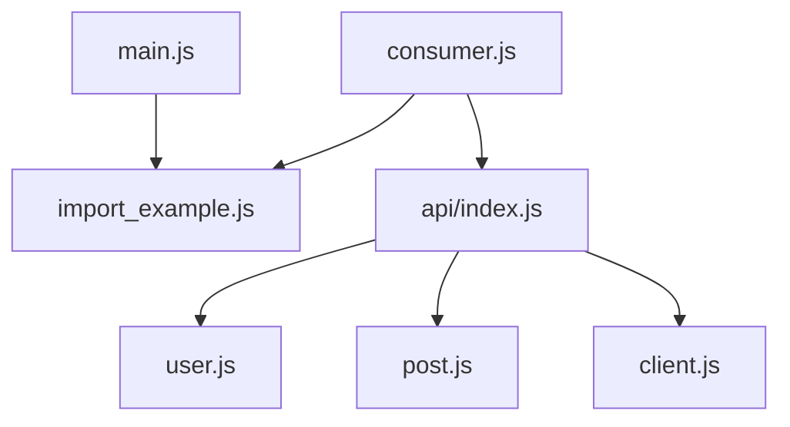

---
head:
  - - meta
    - name: author
      content: 許恩綸
  - - meta
    - name: keywords
      content: export, import, JavaScript, 模塊, ES6 模塊, JS 模塊, 模塊化
  - - meta
    - property: og:title
      content: JavaScript 中的 export 和 import
  - - meta
    - property: og:description
      content: 了解如何在 JavaScript 中使用 export 和 import 來模塊化你的代碼，並通過簡單的範例展示如何在 HTML 中引入 JavaScript 模塊。
  - - meta
    - property: og:type
      content: article
  - - meta
    - property: og:image
      content: https://lucashsu95.github.io/LucasHsu.dev/images/javascript-cover.jpg
  - - meta
    - name: description
      content: JavaScript ES modules 的 export/import 基礎、命名與預設匯出、重匯出、常見陷阱與練習題。
---

# 關於 export 和 import

檔案
- index.html
- main.js
- import_example.js

一個簡單的範例，記得在 HTML 檔裡引入 JS 檔的時候加上 `type="module"`。

## TL;DR

- ES modules 透過 `export` 暴露、`import` 引入；瀏覽器需 `type="module"`。
- 命名匯出可匯出多個值；預設匯出每檔僅一個，用 `export default`。
- 可以重命名：`import { foo as bar } from "./x.js"`；可重匯出：`export { foo } from "./x.js"`。

## 前置知識

- 了解瀏覽器模組載入與相對路徑。
- 基礎作用域與檔案分離概念。
- Node/瀏覽器環境對 ES modules 的支援（需檔案副檔名 .js/.mjs）。

## index.html

```html
<!DOCTYPE html>
<html>
<head>
    <title>JavaScript 模塊示例</title>
</head>
<body>
    <h1>這是一個簡單的 JavaScript 模塊示例</h1>

    <!-- 引入 main.js 並設置 type="module" -->
    <script type="module" src="main.js"></script>
</body>
</html>

```

## main.js

```javascript
// main.js

// 導入 import_example.js 中的函數
import { sayHello } from './import_example.js';

// 使用導入的函數
sayHello("John");

```

## import_example.js

```javascript
// import_example.js

// 定義一個函數
export function sayHello(name) {
    console.log(`Hello, ${name}!`);
  }
```

## 命名匯出 vs 預設匯出

```javascript
// utilities.js
export const add = (a, b) => a + b; // 命名匯出
export const sub = (a, b) => a - b; // 命名匯出

const pi = 3.14;
export default pi; // 預設匯出

// consumer.js
import pi, { add, sub as minus } from "./utilities.js";

console.log(pi, add(1, 2), minus(5, 2));
```

要點：
- 預設匯出在 import 時可用任意名稱；命名匯出需用大括號。
- 同檔可同時有命名與預設匯出。

## 重匯出與聚合

```javascript
// api/index.js
export { getUser } from "./user.js";
export { getPosts } from "./post.js";
export { default as apiClient } from "./client.js";

// 使用端
import apiClient, { getUser, getPosts } from "./api/index.js";
```

這樣可集中出口，避免到處記路徑。

## 常見陷阱

- 忘記加 `type="module"`：瀏覽器會報 `Unexpected token 'export'`。
- 路徑須寫副檔名 `.js`（Vite/打包器可省略，但原生瀏覽器不可）。
- 循環相依會得到 undefined，需拆分或注入工廠函數。

## 模組依賴圖



## 實戰練習

### 練習 1：命名與預設（簡單）⭐
> 建立 `math.js`：預設匯出 `pi`，命名匯出 `add`/`mul`，在 `main.js` 匯入並打印。

:::details 💡 參考答案
```javascript
// math.js
export default 3.14;
export const add = (a, b) => a + b;
export const mul = (a, b) => a * b;

// main.js
import pi, { add, mul } from "./math.js";
console.log(pi, add(1, 2), mul(2, 3));
```
:::

### 練習 2：重匯出聚合（簡單）⭐
> 在 `api/index.js` 重匯出 `user.js` 的 `getUser` 與 `post.js` 的 `getPost`，主程式只從 index 匯入。

:::details 💡 參考答案
```javascript
// api/index.js
export { getUser } from "./user.js";
export { getPost } from "./post.js";

// main.js
import { getUser, getPost } from "./api/index.js";
```
:::

### 練習 3：避免循環相依（中等）⭐⭐
> 若 `a.js` 匯入 `b.js`，`b.js` 又匯入 `a.js`，請改寫成第三個 `shared.js` 提供共同常數，消除循環。

:::details 💡 參考答案與提示
**提示：** 把共同邏輯抽到 shared，讓 a/b 只依賴 shared。

**參考答案（概念）：**
```javascript
// shared.js
export const baseUrl = "https://api.example.com";

// a.js
import { baseUrl } from "./shared.js";
export const fetchA = () => fetch(`${baseUrl}/a`);

// b.js
import { baseUrl } from "./shared.js";
export const fetchB = () => fetch(`${baseUrl}/b`);
```
:::

## 延伸閱讀

- [MDN: ES modules](https://developer.mozilla.org/en-US/docs/Web/JavaScript/Guide/Modules)
- [Node.js ESM 指南](https://nodejs.org/api/esm.html)
- [Vite 官方文件：ESM](https://vitejs.dev/guide/)

## FAQ

- 何時用預設匯出？
  - 模組主體只有一個主要輸出時（例如 React 元件）。
- 可以同時匯出多個預設嗎？
  - 不行，每檔僅能有一個 `export default`。
- import 次序會影響嗎？
  - 模組在解析期就決定依賴，執行時按拓撲排序；避免循環相依。