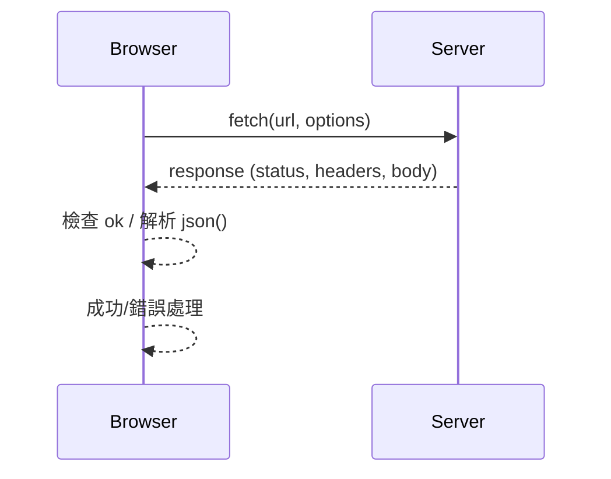

---
head:
  - - meta
    - name: author
      content: 許恩綸
  - - meta
    - name: keywords
      content: fetch(),fetch,javascript
  - - meta
    - property: og:title
      content: 使用 fetch() 進行非同步資料獲取的基礎教學
  - - meta
    - property: og:description
      content: 利用非同步函式fetch()，獲取網路資料
  - - meta
    - property: og:type
      content: article
  - - meta
    - property: og:image
      content: https://lucashsu95.github.io/LucasHsu.dev/images/javascript-cover.jpg
  - - meta
    - name: description
      content: fetch() 的核心概念、GET/POST 範例、錯誤與逾時處理、可執行練習與延伸閱讀。
---

# 使用 fetch() 進行非同步資料獲取的基礎教學

可以用上一篇[異同步 - Asynchronous](./asynchronous)的概念繼續深入...

> 📝 TL;DR

- `fetch(url, options)` 回傳 Promise，預設方法為 GET。
- 常見步驟：送出請求 → `response.ok` 檢查 → 轉格式 (`json()`/`text()`) → 處理錯誤。
- 需自行處理錯誤與逾時（搭配 `Promise.race` 或 `AbortController`）。

## 前置知識

- HTTP 請求/回應概念、狀態碼 2xx/4xx/5xx。
- Promise、async/await 與 try/catch。
- 瀏覽器同源政策與 CORS 基本概念。

## 什麼是fetch()

想像你在一家餐廳點餐。當你告訴服務員你想要的食物時，你的請求就像是用 `fetch()` 向一個網路伺服器發送請求。`fetch()` 是一個 JavaScript 函數，它幫助我們從網路上獲取資料，就像你從餐廳獲得食物一樣。

## 如何使用 fetch()

使用 `fetch()` 很簡單。你只需要告訴它你想要去的網址（URL），然後它會幫你去那裡獲取資料。這裡有兩個範例，幫助你理解如何使用 `fetch()` 來打 API（應用程式介面）。

## 範例一：獲取魔法咒語

這個範例將從一個網站獲取魔法咒語的資料，並把它們顯示在網頁上的表格中。

```html
<!DOCTYPE html>
<html lang="en">
<head>
    <meta charset="UTF-8" />
    <meta name="viewport" content="width=device-width, initial-scale=1.0" />
    <title>魔法咒語</title>
</head>
<body>
    <table border="1">
        <tr>
            <td>ID</td>
            <td>Name</td>
            <td>Description</td>
        </tr>
    </table>

    <script>
        fetch("https://hp-api.onrender.com/api/spells") // 使用 fetch() 獲取資料
            .then((res) => {
                if (!res.ok) throw new Error("網路錯誤:" + res.status);
                return res.json();
            })
            .then((data) => {
                data.forEach((spell) => {
                    const table = document.querySelector("table");
                    const row = table.insertRow();
                    const cell1 = row.insertCell(0);
                    const cell2 = row.insertCell(1);
                    const cell3 = row.insertCell(2);
                    cell1.innerHTML = spell.id; // 填入 ID
                    cell2.innerHTML = spell.name; // 填入名稱
                    cell3.innerHTML = spell.description; // 填入描述
                });
            })
            .catch((err) => console.error(err.message));
    </script>
</body>
</html>
```

## 範例二：獲取國家人口資料

這個範例將從另一個網站獲取國家的人口資料，並把它們顯示在網頁上的表格中。

```html
<!DOCTYPE html>
<html lang="en">
<head>
    <meta charset="UTF-8" />
    <meta name="viewport" content="width=device-width, initial-scale=1.0" />
    <title>國家人口</title>
</head>
<body>
    <table border="1">
        <tr>
            <td>ID Nation</td>
            <td>ID Year</td>
            <td>Nation</td>
            <td>Population</td>
            <td>Slug Nation</td>
            <td>Year</td>
        </tr>
    </table>

    <script>
        fetch("https://datausa.io/api/data?drilldowns=Nation&measures=Population") // 使用 fetch() 獲取資料
                        .then((res) => {
                                if (!res.ok) throw new Error("網路錯誤:" + res.status);
                                return res.json();
                        })
                        .then((data) => {
                                data.data.forEach((nation) => {
                                        const table = document.querySelector("table");
                                        const row = table.insertRow();
                                        const cell1 = row.insertCell(0);
                                        const cell2 = row.insertCell(1);
                                        const cell3 = row.insertCell(2);
                                        const cell4 = row.insertCell(3);
                                        const cell5 = row.insertCell(4);
                                        const cell6 = row.insertCell(5);
                                        cell1.innerHTML = nation["ID Nation"]; // 填入 ID Nation
                                        cell2.innerHTML = nation["ID Year"]; // 填入 ID Year
                                        cell3.innerHTML = nation.Nation; // 填入 Nation 名稱
                                        cell4.innerHTML = nation.Population; // 填入 Population 人口數
                                        cell5.innerHTML = nation["Slug Nation"]; // 填入 Slug Nation
                                        cell6.innerHTML = nation.Year; // 填入 Year 年份
                                });
                        })
                        .catch((err) => console.error(err.message));
    </script>
</body>
</html>
```

## 進階：錯誤處理與逾時

```javascript
const withTimeout = (promise, ms = 5000) =>
    Promise.race([
        promise,
        new Promise((_, reject) =>
            setTimeout(() => reject(new Error("請求逾時")), ms)
        ),
    ]);

const fetchJson = async (url) => {
    const res = await withTimeout(fetch(url));
    if (!res.ok) throw new Error(`HTTP ${res.status}`);
    return res.json();
};

fetchJson("https://hp-api.onrender.com/api/spells")
    .then((data) => console.log("spells", data.length))
    .catch((err) => console.error(err.message));
```

## 資料流視覺化



## 實戰練習

### 練習 1：GET 與錯誤提示（簡單）⭐
> 打 `https://hp-api.onrender.com/api/spells`，非 2xx 時在 console 顯示錯誤訊息。

:::details 💡 參考答案
```javascript
fetch("https://hp-api.onrender.com/api/spells")
    .then((res) => {
        if (!res.ok) throw new Error(`HTTP ${res.status}`);
        return res.json();
    })
    .then((data) => console.log(data.length))
    .catch((err) => console.error(err.message));
```
:::

### 練習 2：POST 送資料（簡單）⭐
> 向 `https://jsonplaceholder.typicode.com/posts` 送出 { title, body, userId }，印出回應 id。

:::details 💡 參考答案
```javascript
fetch("https://jsonplaceholder.typicode.com/posts", {
    method: "POST",
    headers: { "Content-Type": "application/json" },
    body: JSON.stringify({ title: "demo", body: "hello", userId: 1 }),
})
    .then((res) => res.json())
    .then((data) => console.log("id", data.id));
```
:::

### 練習 3：逾時與取消（中等）⭐⭐
> 對同一 API 同時實作 3 秒逾時與手動取消按鈕，取消時顯示「已取消」。

:::details 💡 參考答案與提示
**提示：** 使用 `AbortController` 傳入 `signal`，並用 `Promise.race` 做逾時。

**參考答案（核心片段）：**
```javascript
const controller = new AbortController();
const timer = setTimeout(() => controller.abort(), 3000);

fetch("https://hp-api.onrender.com/api/spells", { signal: controller.signal })
    .then((res) => res.json())
    .then((data) => console.log(data.length))
    .catch((err) => {
        if (err.name === "AbortError") console.log("已取消");
        else console.error(err.message);
    })
    .finally(() => clearTimeout(timer));
```
:::

## 延伸閱讀

- [異同步 - Asynchronous](./asynchronous)
- [HTTP 請求方法介紹](./http-request)
- [MDN: fetch](https://developer.mozilla.org/en-US/docs/Web/API/fetch)

## FAQ

- 為什麼要檢查 `response.ok`？
    - fetch 對 4xx/5xx 不會拋錯，需自行檢查狀態碼。
- `json()` 和 `text()` 差異？
    - 取決於回應格式，API 多為 JSON；純文字或 HTML 則用 `text()`。
- 何時需要取消請求？
    - 使用者切頁、輸入框快速輸入導致舊結果過時，或節省流量時。
