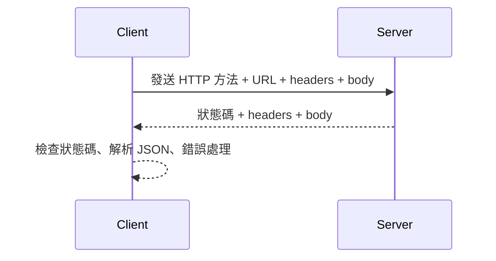

---
head:
  - - meta
    - name: author
      content: 許恩綸
  - - meta
    - name: keywords
      content: HTTP請求方法,HTTP methods,GET,POST,PUT,DELETE,PATCH,JavaScript
  - - meta
    - property: og:title
      content: HTTP 請求方法介紹
  - - meta
    - property: og:description
      content: 了解各種 HTTP 請求方法及其用途，包括 GET、POST、PUT、DELETE 和 PATCH。
  - - meta
    - property: og:type
      content: article
  - - meta
    - property: og:image
      content: https://lucashsu95.github.io/LucasHsu.dev/images/javascript-cover.jpg
  - - meta
    - name: description
      content: HTTP 方法與狀態碼概覽，搭配 fetch GET/POST 範例、流程圖、練習題與常見 FAQ。
---

# HTTP 請求方法

在[什麼是fetch()](./fetch)的文章中學到了怎麼打api，在`fetch()`預設是使用GET方法

除了 `GET` 方法，HTTP 還有其他多種請求方法，每種方法都有其特定的用途和行為。以下是一些常見的 HTTP 請求方法：

> 📝 TL;DR

- GET 讀取、POST 新增、PUT 取代、PATCH 局部更新、DELETE 刪除。
- 安全性：GET/HEAD/OPTIONS/TRACE 為 safe；幂等性：GET/PUT/DELETE/HEAD/OPTIONS/TRACE 為 idempotent。
- 實務搭配：加上錯誤處理、逾時與 JSON 解析，必要時設定標頭與 body。

## 前置知識

- HTTP 請求組成：方法、URL、標頭、主體。
- 狀態碼分段：1xx/2xx/3xx/4xx/5xx。
- 基礎 JavaScript fetch/async-await。

### 1. POST
- **用途**：用於向伺服器提交數據，通常用於創建新的資源。
- **特性**：不安全（unsafe），非幂等（non-idempotent），這意味著多次發送相同的請求會創建多個相同的資源。

### 2. PUT
- **用途**：用於更新或替換指定資源的全部內容。
- **特性**：不安全（unsafe），但幂等（idempotent），這表示多次發送相同的請求會產生相同的結果。

### 3. DELETE
- **用途**：用於刪除指定的資源。
- **特性**：不安全（unsafe），但幂等（idempotent），這意味著多次刪除同一資源不會影響結果。

### 4. PATCH
- **用途**：用於對資源進行部分更新，而不是替換整個資源。
- **特性**：不安全（unsafe），非幂等（non-idempotent），這表示對同一資源進行多次相同的請求可能會產生不同的結果。

### 5. HEAD
- **用途**：類似於 `GET` 請求，但伺服器只返回響應頭，不返回響應體。這通常用於獲取元數據，如檔案大小。
- **特性**：安全（safe）且幂等（idempotent）。

### 6. OPTIONS
- **用途**：用於查詢伺服器支持哪些 HTTP 方法，通常用於 CORS 請求中。
- **特性**：安全（safe）且幂等（idempotent）。

### 7. CONNECT
- **用途**：用於建立到伺服器的隧道，通常用於 SSL 加密連接。
- **特性**：不安全（unsafe），非幂等（non-idempotent）。

### 8. TRACE
- **用途**：用於回顯伺服器收到的請求，主要用於診斷和調試。
- **特性**：安全（safe）且幂等（idempotent）。

這些方法讓客戶端能夠以標準化和可預測的方式對 API 的資源執行 CRUD 操作（創建、讀取、更新和刪除）。每種方法都有其適合使用的場景，開發者可以根據需求選擇合適的方法來進行 HTTP 請求。

要開始使用 `fetch()` 方法，你需要了解如何發送 HTTP 請求，並且可以使用不同的請求方法來獲取或傳送資料。以下是如何使用 `fetch()` 的基本介紹，以及兩個範例，展示如何使用 `GET` 和 `POST` 方法。

## 方法與特性速查

| 方法    | 用途                   | 安全 | 幂等 |
| ------- | ---------------------- | ---- | ---- |
| GET     | 讀取                   | 是   | 是   |
| POST    | 新增                   | 否   | 否   |
| PUT     | 取代                   | 否   | 是   |
| PATCH   | 局部更新               | 否   | 否   |
| DELETE  | 刪除                   | 否   | 是   |
| HEAD    | 取得標頭               | 是   | 是   |
| OPTIONS | 詢問支援方法/CORS 預檢 | 是   | 是   |


### HTTP 狀態碼

#### 1xx：信息響應
- **100 Continue**：這是一個臨時響應，表示到目前為止的所有內容都是可行的，客戶端應該繼續請求。
- **101 Switching Protocols**：表示伺服器正在切換到客戶端所要求的不同協議。

#### 2xx：成功響應
- **200 OK**：請求成功，伺服器返回所請求的數據。
- **201 Created**：成功創建新資源，通常用於 `POST` 請求。
- **202 Accepted**：請求已被接受，但尚未處理，通常用於異步操作。
- **204 No Content**：請求成功，但沒有返回內容，通常用於 `DELETE` 請求。

#### 3xx：重定向
- **301 Moved Permanently**：請求的資源已永久移動到新位置，客戶端應使用新位置進行後續請求。
- **302 Found**：請求的資源臨時移動到其他位置。
- **304 Not Modified**：自上次請求以來，所請求的資源沒有改變，客戶端可以使用快取的版本。

#### 4xx：客戶端錯誤
- **400 Bad Request**：請求無效，伺服器無法理解。
- **401 Unauthorized**：用戶未經授權，需要身份驗證。
- **403 Forbidden**：伺服器理解請求，但拒絕執行。
- **404 Not Found**：所請求的資源不存在。
- **422 Unprocessable Entity**：當創建或更新對象時發生驗證錯誤。

#### 5xx：伺服器錯誤
- **500 Internal Server Error**：伺服器發生錯誤，無法完成請求。
- **502 Bad Gateway**：伺服器作為網關或代理時收到無效響應。
- **503 Service Unavailable**：伺服器目前無法處理請求，通常是因為過載或維護。


### 基本用法

`fetch()` 是一個全域函數，用來發送 HTTP 請求。它的基本語法如下：

```javascript
fetch(url, options)
```

- **url**：要請求的資源網址。
- **options**（可選）：一個物件，用來設定請求的各種參數，例如方法（`method`）、標頭（`headers`）、請求體（`body`）等。

如果不提供 `options`，默認的請求方法是 `GET`。

### 使用 GET 方法

這是一個使用 `GET` 方法的範例，從一個 API 獲取資料並顯示在網頁上：

```html
<!DOCTYPE html>
<html lang="en">
<head>
    <meta charset="UTF-8" />
    <meta name="viewport" content="width=device-width, initial-scale=1.0" />
    <title>GET 請求範例</title>
</head>
<body>
    <h1>魔法咒語列表</h1>
    <table border="1">
        <tr>
            <td>ID</td>
            <td>Name</td>
            <td>Description</td>
        </tr>
    </table>

    <script>
        fetch("https://hp-api.onrender.com/api/spells") // 發送 GET 請求
            .then((response) => {
                if (!response.ok) throw new Error(`HTTP ${response.status}`);
                return response.json();
            })
            .then((data) => {
                data.forEach((spell) => {
                    const table = document.querySelector("table");
                    const row = table.insertRow();
                    const cell1 = row.insertCell(0);
                    const cell2 = row.insertCell(1);
                    const cell3 = row.insertCell(2);
                    cell1.innerHTML = spell.id; // 填入 ID
                    cell2.innerHTML = spell.name; // 填入名稱
                    cell3.innerHTML = spell.description; // 填入描述
                });
            })
            .catch((error) => console.error('發生錯誤:', error)); // 錯誤處理
    </script>
</body>
</html>
```

### 使用 POST 方法

這是一個使用 `POST` 方法的範例，將資料發送到伺服器：

```html
<!DOCTYPE html>
<html lang="en">
<head>
    <meta charset="UTF-8" />
    <meta name="viewport" content="width=device-width, initial-scale=1.0" />
    <title>POST 請求範例</title>
</head>
<body>
    <h1>發送資料到伺服器</h1>

    <script>
        const data = {
            name: "John Doe",
            age: 30
        };

        fetch("https://example.com/api/users", { // 發送 POST 請求
            method: "POST", // 設定請求方法為 POST
            headers: {
                "Content-Type": "application/json" // 設定請求標頭為 JSON 格式
            },
            body: JSON.stringify(data) // 將資料轉換為 JSON 字串
        })
                .then((response) => {
                        if (!response.ok) {
                                throw new Error(`HTTP ${response.status}`);
                        }
                        return response.json(); // 將回應轉換為 JSON 格式
                })
                .then((result) => console.log('成功:', result)) // 成功處理回應
                .catch((error) => console.error('發生錯誤:', error)); // 錯誤處理
    </script>
</body>
</html>
```

## 請求流程圖



## 實戰練習

### 練習 1：GET 與狀態檢查（簡單）⭐
> 使用 fetch 對 spells API，非 2xx 時顯示錯誤訊息。

:::details 💡 參考答案
```javascript
fetch("https://hp-api.onrender.com/api/spells")
    .then((r) => {
        if (!r.ok) throw new Error(`HTTP ${r.status}`);
        return r.json();
    })
    .then((data) => console.log(data.length))
    .catch((err) => console.error(err.message));
```
:::

### 練習 2：POST JSON（簡單）⭐
> 對 jsonplaceholder posts 建立一筆資料，印出回傳 id。

:::details 💡 參考答案
```javascript
fetch("https://jsonplaceholder.typicode.com/posts", {
    method: "POST",
    headers: { "Content-Type": "application/json" },
    body: JSON.stringify({ title: "demo", body: "hello", userId: 1 }),
})
    .then((r) => r.json())
    .then((data) => console.log(data.id));
```
:::

### 練習 3：方法選擇題（中等）⭐⭐
> 下列情境用哪個方法？(1) 部分更新使用者暱稱 (2) 刪除單一貼文 (3) 取得列表。

:::details 💡 參考答案
1. PATCH
2. DELETE
3. GET
:::

## 延伸閱讀

- [使用 fetch() 進行非同步資料獲取的基礎教學](./fetch)
- [Axios - next.js](./axios)
- [MDN: HTTP methods](https://developer.mozilla.org/en-US/docs/Web/HTTP/Methods)

## FAQ

- POST 與 PUT 差異？
    - POST 常用於新增；PUT 用於整體取代，且幂等。
- PATCH 什麼時候用？
    - 只改部分欄位時，避免整筆覆蓋。
- 為何要檢查 `response.ok`？
    - fetch 對 4xx/5xx 不會自動 throw，需要手動檢查。

### 總結

使用 `fetch()` 方法可以輕鬆地發送 HTTP 請求。你可以根據需要選擇不同的請求方法（如 `GET` 或 `POST`），並透過選項來設定請求的各種參數。這使得與伺服器進行互動變得更加簡單和直觀。

