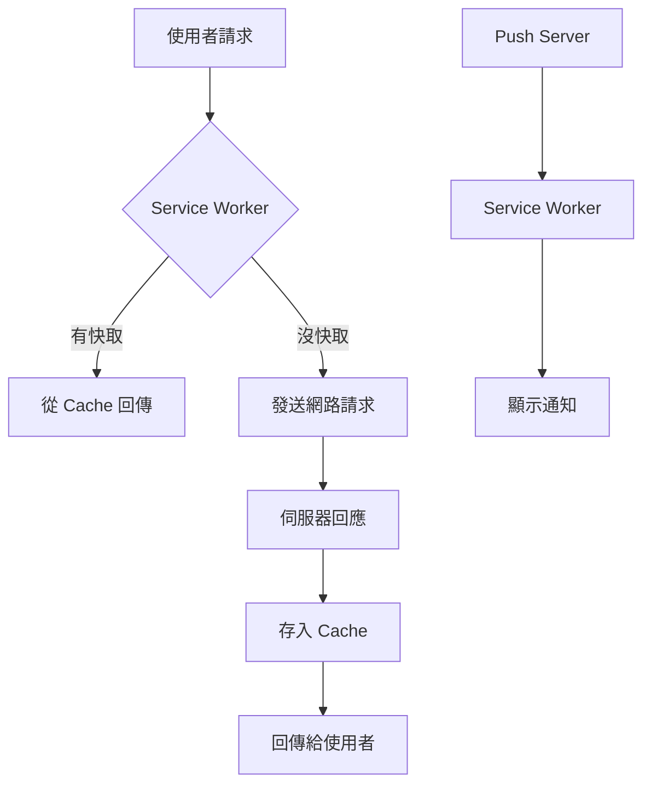

# Service Worker 實戰：把網站升級成 PWA

> 📝 TL;DR：Service Worker 是瀏覽器背景執行的腳本，可以攔截網路請求、做快取、推播通知。用 Workbox 可以少寫很多程式碼，快速把任何網站變成 PWA（可以裝成 App、離線存取）。

## 這篇你會學到

1. Service Worker 是什麼？能做什麼？
2. PWA 的核心概念
3. 用 Workbox 快速設定快取策略
4. 離線回退頁實作
5. 推播通知（Web Push）
6. 背景同步（Background Sync）

## 前置知識

這篇要懂這些才不會卡住：

- JavaScript 基礎（ES6+ 語法）
- 知道什麼是 Promise 和 async/await
- 了解瀏覽器的開發者工具（F12）

如果你連 `fetch()` 都沒用過... 先去翻 JavaScript 入門吧，不然我講「攔截請求」你會以為我在講網路攻擊 XD

## Service Worker 是什麼？

Service Worker 是一種「Web Worker」，在瀏覽器背景執行，跟網頁分開。

它能做這些事：

- **攔截網路請求** — 決定要從網路拿還是從快取拿
- **推送通知** — 就算網頁關掉還能收到通知
- **背景同步** — 離線時先把資料存起來，連線後再同步



### PWA 是什麼？

PWA（Progressive Web App）就是把網站做得像 App：

- 可以加到手機桌面
- 可以離線使用
- 可以收到推播通知

關鍵技術就是 Service Worker + manifest.json。

## 專案初始化

### 1. 建立 manifest.json

PWA 一定要有這個檔，告訴瀏覽器「這個網站可以裝成 App」：

```json
{
  "name": "我的 PWA App",
  "short_name": "MyPWA",
  "start_url": "/",
  "display": "standalone",
  "background_color": "#ffffff",
  "theme_color": "#000000",
  "icons": [
    {
      "src": "/icons/icon-192.png",
      "sizes": "192x192",
      "type": "image/png"
    },
    {
      "src": "/icons/icon-512.png",
      "sizes": "512x512",
      "type": "image/png"
    }
  ]
}
```

在 HTML 的 `<head>` 加：

```html
<link rel="manifest" href="/manifest.json">
```

### 2. 安裝 Workbox CLI

Workbox 是 Google 出的工具，讓你不用手寫 Service Worker 的複雜邏輯。

```bash
npm install workbox-cli --global
workbox wizard
```

Wizard 會掃你的專案，問你幾個問題，然後生出 `workbox-config.js`。

### 3. 註冊 Service Worker

在你的入口檔案（通常是 `index.js` 或 `main.js`）加：

```js
if ('serviceWorker' in navigator) {
  window.addEventListener('load', () => {
    navigator.serviceWorker.register('/service-worker.js')
      .then(reg => {
        console.log('Service Worker 註冊成功！', reg.scope);
      })
      .catch(err => {
        console.log('註冊失敗:', err);
      });
  });
}
```

## 快取策略

Service Worker 最重要的功能就是快取。Workbox 提供了幾種策略：

### 策略比較

| 策略 | 適合場景 | 特點 |
|------|----------|------|
| Cache First | 靜態資源（CSS、JS、圖片） | 快取優先，快取沒有才抓網路 |
| Network First | 常更新的資料（API） | 網路優先，失敗才用快取 |
| Stale While Revalidate | 兩者兼顧 | 先用快取回應，背景更新快取 |
| Network Only | 即時資料（股票、聊天） | 永遠從網路拿 |
| Cache Only | 離線資源 | 永遠從快取拿 |

### 實作各種策略

在你的 `service-worker.js`：

```js
import { registerRoute } from 'workbox-routing';
import { 
  CacheFirst, 
  NetworkFirst, 
  StaleWhileRevalidate 
} from 'workbox-strategies';

// 圖片：Cache First
registerRoute(
  ({ request }) => request.destination === 'image',
  new CacheFirst({
    cacheName: 'images',
  })
);

// CSS/JS：Stale While Revalidate
registerRoute(
  ({ request }) => 
    request.destination === 'style' || 
    request.destination === 'script',
  new StaleWhileRevalidate({
    cacheName: 'static-assets',
  })
);

// API：Network First
registerRoute(
  ({ url }) => url.pathname.startsWith('/api/'),
  new NetworkFirst({
    cacheName: 'api-responses',
    networkTimeoutSeconds: 10, // 網路太慢就用快取
  })
);
```

### 預先快取（Pre-cache）

打包時就把靜態資源存進快取：

```js
import { precacheAndRoute } from 'workbox-precaching';

// 這個清單會在建置時自動注入
precacheAndRoute(self.__WB_MANIFEST);
```

用 Workbox CLI 打包時，會自動幫你生這個清單。

## 離線回退頁

使用者離線時，至少給個「你目前離線」的提示頁面。

### 方法一：用 Workbox Recipe

```js
import { offlineFallback } from 'workbox-recipes';

offlineFallback({
  pageFallback: '/offline.html',
});
```

### 方法二：自己寫

```js
self.addEventListener('fetch', event => {
  // 只攔截頁面請求
  if (event.request.mode === 'navigate') {
    event.respondWith(
      fetch(event.request)
        .catch(() => caches.match('/offline.html'))
    );
  }
});
```

記得建立 `offline.html`：

```html
<!DOCTYPE html>
<html>
<head>
  <meta charset="UTF-8">
  <title>離線中</title>
</head>
<body>
  <h1>你目前離線了</h1>
  <p>請檢查網路連線，然後重新整理頁面。</p>
</body>
</html>
```

也要把這頁加進預先快取：

```js
precacheAndRoute([
  { url: '/offline.html', revision: '1' },
  // ...其他資源
]);
```

## 推播通知

### 前端註冊

```js
// 請求通知權限
async function requestNotificationPermission() {
  const permission = await Notification.requestPermission();
  if (permission === 'granted') {
    console.log('通知權限已取得！');
  }
}

// 訂閱推播
async function subscribeToPush() {
  const registration = await navigator.serviceWorker.ready;
  const subscription = await registration.pushManager.subscribe({
    userVisibleOnly: true,
    applicationServerKey: urlBase64ToUint8Array('YOUR_VAPID_PUBLIC_KEY')
  });
  
  // 把 subscription 送給後端儲存
  await fetch('/api/subscribe', {
    method: 'POST',
    body: JSON.stringify(subscription),
  });
}
```

### Service Worker 接收

```js
self.addEventListener('push', event => {
  const data = event.data?.json() || {};
  
  self.registration.showNotification(data.title || '新訊息', {
    body: data.body || '',
    icon: '/icons/icon-192.png',
    badge: '/icons/badge.png',
    data: data.url, // 點擊要開的網址
  });
});

// 點擊通知
self.addEventListener('notificationclick', event => {
  event.notification.close();
  
  event.waitUntil(
    clients.openWindow(event.notification.data || '/')
  );
});
```

### 後端發送（Node.js 範例）

```bash
npm install web-push
```

```js
const webpush = require('web-push');

// 設定 VAPID 金鑰
webpush.setVapidDetails(
  'mailto:your@email.com',
  'YOUR_VAPID_PUBLIC_KEY',
  'YOUR_VAPID_PRIVATE_KEY'
);

// 發送推播
async function sendPush(subscription, payload) {
  await webpush.sendNotification(subscription, JSON.stringify(payload));
}

// 使用
sendPush(userSubscription, {
  title: '測試通知',
  body: '這是測試訊息',
  url: '/messages'
});
```

## 背景同步

使用者離線時先把資料存起來，連線後自動同步。

### 前端發起同步

```js
// 註冊背景同步
async function syncWhenOnline(data) {
  // 把資料存到 IndexedDB
  await saveToIndexedDB('pending-posts', data);
  
  const registration = await navigator.serviceWorker.ready;
  registration.sync.register('sync-posts');
}
```

### Service Worker 處理

```js
self.addEventListener('sync', event => {
  if (event.tag === 'sync-posts') {
    event.waitUntil(uploadPendingPosts());
  }
});

async function uploadPendingPosts() {
  const pendingPosts = await getFromIndexedDB('pending-posts');
  
  for (const post of pendingPosts) {
    try {
      await fetch('/api/posts', {
        method: 'POST',
        body: JSON.stringify(post),
      });
      await removeFromIndexedDB('pending-posts', post.id);
    } catch (error) {
      // 失敗的話下次再試
      console.error('同步失敗:', error);
    }
  }
}
```

## 更新策略

Service Worker 更新後，怎麼讓使用者拿到新版？

### 方法一：skipWaiting + claim

```js
// 在 install 時強制啟用
self.addEventListener('install', event => {
  self.skipWaiting();
});

// 在 activate 時接管所有頁面
self.addEventListener('activate', event => {
  event.waitUntil(clients.claim());
});
```

### 方法二：提示使用者重新整理

```js
// 前端
navigator.serviceWorker.addEventListener('controllerchange', () => {
  if (confirm('有新版本！要重新整理嗎？')) {
    window.location.reload();
  }
});
```

### 清理舊快取

```js
self.addEventListener('activate', event => {
  event.waitUntil(
    caches.keys().then(keys => {
      return Promise.all(
        keys
          .filter(key => key !== 'v2') // 保留新版的
          .map(key => caches.delete(key)) // 刪掉舊的
      );
    })
  );
});
```

## 實戰練習

### 練習 1：基本快取（簡單）⭐

**任務：** 設定 Service Worker，讓圖片使用 Cache First 策略。

```js
// service-worker.js
// 請補完程式碼
import { registerRoute } from 'workbox-routing';
import { CacheFirst } from 'workbox-strategies';

// ???
```

:::details 參考答案

```js
import { registerRoute } from 'workbox-routing';
import { CacheFirst } from 'workbox-strategies';

registerRoute(
  ({ request }) => request.destination === 'image',
  new CacheFirst({
    cacheName: 'images-cache',
  })
);
```
:::

### 練習 2：離線頁面（簡單）⭐

**任務：** 讓使用者在離線時看到 `/offline.html`。

```js
// service-worker.js
// 請補完攔截 navigate 請求的程式碼

self.addEventListener('fetch', event => {
  // ???
});
```

:::details 參考答案

```js
self.addEventListener('fetch', event => {
  if (event.request.mode === 'navigate') {
    event.respondWith(
      fetch(event.request)
        .catch(() => caches.match('/offline.html'))
    );
  }
});

// 也要記得預先快取 offline.html
precacheAndRoute([
  { url: '/offline.html', revision: '1' },
]);
```
:::

### 練習 3：API 快取策略（中等）⭐⭐

**任務：** 設定 `/api/` 開頭的請求使用 Network First，10 秒逾時就用快取。

```js
import { registerRoute } from 'workbox-routing';
import { NetworkFirst } from 'workbox-strategies';

// ???
```

:::details 參考答案

```js
import { registerRoute } from 'workbox-routing';
import { NetworkFirst } from 'workbox-strategies';

registerRoute(
  ({ url }) => url.pathname.startsWith('/api/'),
  new NetworkFirst({
    cacheName: 'api-cache',
    networkTimeoutSeconds: 10,
    plugins: [
      {
        // 只快取成功的回應
        cacheWillUpdate: async ({ response }) => {
          return response.status === 200 ? response : null;
        },
      },
    ],
  })
);
```
:::

## 常見問題 FAQ

### Q: Service Worker 一定要用 HTTPS 嗎？

A: 是的，但 localhost 例外。線上環境一定要 HTTPS，這是安全考量。

### Q: 開發時怎麼除錯？

A: 用 Chrome DevTools：

1. F12 開開發者工具
2. Application 標籤
3. Service Workers 區塊

可以看到目前運行的 Service Worker、快取內容、手動觸發 Push 等等。

### Q: 更新後還是看到舊版本？

A: Service Worker 會快取自己，更新時要確保：

1. Service Worker 檔案名稱或內容有變
2. 有設定 `skipWaiting()`
3. 或者手動在 DevTools 按 "Update"

### Q: 快取會佔多少空間？

A: 瀏覽器有配額限制，通常是可用空間的一定比例。你可以查：

```js
navigator.storage.estimate().then(estimate => {
  console.log(`已用: ${estimate.usage / 1024 / 1024} MB`);
  console.log(`配額: ${estimate.quota / 1024 / 1024} MB`);
});
```

### Q: PWA 在 iOS 上有問題？

A: iOS 對 PWA 支援比較差，尤其是：
- 推播通知支援有限
- 背景同步不一定可靠
- 可能需要特別處理

建議在 iOS 上多做測試。

## 延伸閱讀

### 本站相關文章

- [TypeScript 工具類型實戰](/typescript/utility-types) — TypeScript 進階技巧
- [Tmux 終端機多工器](/devops/tmux-guide) — 遠端開發必備

### 外部資源

- [Workbox 官方文件](https://developer.chrome.com/docs/workbox/)
- [MDN: Service Worker API](https://developer.mozilla.org/en-US/docs/Web/API/Service_Worker_API)
- [Google: PWA 最佳實踐](https://web.dev/progressive-web-apps/)

---

現在你可以把任何網站變成 PWA 了。離線存取、推播通知、背景同步，用 Workbox 幾行就搞定。:D
