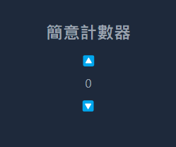

# 簡意計數器

點擊emoji的向上箭頭，中間的數字會增加

點擊向下箭頭，中間的數字會減少



::: details 看答案
```html
<!DOCTYPE html>
<html lang="en">

<head>
    <meta charset="UTF-8">
    <meta name="viewport" content="width=device-width, initial-scale=1.0">
    <title>簡意計數器</title>
    <script src='https://cdnjs.cloudflare.com/ajax/libs/jquery/3.7.1/jquery.min.js'
        integrity='sha512-v2CJ7UaYy4JwqLDIrZUI/4hqeoQieOmAZNXBeQyjo21dadnwR+8ZaIJVT8EE2iyI61OV8e6M8PP2/4hpQINQ/g=='
        crossorigin='anonymous'></script>
    <script src="https://cdn.tailwindcss.com"></script>
</head>

<body>
    <section class="w-full flex flex-col items-center justify-center min-h-screen bg-slate-800">
        <h1 class="text-2xl text-gray-400 font-black mb-3">簡意計數器</h1>
        <button class="add -rotate-90">▶</button>
        <div class="num text-gray-400 my-2">0</div>
        <button class="remove rotate-90">▶</button>
    </section>
    <script>
        $(".add").click(function () {
            $(".num").text(Number($(".num").text()) + 1)
        })

        $(".remove").click(function () {
            $(".num").text(Number($(".num").text()) - 1)
        })
    </script>
</body>

</html>
```
:::