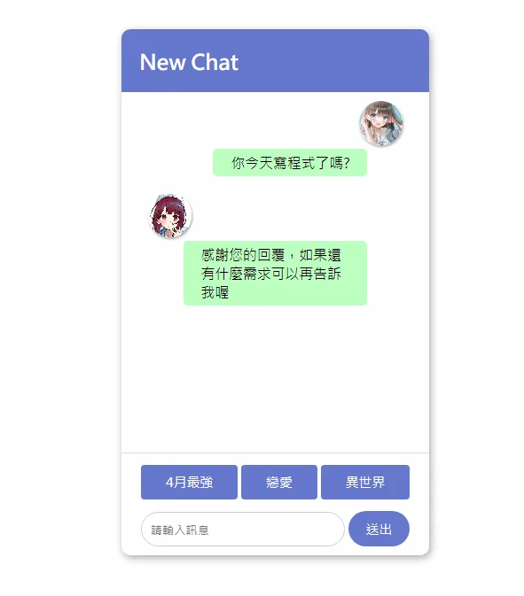

# 聊天機器人



## 互動體驗：聊天機器人

<ChatBot />

## 教學

訊息就是一直把一段文字加進畫面上。快捷按鈕和輸入框做的是同一件事：拿到一段文字，先顯示使用者說的，再顯示機器人回的。

機器人回什麼放在一個物件裡。問題當 key、回答當 value，找不到就用一句預設的。

### HTML

`main` 拿來放訊息。快捷按鈕用 `data-key` 帶要送出的文字，下面的表單則是自己打字。

```html
<div id="chat">
  <header>
    <h2>New Chat</h2>
  </header>
  <main></main>
  <section class="message-input">
    <button data-key="4月最強">4月最強</button>
    <button data-key="戀愛">戀愛</button>
    <button data-key="異世界">異世界</button>
  </section>
  <form class="message-input">
    <input type="text" placeholder="請輸入訊息" />
    <button class="send-btn">送出</button>
  </form>
</div>
```

css太長所以用下拉選單
::: details css

```css
* {
  font-family: 微軟正黑體;
}

:root {
  --color1: #67c;
}

body {
  display: flex;
  justify-content: center;
  align-items: center;
  min-height: 100vh;
}

#chat {
  width: 350px;
  height: 600px;

  display: grid;
  grid-template-rows: 1fr 15fr 2fr;

  background: #fefefe;
  box-shadow: 2px 3px 10px #aaa;
  border-radius: 10px;
  overflow: hidden;
}

/* header */

header {
  background: var(--color1);
  color: #fefefe;
  padding: 0 20px;
}

/* main */

main {
  overflow-y: auto;
  border-bottom: 1px solid #ddd;
  padding: 0 20px;
  padding-bottom: 10px;
  margin-bottom: 10px;
}

.message {
  padding: 10px;
  display: flex;
  flex-direction: column;
  align-items: start;
}

.message.user {
  align-items: end;
}

.avatar img {
  width: 50px;
  height: 50px;
  object-fit: cover;
  object-position: center;
  border-radius: 50%;
  box-shadow: 1px 2px 3px #0005;
}

.content {
  background: rgb(189, 255, 192);
  border-radius: 5px;
  padding: 5px 20px;
  margin: 0 40px;
}

/* message-input */

.message-input {
  padding-inline: 20px;
  padding-bottom: 10px;
  display: flex;
  align-items: center;
}

input,
button {
  padding: 10px;
  margin: 0 2px;
}

input {
  width: 100%;
  border-radius: 4px;
  border: 1px solid #ccc;
  border-radius: 45px;
  outline: none;
}

input:focus {
  border: 1px solid var(--color1);
}

button {
  flex: 1 1 auto;
  background: var(--color1);
  border: none;
  border-radius: 4px;
  color: #fff;
  cursor: pointer;
  font-size: 15px;
  transition: scale 0.3s;
  text-wrap: nowrap;

  &:hover {
    filter: brightness(0.85);
  }
  &:active {
    scale: 0.85;
  }
}

.send-btn {
  padding-inline: 20px;
  border-radius: 45px;
}
```

:::

### JS

先抓好訊息區、輸入框和表單。

```js
const main = document.querySelector("main")
const input = document.querySelector("input")
const form = document.querySelector("form")
```

回答放在一個物件裡。

```js
const replies = {
  "4月最強": "「在演藝圈（這個世界）裡，謊言就是武器。」2023年4月最強廣世巨作「我推的孩子」",
  "戀愛": "最近有「我內心的糟糕念頭」是最甜最甜的純真戀愛動漫，保證甜死你!",
  "異世界": "如果你問我，那我也只能說高橋李依最棒!不訪試試看「為美好的世界獻上爆焰」！",
}
```

使用者的話和機器人的話都用同一個函式加進去，差在 class 和頭像。

```js
function addMessage(text, isUser) {
  const who = isUser ? "user" : ""
  const img = isUser ? "imgs/R.jpg" : "imgs/L.jpg"

  main.innerHTML += `
    <div class="message ${who}">
      <div class="avatar">
        
      </div>
      <div class="content">${text}</div>
    </div>`

  main.scrollTop = main.scrollHeight
}
```

送出時先顯示使用者的文字，再用剛才的物件找出回答。物件沒有這個 key，就回預設那句。

```js
function send(text) {
  if (!text) return

  addMessage(text, true)
  input.value = ""
  addMessage(replies[text] || "感謝您的回覆，如果還有什麼需求可以再告訴我喔", false)
}
```

表單送出打字的內容，快捷按鈕送出自己的 `data-key`。兩邊都呼叫 `send`。

```js
form.addEventListener("submit", (e) => {
  e.preventDefault()
  send(input.value)
})

document.querySelectorAll("[data-key]").forEach((btn) => {
  btn.addEventListener("click", () => send(btn.dataset.key))
})
```

到這就完成了！

