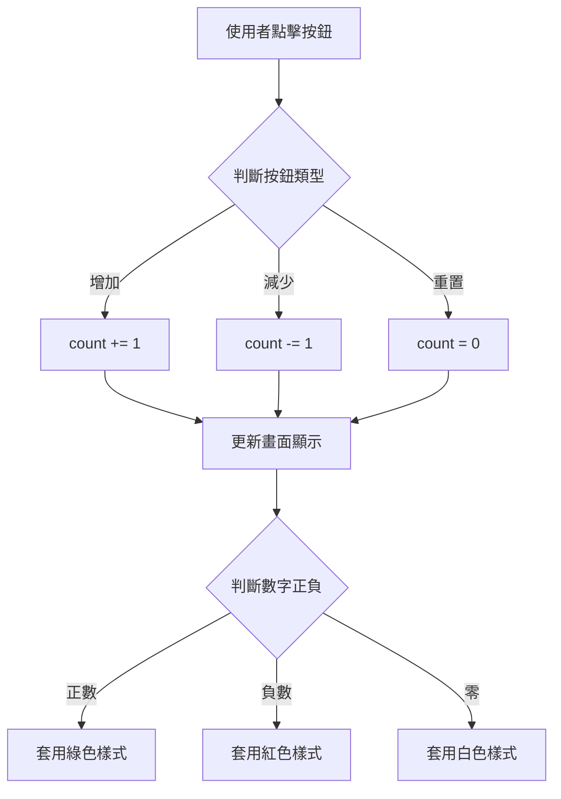

---
head:
  - - meta
    - name: author
      content: 許恩綸
  - - meta
    - name: keywords
      content: JavaScript,計數器,DOM操作,事件監聽,querySelector
  - - meta
    - property: og:title
      content: JavaScript 簡易計數器：DOM 操作入門實戰
  - - meta
    - property: og:description
      content: 從零開始製作 JavaScript 計數器，學習 querySelector、addEventListener、變數管理等核心概念
  - - meta
    - property: og:type
      content: article
---

# JavaScript 簡易計數器

> 📝 TL;DR：計數器包含三大功能：增加、減少、重置。核心技術：`querySelector` 選取元素、`addEventListener` 監聽點擊、`textContent` 更新顯示。初學者必學的第一個 DOM 操作專案。

## 前置知識
- 了解 HTML/CSS 基本語法
- 知道 JavaScript 變數與函式
- 會使用瀏覽器開發者工具

---

## 專案目標
製作一個計數器，包含以下功能：
- ➕ 點擊「+」按鈕，數字加 1
- ➖ 點擊「-」按鈕，數字減 1
- 🔄 點擊「Reset」按鈕，數字歸零
- �� 數字顏色依正負變化（正數綠色、負數紅色、零白色）

---

## 專案結構



---

## 完整程式碼

### HTML 結構

```html
<!DOCTYPE html>
<html lang="zh-TW">
<head>
  <meta charset="UTF-8">
  <meta name="viewport" content="width=device-width, initial-scale=1.0">
  <title>簡易計數器</title>
  <link rel="stylesheet" href="style.css">
</head>
<body>
  <div class="container">
    <h1>簡易計數器</h1>
    <div class="counter-display">
      <span id="value">0</span>
    </div>
    <div class="btn-group">
      <button class="btn decrease">-</button>
      <button class="btn reset">Reset</button>
      <button class="btn increase">+</button>
    </div>
  </div>
  <script src="app.js"></script>
</body>
</html>
```

### CSS 樣式

```css
* {
  margin: 0;
  padding: 0;
  box-sizing: border-box;
}

body {
  font-family: Arial, sans-serif;
  display: flex;
  justify-content: center;
  align-items: center;
  min-height: 100vh;
  background: linear-gradient(135deg, #667eea 0%, #764ba2 100%);
}

.container {
  background: white;
  padding: 50px 80px;
  border-radius: 20px;
  box-shadow: 0 10px 30px rgba(0, 0, 0, 0.3);
  text-align: center;
}

h1 {
  color: #333;
  margin-bottom: 30px;
  font-size: 2rem;
}

.counter-display {
  font-size: 6rem;
  font-weight: bold;
  margin: 30px 0;
  min-height: 120px;
  display: flex;
  align-items: center;
  justify-content: center;
}

#value {
  transition: color 0.3s ease;
}

.btn-group {
  display: flex;
  gap: 15px;
  justify-content: center;
}

.btn {
  padding: 15px 30px;
  font-size: 1.5rem;
  font-weight: bold;
  border: none;
  border-radius: 10px;
  cursor: pointer;
  transition: all 0.3s ease;
  min-width: 80px;
}

.btn:hover {
  transform: translateY(-2px);
  box-shadow: 0 5px 15px rgba(0, 0, 0, 0.2);
}

.btn:active {
  transform: translateY(0);
}

.decrease {
  background-color: #e74c3c;
  color: white;
}

.decrease:hover {
  background-color: #c0392b;
}

.reset {
  background-color: #95a5a6;
  color: white;
}

.reset:hover {
  background-color: #7f8c8d;
}

.increase {
  background-color: #2ecc71;
  color: white;
}

.increase:hover {
  background-color: #27ae60;
}

/* 數字顏色變化 */
.positive {
  color: #2ecc71;
}

.negative {
  color: #e74c3c;
}

.zero {
  color: #333;
}
```

### JavaScript 邏輯

```javascript
// 1 選取 DOM 元素
const valueDisplay = document.getElementById('value');
const decreaseBtn = document.querySelector('.decrease');
const resetBtn = document.querySelector('.reset');
const increaseBtn = document.querySelector('.increase');

// 2 初始化計數變數
let count = 0;

// 3 更新畫面的函式
function updateDisplay() {
  // 更新數字
  valueDisplay.textContent = count;
  
  // 移除所有顏色 class
  valueDisplay.classList.remove('positive', 'negative', 'zero');
  
  // 根據數值加上對應顏色
  if (count > 0) {
    valueDisplay.classList.add('positive');
  } else if (count < 0) {
    valueDisplay.classList.add('negative');
  } else {
    valueDisplay.classList.add('zero');
  }
}

// 4 增加按鈕事件
increaseBtn.addEventListener('click', function() {
  count++;
  updateDisplay();
});

// 5 減少按鈕事件
decreaseBtn.addEventListener('click', function() {
  count--;
  updateDisplay();
});

// 6 重置按鈕事件
resetBtn.addEventListener('click', function() {
  count = 0;
  updateDisplay();
});
```

---

##  程式碼詳解

### 第一步：選取元素

```javascript
const valueDisplay = document.getElementById('value');
const decreaseBtn = document.querySelector('.decrease');
```

- `getElementById()`：透過 ID 選取元素（最快）
- `querySelector()`：透過 CSS 選擇器選取元素（更靈活）

### 第二步：狀態管理

```javascript
let count = 0;
```

使用 `let` 宣告可變變數，儲存當前計數。

### 第三步：更新畫面

```javascript
function updateDisplay() {
  valueDisplay.textContent = count; // 更新顯示
  
  // 動態改變顏色
  if (count > 0) {
    valueDisplay.classList.add('positive');
  }
}
```

**關鍵技術：**
- `textContent`：更新文字內容
- `classList.add/remove()`：動態控制樣式

### 第四步：事件監聽

```javascript
increaseBtn.addEventListener('click', function() {
  count++;
  updateDisplay();
});
```

- `addEventListener`：監聽點擊事件
- `count++`：數字加 1（等同 `count = count + 1`）

---

##  實戰練習

### 練習 1（簡單）
在現有計數器中加入「重置」按鈕的提示功能：點擊 Reset 前彈出確認訊息「確定要重置嗎？」。

:::details 參考答案
```javascript
resetBtn.addEventListener('click', function() {
  // 彈出確認對話框
  const confirmed = confirm('確定要重置計數器嗎？');
  
  if (confirmed) {
    count = 0;
    updateDisplay();
  }
});
```

**知識點：**
- `confirm()` 會顯示確認對話框
- 回傳 `true`（確定）或 `false`（取消）
:::

### 練習 2（簡單）
新增「步進值」功能：讓使用者自訂每次增減的數量（例如 +5 或 -5）。

:::details 參考答案
**HTML 新增輸入框：**
```html
<div class="step-control">
  <label for="step">步進值：</label>
  <input type="number" id="step" value="1" min="1">
</div>
```

**JavaScript 修改：**
```javascript
const stepInput = document.getElementById('step');

increaseBtn.addEventListener('click', function() {
  const step = parseInt(stepInput.value) || 1;
  count += step;
  updateDisplay();
});

decreaseBtn.addEventListener('click', function() {
  const step = parseInt(stepInput.value) || 1;
  count -= step;
  updateDisplay();
});
```

**知識點：**
- `parseInt()` 將字串轉整數
- `|| 1` 當輸入無效時預設為 1
:::

### 練習 3（中等）
實作「計數限制」功能：設定最小值 -10 和最大值 +10，超過範圍時顯示警告並阻止變更。

:::details 參考答案與思路
```javascript
const MIN = -10;
const MAX = 10;

function updateDisplay() {
  valueDisplay.textContent = count;
  
  // 顏色變化
  valueDisplay.classList.remove('positive', 'negative', 'zero');
  if (count > 0) {
    valueDisplay.classList.add('positive');
  } else if (count < 0) {
    valueDisplay.classList.add('negative');
  } else {
    valueDisplay.classList.add('zero');
  }
  
  // 按鈕禁用狀態
  decreaseBtn.disabled = (count <= MIN);
  increaseBtn.disabled = (count >= MAX);
}

increaseBtn.addEventListener('click', function() {
  if (count < MAX) {
    count++;
    updateDisplay();
  } else {
    alert(`已達到最大值 ${MAX}！`);
  }
});

decreaseBtn.addEventListener('click', function() {
  if (count > MIN) {
    count--;
    updateDisplay();
  } else {
    alert(`已達到最小值 ${MIN}！`);
  }
});

// 初始化按鈕狀態
updateDisplay();
```

**CSS 新增禁用樣式：**
```css
.btn:disabled {
  opacity: 0.5;
  cursor: not-allowed;
}
```

**思路：**
1. 定義常數 `MIN`、`MAX`
2. 檢查是否超出範圍，超出時顯示 `alert()` 並阻止變更
3. 動態設定按鈕 `disabled` 屬性
4. 初始化時呼叫 `updateDisplay()` 確保初始狀態正確
:::

---

##  FAQ

### Q: `textContent` 和 `innerHTML` 的差異？
- `textContent`：只顯示純文字，較安全
- `innerHTML`：可插入 HTML 標籤，但有 XSS 風險

### Q: 為什麼要用函式 `updateDisplay()`？
- 避免重複程式碼（DRY 原則）
- 集中管理畫面更新邏輯
- 方便日後維護與擴充

### Q: 按鈕連點會不會有問題？
不會，JavaScript 事件監聽會依序執行，不會重疊。

---

##  延伸閱讀
- [MDN: Document.querySelector()](https://developer.mozilla.org/docs/Web/API/Document/querySelector)
- [MDN: EventTarget.addEventListener()](https://developer.mozilla.org/docs/Web/API/EventTarget/addEventListener)
- [JavaScript.info: DOM 操作入門](https://javascript.info/dom-nodes)

---

##  總結
1. 計數器是學習 DOM 操作的最佳入門專案。
2. 核心技術：`querySelector` 選取、`addEventListener` 監聽、`textContent` 更新。
3. 善用函式封裝重複邏輯，提升程式可讀性。
4. 動態改變樣式用 `classList` 操作，避免直接修改 `style` 屬性。
5. 變數管理要明確，避免全域污染。
