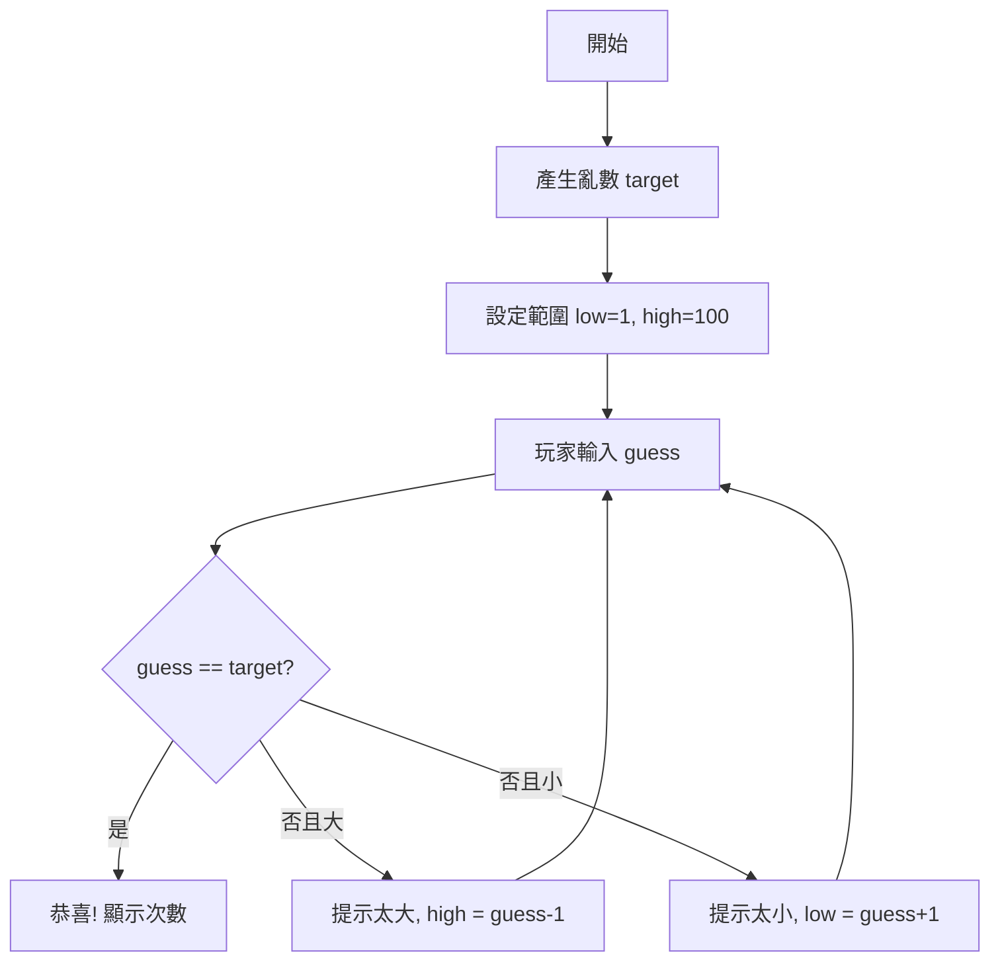

# 終極密碼：數字猜謎遊戲實作指南

>  TL;DR：目標是在 1~100 間猜中系統隨機數字。流程：初始化範圍  取得使用者輸入  判斷並回饋「太大/太小」 更新範圍  直到猜中。附流程圖、步驟拆解與 3 個練習。

## 前置知識
- 基本 JavaScript：`Math.random`、條件判斷、事件監聽
- 了解 DOM 取得元素與更新文字

---

## 遊戲規則與流程
1) 系統產生 1~100 的隨機整數。
2) 玩家輸入數字後送出。
3) 系統回饋「太大」或「太小」，並提示目前有效範圍。
4) 直到猜中，顯示恭喜訊息，並可重新開始。



---

## 範例程式碼（最小可行版）

```html
<form id="game">
  <input id="input" type="number" placeholder="1-100" min="1" max="100" required />
  <button type="submit">猜！</button>
</form>
<p id="hint">請輸入 1-100</p>
<p id="range">目前範圍：1 - 100</p>
<button id="reset">重新開始</button>
<script>
  const input = document.querySelector('#input');
  const hint = document.querySelector('#hint');
  const range = document.querySelector('#range');
  const form = document.querySelector('#game');
  const resetBtn = document.querySelector('#reset');

  let target, low, high, count;
  start();

  form.addEventListener('submit', (e) => {
    e.preventDefault();
    const guess = Number(input.value);
    if (!Number.isInteger(guess) || guess < low || guess > high) {
      hint.textContent = `請輸入 ${low}-${high} 的整數`;
      return;
    }
    count++;
    if (guess === target) {
      hint.textContent = ` 猜中了！答案是 ${target}，共 ${count} 次`;
    } else if (guess > target) {
      high = guess - 1;
      hint.textContent = '太大了！';
    } else {
      low = guess + 1;
      hint.textContent = '太小了！';
    }
    range.textContent = `目前範圍：${low} - ${high}`;
    input.value = '';
    input.focus();
  });

  resetBtn.addEventListener('click', start);

  function start() {
    target = Math.floor(Math.random() * 100) + 1;
    low = 1;
    high = 100;
    count = 0;
    hint.textContent = '請輸入 1-100';
    range.textContent = '目前範圍：1 - 100';
    input.value = '';
    input.focus();
  }
</script>
```

---

##  思路拆解
- **產生亂數**：`Math.floor(Math.random() * 100) + 1`
- **記錄範圍**：用 `low`、`high` 更新提示，降低盲猜
- **計算次數**：用 `count` 累計嘗試數
- **輸入驗證**：限制必須在當前範圍內，避免無效猜測
- **可重置**：提供「重新開始」按鈕

---

##  實戰練習（2 簡單 + 1 中等）

### 練習 1（簡單）
在提示中加入「剩餘嘗試次數」，預設 10 次，猜錯減 1，歸零時顯示遊戲結束並禁用輸入。

:::details 參考答案方向
- 新增 `remaining = 10`
- 每次猜錯 `remaining--`，更新提示
- `remaining === 0` 時顯示失敗並停用 input/button
:::

### 練習 2（簡單）
新增「歷史猜測」區塊，將玩家輸入依序記錄並顯示。

:::details 參考答案方向
- 準備一個陣列 `history`，推入每次 guess
- 渲染成文字：`history.join(', ')`
:::

### 練習 3（中等）
將遊戲改成「自訂範圍」，讓玩家在開始前輸入最小值與最大值，並驗證最小值 < 最大值。

:::details 參考答案與思路
- 在 UI 加入兩個 input，讀取 `min`, `max`
- 驗證後生成亂數：`Math.floor(Math.random() * (max - min + 1)) + min`
- 初始化 `low = min`、`high = max`
:::

---

##  延伸閱讀
- [MDN: Math.random()](https://developer.mozilla.org/docs/Web/JavaScript/Reference/Global_Objects/Math/random)
- [事件監聽 addEventListener](https://developer.mozilla.org/docs/Web/API/EventTarget/addEventListener)
- 可搭配本系列的 [service-worker-basic.md](./service-worker-basic.md) 了解離線快取（進階）

---

##  Demo
<video controls="controls" src="../assets/網頁操作/終極密碼/終極密碼-demo.mp4"></video>

