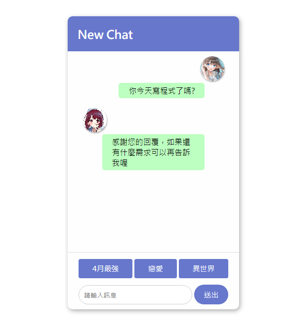

# 聊天機器人

## DEMO

[DEMO](https://lucashsu95.github.io/webDesign/chat/vanilla.html)



## 教學

### HTML

把HTML和CSS放上去吧!
```html
<div id="chat">
    <header>
        <h2>New Chat</h2>
    </header>
    <main></main>
    <section class="message-input">
        <button data-key="4月最強">4月最強</button>
        <button data-key="戀愛">戀愛</button>
        <button data-key="異世界">異世界</button>
    </section>
    <form class="message-input">
        <input type="text" placeholder="請輸入訊息" />
        <button class="send-btn">送出</button>
    </form>
</div>
```

css太長所以用下拉選單
::: details css
```css
* {
    font-family: 微軟正黑體;
}

:root {
    --color1: #67c;
}

body {
    display: flex;
    justify-content: center;
    align-items: center;
    min-height: 100vh;
}

#chat {
    width: 350px;
    height: 600px;

    display: grid;
    grid-template-rows: 1fr 15fr 2fr;

    background: #fefefe;
    box-shadow: 2px 3px 10px #aaa;
    border-radius: 10px;
    overflow: hidden;
}

/* header */

header {
    background: var(--color1);
    color: #fefefe;
    padding: 0 20px;
}

/* main */

main {
    overflow-y: auto;
    border-bottom: 1px solid #ddd;
    padding: 0 20px;
    padding-bottom: 10px;
    margin-bottom: 10px;
}

.message {
    padding: 10px;
    display: flex;
    flex-direction: column;
    align-items: start;
}

.message.user {
    align-items: end;
}

.avatar img {
    width: 50px;
    height: 50px;
    object-fit: cover;
    object-position: center;
    border-radius: 50%;
    box-shadow: 1px 2px 3px #0005;
}

.content {
    background: rgb(189, 255, 192);
    border-radius: 5px;
    padding: 5px 20px;
    margin: 0 40px;
}

/* message-input */

.message-input {
    padding-inline: 20px;
    padding-bottom: 10px;
    display: flex;
    align-items: center;
}

input,
button {
    padding: 10px;
    margin: 0 2px;
}

input {
    width: 100%;
    border-radius: 4px;
    border: 1px solid #ccc;
    border-radius: 45px;
    outline: none;
}

input:focus{
    border: 1px solid var(--color1);
}

button {
    flex: 1 1 auto;
    background: var(--color1);
    border: none;
    border-radius: 4px;
    color: #fff;
    cursor: pointer;
    font-size: 15px;
    transition: scale .3s;
    text-wrap: nowrap;

    &:hover{
        filter: brightness(0.85);
    }
    &:active{
        scale: 0.85;
    }
}

.send-btn {
    padding-inline: 20px;
    border-radius: 45px;
}
```
:::

### JS
今天的重點

#### 先把DOM抓好
```js
// DOM抓取
const main = document.querySelector("main");
const btns = [...document.querySelectorAll("button")];
const input = document.querySelector("input");
const form = document.querySelector(".message-input");
```
#### 綁定事件
```js
for (btn of btns) {
    btn.addEventListener("click", handleMessageSubmit);
}
form.addEventListener("submit", handleMessageSubmit);
```

#### 使用者點擊後要做什麼
```js
// 使用者輸入
const handleMessageSubmit = (e) => {
    e.preventDefault(); // 防止表單送出

    const msg = e.target.dataset.key ?? input.value; // 取得按鈕或輸入
    main.innerHTML += `
        <div class='message user'>
            <div class="avatar">
                
            </div>
            <div class="content">${msg}</div>
        </div>`;
    input.value = ""; // 清空輸入

    setTimeout(() => {
        robotMessage(msg); // 呼叫機器人回應的函式
    }, 500); // 延遲500毫秒
};
```

#### 機器人回應
```js
const robotMessage = (msg) => {
    let data = "";
    switch (msg) {
        case '4月最強':
            data = "「在演藝圈（這個世界）裡，謊言就是武器。」2023年4月最強廣世巨作「我推的孩子」";
            break;
        case '戀愛':
            data = "最近有「我內心的糟糕念頭」是最甜最甜的純真戀愛動漫，保證甜死你!";
            break;
        case '異世界':
            data = "如果你問我，那我也只能說高橋李依最棒!不訪試試看「為美好的世界獻上爆焰」！";
            break;
        default:
            data = '感謝您的回覆，如果還有什麼需求可以再告訴我喔';
            break;
    }

    main.innerHTML += `
        <div class='message'>
            <div class="avatar">
                
            </div>
            <div class="content">${data}</div>
        </div>
    `;

    main.scrollTop = main.scrollHeight; // 滾動到最下面
};
```

到這就完成了！

想要看到最完整的程式碼到DEMO的網站，請點選[DEMO](https://lucashsu95.github.io/webDesign/chat/vanilla.html)