# 購物車

> 📝 TL;DR
- MVP：商品清單 → 加入購物車 → 調整數量 → 計算總額 → 結帳前驗證。
- 狀態管理：用一份 `cart` 陣列存 `{id, name, price, qty}`，所有操作改這份 state，再渲染。
- 常見功能：數量上下限、移除項目、小計/總計、優惠碼、持久化(LocalStorage)。

## 前置知識
- 陣列操作：`find`、`map`、`filter`。
- 數字處理：小計 = `price * qty`，總計 = `reduce`。
- LocalStorage 或全域 state（Redux/Context/Pinia）。

## 基本流程

```mermaid
flowchart LR
	A[商品清單] -->|加入| B[購物車陣列]
	B --> C[更新數量]
	C --> D[計算小計]
	D --> E[計算總額/運費/折扣]
	E --> F[結帳驗證]
```


## 範例資料結構
```javascript
const products = [
	{ id: 'p1', name: 'T-Shirt', price: 480 },
	{ id: 'p2', name: 'Shoes', price: 1280 }
]

let cart = [
	// { id: 'p1', name: 'T-Shirt', price: 480, qty: 2 }
]
```

## 核心操作 (原生 JS)

```javascript
const addToCart = (product) => {
	const exists = cart.find((item) => item.id === product.id)
	if (exists) {
		exists.qty = Math.min(exists.qty + 1, 10) // 上限 10 件
	} else {
		cart.push({ ...product, qty: 1 })
	}
	persist()
	render()
}

const updateQty = (id, nextQty) => {
	cart = cart
		.map((item) =>
			item.id === id ? { ...item, qty: Math.min(Math.max(nextQty, 1), 10) } : item
		)
		.filter((item) => item.qty > 0)
	persist()
	render()
}

const removeItem = (id) => {
	cart = cart.filter((item) => item.id !== id)
	persist()
	render()
}

const summary = () => {
	const subtotal = cart.reduce((sum, i) => sum + i.price * i.qty, 0)
	const shipping = subtotal >= 1500 ? 0 : 120
	const discount = subtotal >= 2000 ? 200 : 0
	return { subtotal, shipping, discount, total: subtotal + shipping - discount }
}

const persist = () => localStorage.setItem('cart', JSON.stringify(cart))
const load = () => {
	cart = JSON.parse(localStorage.getItem('cart') || '[]')
	render()
}
```

## 簡易 UI 片段

```html
<ul id="product-list"></ul>
<ul id="cart-list"></ul>
<p id="total"></p>

<script>
const $ = (s) => document.querySelector(s)

function renderProducts() {
	$('#product-list').innerHTML = products
		.map(
			(p) => `
			<li>
				<span>${p.name} - $${p.price}</span>
				<button data-id="${p.id}" data-action="add">加入</button>
			</li>`
		)
		.join('')
}

function renderCart() {
	const { subtotal, shipping, discount, total } = summary()
	$('#cart-list').innerHTML = cart
		.map(
			(item) => `
			<li data-id="${item.id}">
				<span>${item.name}</span>
				<span>$${item.price}</span>
				<input type="number" min="1" max="10" value="${item.qty}" data-action="qty" />
				<span>小計 $${item.price * item.qty}</span>
				<button data-action="remove">移除</button>
			</li>`
		)
		.join('')
	$('#total').textContent = `小計 ${subtotal}，運費 ${shipping}，折扣 ${discount}，總計 ${total}`
}

document.addEventListener('click', (e) => {
	const id = e.target.dataset.id
	const action = e.target.dataset.action
	if (action === 'add') addToCart(products.find((p) => p.id === id))
	if (action === 'remove') removeItem(e.target.closest('li').dataset.id)
})

document.addEventListener('input', (e) => {
	if (e.target.dataset.action === 'qty') {
		const id = e.target.closest('li').dataset.id
		updateQty(id, Number(e.target.value))
	}
})

renderProducts()
load()
</script>
```

## 常見功能清單
- 數量上下限、移除項目、清空購物車
- 優惠碼/折扣（先驗證格式，再折抵）
- 運費邏輯：滿額免運、或依重量計費
- 失效處理：若商品下架/庫存不足，結帳前阻擋並提示

## 實戰練習

### 練習 1：數量上下限（簡單）⭐
> 將購物車每項的數量限制在 1~10 之間，超出則自動修正。

:::details 💡 參考答案
```javascript
nextQty = Math.min(Math.max(nextQty, 1), 10)
```
:::

### 練習 2：運費規則（簡單）⭐
> 小計滿 1500 免運，未達則運費 120 元，計算總額時加入。

:::details 💡 參考答案
```javascript
const shipping = subtotal >= 1500 ? 0 : 120
const total = subtotal + shipping
```
:::

### 練習 3：優惠碼驗證（中等）⭐⭐
> 加入優惠碼輸入框，輸入 `SAVE200` 折抵 200 元，其餘不折抵並提示。

:::details 💡 參考答案與提示
```javascript
const applyCoupon = (code) => (code === 'SAVE200' ? 200 : 0)
const discount = applyCoupon(userInput)
const total = subtotal + shipping - discount
```
:::

## 延伸閱讀
- MDN: [Array.prototype.reduce](https://developer.mozilla.org/en-US/docs/Web/JavaScript/Reference/Global_Objects/Array/reduce) - 計算總額常用
- Stripe Docs: Checkout 前的驗證與金額計算
- React/Pinia/Redux 官方文件：狀態管理模式

## FAQ
- Q: 金額出現浮點數誤差？
	- A: 金額以「整數分」計算，例如存成 `priceInCents`，計算後再除以 100 顯示。
- Q: 購物車刷新後消失？
	- A: 請在初始化時讀取 LocalStorage，並在每次變更後寫回。
- Q: 跨頁面共用購物車？
	- A: 可用 Context/Redux/Pinia 或 URL 同步；亦可將 cart 存入後端 session。
