# WSL 安裝與 VS Code 連線指南

> 目標：從零啟用 WSL2、建立 Ubuntu 環境，並透過 VS Code 連線開發。本文只涵蓋 WSL 與 VS Code，未包含 Redis、K6 等服務。

## 目錄

1. [環境需求](#環境需求)
2. [安裝 WSL2](#安裝-wsl2)
3. [初始化與更新](#初始化與更新)
4. [VS-Code-連線-Windows-WSL](#vs-code-連線-windows-wsl)
5. [常用指令速查](#常用指令速查)
6. [常見問題](#常見問題)

## 環境需求

- 作業系統：Windows 10 (2004 以上) 或 Windows 11
- 權限：系統管理員權限（執行安裝與重啟）
- 虛擬化：需開啟 BIOS/UEFI 的虛擬化（Intel VT-x / AMD-V）

## 安裝 WSL2

1. 以系統管理員身分開啟 PowerShell，執行：

    ```powershell
    wsl --install
    ```

    這會啟用必要功能並安裝預設的 Ubuntu 發行版。

2. 重啟電腦。

3. 再次確認 WSL 版本：

    ```powershell
    wsl --list --verbose
    ```

    `VERSION` 應為 `2`。若不是，設定預設版本：

    ```powershell
    wsl --set-default-version 2
    ```

## 初始化與更新

1. 首次啟動 Ubuntu，依提示建立使用者名稱與密碼（輸入密碼時不會顯示字元）。
2. 更新套件庫與既有軟體：

    ```bash
    sudo apt update && sudo apt upgrade -y
    ```

3. 常用檢查：

    ```powershell
    wsl --status           # 查看 WSL 核心與預設版本
    wsl --list --verbose   # 查看已安裝的發行版
    ```

4. 建議將專案存放在 Linux 家目錄（如 `/home/<user>/projects`），避免放在 `/mnt/c` 以降低 I/O 延遲。

## VS Code 連線 (Windows WSL)

1. 在 Windows 安裝 [VS Code](https://code.visualstudio.com/)。
2. 在 VS Code 安裝官方擴充套件 **Remote - WSL**。
3. 在 WSL 終端機切到專案資料夾：

    ```bash
    cd ~/projects/<your-project>
    code .
    ```

    會自動啟動 Windows 端的 VS Code 並附掛到 WSL 環境。

4. 檔案路徑建議：
    - WSL 端專案：`/home/<user>/projects/...`
    - 如需從 Windows 檔案總管開啟，可在位址列輸入 `\\wsl$\Ubuntu\home\<user>\projects`。

## Git SSH 設定指南

### 為什麼需要 SSH？

使用 SSH 金鑰可以：
- ✅ 免密碼推送程式碼到 GitHub/GitLab
- ✅ 更安全（不需在終端輸入密碼）
- ✅ 支援多帳號管理

### SSH 金鑰設定流程

```mermaid
flowchart LR
    A[產生 SSH 金鑰] --> B[複製公鑰]
    B --> C[上傳到 GitHub/GitLab]
    C --> D[測試連線]
    D --> E[開始使用]
    
    style A fill:#87CEEB
    style C fill:#FFD700
    style E fill:#90EE90
```



### 步驟 1: 產生 SSH 金鑰

在 WSL 終端機執行：

```bash
# 產生新的 SSH 金鑰（使用你的 email）
ssh-keygen -t ed25519 -C "your_email@example.com"

# 如果系統不支援 ed25519，使用 RSA
ssh-keygen -t rsa -b 4096 -C "your_email@example.com"
```

**互動提示說明：**
```bash
# 提示 1: 儲存位置（直接按 Enter 使用預設路徑）
Enter file in which to save the key (/home/user/.ssh/id_ed25519): [直接按 Enter]

# 提示 2: 輸入密碼（可留空，但建議設定）
Enter passphrase (empty for no passphrase): [輸入密碼或按 Enter]
Enter same passphrase again: [再次輸入密碼]
```

**成功訊息：**
```
Your identification has been saved in /home/user/.ssh/id_ed25519
Your public key has been saved in /home/user/.ssh/id_ed25519.pub
The key fingerprint is:
SHA256:xxxxxxxxxxxxxxxxxxxxxxxxxxxxxxxxxxx your_email@example.com
```

### 步驟 2: 啟動 SSH Agent

```bash
# 啟動 ssh-agent
eval "$(ssh-agent -s)"

# 將金鑰加入 agent
ssh-add ~/.ssh/id_ed25519

# 若使用 RSA
# ssh-add ~/.ssh/id_rsa
```

### 步驟 3: 複製公鑰

```bash
# 方法 1: 使用 cat 顯示後複製
cat ~/.ssh/id_ed25519.pub

# 方法 2: 直接複製到剪貼簿（需安裝 clip.exe）
cat ~/.ssh/id_ed25519.pub | clip.exe
```

**公鑰格式範例：**
```
ssh-ed25519 AAAAC3NzaC1lZDI1NTE5AAAAIxxxxxxxxxxxxxxxxxxxxxxxxxxxxxxx your_email@example.com
```

### 步驟 4: 上傳到 GitHub

1. 開啟 [GitHub SSH 設定頁面](https://github.com/settings/keys)
2. 點擊「New SSH key」
3. 填寫資訊：
   - **Title**: 例如「WSL Ubuntu」或「開發筆電」
   - **Key**: 貼上剛才複製的公鑰
4. 點擊「Add SSH key」

### 步驟 5: 測試連線

```bash
# 測試 GitHub 連線
ssh -T git@github.com

# 成功訊息
# Hi username! You've successfully authenticated, but GitHub does not provide shell access.

# 測試 GitLab 連線
ssh -T git@gitlab.com

# 成功訊息
# Welcome to GitLab, @username!
```

### 步驟 6: 設定 Git 全域資訊

```bash
# 設定全域使用者名稱
git config --global user.name "Your Name"

# 設定全域 email
git config --global user.email "your_email@example.com"

# 查看設定
git config --list
```

### SSH 多帳號管理

如果你有多個 GitHub/GitLab 帳號，可以設定不同的 SSH 金鑰：

**1. 產生不同的金鑰：**
```bash
# 個人帳號
ssh-keygen -t ed25519 -C "personal@email.com" -f ~/.ssh/id_ed25519_personal

# 工作帳號
ssh-keygen -t ed25519 -C "work@email.com" -f ~/.ssh/id_ed25519_work
```

**2. 建立 SSH config 檔案：**
```bash
# 編輯或建立 config 檔案
nano ~/.ssh/config
```

**3. 加入設定：**
```
# 個人 GitHub 帳號
Host github-personal
    HostName github.com
    User git
    IdentityFile ~/.ssh/id_ed25519_personal

# 工作 GitHub 帳號
Host github-work
    HostName github.com
    User git
    IdentityFile ~/.ssh/id_ed25519_work

# GitLab 帳號
Host gitlab.com
    HostName gitlab.com
    User git
    IdentityFile ~/.ssh/id_ed25519_gitlab
```

**4. 使用範例：**
```bash
# Clone 個人專案
git clone git@github-personal:username/repo.git

# Clone 工作專案
git clone git@github-work:company/repo.git

# Clone GitLab 專案
git clone git@gitlab.com:username/repo.git
```

## 實戰演練

### 演練 1: 完整環境設定（簡單）⭐

**目標：** 從零開始建立 WSL 開發環境

**步驟：**
1. 安裝 WSL2 並重啟
2. 建立使用者帳號
3. 更新系統套件
4. 建立專案目錄結構

**實作指令：**
```bash
# 在 WSL 終端執行

# 1. 確認 WSL 版本
wsl --list --verbose

# 2. 更新系統
sudo apt update && sudo apt upgrade -y

# 3. 安裝常用工具
sudo apt install -y git curl wget vim htop

# 4. 建立專案目錄結構
mkdir -p ~/projects/{frontend,backend,scripts}
cd ~/projects

# 5. 查看目錄樹
ls -la
```

**驗證成功：**
```bash
# 應該看到類似輸出
total 20
drwxr-xr-x 5 user user 4096 Dec 30 10:00 .
drwxr-xr-x 7 user user 4096 Dec 30 09:55 ..
drwxr-xr-x 2 user user 4096 Dec 30 10:00 frontend
drwxr-xr-x 2 user user 4096 Dec 30 10:00 backend
drwxr-xr-x 2 user user 4096 Dec 30 10:00 scripts
```

### 演練 2: SSH 金鑰完整設定（中等）⭐⭐

**目標：** 設定 GitHub SSH 並測試推送

**步驟：**

```bash
# 1. 產生 SSH 金鑰
ssh-keygen -t ed25519 -C "your_email@example.com"
# 按三次 Enter（使用預設路徑，不設密碼）

# 2. 啟動 ssh-agent
eval "$(ssh-agent -s)"
ssh-add ~/.ssh/id_ed25519

# 3. 顯示公鑰
cat ~/.ssh/id_ed25519.pub
# 複製整段輸出（從 ssh-ed25519 開始到 email 結束）

# 4. 上傳到 GitHub
# 開啟 https://github.com/settings/keys
# 點擊 "New SSH key"，貼上公鑰

# 5. 測試連線
ssh -T git@github.com
# 看到 "Hi username!" 就成功了

# 6. 設定 Git 資訊
git config --global user.name "Your Name"
git config --global user.email "your_email@example.com"

# 7. 建立測試專案
cd ~/projects
mkdir test-repo && cd test-repo
git init
echo "# Test Repository" > README.md
git add .
git commit -m "Initial commit"

# 8. 連結遠端倉庫（請先在 GitHub 建立 repo）
git remote add origin git@github.com:username/test-repo.git
git branch -M main
git push -u origin main
```

**驗證成功：**
- ✅ SSH 連線測試成功
- ✅ Git 資訊設定完成
- ✅ 可以推送到 GitHub

### 演練 3: VS Code 整合開發（中等）⭐⭐

**目標：** 使用 VS Code 在 WSL 中開發專案

**步驟：**

```bash
# 1. 安裝 Node.js（範例用）
curl -fsSL https://deb.nodesource.com/setup_20.x | sudo -E bash -
sudo apt-get install -y nodejs

# 2. 確認安裝
node --version
npm --version

# 3. 建立 Node.js 專案
cd ~/projects
mkdir my-app && cd my-app
npm init -y

# 4. 用 VS Code 開啟
code .
```

**在 VS Code 中：**
1. 確認左下角顯示「WSL: Ubuntu」
2. 安裝推薦的擴充套件（如 ESLint、Prettier）
3. 建立 `index.js` 檔案：

```javascript
// index.js
console.log('Hello from WSL!');
```

4. 在 VS Code 終端執行：
```bash
node index.js
# 輸出: Hello from WSL!
```

### 演練 4: 多帳號 SSH 管理（困難）⭐⭐⭐

**目標：** 設定個人和工作用的不同 GitHub 帳號

**步驟：**

```bash
# 1. 產生兩組金鑰
ssh-keygen -t ed25519 -C "personal@email.com" -f ~/.ssh/id_personal
ssh-keygen -t ed25519 -C "work@email.com" -f ~/.ssh/id_work

# 2. 建立 SSH config
cat > ~/.ssh/config << 'EOF'
# 個人帳號
Host github-personal
    HostName github.com
    User git
    IdentityFile ~/.ssh/id_personal

# 工作帳號
Host github-work
    HostName github.com
    User git
    IdentityFile ~/.ssh/id_work
EOF

# 3. 設定權限
chmod 600 ~/.ssh/config

# 4. 將金鑰加入 agent
ssh-add ~/.ssh/id_personal
ssh-add ~/.ssh/id_work

# 5. 顯示並上傳公鑰到對應的 GitHub 帳號
echo "=== 個人帳號公鑰 ==="
cat ~/.ssh/id_personal.pub

echo -e "\n=== 工作帳號公鑰 ==="
cat ~/.ssh/id_work.pub

# 6. 測試連線
ssh -T github-personal
ssh -T github-work

# 7. Clone 測試
cd ~/projects

# 個人專案
git clone git@github-personal:personal-username/repo.git personal-project

# 工作專案
git clone git@github-work:company-username/repo.git work-project

# 8. 設定不同專案的 Git 資訊
cd personal-project
git config user.name "Personal Name"
git config user.email "personal@email.com"

cd ../work-project
git config user.name "Work Name"
git config user.email "work@email.com"
```

**驗證成功：**
```bash
# 在各自的專案中查看設定
cd ~/projects/personal-project
git config user.email  # 應顯示個人 email

cd ~/projects/work-project
git config user.email  # 應顯示工作 email
```

## 常用指令速查

```powershell
wsl --list --verbose        # 列出所有發行版與版本
wsl --set-default <Name>    # 設定預設發行版
wsl --terminate <Name>      # 停止某個發行版
wsl --shutdown              # 停止所有 WSL 實例
wsl --install -d Ubuntu-22.04 # 安裝指定版本
```

```bash
# Ubuntu 內部
uname -a           # 查看核心與架構
df -h              # 查看磁碟空間
htop               # 查看 CPU/記憶體（需先 sudo apt install htop）
```

## 常見問題

### Q1: 在 PowerShell 執行 `wsl --install` 失敗，怎麼辦？

**A:** 
- 確認已開啟虛擬化；必要時在「啟用或關閉 Windows 功能」勾選「適用於 Linux 的 Windows 子系統」與「虛擬機平台」，再重啟。
- 若仍失敗，可執行 `wsl --update` 後再嘗試。
- 檢查 Windows 版本是否符合要求（Windows 10 2004+ 或 Windows 11）

**詳細排查步驟：**
```powershell
# 1. 檢查 Windows 版本
winver

# 2. 檢查虛擬化是否啟用
systeminfo | findstr /i "virtualization"

# 3. 手動啟用 WSL 功能
dism.exe /online /enable-feature /featurename:Microsoft-Windows-Subsystem-Linux /all /norestart
dism.exe /online /enable-feature /featurename:VirtualMachinePlatform /all /norestart

# 4. 重啟後更新 WSL
wsl --update
```

### Q2: VS Code 無法連上 WSL？

**A:** 
- 確認已安裝 **Remote - WSL** 擴充套件。
- 在 WSL 內移除舊 Server：`rm -rf ~/.vscode-server`，再重新 `code .`。
- 若卡在權限，檢查目錄屬性：`sudo chown -R $(whoami) ~/.vscode-server`。

**進階除錯：**
```bash
# 1. 檢查 vscode-server 狀態
ls -la ~/.vscode-server

# 2. 清理並重新安裝
rm -rf ~/.vscode-server ~/.vscode-server-insiders

# 3. 從 WSL 重新啟動 VS Code
cd ~/projects
code .

# 4. 查看 VS Code 連線日誌
# 在 VS Code 中：按 F1 → 輸入 "Remote-WSL: Show Log"
```

### Q3: Windows 程式要如何連到 WSL 內的服務？

**A:** 
直接使用 `localhost:<port>`（WSL2 會自動做轉發）。若從 WSL 連回 Windows，可用 `127.0.0.1` 或取得 Windows 主機 IP：

```bash
# 方法 1: 從 resolv.conf 取得
cat /etc/resolv.conf | grep nameserver | awk '{print $2}'

# 方法 2: 使用變數
export WIN_HOST=$(cat /etc/resolv.conf | grep nameserver | awk '{print $2}')
echo $WIN_HOST

# 測試連線
ping $WIN_HOST
```

### Q4: WSL 儲存空間不足怎麼清理？

**A:** 
- 清除 apt 快取：`sudo apt clean && sudo apt autoremove`
- 刪除不用的發行版：`wsl --unregister <Name>`
- 若使用 WSL 封裝檔（.vhdx），可在磁碟管理中壓縮或用 `Optimize-VHD`（需 Hyper-V）。

**完整清理腳本：**
```bash
# 1. 清理 apt 快取
sudo apt clean
sudo apt autoremove -y

# 2. 清理 journal 日誌
sudo journalctl --vacuum-time=3d

# 3. 清理 npm 快取（如有安裝 Node.js）
npm cache clean --force

# 4. 清理 pip 快取（如有安裝 Python）
pip cache purge

# 5. 找出大檔案
du -h --max-depth=1 ~ | sort -hr | head -10
```

**在 Windows 端壓縮 WSL 映像：**
```powershell
# 1. 關閉 WSL
wsl --shutdown

# 2. 找到 ext4.vhdx 位置
# 通常在：C:\Users\<username>\AppData\Local\Packages\CanonicalGroupLimited...\LocalState\ext4.vhdx

# 3. 使用 diskpart 壓縮
diskpart
select vdisk file="C:\Users\<username>\AppData\Local\Packages\...\ext4.vhdx"
compact vdisk
exit
```

### Q5: 如何重置或移除 WSL？

**A:** 
- 只移除某個發行版：`wsl --unregister <Name>`
- 全部重置：在「應用程式與功能」找到「適用於 Linux 的 Windows 子系統」並重置，或重新執行 `wsl --unregister` 後再 `wsl --install`。

**完整移除步驟：**
```powershell
# 1. 列出所有發行版
wsl --list --verbose

# 2. 移除特定發行版
wsl --unregister Ubuntu

# 3. 停用 WSL 功能（完全移除）
dism.exe /online /disable-feature /featurename:Microsoft-Windows-Subsystem-Linux
dism.exe /online /disable-feature /featurename:VirtualMachinePlatform

# 4. 重啟電腦
```

### Q6: WSL 與 Hyper-V 會衝突嗎？

**A:** 
WSL2 依賴 Hyper-V 技術，但可以與一般虛擬機並存。若使用第三方虛擬機（如 VirtualBox 6.0 以下版本）出現衝突，可：
- 改用 WSL1（`wsl --set-version <Name> 1`）
- 升級第三方虛擬機到支援 Hyper-V 的版本（VirtualBox 6.1+）
- 啟用該虛擬機的軟體相容模式

### Q7: 我需要將專案放在哪裡？

**A:** 
建議放在 `/home/<user>/projects` 之類的 Linux 目錄，可避免 `/mnt/c` 帶來的 I/O 延遲，也方便透過 `code .` 直接開啟。

**效能比較：**
| 位置                  | 讀寫速度 | 推薦用途                 |
| --------------------- | -------- | ------------------------ |
| `/home/user/projects` | ⚡ 快     | 開發專案（強烈推薦）     |
| `/mnt/c/projects`     | 🐌 慢     | 與 Windows 共用檔案      |
| `/tmp`                | ⚡⚡ 很快  | 臨時檔案（重啟後會清除） |

### Q8: SSH 連線 GitHub 失敗怎麼辦？

**A:** 常見原因與解決方法：

**錯誤 1: Permission denied (publickey)**
```bash
# 原因：SSH 金鑰未加入或未上傳
# 解決：
ssh-add ~/.ssh/id_ed25519
ssh -T git@github.com
```

**錯誤 2: Could not resolve hostname**
```bash
# 原因：網路問題或 DNS 設定錯誤
# 解決：測試網路連線
ping github.com
nslookup github.com
```

**錯誤 3: Bad owner or permissions**
```bash
# 原因：SSH 檔案權限不正確
# 解決：修正權限
chmod 700 ~/.ssh
chmod 600 ~/.ssh/id_ed25519
chmod 644 ~/.ssh/id_ed25519.pub
chmod 644 ~/.ssh/config
```

**除錯步驟：**
```bash
# 1. 詳細模式測試 SSH
ssh -vT git@github.com

# 2. 檢查 SSH 金鑰是否已載入
ssh-add -l

# 3. 手動指定金鑰測試
ssh -i ~/.ssh/id_ed25519 -T git@github.com

# 4. 檢查 GitHub 上的 SSH 金鑰
# 前往：https://github.com/settings/keys
```

### Q9: Git 推送時要求輸入密碼？

**A:** 表示你使用的是 HTTPS 而非 SSH 連線。

**解決方法：**
```bash
# 1. 查看目前遠端 URL
git remote -v

# 2. 如果看到 https://github.com...，改為 SSH
git remote set-url origin git@github.com:username/repo.git

# 3. 驗證修改
git remote -v

# 4. 測試推送
git push
```

## 相關資源

### 官方文件
- [WSL 官方文檔](https://learn.microsoft.com/windows/wsl/) - 微軟官方完整指南
- [Remote - WSL 擴充套件](https://marketplace.visualstudio.com/items?itemName=ms-vscode-remote.remote-wsl) - VS Code 官方擴充套件
- [WSL 故障排除](https://learn.microsoft.com/windows/wsl/troubleshooting) - 官方問題排查指南

### Git 與 SSH 相關
- [GitHub SSH 金鑰設定](https://docs.github.com/zh/authentication/connecting-to-github-with-ssh) - GitHub 官方 SSH 教學
- [GitLab SSH 金鑰設定](https://docs.gitlab.com/ee/user/ssh.html) - GitLab 官方 SSH 教學
- [Git 官方文件](https://git-scm.com/book/zh-tw/v2) - Git 繁體中文版完整教學

### 開發工具
- [VS Code 官方網站](https://code.visualstudio.com/) - 下載 VS Code
- [Node.js 官方網站](https://nodejs.org/) - 下載 Node.js
- [Oh My Zsh](https://ohmyz.sh/) - 美化終端機的工具

### 社群資源
- [WSL GitHub Issues](https://github.com/microsoft/WSL/issues) - 回報問題與查看已知問題
- [VS Code Remote Development](https://code.visualstudio.com/docs/remote/remote-overview) - Remote 開發完整指南

## 延伸學習

### 下一步建議

完成 WSL 設定後，你可以繼續學習：

- 安裝 [Oh My Zsh](https://ohmyz.sh/) 美化終端
- 設定 [tmux](https://github.com/tmux/tmux/wiki) 終端多工
- 學習 [Vim](https://www.vim.org/) 或 [Neovim](https://neovim.io/) 編輯器


### 實用指令速查表

```bash
# WSL 管理
wsl --list --verbose          # 列出所有發行版
wsl --set-default Ubuntu      # 設定預設發行版
wsl --shutdown                # 停止所有 WSL
wsl --update                  # 更新 WSL 核心

# 系統管理
sudo apt update               # 更新套件列表
sudo apt upgrade              # 升級已安裝套件
sudo apt autoremove           # 移除不需要的套件
df -h                         # 查看磁碟空間
htop                          # 查看系統資源

# Git 常用
git status                    # 查看狀態
git add .                     # 加入所有變更
git commit -m "message"       # 提交變更
git push                      # 推送到遠端
git pull                      # 拉取更新
git log --oneline             # 查看提交歷史

# SSH 管理
ssh-keygen -t ed25519         # 產生金鑰
ssh-add ~/.ssh/id_ed25519     # 加入金鑰到 agent
ssh-add -l                    # 列出已載入的金鑰
ssh -T git@github.com         # 測試 GitHub 連線
```

## 總結

完成本文的設定後，你已經擁有：

✅ 完整的 WSL2 開發環境  
✅ VS Code 與 WSL 整合  
✅ Git 與 SSH 金鑰設定  
✅ 多帳號 SSH 管理能力

現在你可以：
- 在 Windows 上使用完整的 Linux 開發環境
- 透過 SSH 免密碼推送程式碼
- 使用 VS Code 無縫開發 WSL 專案
- 管理多個 Git 帳號