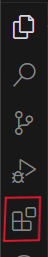
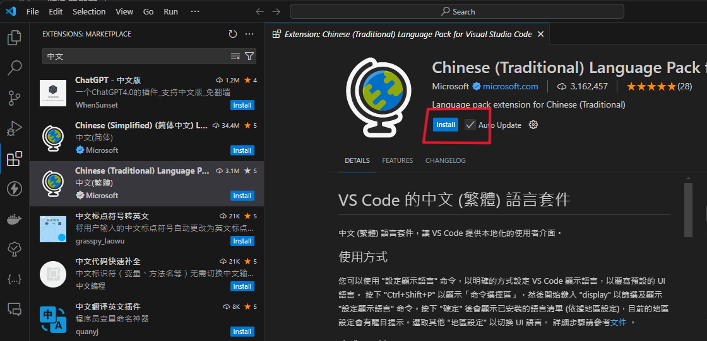
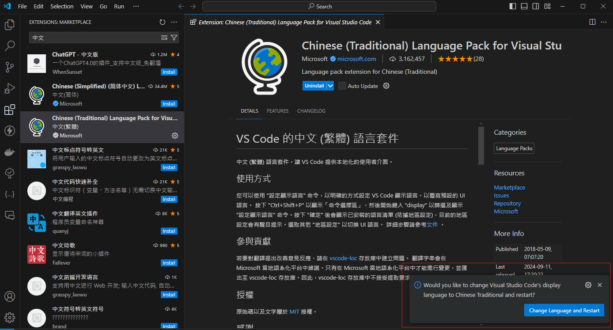
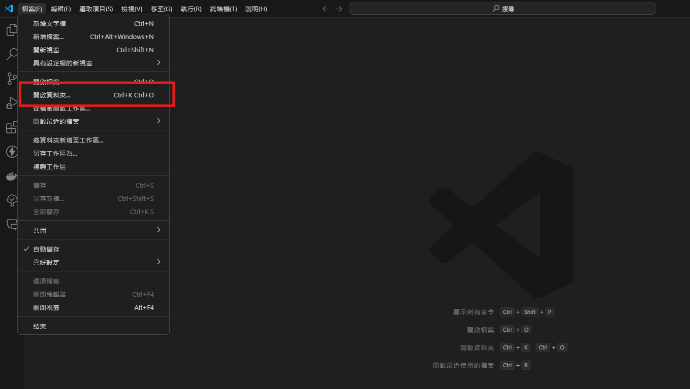
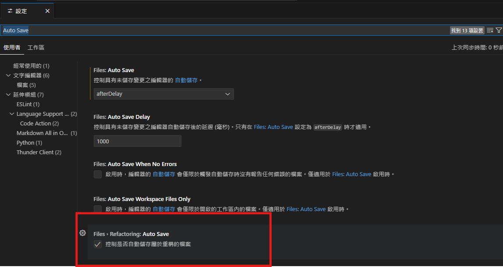

---
head:
  - - meta
    - name: author
      content: 許恩綸
  - - meta
    - name: keywords
      content: Python, python, 新手上路, 安裝VSCode, 開發環境設置
  - - meta
    - name: og:title
      content: Python新手上路 Day0 - 安裝VSCode
  - - meta
    - name: og:descriptionN
      content: 學習如何安裝VSCode
  - - meta
    - name: og:type
      content: article
---

# 安裝vscode

到[官網](https://code.visualstudio.com/) 點donwload(下載) 
然後就啟動 
一直按下一步 
最後面的 按右鍵以code開啟 這個選項可以抅

## 下載中文外掛

然後在左邊會看到這些選項，去點四個方塊的那個
就是圖片中第5個icon

按下去
然後在搜尋框打中文

::: info 資訊
install 是下載的意思 
uninstall 是解除安裝的意思
:::

::: warning 注意
然後右下角會跳出訊息 問你要不要改語言
當然是直接點擊`Change Language and Restart`
:::

## 開始連結資料夾

1. 創一個空的資料夾
2. 在到vscode的左上角點擊【檔案】
3. 然後可以找到【開啟資料夾】的選項

選擇剛剛建好的資料夾
按【選擇資料夾】

## Auto Save
在儲存時自動格式化文件
到左下角的齒輪 -> 設定 -> 搜尋框打`auto save`

## 可以安裝的掛件

- 如果要用python就在搜尋框打`python`然後就點install
- 做網頁就可以去找`live server`
- `cdnjs`引入套件很好用
- `Vitesse theme` 或是 `Owl` 的顏色好看(按`ctrl` + `shift` + `p` 然後打`Color Theme` 可以自己調顏色)
