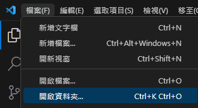

---
head:
  - - meta
    - name: author
      content: 許恩綸
  - - meta
    - name: keywords
      content: PHP, php, 如何開始php
  - - meta
    - name: og:title
      content: PHP-Day1
  - - meta
    - name: og:description
      content: 學習如何寫php
  - - meta
    - name: og:type
      content: article
---

# PHP-Day1

想必已經有裝好xampp了吧

沒有的話可以看這篇

[**xampp 起手式｜下載xampp**](./xampp/xampp起手式)

## 新增資料夾

預設`xampp`會在C槽

打開`xampp`裡的`htdocs`

在`htdocs`裡創一個資料夾`web01`

先打開vscode

vscode左上角裡有個`檔案`、`開啟資料夾`
然後去選剛剛建立好的`web01`

之後在按確定

~~要是找不到請去洗眼睛~~



## 創檔案寫程式

在`web01`的資料夾裡創個檔案index.php

要寫php的話要在`<?php   ?>`裡面寫

所以就是

```php
# xampp/htdocs/web01/index.php

<?php
echo <h1>123</h1>;
?>
```

## 結果

打開chrome或是其他遊覽器都可

在網址列上打`localhost/web01`

就可以看到123了