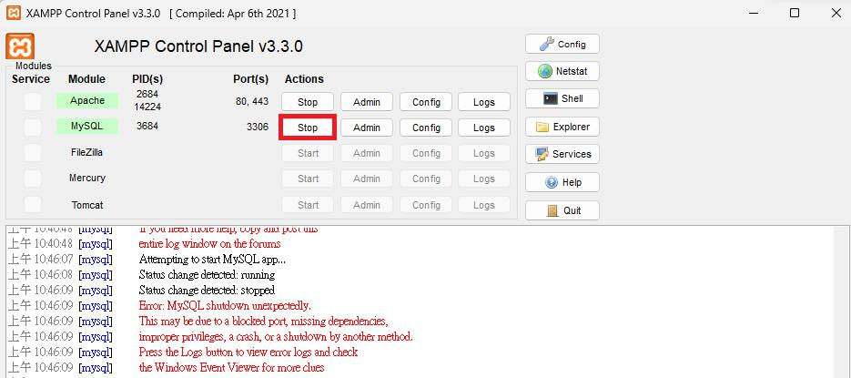
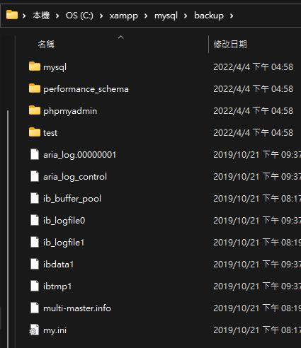
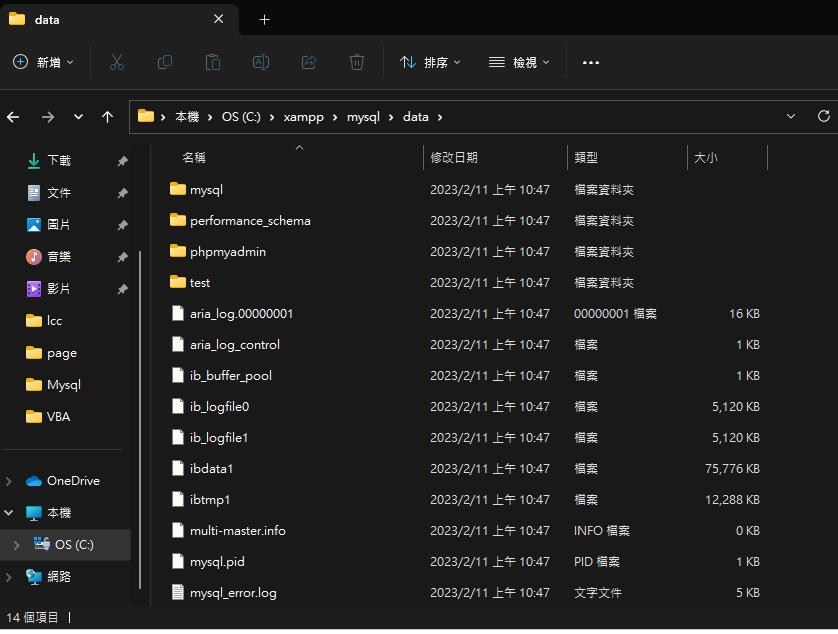
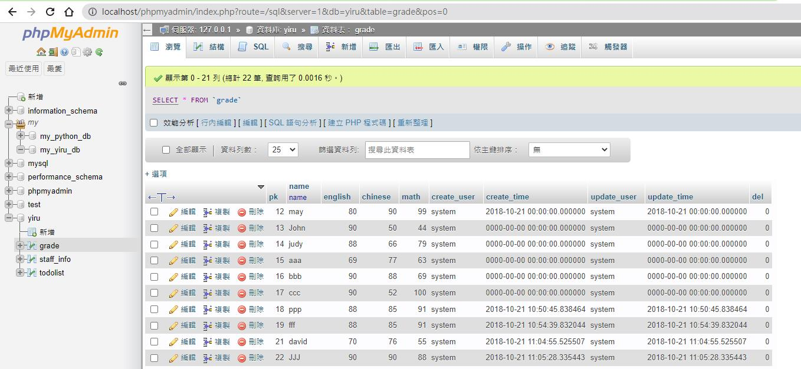

# xampp mysql 又壞掉
## 將data資料夾先備份
先到路徑`C:\xampp\mysql\data`

將`data`資料夾改名叫做`data1`

再建立一個新的`data`資料夾，建立完後重啟一下xampp的mysql

此時應該還是不能運行的

重啟後 `data` 資料夾會多了幾個檔案

接下來到`C:\xampp\mysql\backup`資料夾下，複製

`mysql`,`performance_schema`,`phpmyadmin`,等資料夾到`data`

接下來再重啟一下xampp的mysql,此時已經可以正常啟動了

1. 如果不行就重開機再來一次
2. 重開機把上面的流程再來一次，如果還是不行就可以準備重裝了

## 資料表無法使用

接下來可能你會發現你的資料庫底下的資料表無法使用

先關閉xampp-mysql→再從舊的剛剛複製的data1資料夾中複製 `ibdata1` 到新的 `data` 資料夾中

再重啟xampp-mysql即可正常

