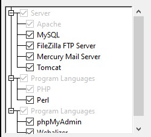
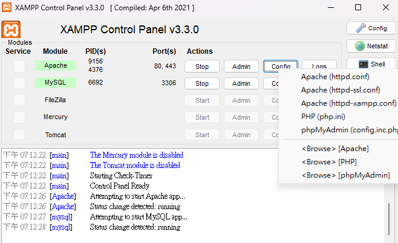
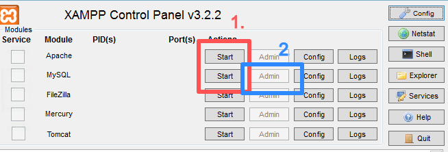
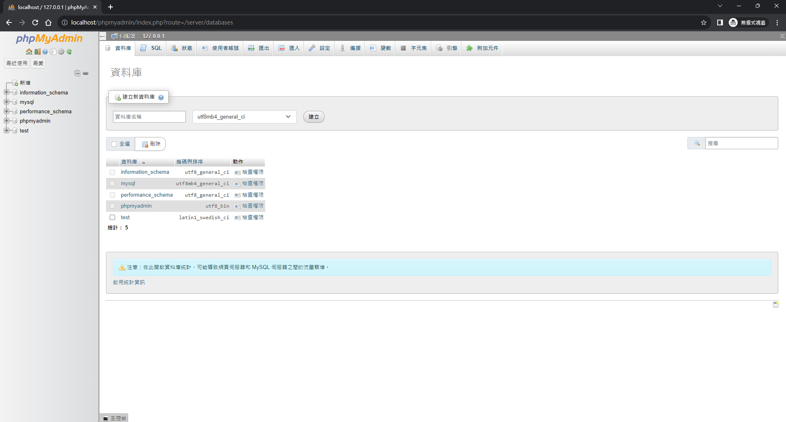
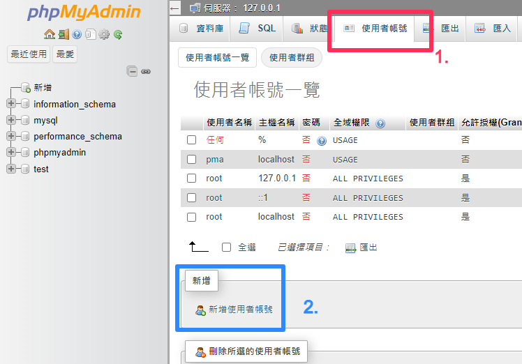
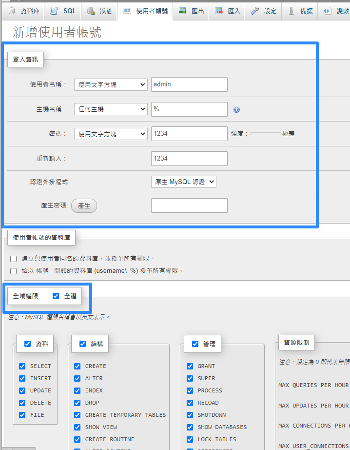
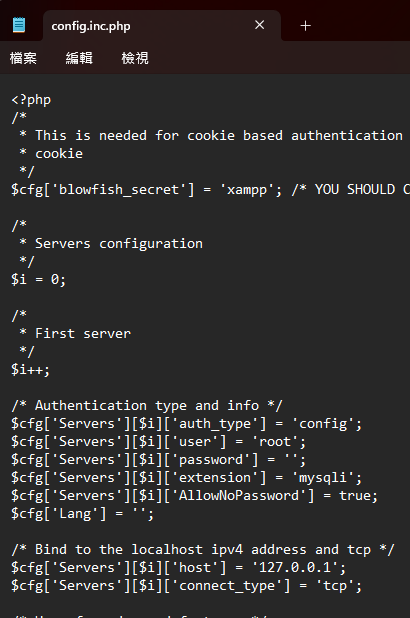
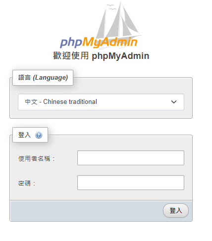

# xampp 起手式｜資料庫｜下載xampp

## 下載

官網下載: [點我下載](https://www.apachefriends.org/zh_tw/download.html)

就一直按下一步，直到看到這個畫面只要鈎

- Apcahe
- MySQl
- PHP
- phpMyAdmin
就可以了

~~也可以直接一直按下一步就是了~~

## 建立使用者帳號

裝好之後可以點開 xampp control (就會看到這個畫面)

1. 先把 `Apache` 和 `MySQL` 點開 (按下`Start`)
2. 再按下 `MySQL` 的 Admin

~~這應該沒有很難~~

---

點開 `MySQL` 的 `Admin` 之後就會看到這個畫面

中間有個`使用者帳號`按下去

在按下`新增使用者帳號`

把`使用者名稱`、`密碼`打完，記得要鉤全選

都做好後就可以用滾輪滾到最下面按下執行的按鈕

---

## 更改Apache

到這裡點擊`Apache`的`Config`在點擊第五個`phpMyAdmin`

把

1. `auth_type` 的 `config` 改成 `cookie`
2. `user` 的 `root` 改成 `admin`
3. `password` 的 `''` 改成 `1234`

然後重啟Apache (就是點擊Stop再點Start)

之後就可以用帳號登入了

