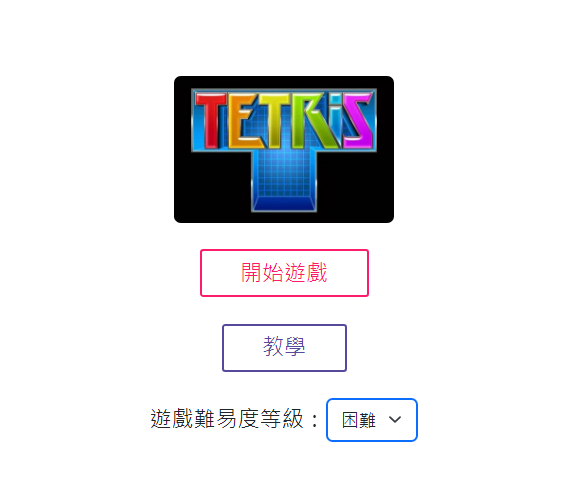
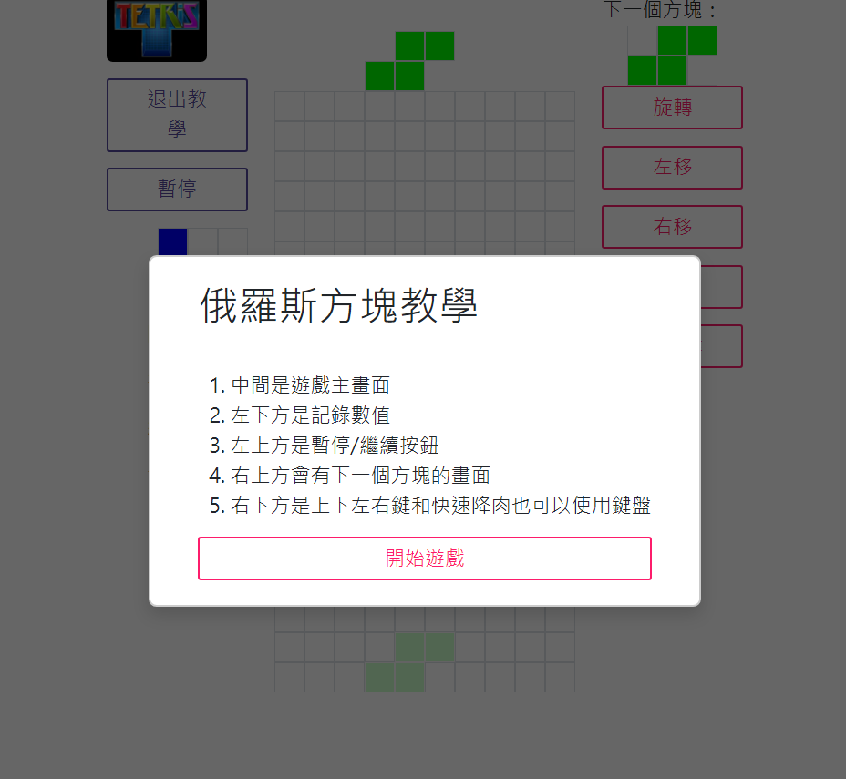
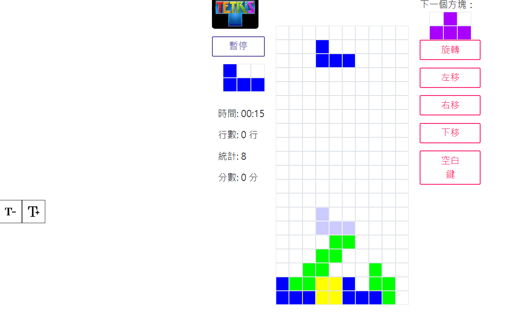
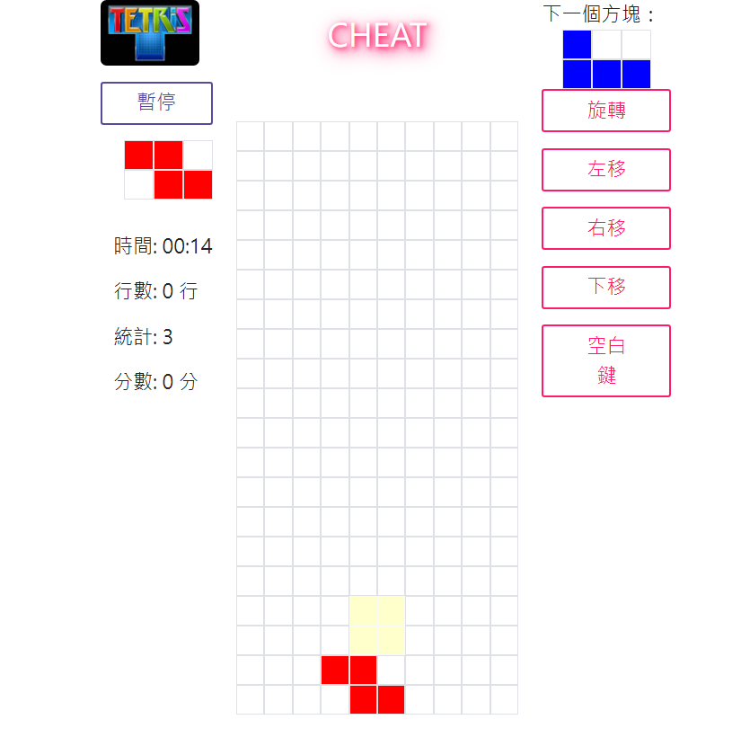
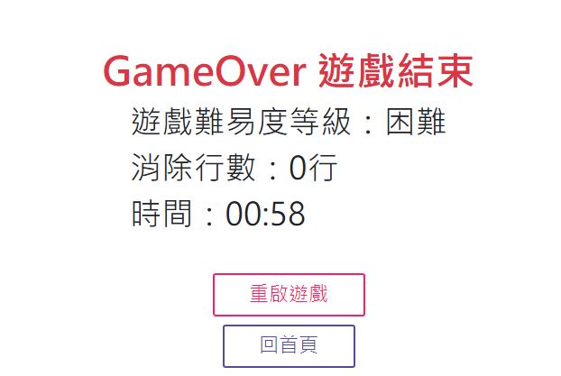

# 49_Module_A_Game 俄羅斯方塊

## Introduction

### 開始使遊戲畫面
- 開始遊戲按鈕
- 遊戲教學按鈕
- 選擇模式按鈕

### 教學模式

### 遊戲畫面
- 按shift可以交換方塊
- 左邊可以調整字體大小
- 有暫停功能
- 可以用鍵盤控制方塊移動

### CHEAT模式畫面
- 在遊戲畫面中直接打cheat，就可以進入CHEAT模式
- CHEAT模式可以無限交換方塊

### 遊戲結束畫面

## Language & Framework

## Demo

[DEMO](https://lucashsu95.github.io/web-global-public/49/module_A/)