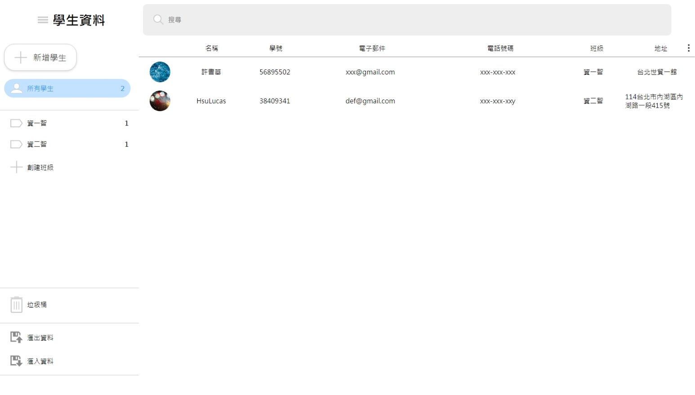

# 52_Module_E_Frontend 學生管理系統

## Introduction

2023年5月時，在練習Vue專案，52屆全國技能競賽全國賽的題組

- 增加班級，依照班級塞選
- CRUD 學生功能
- 排序功能
- 滙入/滙出csv檔功能
- 使用indexDB

## Language & Framework

## Demo

[DEMO](https://lucashsu95.github.io/web-global-public/52/module_E/)

