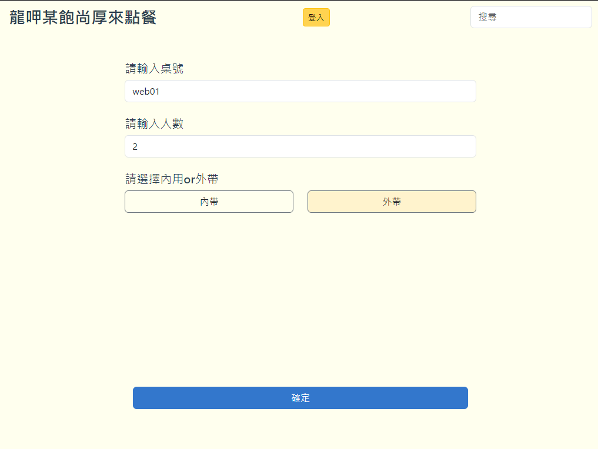
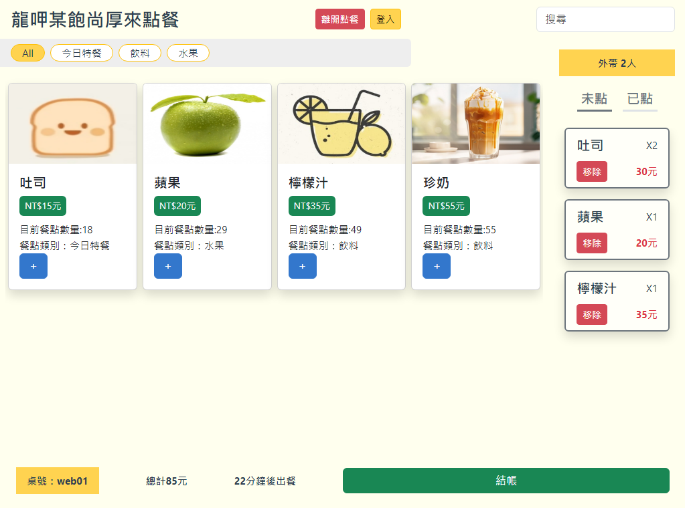
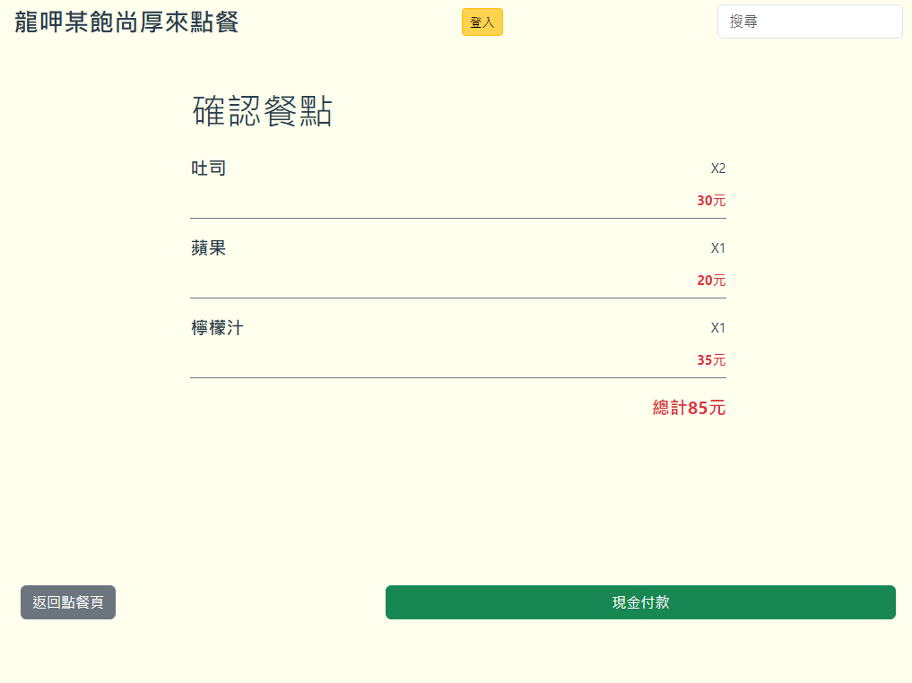
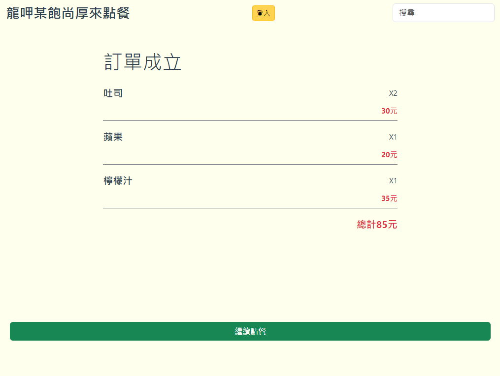

# 54_Module_E_Frontend 線上點餐系統

## Introduction

### 登入畫面
- 輸入桌號
- 輸入人數
- 選擇內用or外帶

### 點餐畫面
- 點擊【+】來點餐，會出現在又邊的"未點"的側邊欄
- 使用**上方的標籤**或**右上角的搜尋框**來**查詢**餐點
- 下方顯示**總金額**和**總出餐時間**
- 猜測變化題
  - CRUD餐點
  - CRUD餐點標籤
  - 登入
  - 使用彈跳視窗

### 確認餐點畫面

### 訂單成立畫面
- 按下**繼續點餐**按鈕後，回到點餐頁面並將已成立訂單的餐點內容移至"已點"清單中，且清除"未點"清單中的內容

## Language & Framework

## DEMO

[DEMO](https://lucashsu95.github.io/web-global-public/54/module_E/)
