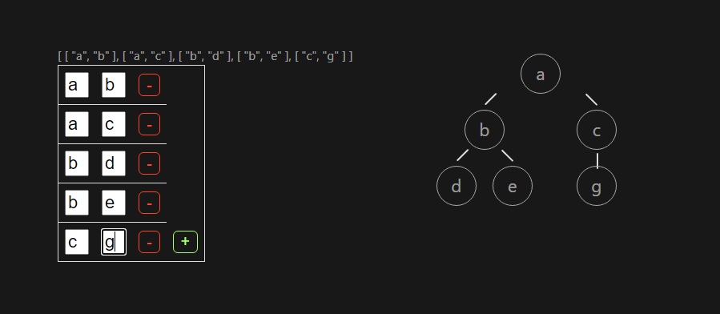

---
head:
  - - meta
    - name: author
      content: 許恩綸
  - - meta
    - name: keywords
      content: 二元樹, 二元樹結構, 樹狀結構, 資料結構
  - - meta
    - name: og:title
      content: 二元樹結構產生器
  - - meta
    - name: og:description
      content: 二元樹結構產生器教學和範例
  - - meta
    - name: og:type
      content: article
  - - meta
    - name: og:image
      content: https://lucashsu95.github.io/LucasHsu.dev/assets/二元樹結構產生器/image.png
---


# 二元樹結構產生器

可以輸入
```txt
a b
a c
b d
b e
c f
c g
```



[DEMO](https://create-tree.vercel.app/)