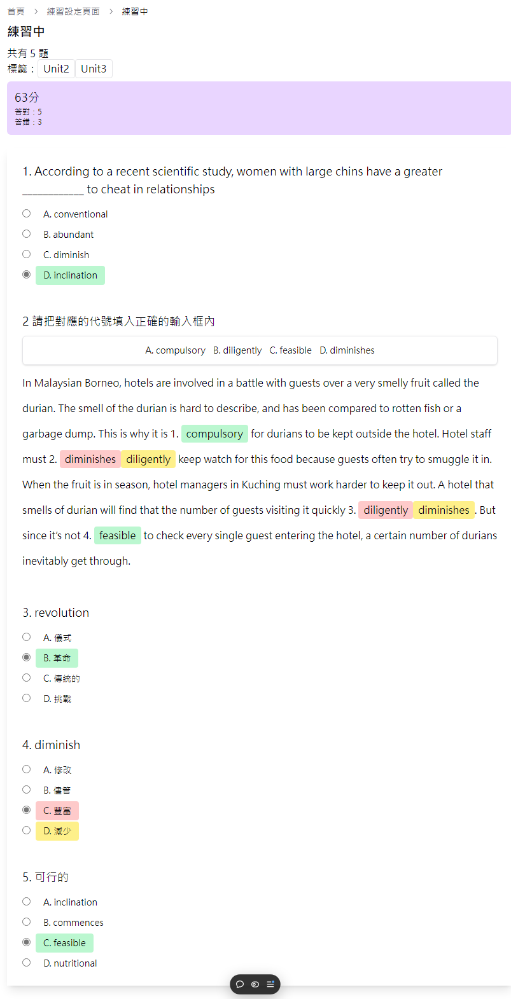

---
head:
  - - meta
    - name: author
      content: 許恩綸
  - - meta
    - property: og:title
      content: 二元樹結構產生器
  - - meta
    - property: og:description
      content: 自己決定練習的題目，自己練習
  - - meta
    - property: og:type
      content: article
  - - meta
    - property: og:image
      content: https://custom-training.vercel.app
---

# 自定題目練習系統

## How to use ?

[DEMO](https://custom-training.vercel.app/)

### 匯入題庫

點擊圖中題庫按鈕

點擊"新增 題目/標籤" 上傳`.json`檔(詳細格式可以查看[question.json](https://github.com/lucashsu95/custom-training/blob/main/src/assets/questions2.json))

### 練習設定

上傳完成後可以回到首頁到點擊【開始練習】
可以設定標籤來排除不想練習的題目(預設是全部)

### 練習中

#### 填空題

如果預到填空題請填入**代號**

### 練習結束

做答完後按下送出按鈕，會出現得分數和答對與答錯的題數

- 選項顯示綠色代表答對
- 選項顯示黃色代表應該要選擇的答案
- 選項顯示紅色代表使用者選擇的錯誤答案

## Libary

- 
- shadcn/ui

