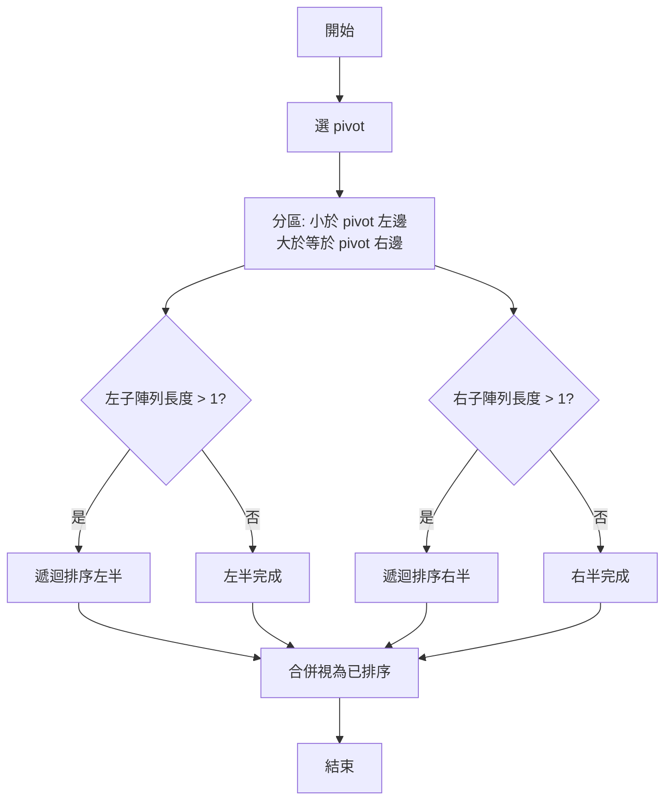

# 快速排序法完整指南

> 📝 **TL;DR** 以「選一個基準、分成左小右大、對兩邊遞迴」為核心。平均 $O(n \log n)$、就地排序、實作要避免最壞情況（已排序輸入）。

## 什麼是快速排序？

快速排序（Quick Sort）以「分治」為核心：挑一個基準值（pivot），把比它小的放左邊，比它大的放右邊，再對左右子陣列重複同樣的事，直到子陣列長度為 0 或 1。

- 為什麼學：平均時間複雜度 $O(n \log n)$、記憶體需求低，可直接在原陣列操作。
- 什麼時候用：需要原地排序、對大多數隨機輸入追求速度時。
- 注意什麼：已排序或幾乎有序的輸入可能觸發最壞 $O(n^2)$，需用好的 pivot 選擇策略。

## 演算法流程

1. 選 pivot：常見策略有首元素、尾元素、隨機、中位數近似（如三數取中）。
2. 分區（partition）：將小於 pivot 的移到左側，大於等於 pivot 的移到右側。
3. 遞迴：對左半、右半重複步驟 1-2，直到子陣列長度 <= 1。

### Hoare 分區範例（示意）

```text
[45, 83, 7, 61, 12, 99, 44, 77, 14, 29]
^pivot = 45
左掃描找到 > pivot 的 83，右掃描找到 < pivot 的 29，交換。
重複直到左右指標交錯，最後將 pivot 與交錯點交換。
```

## Python 實作

```python
def quick_sort(lst):
    if len(lst) <= 1:
        return lst
    pivot = lst.pop(0)
    before = [i for i in lst if i < pivot]
    after = [i for i in lst if i >= pivot]
    return quick_sort(before) + [pivot] + quick_sort(after)


ary = [5, 3, 1, 2, 6, 4]

print("quick_sorted:")
print(*quick_sort(ary))

```


**就地、隨機 pivot**

```python
import random

def partition(nums, lo, hi):
    pivot_idx = random.randint(lo, hi)
    nums[pivot_idx], nums[hi] = nums[hi], nums[pivot_idx]  # 隨機 pivot 放到尾端
    pivot = nums[hi]
    store = lo
    for i in range(lo, hi):
        if nums[i] < pivot:
            nums[store], nums[i] = nums[i], nums[store]
            store += 1
    nums[store], nums[hi] = nums[hi], nums[store]
    return store


def quick_sort(nums, lo=0, hi=None):
    if hi is None:
        hi = len(nums) - 1
    if lo >= hi:
        return
    mid = partition(nums, lo, hi)
    quick_sort(nums, lo, mid - 1)
    quick_sort(nums, mid + 1, hi)


data = [45, 83, 7, 61, 12, 99, 44, 77, 14, 29]
quick_sort(data)
print(data)
```

### 參數說明

| 參數 | 型別 | 說明                   | 預設值        |
| ---- | ---- | ---------------------- | ------------- |
| nums | list | 要排序的列表，原地修改 | -             |
| lo   | int  | 目前分區的起始索引     | 0             |
| hi   | int  | 目前分區的結束索引     | `len(nums)-1` |

## 實際範例

### 範例 1：基礎排序

目標：排序整數列表並輸出結果。

```python
arr = [5, 3, 1, 2, 6, 4]
quick_sort(arr)
print(arr)  # [1, 2, 3, 4, 5, 6]
```

### 範例 2：處理重複值

```python
arr = [4, 4, 4, 1, 3, 2]
quick_sort(arr)
print(arr)  # [1, 2, 3, 4, 4, 4]
```

## 流程圖



## 時間與空間複雜度

- 平均時間：$O(n \log n)$
- 最壞時間：$O(n^2)$（pivot 總是落在最端點時）
- 空間：$O(\log n)$（遞迴呼叫堆疊），就地排序不需額外陣列

## 實戰練習

### 練習 1：追蹤分區（簡單）

給定 `[9, 1, 5, 3]`，選最後一個元素為 pivot，寫出第一輪分區後的結果。

:::details 答案
第一輪 pivot = 3，分區後為 `[1, 3, 5, 9]`，pivot 索引在 1。
:::

### 練習 2：最壞情況（簡單）

何種輸入會讓快速排序退化到 $O(n^2)$？如何改善？

:::details 答案
已排序或反向排序且每次選首/尾為 pivot 會退化。可改用隨機 pivot 或三數取中降低機率。
:::

### 練習 3：改寫非遞迴（中等）

請用堆疊（stack）改寫 `quick_sort`，避免遞迴深度限制。

:::details 參考答案
核心做法：手動維護區間堆疊，模擬遞迴。

```python
def quick_sort_iter(nums):
    stack = [(0, len(nums) - 1)]
    while stack:
        lo, hi = stack.pop()
        if lo >= hi:
            continue
        mid = partition(nums, lo, hi)
        stack.append((lo, mid - 1))
        stack.append((mid + 1, hi))


arr = [9, 1, 5, 3]
quick_sort_iter(arr)
print(arr)
```
:::

## FAQ

- 快速排序 vs. 合併排序：快速排序平均更快且原地；合併排序穩定且最壞時間也為 $O(n \log n)$。
- 快速排序是穩定的嗎？通常否，分區交換會改變相等元素順序。
- 何時不適合用快速排序？需要穩定排序或輸入已知接近有序時，可改用合併排序或堆排序。

## 延伸閱讀

- [Comparison Sort: Quick Sort(快速排序法)](http://alrightchiu.github.io/SecondRound/comparison-sort-quick-sortkuai-su-pai-xu-fa.html)
- [[演算法] 快速排序法 (Quick Sort)](https://ithelp.ithome.com.tw/articles/10202330)
- [排序演算法 選擇排序法與插入排序法](https://ithelp.ithome.com.tw/articles/10333345)

## 總結

1. 核心：選 pivot、分區、遞迴左右子陣列。
2. 平均 $O(n \log n)$，最壞 $O(n^2)$，可用隨機/三數取中降低風險。
3. 就地排序、額外空間低，但不穩定。
4. 適用大多數一般輸入；特殊需求時選擇合併或堆排序。