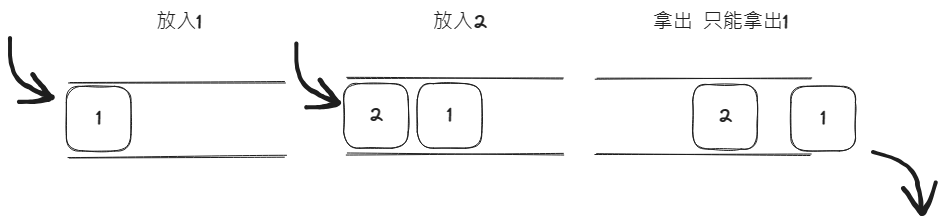

# 佇列Queue



## 介紹

1. 先進先出（FIFO）特性
2. 舉例：
   - 排隊購票： 想像你在電影院或火車站排隊購買票。每個人依次排隊，第一個排隊的人最先買到票，然後依序向後。這就是佇列的先進先出（FIFO）特性，即先到先得。
   - 食物點餐： 在一家快餐店裡，顧客在收銀機前排隊點餐。每個人都按照他們到達的順序進行點餐，而服務員也按照相同的順序處理他們的訂單。這就是佇列的先進先出特性，訂單將按照排隊的順序來完成。

## 先進先出（FIFO）

::: code-group
```python [用list]
queue = []

queue.append(1)
queue.append(2)
queue.append(3)

node = queue.pop(0) # 從佇列中取出1
```

```python [collections.deque]
# 也可以用collections 裡的 deque 在pop時候會變快一點
from collections import deque

queue = deque()

queue.append(1)
queue.append(2)
queue.append(3)

node = queue.popleft() # 從佇列中取出1
```

```python [queue.Queue]
import queue

queue = queue.Queue()

queue.put(1)
queue.put(2)
queue.put(3)

item = queue.get()  # 從佇列中取出1
```

:::

## 後進先出（LIFO）

```python
import queue

# 創建一個LIFO佇列
lifo_queue = queue.LifoQueue() # 其實就是堆疊

# 將元素放入佇列
lifo_queue.put(1)
lifo_queue.put(2)
lifo_queue.put(3)

# 從佇列中取出元素
item = lifo_queue.get()  # 從佇列中取出3
```

<br><br>

# 優先權佇列

## queue.PriorityQueue

- [【演算法筆記 #4】Priority Queue (優先權佇列) 重點整理筆記，包含與常見的 Stack, Queue 的比較](https://www.wongwonggoods.com/all-posts/school-notes/algorithm/priority-queue/#gsc.tab=0)

```python
import queue

# 創建一個優先權佇列
priority_queue = queue.PriorityQueue()

# 將元素放入佇列，並指定優先權 (優先權,物品)
priority_queue.put((3, "Item 3"))
priority_queue.put((1, "Item 1"))
priority_queue.put((2, "Item 2"))

# 從佇列中取出元素
item = priority_queue.get()
# 從佇列中取出(1, "Item 1")，因為優先權最低
```

## heapq堆積

也可以用

```python
import heapq
queue = [(1,'A'),(2,'B'),(3,'C')]
node = heapq.heappop(queue)
heapq.heappush(queue,(-5,'D'))
```

- [Leetcode 703.](https://leetcode.com/problems/kth-largest-element-in-a-stream)