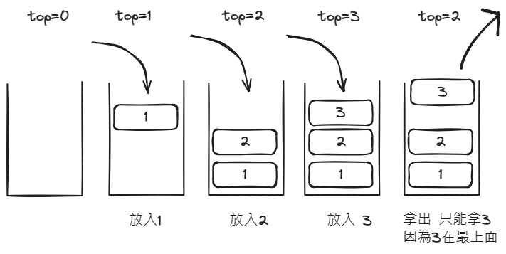

# 堆疊stack 後進先出(LIFO)

## 介紹

堆疊(Stack)是一種非常常用且重要的資料結構,它具有以下幾個主要特性:

1. 後進先出(LIFO)特性
堆疊就像一堆盤子一樣,最後放上的盤子必須先取出,這稱為後進先出。在堆疊中,最新放入的元素在堆疊頂端,只有頂端的元素可以取出,先進的元素會被阻隔在下面。

2. 主要操作為推入(Push)和彈出(Pop)
堆疊中的元素只能通過頂端進行插入和刪除。推入操作將元素放入堆疊頂端,彈出操作取出堆疊頂端的元素。

3. 存取只允許在堆疊頂端
堆疊中只允許通過頂端元素進行存取,不允許直接讀取或修改堆疊中的其他元素。

4. 固定大小或動態調整
堆疊可以是固定長度也可以動態調整,動態堆疊可以 according 到需求動態分配或釋放記憶體。

5. 易於實現

堆疊的結構和操作規則簡單,很容易用陣列或連結串列實現。

堆疊廣泛應用於資料結構與演算法中,如括號匹配、運算式轉換、遞迴呼叫等。掌握堆疊的特性可以更好地理解和運用堆疊處理各種複雜問題。

::: info 資訊
遞迴也是堆疊的一種
:::