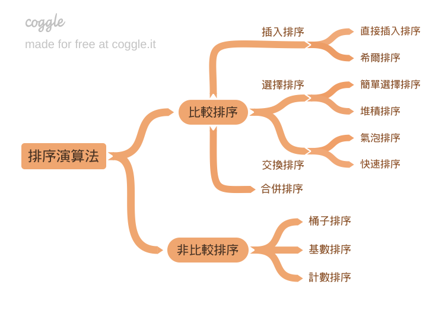

# 排序法

1. 氣泡排序法（Bubble Sort）
2. 選擇排序法（Selection Sort）
3. 插入排序法（Insertion Sort）
4. 希爾排序法（Shell Sort）
5. 合併排序法（Merge Sort）
6. 快速排序法（Quick Sort）
7. 計數排序法（Counting Sort）
8. 桶排序法（Bucket Sort）
9. 基數排序法（Radix Sort）
10. 堆積排序法（Heap Sort）

## Python的排序

### 排序的函式預設都是由第一個從小到大

```python
ary = [(2,55),(1,44),(3,33)]
ary.sort()
# 或
a = sorted(ary)
# [(1,44),(2,55),(3,33)]
```

### 但如果今天要只定大小呢 ?

x 是參數(名字可以自己取)

```python
ary.sort(key=lambda x: x[1])
a = sorted(ary,key=lambda x: x[1])
```

好 太好了會針對排序了

### 但如果今天還要從大到小呢?

可能會想說,不就在後面加上`reverse=True`而己
等等 如果問題是有二個項目，項目二由大到小，項目二都一樣的話，再依照項目一由小到大呢?

```python
ary = [(1,55),(2,11),(3,11)]
ary.sort(key=lambda x: (-x[1],x[0]))
a = sorted(ary,key=lambda x: (-x[1],x[0]))
```

沒錯 加個負號就可以由大到小了(是不是超方便?)
用括號括起來 會先判斷第一個在依序判斷 !

想要練習可以在domjudge裡的

- 111_1130 的 I
- TQC_111 的 Q4
- UVA 的 c012

## 資料夾源
* [那些前端不用會，但是可以會的資料結構與演算法系列 第 17 篇](https://reurl.cc/GKy73d)
