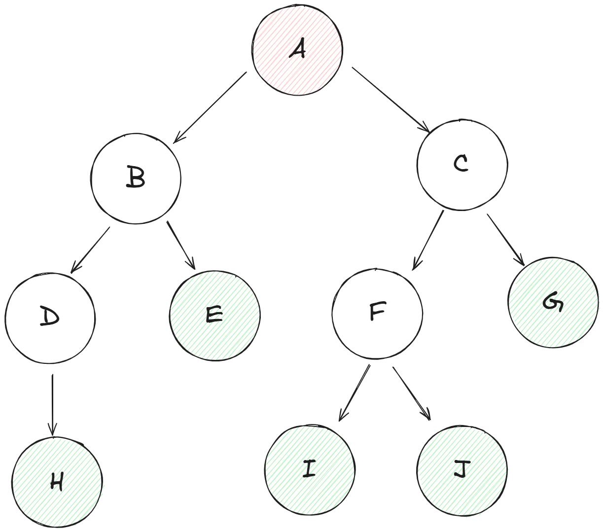

# DFS and BFS

## DFS（深度優先搜索）

`DFS` 是一種用於遍歷或搜索樹或圖的算法。它從根節點（或任何其他節點）開始，沿着每個分支儘可能深地探索樹或圖，直到到達不能再前進的終點，然後回溯並探索另一個分支。

`DFS` 使用棧數據結構來存儲待訪問的節點。算法的主要步驟如下：

1. 將起始節點壓入棧中。
2. 重複以下步驟，直到棧為空：
- 從棧頂彈出一個節點。
- 對於彈出節點的每個未訪問過的相鄰節點：
- 將該節點壓入棧中。
- 將該節點標記為已訪問。

`DFS` 的時間複雜度為 `O(V+E)`，其中 V 是節點數，E 是邊數。

## BFS（廣度優先搜索）

`BFS` 是一種用於遍歷或搜索樹或圖的算法。它從根節點（或任何其他節點）開始，沿着每個分支逐層探索樹或圖，直到所有節點都被訪問過。

`BFS` 使用隊列數據結構來存儲待訪問的節點。算法的主要步驟如下：

1. 將起始節點入隊。
2. 重複以下步驟，直到隊列為空：
- 從隊列頭部取出一個節點。
- 對於取出節點的每個未訪問過的相鄰節點：
- 將該節點入隊。
- 將該節點標記為已訪問。

`BFS` 的時間複雜度為 `O(V+E)`，其中 V 是節點數，E 是邊數。

`BFS` 和 DFS 的主要區別在於：

- `BFS` 先訪問當前層的所有節點，然後再訪問下一層的節點。
- `DFS` 沿着每個分支儘可能深地探索樹或圖，直到到達不能再前進的終點，然後回溯並探索另一個分支。


## 例題

以下是使用 Python 實現的 DFS（深度優先搜索）和 BFS（廣度優先搜索）演算法的基本代碼。假設輸入的圖是通過邊的列表表示的，我們將使用字典來表示鄰接表。

### 輸入數據

我們將使用以下邊的列表來構建圖：

```
A B
A C
B D
B E
C F
C G
D H
F I
F J
```



**順變介紹一下**<br>
- **紅色**的是**根路徑**(A節點)
- **綠色**的是**葉子**，意思就是沒有子路徑的節點(E、G、H、I、J節點)

### DFS 實現

```python
def dfs(graph, start, visited=None):
    if visited is None:
        visited = set()
    visited.add(start)
    print(start, end=' ')
    
    for neighbor in graph[start]:
        if neighbor not in visited:
            dfs(graph, neighbor, visited)

# 構建圖的鄰接表
edges = [
    ('A', 'B'),
    ('A', 'C'),
    ('B', 'D'),
    ('B', 'E'),
    ('C', 'F'),
    ('C', 'G'),
    ('D', 'H'),
    ('F', 'I'),
    ('F', 'J')
]

graph = {}
for edge in edges:
    graph.setdefault(edge[0], []).append(edge[1])
    graph.setdefault(edge[1], []).append(edge[0])  # 因為是無向圖

print("DFS Traversal:")
dfs(graph, 'A')
```
```
DFS Traversal:
A B D H E C F I J G 
```

### BFS 實現

```python
from collections import deque

def bfs(graph, start):
    visited = set()
    queue = deque([start])
    visited.add(start)
    
    while queue:
        vertex = queue.popleft()
        print(vertex, end=' ')
        
        for neighbor in graph[vertex]:
            if neighbor not in visited:
                visited.add(neighbor)
                queue.append(neighbor)

graph = {}
for edge in edges:
    graph.setdefault(edge[0], []).append(edge[1])
    graph.setdefault(edge[1], []).append(edge[0])  # 因為是無向圖

print("\nBFS Traversal:")
bfs(graph, 'A')
```

```
BFS Traversal:
A B C D E F G H I J 
```

## 總結

- **DFS** 先深入到每一個分支，直到沒有更多的節點可以訪問，然後回溯。
- **BFS** 則是逐層訪問節點，確保當前層的所有節點都被訪問後，才會進入下一層。