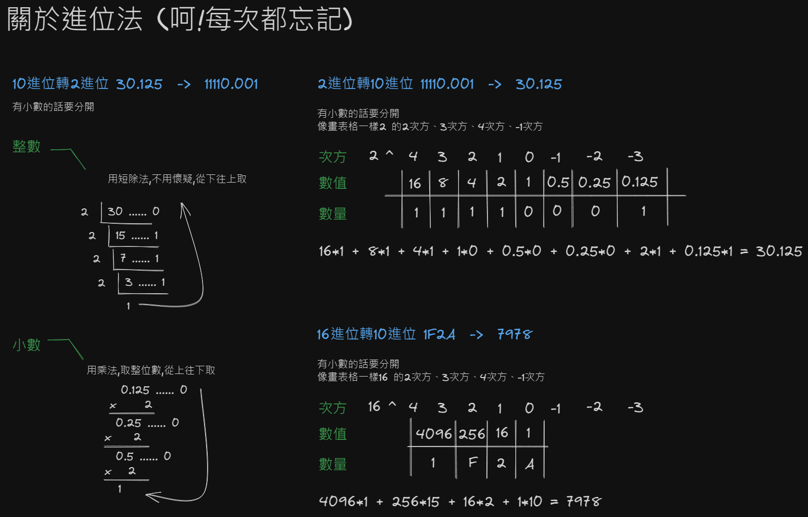
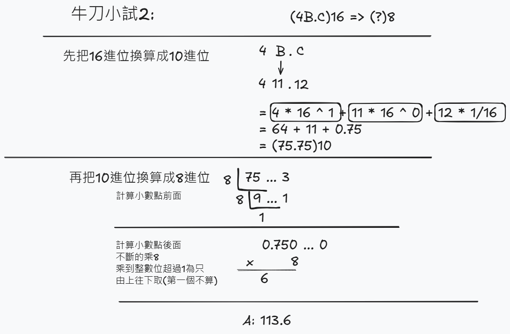

# 進位轉換 - 進位法
- $(x)_{10}$ 代表十進制數字x
- $(x)_2$ 代表二進制數字x
- $(x)_8$ 代表八進制數字x
- $(x)_{16}$ 代表十六進制數字x。
  - 10 : A
  - 11 : B
  - 12 : C
  - 13 : D
  - 14 : E
  - 15 : F

| $2^7$ | $2^6$ | $2^5$ | $2^4$ | $2^3$ | $2^2$ | $2^1$ | $2^0$ |
| ----- | ----- | ----- | ----- | ----- | ----- | ----- | ----- |
| 128   | 64    | 32    | 16    | 8     | 4     | 2     | 1     |

直接背口訣1 2 4 8 16 32 64 128

## 基礎

### 10進制轉2進制

**題目**：
$$ (28)_{10} = (x)_2 $$

**過程**：
```
28 - 16 = 12
12 - 8 = 3
3 - 2 = 1
1 - 1 = 0
```
4和1 沒有用到所以是0

| $2^4$ | $2^3$ | $2^2$ | $2^1$ | $2^0$ |
| ----- | ----- | ----- | ----- | ----- |
| 16    | 8     | 4     | 2     | 1     |
| 1     | 1     | 0     | 1     | 0     |

**答案**：
$$ (11010)_2 $$

### 2轉10進制

**題目**：
$$ (1101)_2 = (x)_{10} $$


**過程**：

每個二進位的數字代表 2 的不同次方，從右到左依次為 $2^0, 2^1, 2^2, \dots$。<br>
因此，$(1101)_2$可以展開為：

| $2^3$ | $2^2$ | $2^1$ | $2^0$ |
| ----- | ----- | ----- | ----- |
| 8     | 4     | 2     | 1     |
| 1     | 1     | 0     | 1     |

8 + 4 + 0 + 1 = 13

**答案**：
$$ (13)_{10} $$

### 16進制轉2進制

**題目**：
$$ (BC5F)_{16} = (x)_2 $$

**過程**：

| 16進位 | B    | C    | 5    | F    |
| ------ | ---- | ---- | ---- | ---- |
| 10進位 | 12   | 13   | 5    | 15   |
| 2進位  | 1100 | 1101 | 0101 | 1111 |

**答案**：

$$ (1100110101011111)_2 $$

### 2進制轉16進制

**題目**：
$$ (1001101010)_{16} $$

**過程**：

先4個4個一組
```
0010 0110 1010
```
然後就8421寫下去

| 8   | 4   | 2   | 1   | .   | 8   | 4   | 2   | 1   | .   | 8   | 4   | 2   | 1   |
| --- | --- | --- | --- | --- | --- | --- | --- | --- | --- | --- | --- | --- | --- |
| 0   | 0   | 1   | 0   | .   | 0   | 1   | 1   | 0   | .   | 1   | 0   | 1   | 0   |

```
4 + 2 = 6
8 + 2 = 10
```

**答案**：
$$ (26A)_{16} $$

### 16進制轉10進制
**題目**：
$$ (3a5)_{16} = (x)_{10} $$

**過程**：

  | 16進位 | 3   | A   | 5   |
  | ------ | --- | --- | --- |
  | 10進位 | 3   | 10  | 5   |


  | 次方 | $16^2$ | $16^1$ | $16^0$ |
  | ---- | ------ | ------ | ------ |
  | 值   | 256    | 16     | 1      |
  | 數量 | 3      | 10     | 5      |

  $$ 3 \times 256 + 10 \times 16 + 5 \times 1 = 768 + 160 + 5 = 933 $$

**答案**：
$$ (933)_{10} $$

### 10進制轉16進制
**題目**：
$$ (232)_{10} = (x)_{16} $$

**過程**：

1. 先轉把10轉2進位

    ```
    232 - 128 = 104
    104 - 64 = 40
    40 - 32 = 8
    8 - 8 = 0
    ```

    | 128 | 64  | 32  | 16  | 8   | 4   | 2   | 1   |
    | --- | --- | --- | --- | --- | --- | --- | --- |
    | 1   | 1   | 1   | 0   | 1   | 0   | 0   | 0   |

    16、4、2和1 沒有用到所以是0

    所以:$(232)_{10} = (11101000)_2$

2. 接著4個4個一組

    | 2進位  | 1110 | 1000 |
    | ------ | ---- | ---- |
    | 10進位 | 14   | 8    |
    | 16進位 | E    | 8    |

**答案**：
$$ (E8)_{16} $$


## 進階

### 10進制轉2進制(小數)
$(30.875)_{10}$ 轉換為 2 進位，我們可以將整數和小數部分分別轉換，再將結果結合起來。具體步驟如下：

**1. 將整數部分 $30_{10}$ 轉換為 2 進位**

用逐步除以 2 的方法來轉換：(短除法)

$$ 30 \div 2 = 15 \quad 餘數 0 $$
$$ 15 \div 2 = 7 \quad 餘數 1 $$
$$ 7 \div 2 = 3 \quad 餘數 1 $$
$$ 3 \div 2 = 1 \quad 餘數 1 $$
$$ 1 \div 2 = 0 \quad 餘數 1 $$

$$30_{10} = 11110_2$$

**2. 將小數部分 $0.875_{10}$ 轉換為 2 進位**

對小數部分進行乘以 2 的運算：

$$ 0.875 \times 2 = 1.75 \quad \text{取整數部分} 1 $$
$$ 0.75 \times 2 = 1.5 \quad \text{取整數部分} 1 $$
$$ 0.5 \times 2 = 1.0 \quad \text{取整數部分} 1 $$

因為小數部分已經是 0，所以不需要再進行運算。
所以，$0.875_{10} = 0.111_2$。

**3. 將整數和小數部分合併**

整數部分 $11110_2$ 和小數部分 $0.111_2$ 結合起來，得到：

$$ (30.875)_{10} = (11110.111)_2 $$


### 9進制轉3進制

因為是9是3的次方數，所以可以直接除

$(74.2)_9$ 轉換為 3 進位，我們可以將整數和小數部分分別轉換，再將結果結合起來。具體步驟如下：

**1. 將整數部分 $74_{9}$ 轉換為 3 進位**

用逐步除以 3 的方法來轉換：
商數+餘數

$$ 7 \div 3 = 2 \quad 餘數 1 $$
$$ 4 \div 3 = 1 \quad 餘數 1 $$

$$ 2 + 1 + 1 + 1 = 2111 $$

$$74_{9} = 2111_3$$

**2. 將小數部分 $0.2_{9}$ 轉換為 3 進位**

對小數部分進行乘以 3 的運算：

$$ 0.2 \times 3 = 0.6 \quad \text{取整數部分} 0 $$
$$ 0.6 \times 3 = 1.8 \quad \text{取整數部分} 1 $$
$$ 0.8 \times 3 = 2.4 \quad \text{取整數部分} 2 $$
$$ 0.4 \times 3 = 1.2 \quad \text{取整數部分} 1 $$

這裡就開始重複了，所以不需要再進行運算。

所以，$0.2_{9} = 0.0121_3$。

$$ (74.2)_{9} = (2111.012)_3 $$


### 3進制轉9進制

$(2122.12)_3$ 轉換為 9 進位

1. **轉換為十進制。**

- **整數部分：**

$2*3^3 + 1*3^2 + 2*3^1 + 2*3^0 = 2*27 + 1*9 + 2*3 + 2*1$
$= 54 + 9 + 6 + 2$
$= 71$

- **小數部分：**

$1*3^-1 + 2*3^-2 = 1/3 + 2/9 = 0.3333... + 0.2222...$
$= 0.5555...$
$=71.5555_{10}$

2. **轉換為 9 進制。**

- **整數部分：**

$71 ÷ 9 = 7 餘 8$

$7 ÷ 9 = 0 餘 7$

從下到上讀取餘數：**78**

小數部分（乘 9 取整數部分）：

$0.5555... * 9 = 4.9999..., 整數部分 4$

$0.9999... * 9 = 8.9999..., 整數部分 8$

$0.9999... * 9 = 8.9999..., 整數部分 8$

2) 組合整數和小數部分：

$(2122.12)_3 = (71.5555...)_{10} = (78.488888...)_9$

請注意，小數部分是循環的，8 會無限重複。

## 畫格子法
如果是2進位轉16進位，需要先將2進位換為10進位，再轉換為16進位制。


## 練習
### 牛刀小試1
$$ (1101001.11)_2 = (x)_{16} $$

則x為多少？

::: details 答案
將1101001透過畫格子的方式轉換為十進制，得到105。<br>
0.11 = 0.5 + 0.25 = 0.75<br>
使用短除法，將105除以16。<br>
105 ÷ 16 = 6 ... 9
0.75 * 16 = 12(16進位的12等於C)<br>
(除數為16是因為要轉換的進制是十六進制)<br>
答案：69.C
:::

### 牛刀小試2

$$ (4B.C)_{16} = (x)_8 $$

則x為多少？

::: details 答案
首先，將十六進制的4B.C轉換為十進制，得到75.75。<br>
接著，將75.75轉換為八進制，得到113.6。<br>
答案：113.6

:::

### 牛刀小試3

$$ (74.2)_9 = (x)_3 $$
則x為多少？

::: details 答案
首先，將九進制的74.2轉換為十進制，得到67.22...。<br>
接著，將67.22...轉換為三進制，得到221.021
:::

## 參考資料

- [二、八、十與十六進位 (數字系統) 轉換教學](https://footmark.com.tw/news/introduction-to-computer/digital-system-conversion/#:~:text=%E6%95%B4%E6%95%B8%20%E2%86%92%20%E9%99%A4%E6%B3%95%EF%BC%9A%20%E3%80%90%E5%8D%81%E9%80%B2%E4%BD%8D%20%28%E6%95%B4%E6%95%B8%29%20%2F%20%E6%AC%B2%E8%BD%89%E6%8F%9B%E9%80%B2%E4%BD%8D%E6%95%B8%E3%80%91%E4%B8%80%E7%9B%B4%E9%99%A4%E5%88%B0%E5%95%86%E6%95%B8%E7%82%BA%200%EF%BC%8C%E5%86%8D%E4%BE%9D%E5%BA%8F%E3%80%90%E7%94%B1%E4%B8%8B%E5%BE%80%E4%B8%8A%E3%80%91%E5%8F%96%E5%87%BA%E9%A4%98%E6%95%B8%E3%80%82,%E5%B0%8F%E6%95%B8%20%E2%86%92%20%E4%B9%98%E6%B3%95%EF%BC%9A%20%E3%80%90%E5%8D%81%E9%80%B2%E4%BD%8D%20%28%E5%B0%8F%E6%95%B8%29%20%2A%20%E6%AC%B2%E8%BD%89%E6%8F%9B%E9%80%B2%E4%BD%8D%E6%95%B8%E3%80%91%E4%B8%80%E7%9B%B4%E4%B9%98%E5%88%B0%E5%B0%8F%E6%95%B8%E7%82%BA%200%EF%BC%8C%E5%86%8D%E4%BE%9D%E5%BA%8F%E3%80%90%E7%94%B1%E4%B8%8A%E5%BE%80%E4%B8%8B%E3%80%91%E5%8F%96%E5%87%BA%E6%95%B4%E6%95%B8%E3%80%82)