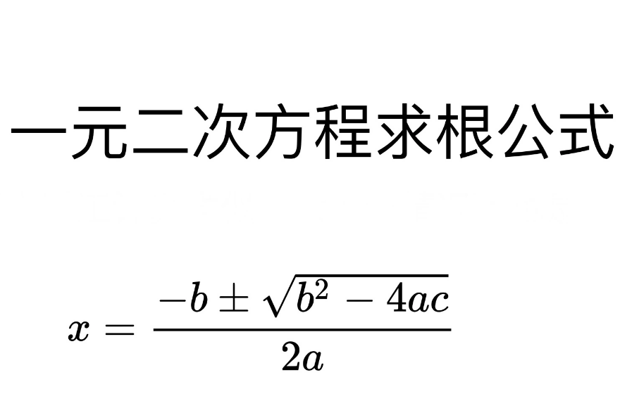

# 一元二次方程式的根



表達式「(-b +- (b^2-4ac)^(1/2))/(2a)」是求二次方程式根的公式。 這裡，「a」、「b」和「c」是二次方程式的係數。

如果你想在Python中計算表達式`(-b + (b**2-4*a*c) ** 0.5) / (2*a)`，你可以使用下面的程式碼片段：

## 1. 求根

公式為
```
r1 = (-b + (b**2 - 4*a*c)**0.5) / 2*a
r2 = (-b - (b**2 - 4*a*c)**0.5) / 2*a
我們會利用 b**2 - 4ac來判斷，有三種情況：
1. b**2 - 4ac為正，解為兩實數根
2. b**2 - 4ac為0，解為一實數根
3. b**2 - 4ac為負，沒有實數根
```
接下來我們來舉例
     
一元二次方程式為
```python
2x**2 + 5x + 6 = 0

a = 2
b = 5
c = 6

r1 = (-b + (b**2 - 4*a*c)**0.5) / 2*a
r2 = (-b - (b**2 - 4*a*c)**0.5) / 2*a
print(r1)
print(r2)
```
## 2. 解聯立
最簡單，有兩條方程式
會給你a、b、c、d、e、f的值
```
ax + by = e
cx + dy = f
```

```python
假設 2x + 3y = 13
     x - 2y = -4

a = 2
b = 3
c = 1
d = -2
e = 13
f = -4

x = (d*e - b*f) / (a*d - c*b)
y = (f*a - c*e) / (a*d - c*b) #若a*d - b*c = 0，此方程式無解
print(x)
print(y)
```