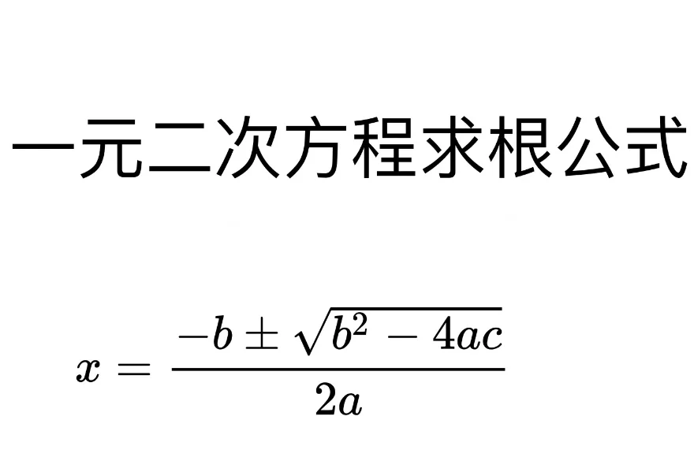

# 一元二次方程式的根



表達式「(-b +- (b^2-4ac)^(1/2))/(2a)」是求二次方程式根的公式。 這裡，「a」、「b」和「c」是二次方程式的係數。

如果你想在Python中計算表達式`(-b + (b**2-4*a*c) ** 0.5) / (2*a)`，你可以使用下面的程式碼片段：

## 1. 求根

公式為
```
r1 = (-b + (b**2 - 4*a*c)**0.5) / 2*a
r2 = (-b - (b**2 - 4*a*c)**0.5) / 2*a
我們會利用 b**2 - 4ac來判斷，有三種情況：
1. b**2 - 4ac為正，解為兩實數根
2. b**2 - 4ac為0，解為一實數根
3. b**2 - 4ac為負，沒有實數根
```
接下來我們來舉例
     
一元二次方程式為
```python
2x**2 + 5x + 6 = 0

a = 2
b = 5
c = 6

r1 = (-b + (b**2 - 4*a*c)**0.5) / 2*a
r2 = (-b - (b**2 - 4*a*c)**0.5) / 2*a
print(r1)
print(r2)
```

### 1.2 再練一題

Problem Description  
給定一組一元二次方程式的係數 𝑎,𝑏,𝑐，方程式形式為：𝑎𝑥2+𝑏𝑥+𝑐=0 
請你求出方程式的實數根。 
根據判別式 𝐷=𝑏2−4𝑎𝑐的值，結果會有以下三種情況： 
• 如果 D > 0：有兩個不同的實根，請由大到小輸出。 
• 如果 D = 0：有兩個相同的實根。 
• 如果 D < 0：沒有實數根。 

**Input Format**

輸入一行，包含三個整數 𝑎,b,c，以空白分隔。−1000≤𝑎,𝑏,𝑐≤1000 ,𝑎≠0

**Output Format**

請根據不同情況，輸出對應的結果： 
• 兩個不同的整數根，請輸出：「Two different roots x1=大根 , x2=小根」 
• 兩個相同的整數根，請輸出：「Two same roots x=根」 
• 沒有實根，請輸出：「No real root」 
答案均為整數，若有兩個根則大者在前 

```python
a,b,c = map(int,input().split())

discriminant = b**2 - 4*a*c

if discriminant > 0:
    r1 = (-b + discriminant**0.5) / (2*a)
    r2 = (-b - discriminant**0.5) / (2*a)
    if r1 < r2:
        r1, r2 = r2, r1
    print(f'Two different roots x1={r1:.0f} , x2={r2:.0f}')
elif discriminant == 0:
    r1 = -b / (2*a)
    print(f'Two same roots x={r1:.0f}')
else:
    print('No real root')
```


## 2. 解聯立
最簡單，有兩條方程式
會給你a、b、c、d、e、f的值
```
ax + by = e
cx + dy = f
```

```python
假設 2x + 3y = 13
     x - 2y = -4

a = 2
b = 3
c = 1
d = -2
e = 13
f = -4

x = (d*e - b*f) / (a*d - c*b)
y = (f*a - c*e) / (a*d - c*b) #若a*d - b*c = 0，此方程式無解
print(x)
print(y)
```