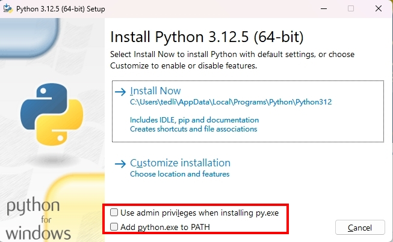

# python-新手上路-Day0｜建置環境

## 這一篇會學到的

1. 安裝python
2. 安裝環境、編輯器
3. print()


## 安裝python
首先，到[官網](https://www.python.org/)，點download


::: warning 注意
點exe檔 之後就會看到視窗下方有兩行，把那兩個框框抅起來
:::



## 安裝環境、編輯器
[安裝vscode](../../other/安裝vscode)

## print()

是時候寫程式了
### 可以先連結資料夾

1. 點【檔案】按鈕->【開啟資料夾】(~~沒有資料夾可以在桌面創一個~~)
2. 然後檔案那裡就可以看到四個按鈕


3. 四個按鈕的功能分別是【新增檔案】【新增資料夾】【重新整理】【摺疊資料夾】
4. 就直接點第一個按鈕
5. 打`a.py`-> 按下Enter 就創建好檔案了
6. 打程式
```python
print("Hello, world!")
```

7. 然後按ctrl + `，可以叫出終端機
8. 在終端機裡打cmd 按下Enter(切換成command 不要使用powershell)
9. 在終端機裡打
```sh
python a.py
```
如果印出Hello, world!
就代表你成功了
