<div class="absolute inset-0 bg-gradient-to-br from-[#0d1117] via-[#0d1117] to-[#1d1430]"></div>

<div class="relative z-10">
  <p class="font-mono text-sm text-[#7ee787] mb-6">$ curl /users/123 | usecase | repository | db</p>
  <h1 class="text-5xl">
    <span class="accent-brand">Clean</span>
    <span class="text-white"> Architecture</span>
  </h1>
  <p class="mt-4 text-xl text-gray-300 font-mono">
    <span class="muted">//</span> 分層，但不互相認識
  </p>
  <div class="mt-14 grid grid-cols-4 gap-3 font-mono text-sm text-center">
    <div class="concept-card"><strong>Controller</strong><br><span class="muted">服務生</span></div>
    <div class="concept-card"><strong>Usecase</strong><br><span class="muted">主廚</span></div>
    <div class="concept-card"><strong>Repository</strong><br><span class="muted">倉管</span></div>
    <div class="concept-card"><strong>Presenter</strong><br><span class="muted">打包員</span></div>
  </div>
</div>

<!--
開場：別被那張經典圓圈圖唬了。Clean Architecture 只是一個簡單規則——
資料流只能往內，不能往外。用餐廳比喻走完全場。預計 30–40 分鐘。
-->

---
layout: default
hideInToc: true
---

<p class="font-mono text-xs text-gray-500"><span class="accent-green">$</span> cat blueprint.md</p>

# 今日路線

<div class="grid grid-cols-2 gap-4 mt-7">
  <div v-click class="concept-card"><strong>01 / 為什麼</strong><br><span class="muted">全黏在一起的程式怎麼讓你崩潰</span></div>
  <div v-click class="concept-card"><strong>02 / 四個角色</strong><br><span class="muted">服務生、主廚、倉管、打包員</span></div>
  <div v-click class="concept-card"><strong>03 / 實作</strong><br><span class="muted">TypeScript 完整範例 + 依賴注入</span></div>
  <div v-click class="concept-card"><strong>04 / 驗收</strong><br><span class="muted">換 DB、換格式、加快取——各改哪層？</span></div>
</div>

<div v-click class="mt-6 terminal-card text-sm">
  <span class="accent-orange">核心規則只有一條：</span>你只跟上一層說話，下層的細節不關你的事。
</div>

---
layout: section
transition: fade
---

<p class="font-mono accent-orange">PART 01</p>

# 為什麼需要它？

<p class="font-mono muted">先看一段讓人崩潰的程式</p>

---
layout: two-cols
layoutClass: gap-8
---

# 全黏在一起

```ts {all|3|4-8|all}
// UI 直接連資料庫
app.get('/users', (req, res) => {
  const users = db.query('SELECT * FROM users');
  res.json(users.map(u => ({
    name: u.name,
    email: u.email,
    createdAt: u.created_at.format('YYYY-MM-DD')
  })));
});
```

::right::

<div class="terminal-card mt-14">
  <p class="terminal-label">INCOMING REQUESTS</p>
  <div v-click>老闆：「我們要換 GraphQL！」<br><span class="accent-orange">→ 你崩潰（路由、格式全重寫）</span></div>
  <div v-click class="mt-3">老闆：「加個快取！」<br><span class="accent-orange">→ 改 10 個地方</span></div>
  <div v-click class="mt-3">老闆：「換 MongoDB！」<br><span class="accent-orange">→ SQL 散落各處，找都找不完</span></div>
</div>

<!--
病根：UI、商業邏輯、資料存取、格式轉換全部黏在一個函數裡。
-->

---
---

# 分層之後：改「怎麼做」，不動「做什麼」

<div class="grid grid-cols-3 gap-4 mt-8 text-center">
  <div v-click class="concept-card"><strong>換資料庫？</strong><br><span class="muted">只改 Repository</span></div>
  <div v-click class="concept-card"><strong>換 API 格式？</strong><br><span class="muted">只改 Presenter</span></div>
  <div v-click class="concept-card"><strong>換前端框架？</strong><br><span class="muted">只改 Controller</span></div>
</div>

<div v-click class="mt-8 terminal-card text-sm">
  <p class="terminal-label">INVARIANT</p>
  <span class="accent-brand">商業邏輯（Usecase）永遠不動</span> —— 它是你的核心資產，活得比任何框架久。
</div>

---
layout: section
transition: fade
---

<p class="font-mono accent-orange">PART 02</p>

# 四個角色

<p class="font-mono muted">一間餐廳就講完了</p>

---
---

# 餐廳編制

<div class="grid grid-cols-2 gap-4 mt-6">
  <div v-click class="concept-card"><strong>Controller = 服務生</strong><br><span class="muted">接單、把參數轉成程式能用的格式、傳話給廚房。<span class="accent-orange">不能寫商業邏輯！</span></span></div>
  <div v-click class="concept-card"><strong>Usecase = 主廚</strong><br><span class="muted">醃多久、火候多大——商業邏輯的家。不知道資料庫長怎樣、不知道前端要 JSON 還是 XML</span></div>
  <div v-click class="concept-card"><strong>Repository = 倉管</strong><br><span class="muted">主廚喊「拿雞蛋」就去拿。從 MySQL、MongoDB 還是 API 拿？主廚不關心</span></div>
  <div v-click class="concept-card"><strong>Presenter = 打包員</strong><br><span class="muted">JSON 盒子還是 XML 盒子？只管怎麼呈現，不管資料哪來</span></div>
</div>

<div v-click class="mt-5 terminal-card text-sm">
  重點：<span class="accent-brand">廚房不知道菜市場在哪</span>。大家只管自己的事。
</div>

---
---

# 請求流程：資料只往內流

```mermaid {theme: 'dark', scale: 0.6}
graph LR
    A[使用者] --> B[Controller]
    B --> C[Usecase]
    C --> D[Repository]
    D --> E[(資料庫)]
    E --> D
    D --> C
    C --> F[Presenter]
    F --> B
    B --> A
    style B fill:#13202a,stroke:#5382a1
    style C fill:#1d1430,stroke:#a371f7
    style D fill:#2d1c13,stroke:#e76f00
    style F fill:#13251a,stroke:#7ee787
```



<div class="mt-5 grid grid-cols-2 gap-4 text-sm">
  <div v-click class="concept-card"><strong>去程</strong><br><span class="muted">UI → Usecase → Repository → DB</span></div>
  <div v-click class="concept-card"><strong>回程</strong><br><span class="muted">DB → Repository → Usecase → Presenter → UI，永遠不反向</span></div>
</div>

<!--
這條呼叫鏈本質是 Stack：一層層壓進去，再一層層彈出來（LIFO）。
非同步的事（寄信、通知）則交給 Queue——兩者不衝突。
-->

---
layout: section
transition: fade
---

<p class="font-mono accent-orange">PART 03</p>

# TypeScript 實作

<p class="font-mono muted">「取得使用者」完整走一遍</p>

---
layout: two-cols
layoutClass: gap-7
---

# Repository：先定契約

```ts {1-3|5-12|all}
export interface UserRepository {
  getUser(id: number): Promise<User | null>;
}

// 實作：用 MySQL —— Usecase 完全不知道
export class MySQLUserRepository
  implements UserRepository {
  async getUser(id: number) {
    const rows = await db.query(
      'SELECT * FROM users WHERE id = ?', [id]);
    return rows[0] ?? null;
  }
}
```

::right::

# Usecase：商業邏輯的家

```ts
export class GetUserUseCase {
  constructor(
    private userRepository: UserRepository
  ) {}

  async execute(id: number) {
    const user =
      await this.userRepository.getUser(id);
    if (!user) return null;

    // 真正的商業邏輯：30 天未登入視為無效
    if (user.createdAt < thirtyDaysAgo()) {
      return null;
    }
    return user;
  }
}
```

<div v-click class="mt-3 concept-card text-sm">
  <strong>依賴介面，不依賴實作</strong><br>
  <span class="muted">建構子注入 UserRepository —— MySQL 還是 Mongo？不知道也不需要知道</span>
</div>

---
layout: two-cols
layoutClass: gap-7
---

# Presenter 與 Controller

```ts
// Presenter：只管怎麼呈現
export class UserPresenter {
  static toResponse(user: User | null) {
    if (!user) return { error: 'User not found' };
    return {
      id: user.id,
      name: user.name,
      created_at: user.createdAt.toISOString(),
    };
  }
}
```

::right::

# 組裝端：依賴注入

```ts {1-4|6|all}
// routes/user.ts —— 具體選擇集中在這
const repo = new MySQLUserRepository();
const usecase = new GetUserUseCase(repo);
const controller = new UserController(usecase);

router.get('/users/:id', controller.getUser);
```

<div v-click class="mt-4 terminal-card text-sm">
  <p class="terminal-label">COMPOSITION ROOT</p>
  Controller 不知道資料庫是什麼、Usecase 不知道前端要什麼 ——
  <span class="accent-brand">每層都只跟介面說話</span>。
</div>

---
layout: section
transition: fade
---

<p class="font-mono accent-orange">PART 04</p>

# 驗收時間

<p class="font-mono muted">老闆的三個需求，各改哪一層？</p>

---
---

# 三個需求，三次「只改一層」

<div class="space-y-3 mt-5">
  <div v-click class="concept-card"><strong>「換成 MongoDB！」</strong><br><span class="muted">新增 MongoDBUserRepository 實作介面，組裝端換一行 new。其他層零改動。</span></div>
  <div v-click class="concept-card"><strong>「改輸出 XML！」</strong><br><span class="muted">只改 Presenter 的 toResponse()。其他層零改動。</span></div>
  <div v-click class="concept-card"><strong>「查詢太慢，加快取！」</strong><br><span class="muted">CacheUserRepository 包住 MySQLUserRepository（裝飾器模式），先查快取再查 DB。Usecase 完全沒動。</span></div>
</div>

<div v-click class="mt-6 terminal-card text-sm">
  <span class="accent-green">$</span> 每個需求都只動一層 —— 這就是分層的投資報酬率。
</div>

---
---

<LayerQuiz />

<p class="print-answer hidden mt-4 text-sm">
  列印版答案：C。快取是「怎麼拿資料」的細節，包一層 Repository 裝飾器即可。
</p>

<!--
答案 C。快取、重試、連線池——所有「怎麼拿」的細節都屬於 Repository 層。
-->

---
---

# FAQ 快問快答

<div class="space-y-3 mt-5">
  <div v-click class="concept-card"><strong>這不就是 MVC 嗎？</strong><br><span class="muted">MVC 常把邏輯與存取黏在一起；Clean Architecture 是把「做什麼」和「怎麼做」分家。</span></div>
  <div v-click class="concept-card"><strong>寫這麼多檔案不累嗎？</strong><br><span class="muted">寫 10 個檔案累，還是改 100 個地方時崩潰累？現在省 1 小時，未來用 100 小時還。</span></div>
  <div v-click class="concept-card"><strong>小工具也要這樣？</strong><br><span class="muted">不用。但希望它活過 2 年的東西，就值得分層。</span></div>
  <div v-click class="concept-card"><strong>Repository 要寫介面嗎？</strong><br><span class="muted">要。介面讓 Usecase 不知道你用什麼資料庫——明天才換得掉。</span></div>
</div>

---
---

# 今日重點

<div class="grid grid-cols-2 gap-4 mt-5">
  <div v-click class="concept-card"><strong>一條規則</strong><br><span class="muted">資料流只能往內，不能往外</span></div>
  <div v-click class="concept-card"><strong>四個角色</strong><br><span class="muted">服務生、主廚、倉管、打包員——各管各的</span></div>
  <div v-click class="concept-card"><strong>依賴介面</strong><br><span class="muted">具體選擇集中在組裝端（依賴注入）</span></div>
  <div v-click class="concept-card"><strong>驗收標準</strong><br><span class="muted">換 DB、換格式、加快取——各只改一層</span></div>
</div>

<div v-click class="mt-7 text-center text-lg font-mono">
  分層，但不互相認識 —— <span class="accent-orange">商業邏輯永遠不動</span>。
</div>

---
layout: end
class: text-center
---

# Layers separated.

<p class="mt-5 font-mono muted">下一步：Spring Boot × DDD，看同樣的思想在後端怎麼落地</p>

<div class="mt-10 terminal-card inline-block text-left text-sm">
  <div><span class="accent-green">$</span> curl /users/123</div>
  <div class="accent-orange mt-2">controller → usecase → repository → presenter</div>
</div>

<!--
延伸閱讀回文章：三題實戰練習、Spring Boot × DDD、Spring Boot × FP。
-->
