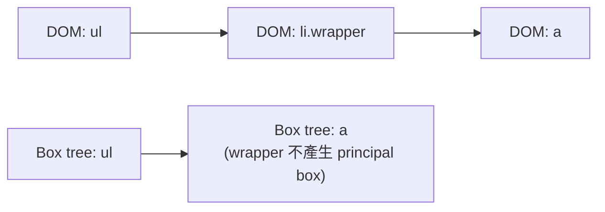

<div class="lab-kicker">CSS LAYOUT LAB · 02</div>
<h1 v-motion :initial="{ x: -32, opacity: 0 }" :enter="{ x: 0, opacity: 1 }">Display<br><span>一個盒子，兩種角色</span></h1>
<p class="lead" v-click>Outer role × Inner formatting context × Accessibility</p>
<div class="display-sculpture"><i></i><i></i><i></i><i></i></div>

<!--
display 不只是一張 block / inline 清單。現代語法把外部參與方式與內部排版模型拆開。
-->

---
layout: center
---

# display = outer + inner

<p class="lead">`display` 同時回答兩件事：這個盒子怎麼跟兄弟姊妹排在一起，以及它內部用哪種排版模型安排 children。</p>

<div class="equation">
  <div v-click><small>對兄弟姊妹</small><b>outer</b><code>block / inline</code></div>
  <span v-click>+</span>
  <div v-click><small>對自己的 children</small><b>inner</b><code>flow / flex / grid</code></div>
</div>
<p v-click class="lab-note"><code>display: inline flex</code>：本身像 inline，內部建立 flex formatting context。</p>

---

# 現代雙值語法

<p class="lead">單一關鍵字是歷史相容寫法；雙值語法把 outer 與 inner 拆開，讀起來更接近瀏覽器實際建立的 formatting context。</p>

| 常見單值 | 等價概念 | 說明 |
|---|---|---|
| `block` | `block flow` | 外部 block，內部 flow |
| `inline` | `inline flow` | 外部 inline，內部 flow |
| `inline-block` | `inline flow-root` | inline 外觀、隔離內部 flow |
| `flex` | `block flex` | block-level flex container |
| `inline-grid` | `inline grid` | inline-level grid container |

<div v-click class="callout">雙值語法已廣泛支援；團隊若需照顧舊瀏覽器，可先寫單值 fallback，再覆寫雙值。</div>

---
layout: two-cols
layoutClass: gap-8
---

# `flow-root` 解決什麼？

<p class="lab-note">當內部有 float 或 margin collapsing 讓外層高度塌陷時，需要一個能「包住內部排版」的 formatting context。</p>

```css
.card {
  display: flow-root;
}
.avatar {
  float: inline-start;
}
```

<div v-click class="lab-card"><b>建立 block formatting context</b><p>容納內部 float，並隔離部分 margin collapsing / float 互動；不用 clearfix 偽元素。</p></div>

::right::

# 隱藏不是同一件事

<p class="lab-note">三種常見寫法都會讓元素「看不見」，但對版面、互動與無障礙樹的影響完全不同；選錯會造成空間殘留或可聚焦幽靈元素。</p>

<div class="stack">
  <div v-click><code>display: none</code><span>不產生 box；通常也離開 accessibility tree</span></div>
  <div v-click><code>visibility: hidden</code><span>保留版面空間；不可互動</span></div>
  <div v-click><code>opacity: 0</code><span>仍佔空間，也可能可聚焦/點擊</span></div>
</div>

---

# `display: contents`

<p class="lead">元素本身不產生 principal box，但 DOM 與子元素都還在。常用來讓深層 children 直接參與父層 flex / grid，代價是 wrapper 的背景與邊框無處可畫。</p>



<div class="card-grid">
  <div v-click class="lab-card"><b>適合</b><p>讓深層 children 直接成為 grid / flex items。</p></div>
  <div v-click class="lab-card danger"><b>注意</b><p>元素本身的背景、邊框、尺寸不再有 box 可畫。</p></div>
  <div v-click class="lab-card danger"><b>A11y</b><p>部分 browser / AT 組合曾錯誤移除語意；重要語意容器要實測。</p></div>
</div>

<!--
規格意圖是只影響 box tree，不移除 DOM 語意；但無障礙實作歷史上有互通性問題。
-->

---

# Shiki Magic Move：拆開兩個維度

<p class="lead">`inline-flex` 是單值簡寫；`inline flex` 則明確寫出 outer inline 與 inner flex。實務上常先寫 fallback，再覆寫雙值語法。</p>

````md magic-move
```css
.chips {
  display: inline-flex;
}
```
```css
.chips {
  display: inline flex;
  flex-wrap: wrap;
  gap: .5rem;
}
```
```css
.chips {
  display: inline-flex; /* fallback */
  display: inline flex;
  flex-wrap: wrap;
  gap: .5rem;
}
```
````

---
layout: center
---

# Live Lab

<p class="lead">切換 `display` 值，觀察容器邊框、子項排列與前後 inline 文字的關係。重點不是背值，而是看出 outer 與 inner 各自改變了什麼。</p>

<DisplayLab />

<div class="monaco-probe">

```css {monaco}
display: flex;
```

</div>

<!--
Monaco 僅接受 display、gap 與對齊相關白名單。可拖曳色票重排 DOM 順序，對照視覺順序。
-->

---

# 快問快答

<p class="lab-note">先想「要移除的是 wrapper box，還是整棵子樹？」再選 `contents`、`none` 或 `flow-root`。</p>

<div class="quiz">
  <p>要讓 wrapper 不產生 box，但保留 children 參與父 grid，最接近哪個值？</p>
  <div v-click="1">A. `none`　 B. `contents`　 C. `flow-root`</div>
  <div v-click="2" class="answer">B；但重要 list/table/landmark 語意需搭配目標 AT 實測。</div>
</div>

---
layout: end
---

# 先問 box 的兩個角色

<p class="lead">遇到任何 `display` 問題，先拆成兩句話：它如何加入外部 flow？它如何排列內部 children？</p>
<p>記住這兩個問題，比背完整關鍵字表更能快速定位問題。</p>
<small>列印版：互動區保留預設排列與 CSS。</small>
