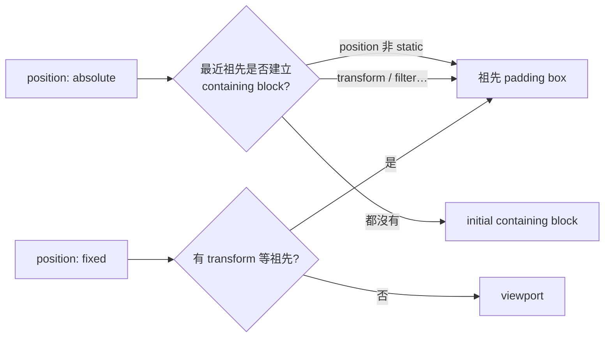
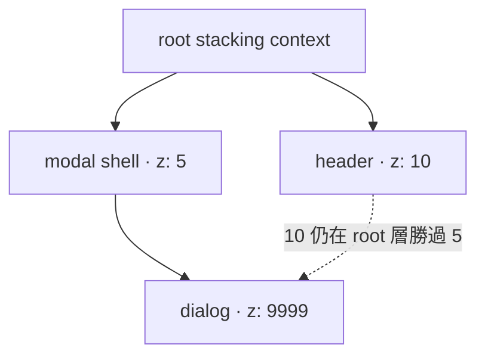

<div class="lab-kicker">CSS LAYOUT LAB · 01</div>
<h1 v-motion :initial="{ y: 24, opacity: 0 }" :enter="{ y: 0, opacity: 1 }">Position<br><span>座標不是憑空出現</span></h1>
<p class="lead" v-click>Containing block × Sticky × Stacking context</p>
<div class="cover-orbit" v-motion :initial="{ rotate: -8, scale: .8 }" :enter="{ rotate: 0, scale: 1 }"><b>top: 24px</b><i>containing block</i></div>

<!--
今天不背五個 position 值；我們追蹤「座標參考誰、何時黏住、為何被蓋住」。
-->

---
layout: center
---

# 三個診斷問題

<p class="lead">遇到定位問題，不要先猜 `top` 數值；先回答參考誰、何時移動、為何被蓋住，答案通常就浮現了。</p>

<div class="card-grid">
  <div v-click class="lab-card"><b>01</b><h3>參考誰？</h3><p>找 containing block，不是只找 parent。</p></div>
  <div v-click class="lab-card"><b>02</b><h3>何時移動？</h3><p>normal flow、scroll container、viewport。</p></div>
  <div v-click class="lab-card"><b>03</b><h3>為何蓋不過？</h3><p>先判斷 stacking context，再談 z-index。</p></div>
</div>

---
layout: two-cols
layoutClass: gap-8
---

# Position 改變什麼？

<p class="lab-note">`position` 決定元素是否留在 normal flow，以及 `inset` 的座標相對於誰計算。</p>

<div class="mini-spec">

| value | normal flow | 座標基準 |
|---|---|---|
| `static` | 在 | 不套用 inset |
| `relative` | 保留原空間 | 自己原位置 |
| `absolute` | 脫離 | containing block |
| `fixed` | 脫離 | viewport* |
| `sticky` | 先在、後黏 | scrollport + inset |

</div>

::right::

<div v-click class="callout">`fixed` 遇到有 <code>transform</code>、<code>filter</code>、<code>perspective</code> 等祖先時，containing block 可能不再是 viewport。</div>

```css {1-3|5-8|all}
.anchor { position: relative; }
.badge  { position: absolute; inset: 8px 8px auto auto; }

.panel {
  transform: translateZ(0);
}
.panel .fixed { position: fixed; } /* 相對 panel */
```

---

# Containing block 追蹤圖

<p class="lead">`absolute` 與 `fixed` 的座標都依 containing block 計算；往上找的是「誰建立了參考框」，不一定是直接 parent。</p>



<p v-click class="lab-note">實務除錯：從元素往上檢查 computed styles，而不是猜「父層」。</p>

---

# Sticky 的兩道門

<p class="lead">`sticky` 不是 `fixed` 的簡寫：它先留在 flow 裡，跨過閾值後才相對 scrollport 偏移，且不能超出自己的 containing block。</p>

<div class="split-diagram">
  <div v-click><b>門 1 · 有 inset</b><code>position: sticky; top: 0;</code><p>沒有 `top` / `bottom`，看起來就像 relative。</p></div>
  <div v-click><b>門 2 · 有滾動空間</b><code>overflow: auto; height: …</code><p>它黏在最近 scroll container，且不超出 containing block。</p></div>
</div>

```css
.scroller { block-size: 18rem; overflow-y: auto; }
.section-title { position: sticky; inset-block-start: 0; }
```

<div v-click class="warning">常見失效：祖先意外設了 `overflow: hidden/auto`、容器不夠高、grid item 被 stretch。</div>

<!--
Sticky 不是 fixed 的簡寫。它保留 flow 中的位置，跨過閾值才相對 scrollport 偏移。
-->

---

# Stacking context：z-index 的「島」

<p class="lead">`z-index` 只在同一個 stacking context 內比大小；子元素的 9999 無法逃出父層這座「島」去壓過外層元素。</p>



<div class="card-grid compact">
  <div v-click class="lab-card"><b>常見建立者</b><p>positioned + z-index、opacity &lt; 1、transform、filter、isolation: isolate。</p></div>
  <div v-click class="lab-card"><b>判讀規則</b><p>子元素的 9999 不能逃出父 stacking context。</p></div>
  <div v-click class="lab-card"><b>修法</b><p>移除不必要 context、調整共同祖先、或用 top layer。</p></div>
</div>

---

# Shiki Magic Move：從「猜」到「可解釋」

<p class="lead">Tooltip 飄到錯誤位置，通常是缺少明確的 containing block；補上 `position: relative` 與 logical inset 後，偏移就變得可預期。</p>

````md magic-move
```css
.tooltip {
  position: absolute;
  top: 100%;
  left: 0;
}
```
```css
.trigger {
  position: relative; /* 明確建立 containing block */
}
.tooltip {
  position: absolute;
  inset-block-start: calc(100% + .5rem);
  inset-inline-start: 0;
  z-index: 1;
}
```
````

<div v-click class="lab-note">Logical properties 讓書寫模式改變時，方向語意仍成立。</div>

---
layout: center
---

# Live Lab

<p class="lead">這個實驗室示範 `absolute` 的座標怎麼相對 containing block 計算：右側灰底舞台是 `position: relative` 的錨點，紫色按鈕在其內偏移。</p>

<p class="lab-note">左側 Monaco 可改 `position`、`top` / `left` / `inset`、`z-index`；拖曳按鈕時座標會同步寫回 CSS。試把 `position` 改成 `relative`，觀察元素是否仍留在文流、inset 如何作用。</p>

<PositionLab />

<div class="monaco-probe">

```css {monaco}
position: absolute;
```

</div>

<!--
操作：拖曳「拖我」按鈕 → top/left 更新；改 Monaco 白名單屬性 → 按鈕即時套用。
重點：座標不是相對 viewport，而是相對建立 containing block 的祖先（此處為舞台）。
列印版：顯示預設 absolute + top/left 狀態。
-->

---

# 快問快答

<p class="lab-note">`z-index` 調再大也無法跨 stacking context；先畫出雙方所屬的 context 層級，再決定要移動誰。</p>

<div class="quiz">
  <p>一個 `z-index: 9999` 的子元素仍被 header 蓋住，第一步該做什麼？</p>
  <div v-click="1">A. 改成 999999　 B. 檢查雙方 stacking context　 C. 加 `!important`</div>
  <div v-click="2" class="answer">答案 B：先比較它們所屬的 stacking context 層級。</div>
</div>

---
layout: end
---

# 定位是一條參考鏈

<p class="lead">Position 除錯的本質是追蹤參考關係：先找 containing block，再看 scroll container，最後才處理 stacking context。</p>
<p>Containing block → scroll container → stacking context</p>
<small>列印版：互動區會顯示預設狀態與完整 CSS。</small>
