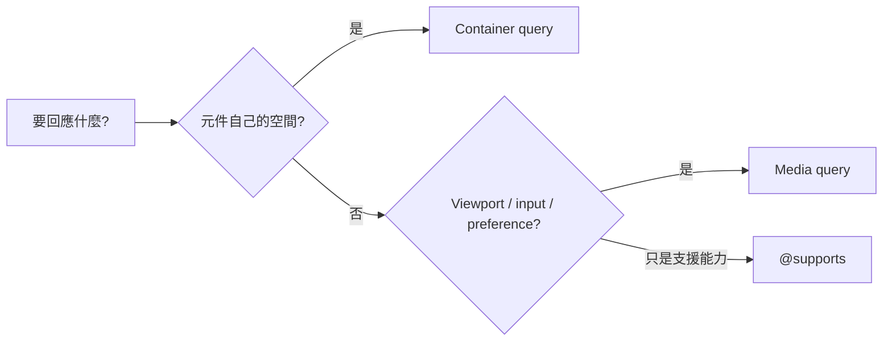

<div class="lab-kicker">CSS LAYOUT LAB · 04</div>
<h1 v-motion :initial="{ y: 30, opacity: 0 }" :enter="{ y: 0, opacity: 1 }">RWD<br><span>回應能力，不只螢幕寬度</span></h1>
<p class="lead" v-click>Mobile-first × Queries × Preferences × Responsive media</p>
<div class="devices"><i></i><i></i><i></i></div>

<!--
Responsive design 是一組能力偵測：可用空間、元件容器、輸入與使用者偏好、媒體資源。
-->

---
layout: center
---

# Mobile-first 是 cascade 策略

<p class="lead">先寫窄螢幕夠用的基礎規則，再用 `min-width` media query 逐步增強；breakpoint 應由內容何時失衡決定，不由裝置品牌決定。</p>

```css {1-5|7-11|all}
.nav {
  display: grid;
  gap: .75rem;
}

@media (width >= 48rem) {
  .nav {
    grid-template-columns: auto 1fr auto;
  }
}
```

<div v-click class="callout">基礎規則服務窄空間，再以 min-width 增強；breakpoint 應由內容何時失衡決定，不由裝置品牌決定。</div>

---

# Media query vs Container query

<p class="lead">Media query 回應 viewport 與裝置能力；container query 讓元件依自己的可用空間變版，同一卡片放 sidebar 或 main 都能自治。</p>

<div class="compare">
  <div v-click><b>Viewport / 裝置能力</b><code>@media (width >= 64rem)</code><p>頁面 shell、全域 navigation、列印、hover/pointer、使用者偏好。</p></div>
  <div v-click><b>元件可用空間</b><code>@container card (width > 28rem)</code><p>同一元件放在 sidebar 或 main 都能自主適應。</p></div>
</div>

```css
.card-shell { container: card / inline-size; }
@container card (width > 28rem) {
  .card { grid-template-columns: 10rem 1fr; }
}
```

---

# Query 決策圖

<p class="lead">先問「要回應的是整頁還是元件自己的空間」：前者用 media query，後者用 container query；只是偵測 CSS 支援則用 `@supports`。</p>



<p v-click class="lab-note">Style queries 可查 custom property；尺寸 container query 需要祖先建立 containment。</p>

---

# 尊重使用者偏好

<p class="lead">RWD 不只回應螢幕寬度，也應回應動效、配色與對比度等使用者偏好；這些 media feature 讓介面更包容，而不是只靠 breakpoint。</p>

<div class="card-grid">
  <div v-click class="lab-card"><b>Reduced motion</b><code>@media (prefers-reduced-motion: reduce)</code><p>減少非必要位移與視差，不必粗暴關掉所有回饋。</p></div>
  <div v-click class="lab-card"><b>Color scheme</b><code>@media (prefers-color-scheme: dark)</code><p>搭配 `color-scheme` 讓原生 controls 同步。</p></div>
  <div v-click class="lab-card"><b>Contrast</b><code>@media (prefers-contrast: more)</code><p>加強邊界、文字和狀態差異；先確認目標支援。</p></div>
</div>

```css
@media (prefers-reduced-motion: reduce) {
  .card { transition-duration: .01ms; }
}
```

---
layout: two-cols
layoutClass: gap-8
---

# Responsive images

<p class="lab-note">圖片響應式分兩層：`srcset` + `sizes` 選解析度，`picture` 處理裁切或格式不同的 art direction。</p>

```html
<picture>
  <source
    media="(width >= 60rem)"
    srcset="/hero-wide.avif"
  >
  = 48rem) 50vw, 100vw"
    width="960" height="640"
    alt="團隊共同檢視版面"
  >
</picture>
```

::right::

<div class="stack">
  <div v-click><b>`srcset` + `sizes`</b><span>解析度選擇：給 browser 候選與預期 rendered width。</span></div>
  <div v-click><b>`picture`</b><span>Art direction / format selection：來源內容或裁切真的不同。</span></div>
  <div v-click><b>width + height</b><span>提供 intrinsic ratio，降低 layout shift。</span></div>
</div>

---

# Shiki Magic Move：從 breakpoint 堆疊到元件自治

<p class="lead">把版面規則從「全站 viewport breakpoint」搬到「元件容器 query」，同一 ProductCard 就不必為每個版面寫一組 media query。</p>

````md magic-move
```css
@media (min-width: 768px) {
  .product-card { grid-template-columns: 12rem 1fr; }
}
```
```css
.product-slot {
  container-type: inline-size;
}
@container (width >= 30rem) {
  .product-card { grid-template-columns: 12rem 1fr; }
}
```
```css
.product-slot { container: product / inline-size; }
@container product (width >= 30rem) {
  .product-card { grid-template-columns: minmax(8rem, 2fr) 3fr; }
}
```
````

---
layout: center
---

# Live Lab

<p class="lead">拖曳右側把手改變卡片容器寬度，觀察窄於 400px 時自動切單欄、寬於閾值時維持雙欄；左側 Monaco 可調 grid、gap 與字級。</p>

<p class="lab-note">重點不是背 breakpoint 數字，而是「元件依自己的 inline-size 變版」——這正是 container query 要解的問題。</p>

<RwdLab />

<div class="monaco-probe">

```css {monaco}
container-type: inline-size;
```

</div>

<!--
操作：拖曳 ↔ 把手調整容器寬度（280–610px）；<400px 強制單欄 grid。
左側 Monaco 白名單：display、grid-template-columns、gap、font-size。
列印版：顯示 520px 預設狀態。
-->

---

# 快問快答

<p class="lab-note">viewport media query 管的是整頁；元件在 sidebar 與 main 寬度不同時，應讓它回應自己的容器，而不是猜使用者裝置。</p>

<div class="quiz">
  <p>同一張 ProductCard 在 320px sidebar 與 700px main 中應各自變版，首選？</p>
  <div v-click="1">A. viewport media query　 B. container query　 C. user-agent sniffing</div>
  <div v-click="2" class="answer">B：元件回應自己的可用 inline-size。</div>
</div>

---
layout: end
---

# 響應「情境」，不是裝置名稱

<p class="lead">好的 RWD 同時處理空間、能力、偏好與內容本身；用 `@media` 與 `@container` 選對偵測對象，比維護一份裝置清單更可靠。</p>
<p>Space · Capability · Preference · Content</p>
<small>列印版：Live Lab 顯示 520px 預設狀態。</small>
