<div class="absolute inset-0 bg-gradient-to-br from-[#0d1117] via-[#0d1117] to-[#0e2226]"></div>

<div class="relative z-10">
  <p class="font-mono text-sm text-[#7ee787] mb-6">$ mysql -e "EXPLAIN SELECT * FROM users WHERE email = ?"</p>
  <h1 class="text-5xl">
    <span class="accent-brand">資料庫</span>
    <span class="text-white">索引</span>
  </h1>
  <p class="mt-4 text-xl text-gray-300 font-mono">
    <span class="muted">//</span> 從 O(n) 全表掃描到 O(log n) 精準定位
  </p>
  <div class="mt-14 grid grid-cols-4 gap-3 font-mono text-sm text-center">
    <div class="concept-card"><strong>B-Tree</strong><br><span class="muted">平衡樹</span></div>
    <div class="concept-card"><strong>EXPLAIN</strong><br><span class="muted">執行計劃</span></div>
    <div class="concept-card"><strong>失效陷阱</strong><br><span class="muted">函數與通配符</span></div>
    <div class="concept-card"><strong>代價</strong><br><span class="muted">空間換時間</span></div>
  </div>
</div>

<!--
開場比喻：1000 頁的字典找「Apple」——沒目錄逐頁翻，有目錄直接跳 A 開頭。
索引就是資料庫的目錄。預計 30–40 分鐘。
-->

---
layout: default
hideInToc: true
---

<p class="font-mono text-xs text-gray-500"><span class="accent-green">$</span> cat index-plan.md</p>

# 今日路線

<div class="grid grid-cols-2 gap-4 mt-7">
  <div v-click class="concept-card"><strong>01 / 為什麼</strong><br><span class="muted">全表掃描 vs 索引查詢</span></div>
  <div v-click class="concept-card"><strong>02 / 原理</strong><br><span class="muted">B-Tree 結構與 EXPLAIN 判讀</span></div>
  <div v-click class="concept-card"><strong>03 / 設計</strong><br><span class="muted">哪些欄位該建、複合索引順序</span></div>
  <div v-click class="concept-card"><strong>04 / 陷阱</strong><br><span class="muted">索引失效的六種姿勢</span></div>
</div>

<div v-click class="mt-6 terminal-card text-sm">
  <span class="accent-orange">目標：</span>100 萬筆資料的查詢，從 3000ms 壓到 3ms。
</div>

---
layout: section
transition: fade
---

<p class="font-mono accent-orange">PART 01</p>

# 為什麼需要索引？

<p class="font-mono muted">在 1000 頁的字典裡找 Apple</p>

---
layout: two-cols
layoutClass: gap-7
---

# 沒有索引：逐頁翻

```text
資料表：
[1] → [2] → [3] → ... → [1000000]

目標：email = 'hua@email.com'
方式：從第 1 筆逐一檢查
```

<div v-click class="mt-4 terminal-card text-sm">
  <p class="terminal-label">EXPLAIN</p>
  <div>type: <span class="accent-orange">ALL</span>（全表掃描）</div>
  <div>rows: <span class="accent-orange">1000000</span></div>
  <div class="mt-2">⏱️ O(n) — 資料翻倍，時間翻倍</div>
</div>

::right::

# 有索引：直接跳

```text
索引樹：      root
            /      \
        branch    branch
        /    \
     leaf    leaf → 資料位址
```

<div v-click class="mt-4 terminal-card text-sm">
  <p class="terminal-label">EXPLAIN</p>
  <div>type: <span class="accent-green">ref</span>（索引查詢）</div>
  <div>rows: <span class="accent-green">1</span></div>
  <div class="mt-2">⏱️ O(log n) — 3~4 次 I/O 到手</div>
</div>

---
---

# 資料量越大，差距越恐怖

| 資料筆數 | 無索引 | 有索引 | 效能提升 |
| --- | --- | --- | --- |
| 1,000 | 2ms | 1ms | 2x |
| 10,000 | 25ms | 1ms | 25x |
| 100,000 | 300ms | 2ms | 150x |
| 1,000,000 | 3,500ms | 3ms | <strong>1000x+</strong> |

<div class="mt-5 grid grid-cols-2 gap-4 text-sm">
  <div v-click class="concept-card"><strong>O(n) 線性成長</strong><br><span class="muted">無索引：資料量 ×10，時間 ×10</span></div>
  <div v-click class="concept-card"><strong>O(log n) 對數成長</strong><br><span class="muted">有索引：資料量 ×10，時間幾乎不動</span></div>
</div>

<div v-click class="mt-5 terminal-card text-sm">
  小表（&lt;1000 筆）效益不明顯；大表（&gt;10 萬筆）<span class="accent-orange">必須建索引</span>。
</div>

---
layout: section
transition: fade
---

<p class="font-mono accent-orange">PART 02</p>

# B-Tree 原理

<p class="font-mono muted">為什麼是 3~4 次 I/O？</p>

---
---

# B-Tree：平衡、有序、高扇出

```mermaid {theme: 'dark', scale: 0.55}
graph TD
    Root["Root<br/>10, 20, 30"]
    B1["Branch<br/>5, 7"]
    B2["Branch<br/>15, 17"]
    B3["Branch<br/>25, 27"]
    L1["Leaf<br/>1..4"]
    L2["Leaf<br/>5,6"]
    L3["Leaf<br/>15,16"]
    L4["Leaf<br/>25,26"]
    Root --> B1
    Root --> B2
    Root --> B3
    B1 --> L1
    B1 --> L2
    B2 --> L3
    B3 --> L4
    style Root fill:#0e2226,stroke:#00a4b4
    style L1 fill:#13251a,stroke:#7ee787
    style L2 fill:#13251a,stroke:#7ee787
    style L3 fill:#13251a,stroke:#7ee787
    style L4 fill:#13251a,stroke:#7ee787
```



<div class="mt-4 grid grid-cols-4 gap-3 text-sm text-center">
  <div v-click class="concept-card"><strong>平衡</strong><br><span class="muted">所有葉節點同深度</span></div>
  <div v-click class="concept-card"><strong>有序</strong><br><span class="muted">鍵值排序，可二分</span></div>
  <div v-click class="concept-card"><strong>範圍查詢</strong><br><span class="muted">葉節點互相連接</span></div>
  <div v-click class="concept-card"><strong>高扇出</strong><br><span class="muted">樹很矮，I/O 很少</span></div>
</div>

<!--
查詢流程：Root 比較 → Branch 比較 → Leaf 找到索引記錄 → 指標讀實際資料。
百萬筆資料的樹高通常只有 3~4 層。
-->

---
---

# 索引的本質：空間換時間

```sql {1-2|4-6|all}
-- 建立索引：多一份「排序過的目錄」
CREATE INDEX idx_user_email ON users(email);

-- 同一個查詢，執行計劃改變
SELECT * FROM users WHERE email = 'hua@email.com';
-- type: ALL, rows: 1000000  →  type: ref, rows: 1
```

<div class="mt-5 grid grid-cols-2 gap-4 text-sm">
  <div v-click class="concept-card"><strong>索引是獨立的資料結構</strong><br><span class="muted">存「鍵值 → 資料位址」，按鍵值排序，指標定位</span></div>
  <div v-click class="concept-card"><strong>三種常見類型</strong><br><span class="muted">主索引（PRIMARY KEY 自動建）、一般索引、唯一索引</span></div>
</div>

<div v-click class="mt-5 terminal-card text-sm">
  <span class="accent-green">$</span> 驗證方式永遠是 <code>EXPLAIN</code>：type 是 <code>ref</code>/<code>range</code> 用到索引，<code>ALL</code> 就是全表掃描。
</div>

---
layout: section
transition: fade
---

<p class="font-mono accent-orange">PART 03</p>

# 索引設計原則

<p class="font-mono muted">建對欄位，排對順序</p>

---
layout: two-cols
layoutClass: gap-7
---

# 適合建索引

```sql
-- WHERE 常客
CREATE INDEX idx_order_status
    ON orders(status);

-- JOIN 關聯欄位
CREATE INDEX idx_order_user_id
    ON orders(user_id);

-- ORDER BY 常客
CREATE INDEX idx_order_created
    ON orders(created_at);
```

::right::

# 不適合建索引

<div class="space-y-3 mt-4">
  <div v-click class="concept-card text-sm"><strong>低區分度欄位</strong><br><span class="muted">gender 只有兩三種值，索引幫不上忙</span></div>
  <div v-click class="concept-card text-sm"><strong>頻繁更新的欄位</strong><br><span class="muted">last_login_time 每次登入都要維護索引</span></div>
  <div v-click class="concept-card text-sm"><strong>很少查詢的欄位</strong><br><span class="muted">description 建了也沒人用，白付寫入成本</span></div>
</div>

---
---

# 複合索引：順序決定成敗

```sql {1-4|6-9|all}
-- 慢查詢：100 萬筆全表掃描
SELECT * FROM orders
WHERE user_id = 123 AND status = 'completed'
  AND order_date >= '2024-01-01';

-- 建複合索引：等值在前、範圍在後、選擇性高的優先
CREATE INDEX idx_orders_user_status_date
    ON orders(user_id, status, order_date);
-- rows: 1000000 → 120，快 8000 倍
```

<div class="mt-5 grid grid-cols-3 gap-3 text-sm text-center">
  <div v-click class="concept-card"><strong>1. user_id</strong><br><span class="muted">等值、選擇性高</span></div>
  <div v-click class="concept-card"><strong>2. status</strong><br><span class="muted">等值、選擇性低</span></div>
  <div v-click class="concept-card"><strong>3. order_date</strong><br><span class="muted">範圍查詢放最後</span></div>
</div>

<!--
複合索引三原則：選擇性高的在前、等值在前範圍在後、最常用的放最左。
-->

---
layout: section
transition: fade
---

<p class="font-mono accent-orange">PART 04</p>

# 索引失效陷阱

<p class="font-mono muted">建了索引 ≠ 用得到索引</p>

---
---

<IndexQuiz />

<p class="print-answer hidden mt-4 text-sm">
  列印版答案：C。後置通配符保留 B-Tree 有序性；函數與前置通配符都讓索引失效。
</p>

<!--
答案 C。這題直接對應接下來的失效清單。
-->

---
---

# 六種失效姿勢

```sql {1-2|4-5|7-8|all}
SELECT * FROM users WHERE UPPER(name) = 'ZHANG';  -- ❌ 函數
SELECT * FROM users WHERE name = 'Zhang';          -- ✅

SELECT * FROM users WHERE name LIKE '%明';         -- ❌ 前置通配符
SELECT * FROM users WHERE name LIKE '張%';         -- ✅

SELECT * FROM users WHERE age + 10 > 35;           -- ❌ 欄位運算
SELECT * FROM users WHERE age > 25;                -- ✅ 運算移到右邊
```

| 情況 | 原因 | 解法 |
| --- | --- | --- |
| 索引欄位套函數 | 破壞排序 | 函數索引（MySQL 8.0+）或改條件 |
| 前置通配符 `%x` | 有序性無用 | 後置通配符或全文索引 |
| 欄位參與運算 | 無法預算索引值 | 運算移到條件右邊 |
| 隱式型別轉換 / OR / != | 觸發轉換、難優化 | 型別一致、改 IN / 範圍 |

---
---

# 天下沒有免費的索引

<div class="grid grid-cols-2 gap-5 mt-6">
  <div class="terminal-card">
    <p class="terminal-label">GAIN</p>
    <div v-click>✓ 查詢從 O(n) → O(log n)</div>
    <div v-click class="mt-2">✓ ORDER BY / GROUP BY 加速</div>
    <div v-click class="mt-2">✓ JOIN 效能大幅改善</div>
  </div>
  <div class="terminal-card">
    <p class="terminal-label">COST</p>
    <div v-click>× 額外空間（約原表 10–30%）</div>
    <div v-click class="mt-2">× INSERT / UPDATE / DELETE 變慢（要維護樹）</div>
    <div v-click class="mt-2">× 過度索引 = 白付寫入稅</div>
  </div>
</div>

<div v-click class="mt-6 terminal-card text-sm">
  <span class="accent-orange">80/20 法則：</span>為 20% 最常用的查詢建索引，不是為每個欄位都建一個。
</div>

---
---

# 今日重點

<div class="grid grid-cols-2 gap-4 mt-5">
  <div v-click class="concept-card"><strong>索引 = 目錄</strong><br><span class="muted">B-Tree 讓查詢從 O(n) 變 O(log n)</span></div>
  <div v-click class="concept-card"><strong>EXPLAIN 驗證</strong><br><span class="muted">type: ALL 是警報，ref / range 才及格</span></div>
  <div v-click class="concept-card"><strong>複合索引順序</strong><br><span class="muted">選擇性高在前、等值在前、範圍在後</span></div>
  <div v-click class="concept-card"><strong>失效陷阱</strong><br><span class="muted">函數、前置通配符、欄位運算</span></div>
</div>

<div v-click class="mt-7 text-center text-lg font-mono">
  索引是<span class="accent-orange">空間換時間</span> —— 讀多寫少的欄位才值得。
</div>

---
layout: end
class: text-center
---

# Query optimized.

<p class="mt-5 font-mono muted">下一步：進階索引實戰 — 複合索引與 Hash 索引</p>

<div class="mt-10 terminal-card inline-block text-left text-sm">
  <div><span class="accent-green">$</span> EXPLAIN SELECT ... -- type: ref, rows: 1</div>
  <div class="accent-orange mt-2">b-tree → explain → composite → 避開失效</div>
</div>

<!--
延伸閱讀回文章：三題實戰練習（含效能基準測試腳本）、進階索引實戰、SQL JOIN。
-->
