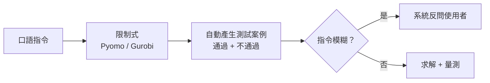

RESEARCH PROPOSAL · 2026

<h1 v-motion :initial="{ y: 28, opacity: 0 }" :enter="{ y: 0, opacity: 1 }">用一句話 建出可執行的調度模型</h1>

讓中小型運輸業者用自然語言描述限制，系統把它變成限制式、測試案例和排班結果。

  
<code>instruction</code>危險品那批走外環<i class="wait"></i>

  
<code>constraint</code>禁行危險品路段<i class="ok"></i>

  
<code>test_case</code>pass / fail × 2<i class="ok"></i>

  
<code>solver</code>Pyomo + Gurobi<i class="wait"></i>

---
layout: two-cols
layoutClass: gap-9 v-center
---

# 一個大問題

調度系統從一個港口搬到另一個港口，就要重找專家、重收資料，重新調校數週到數月。中型業者沒有這個預算。

<b>命題</b>

用自然語言描述限制，模型自己建立、自己驗證、自己求解。安全與減碳一起算。

::right::

  
<b>3,826 → 0</b>4 萬筆訂單下，MILP 單獨求解的未送達件數；加上啟發式後歸零

  
<b>0.18 vs 0.31</b>四個 agent 協作的空駛比，對照單一 RL

  
<b>27 – 33%</b>PortAgent 拿掉 RAG 或自我修正後的解正確率

---
layout: section
transition: fade
---

PART 01

# 文獻回顧：三篇，各解決一段

多代理強化學習、混合求解、以及讓 LLM 寫最佳化模型。三篇各留一個洞。

---
layout: two-cols
layoutClass: gap-9
---

PAPER 01 · HSR London, 2026

# MARL + LLM 卡車調度

規則式與最佳化式調度跟不上的地方是即時變動：需求、路況、司機狀態。

  
<b>方法</b>卡車、貨物、路線、獲利四個 agent 用 MARL 學調度。LLM 把仲介訊息與調度員指令轉成限制向量 Ct，注入狀態。

  
<b>模擬結果</b>Total Reward 0.91（單一 RL 0.79）、空駛比 0.18（0.31）、準時率 93%（84%）。

::right::

  
限制與觀察

  <ul>
    <li>沒有「只用 MARL、不加 LLM」的對照，LLM 的貢獻未被驗證</li>
    <li>模擬細節、隨機種子、變異數都未交代</li>
    <li>參考文獻編號對不上</li>
  </ul>
  
這篇我當靈感，不當證據。

---
layout: two-cols
layoutClass: gap-9
---

PAPER 02 · ICAPS 2021

# DeepFreight：多次轉運的貨運配送

貨運要同時顧到服務所有訂單與省油。VRP／MILP 在大規模下算不動，也沒考慮貨物中途轉運。

  
<b>方法</b>QMIX 學卡車派遣，DFS 貪婪配對（允許多次轉運），剩餘少量訂單交給 MILP 精算。

  
<b>模擬結果</b>20 輛車、4 萬筆訂單：MILP 單獨約 3,826 件未送達，DeepFreight 約 643 件，兩者合用為 0。允許轉運讓行駛時間少約 7.5%。

::right::

  
限制與觀察

  <ul>
    <li>純模擬：美東 10 個配送中心</li>
    <li>需求需事先已知，不能線上應對新單</li>
    <li>純 RL 訓練不穩定</li>
  </ul>
  
「啟發式處理大部分、求解器收尾」這一段可以直接沿用。

---
layout: two-cols
layoutClass: gap-9
---

PAPER 03

# PortAgent：讓 LLM 當虛擬專家團隊

換一個港口就要重新調校。目標是讓 LLM 產出可執行的最佳化模型，而不是重新求解。

  
<b>方法</b>LLM 模擬專家團隊做檢索、建模、寫程式與除錯，搭配 RAG few-shot 與 Reflexion 式自我修正，輸出 Pyomo／Gurobi 模型。

  
<b>結果</b>45 個案例：可執行率 100%，解正確率 93.33%，平均 83 秒。拿掉 RAG 或自我修正後掉到約 27～33%。

::right::

  
限制與觀察

  <ul>
    <li>測試題簡單，都是「加限制的最短路徑」</li>
    <li>3 次失敗全是語意誤解</li>
    <li>「專業程度無顯著影響」的樣本小，檢定力不足</li>
  </ul>
  
20 個節點的規模，撐不起調度題目的複雜度。

---

# 三篇的共同缺口

  

    
<b>01</b>MARL + LLM<em>LLM 解析層沒有對照實驗，增益歸因不明</em>

    
<b>02</b>DeepFreight<em>模擬環境固定，需求不能線上變動</em>

    
<b>03</b>PortAgent<em>規模停在 20 個節點，失敗集中在語意</em>

  

  

    
GAP

    
三篇都做了<b>某一層</b>的驗證， 沒有人在<b>指令到限制式</b>這一層建立基準。

    
我的切入點就是這一層。

  

---
layout: section
transition: fade
---

PART 02

# 對社會的貢獻

讓中小型運輸業者用自然語言就能可靠地建立並求解調度模型，同時兼顧安全與減碳。

---

# 一個大問題，三個小問題

  

    
<b>1</b>可信賴<em>自然語言轉成限制式時，結果怎麼驗證？</em>

    

      
<b>缺口</b>PortAgent 的失敗全是語意誤解；①的 LLM 解析層未被驗證。

      
<b>社會貢獻</b>危險品禁行、限高限重不被誤解，安全風險下降。

    

  

  

    
<b>2</b>可擴展<em>規模變大時，怎麼維持穩定與省油？</em>

    

      
<b>缺口</b>MILP 放大就算不動，純 RL 不穩定（②）；PortAgent 只測 20 個節點。

      
<b>社會貢獻</b>空駛與油耗下降，小公司不必聘最佳化專家。

    

  

  

    
<b>3</b>可重現<em>怎麼建立能公平比較的公開基準？</em>

    

      
<b>缺口</b>三篇的評測都是自建、小樣本。

      
<b>社會貢獻</b>公共財，後續研究可以直接比較，不用重蓋評測環境。

    

  

---
layout: section
transition: fade
---

PART 03

# 具體方案

三個小問題各自有做法，驗證指標在最後一頁。

---

# 1 可信賴：每條限制都要有測試案例

建模完成後，為每條限制各產生一個通過案例與一個不通過案例。指令模糊時由系統反問，不自己猜門檻。

<ConstraintGate />

---

# 2 可擴展：啟發式先跑，求解器收尾

沿用 DeepFreight＋MILP 的分工。LLM 負責把指令變成模型，規模問題交給演算法。

  

    <b class="no">LLM 直接求解</b>
    
節點數一多就卡住，等待時間無法預估。

    <em>PortAgent 只測到 20 個節點。</em>
  

  

    <b class="yes">啟發式 + 求解器</b>
    
啟發式處理大部分訂單，剩下難題交給求解器精算。

    <em>4 萬筆訂單的案例裡，未送達件數從 643 降到 0。</em>
  

  
<b>求解時間</b>同一路網規模下，從指令到可執行解的時間，與只用最佳化、只用 RL 比較

  
<b>空駛比</b>空車里程 ÷ 總里程，沿用 ① 的量法

---

# 3 可重現：把評測環境做成公共財

<b>01</b>路網<em>用 OpenStreetMap 或政府開放資料，不自建模擬城市</em>

<b>02</b>指令資料集<em>繁體中文口語指令 + 標準答案，每條指令附限制式與測試案例</em>

<b>03</b>多組種子<em>同一組評測跑多組隨機種子，用等效性檢定報信賴區間</em>

  三篇的評測都是自建、小樣本。我把這一層公開，其他人才有東西可以比。

---

# 預期產出與驗證指標

  
<b>開源原型</b>自然語言指令到限制式、測試案例、排班結果的完整流程

  
<b>評測集</b>路網、繁體中文口語指令、標準答案與多組隨機種子

  
<b>限制正確率</b>每條限制的測試案例通過比例。通過與不通過各一個，缺一不可

  
<b>求解時間</b>不同規模下的建模時間與求解時間分開量

  
<b>空駛比</b>與 ① 的 0.18／0.31 用同一種算法計算

限制正確率是這份計畫最硬的一項指標。其他兩項都是借來的量法。

---
class: v-center
---

# 快問快答

  
仲介說「危險品那批盡量走外環」。哪一種做法最安全？

  
A. 讓 LLM 自己決定「盡量」的門檻　 B. 直接當成硬性禁行規定　 C. 反問Broker要門檻與例外

  
C：「盡量」沒有門檻，猜錯就是安全問題。這一頁的互動可以試。

---
layout: end
---

# 指令進來，限制式出去

把「指令到限制式」這一層變成可驗證的，後面的規模與碳排才有討論的基礎。

範圍：自然語言建模、限制式驗證、啟發式加求解器、公開評測集

<small>文獻：MARL+LLM 調度（2026）、DeepFreight（ICAPS 2021）、PortAgent。</small>
