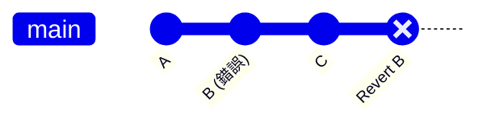
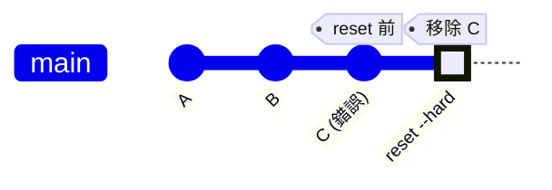

<div class="absolute inset-0 bg-gradient-to-br from-[#0d1117] via-[#0d1117] to-[#2a1410]"></div>

<div class="relative z-10">
  <p class="font-mono text-sm text-[#7ee787] mb-6">$ git log --oneline && git revert HEAD</p>
  <h1 class="text-5xl">
    <span class="accent-brand">Revert</span>
    <span class="text-white"> vs </span>
    <span class="accent-brand">Reset</span>
  </h1>
  <p class="mt-4 text-xl text-gray-300 font-mono">
    <span class="muted">//</span> 時光機的兩種開法：溫柔倒帶，還是橡皮擦擦掉
  </p>
  <div class="mt-14 grid grid-cols-4 gap-3 font-mono text-sm text-center">
    <div class="concept-card"><strong>revert</strong><br><span class="muted">溫柔模式</span></div>
    <div class="concept-card"><strong>reset</strong><br><span class="muted">狠心模式</span></div>
    <div class="concept-card"><strong>reflog</strong><br><span class="muted">救命符</span></div>
    <div class="concept-card"><strong>push -f</strong><br><span class="muted">危險動作</span></div>
  </div>
</div>

<!--
開場：每個人都有「這個 commit 不該存在」的時刻。差別在於你怎麼反悔——
先找溫柔的 revert，真的沒辦法再考慮狠心的 reset。預計 25–35 分鐘。
-->

---
layout: default
hideInToc: true
---

<p class="font-mono text-xs text-gray-500"><span class="accent-green">$</span> cat agenda.md</p>

# 今日路線

<div class="grid grid-cols-2 gap-4 mt-7">
  <div v-click class="concept-card"><strong>01 / 為什麼要回退</strong><br><span class="muted">血淚史盤點</span></div>
  <div v-click class="concept-card"><strong>02 / Revert</strong><br><span class="muted">反向提交，歷史保留</span></div>
  <div v-click class="concept-card"><strong>03 / Reset</strong><br><span class="muted">移動 HEAD，三種模式</span></div>
  <div v-click class="concept-card"><strong>04 / 決策與救援</strong><br><span class="muted">決策樹、reflog、merge commit</span></div>
</div>

<div v-click class="mt-6 terminal-card text-sm">
  <span class="accent-orange">目標：</span>回退前先問一句「推送了沒？」，答案就出來一半。
</div>

---
layout: section
transition: fade
---

<p class="font-mono accent-orange">PART 01</p>

# 為什麼需要回退？

<p class="font-mono muted">都是血淚史</p>

---
---

# 常見情境

<div class="grid grid-cols-3 gap-4 mt-8 text-center">
  <div v-click class="concept-card"><strong>推錯了</strong><br><span class="muted">錯誤的功能已推送到遠端（糟糕！）</span></div>
  <div v-click class="concept-card"><strong>寫壞了</strong><br><span class="muted">某個提交導致 bug（誰寫的！...是我）</span></div>
  <div v-click class="concept-card"><strong>先拿掉</strong><br><span class="muted">暫時移除某些改動以便測試</span></div>
</div>

<div class="mt-8 grid grid-cols-2 gap-5">
  <div v-click class="terminal-card text-sm">
    <p class="terminal-label">WRONG</p>
    直接刪除程式碼再提交 —— 無法追溯，<span class="accent-orange">跳進火坑</span>
  </div>
  <div v-click class="terminal-card text-sm">
    <p class="terminal-label">RIGHT</p>
    用 Git 工具安全回退 —— <span class="accent-green">優雅地後退</span>
  </div>
</div>

---
layout: section
transition: fade
---

<p class="font-mono accent-orange">PART 02</p>

# Revert：生成反向提交

<p class="font-mono muted">倒帶鏡頭，但原片還在</p>

---
---

# 運作原理



<div class="mt-6 grid grid-cols-2 gap-4 text-sm">
  <div v-click class="concept-card"><strong>新的提交</strong><br><span class="muted">內容是「撤銷 B 的改動」</span></div>
  <div v-click class="concept-card"><strong>歷史完整</strong><br><span class="muted">A → B → C → Revert B，B 仍存在</span></div>
</div>

<div v-click class="mt-5 terminal-card text-sm">
  像拍電影的倒帶鏡頭 —— <span class="accent-brand">觀眾看得到你倒帶</span>，這就是可追溯性。
</div>

---
layout: two-cols
layoutClass: gap-7
---

# 基本用法

```shell
# 回退單個提交
git revert <commit-id>

# 回退最近一次提交
git revert HEAD

# 回退但不自動提交
git revert --no-commit <commit-id>
```

::right::

# 批量回退

```shell
# A → B → C → D → E
# 想回退 C、D、E

git revert --no-commit b2c3d4e..e5f6g7h
git commit -m "Revert changes C to E"
git push origin main
```

<div v-click class="mt-4 concept-card text-sm">
  <strong>--no-commit</strong><br>
  <span class="muted">多個 revert 合併成一個提交；範圍 &lt;old&gt;..&lt;new&gt; 不含 old</span>
</div>

---
layout: section
transition: fade
---

<p class="font-mono accent-orange">PART 03</p>

# Reset：重寫歷史

<p class="font-mono muted">橡皮擦，擦掉就沒了</p>

---
---

# 運作原理



<div class="mt-6 grid grid-cols-2 gap-4 text-sm">
  <div v-click class="concept-card"><strong>移動 HEAD 指針</strong><br><span class="muted">改變提交歷史本身</span></div>
  <div v-click class="concept-card"><strong>歷史變成 A → B</strong><br><span class="muted">C 被完全移除，消失了</span></div>
</div>

---
---

# 三種模式：擦到哪一層？

| 模式 | 影響範圍 | 使用情境 |
| --- | --- | --- |
| `--soft` | 只移動 HEAD | 改動保留在<strong>暫存區</strong>，可直接重新提交 |
| `--mixed`（預設） | HEAD + 暫存區 | 改動保留在<strong>工作區</strong>，需重新 add |
| `--hard` | HEAD + 暫存區 + 工作區 | <strong>完全刪除改動</strong>，謹慎使用！ |

<div v-click class="mt-5 terminal-card">
  <p class="terminal-label">DANGER — 核彈按鈕</p>
  <div><code>--hard</code> 會<span class="accent-orange">永久刪除</span>未提交的改動。按下去之前：</div>
  <div class="mt-2">1. 備份了嗎？ 2. 真的不要了？ 3. 這分支只有我在用吧？</div>
</div>

<!--
soft/mixed/hard 的記法：擦掉的層數遞增——歷史、暫存區、工作區。
-->

---
layout: section
transition: fade
---

<p class="font-mono accent-orange">PART 04</p>

# 對決與救援

<p class="font-mono muted">選哪個？擦錯了怎麼辦？</p>

---
---

# 正面對決

| 特性 | Revert | Reset |
| --- | --- | --- |
| 歷史記錄 | 保留（新增反向提交） | 重寫（刪除提交） |
| 安全性 | 高（溫柔模式） | 低（狠心模式） |
| 已推送的提交 | ✅ 推薦 | ❌ 避免 |
| 團隊協作 | 安全 | 危險 |
| 追蹤性 | 可追溯 | 無法追溯 |

<div v-click class="mt-5 text-center text-lg font-mono">
  一句話：<span class="accent-brand">公開的用 revert，私有的才 reset</span>。
</div>

---
---

# 決策樹

```mermaid {theme: 'dark', scale: 0.62}
flowchart TD
    A[需要回退提交] --> B{已推送到遠端?}
    B -->|是| C["revert（溫柔模式）"]
    B -->|否| D{需要保留改動?}
    D -->|是| E["reset --soft / --mixed"]
    D -->|否| F["reset --hard（確認再確認）"]
    C --> G[git push]
    E --> H[修改後重新提交]
    style C fill:#13251a,stroke:#7ee787
    style E fill:#13202a,stroke:#5382a1
    style F fill:#2d1c13,stroke:#f05133
```



<div v-click class="mt-4 terminal-card text-sm">
  第一個問題永遠是：<span class="accent-orange">「推送了沒？」</span>
</div>

---
---

<GitQuiz />

<p class="print-answer hidden mt-4 text-sm">
  列印版答案：B。已推送的提交用 revert；reset + push -f 會重寫公開歷史。
</p>

<!--
答案 B。選 A 的人請他想像五個隊友明天早上 pull 下來的表情。
-->

---
layout: two-cols
layoutClass: gap-7
---

# 救援：reflog

```shell
# 誤用 reset --hard 刪了改動？
# 短時間內可以救回

git reflog
# 找到刪除前的 commit-id

git reset --hard <commit-id>
# 穿越回去
```

<div v-click class="mt-4 concept-card text-sm">
  <strong>reflog 是救命符</strong><br>
  <span class="muted">記錄 HEAD 的每次移動，垃圾回收前都找得回來</span>
</div>

::right::

# 兩個進階題

```shell
# Revert 一個 merge commit
git revert -m 1 <merge-commit-id>
# -m 1 = 保留主線（通常是 main）
```

```shell
# 隊友不小心 reset 了公開分支？
git fetch origin
git reset --hard origin/main
# 全員同步回遠端狀態
```

<div v-click class="mt-4 terminal-card text-sm">
  <p class="terminal-label">RULE</p>
  reset 後已推送的分支需要 <code>push -f</code> ——
  <span class="accent-orange">會影響他人，小心被追殺</span>
</div>

---
---

# 今日重點

<div class="grid grid-cols-2 gap-4 mt-5">
  <div v-click class="concept-card"><strong>Revert</strong><br><span class="muted">反向提交、保留歷史，已推送的首選</span></div>
  <div v-click class="concept-card"><strong>Reset</strong><br><span class="muted">重寫歷史，只用在本地未推送</span></div>
  <div v-click class="concept-card"><strong>批量回退</strong><br><span class="muted">revert --no-commit &lt;old&gt;..&lt;new&gt;</span></div>
  <div v-click class="concept-card"><strong>reflog</strong><br><span class="muted">--hard 擦錯了，短時間內救得回</span></div>
</div>

<div v-click class="mt-7 text-center text-lg font-mono">
  要反悔時，先找溫柔的 revert，<span class="accent-orange">真的沒辦法再狠心 reset</span>。
</div>

---
layout: end
class: text-center
---

# History preserved.

<p class="mt-5 font-mono muted">下一步：git branch 與 commit 訊息規範</p>

<div class="mt-10 terminal-card inline-block text-left text-sm">
  <div><span class="accent-green">$</span> git log --oneline --graph</div>
  <div class="accent-orange mt-2">revert → push | reset → reflog → 救回</div>
</div>

<!--
延伸閱讀回文章：git-commit、git-branch、Pro Git: Undoing Things。
掌握這兩招，你就是時光機駕駛員。
-->
