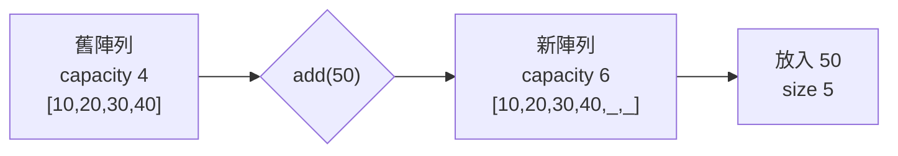

<div class="cover-glow"></div>
<div class="relative z-10">
  <div v-motion :initial="{ y: -18, opacity: 0 }" :enter="{ y: 0, opacity: 1 }" class="kicker">DATA STRUCTURE LAB</div>
  <h1 v-motion :initial="{ y: 24, opacity: 0 }" :enter="{ y: 0, opacity: 1, transition: { delay: 180 } }">
    <span class="text-[#5382A1]">Array</span> 與 <span class="text-[#E76F00]">ArrayList</span>
  </h1>
  <p class="text-xl text-gray-300 mt-4 font-mono">// 固定格子，還是會長大的格子？</p>
  <div class="grid grid-cols-2 gap-5 mt-14">
    <div v-click class="concept-card blue"><b>length</b><span>配置後固定</span></div>
    <div v-click class="concept-card orange"><b>size ≠ capacity</b><span>看得見的元素 ≠ 底層空間</span></div>
  </div>
</div>

<!--
開場先建立空間模型：Array 是固定格數；ArrayList 仍然使用陣列，只是會替你換成更大的陣列。
今天重點不是背 API，而是預測每個操作背後的成本。
-->

---
layout: default
---

# 先看表面 API

<div class="grid grid-cols-2 gap-6 mt-5">
  <div>

```java
int[] scores = {85, 92, 78};
scores[1] = 95;
int n = scores.length;
```

  <div v-click class="concept-card blue mt-4">索引語法 <code>[]</code> · 長度固定</div>
  </div>
  <div>

```java
List<Integer> scores = new ArrayList<>();
scores.add(85);
scores.set(0, 95);
int n = scores.size();
```

  <div v-click class="concept-card orange mt-4">方法 API · 元素數可變</div>
  </div>
</div>

<!--
先比較使用者看得到的語法。ArrayList 通常以 List 介面宣告，但需要 ArrayList 實作。
提醒 length 是欄位，size() 是方法。
-->

---
layout: default
---

# size 與 capacity 不是同一件事

<div class="capacity-row mt-10">
  <div v-for="n in [10, 20, 30]" :key="n" v-click class="memory-cell filled">{{ n }}</div>
  <div v-click class="memory-cell empty">空</div>
</div>

<div class="grid grid-cols-2 gap-5 mt-10 text-center">
  <div v-click class="metric"><b>size = 3</b><span>使用者可存取的元素數</span></div>
  <div v-click class="metric"><b>capacity = 4</b><span>底層陣列目前的格數</span></div>
</div>

<div v-click class="callout mt-6">capacity 是實作細節，標準 List API 不提供直接讀取。</div>

<!--
空格不屬於 List 的元素，因此 get(3) 仍會越界。
capacity 用來理解成本；一般程式應依賴 size()，不要依賴內部容量。
-->

---
layout: default
---

# 容量滿了：建立新陣列再複製



<div class="grid grid-cols-3 gap-4 mt-5 text-sm">
  <div v-click class="metric"><b>4 → 6</b><span>4 + floor(4 / 2)</span></div>
  <div v-click class="metric"><b>複製 4 次</b><span>這次 add 是 O(n)</span></div>
  <div v-click class="metric"><b>攤銷 O(1)</b><span>不是每次都擴容</span></div>
</div>

<div v-click class="callout mt-4">OpenJDK 常見成長約 1.5×；精確策略不是 List 規格保證。</div>

<!--
「1.5 倍」是常見 ArrayList 實作策略，不應說成所有 JVM 或 List 的契約。
單次擴容昂貴，但分攤到許多尾端 add 後，平均成本仍為常數。
-->

---
layout: default
---

# 看程式碼演進：預先給容量

````md magic-move {lines: true}
```java
List<Order> orders = new ArrayList<>();
for (Order order : incoming) {
    orders.add(order);
}
```

```java
int expected = incoming.size();
List<Order> orders = new ArrayList<>(expected);
for (Order order : incoming) {
    orders.add(order);
}
```

```java
List<Order> orders = new ArrayList<>(incoming);
```
````

<div v-click class="callout mt-4">已知資料量時，合理預估容量可減少重複配置與複製。</div>

<!--
第一版完全合理；只有量大或效能敏感時才需要預估。
第二版預先配置，第三版若目的只是複製集合則最直接。
-->

---
layout: default
---

# 中間插入：成本來自「搬家」

<div class="shift-demo mt-10">
  <div class="memory-cell filled">A</div>
  <div class="insert-cell" v-click>B</div>
  <div class="memory-cell filled" v-click>C <small>→</small></div>
  <div class="memory-cell filled" v-click>D <small>→</small></div>
  <div class="memory-cell filled" v-click>E <small>→</small></div>
</div>

<div class="grid grid-cols-2 gap-5 mt-10">
  <div v-click class="metric"><b>尾端 add</b><span>通常不搬既有元素</span></div>
  <div v-click class="metric"><b>index 1 插入</b><span>後方元素右移：O(n)</span></div>
</div>

<!--
逐格揭示右移。即使容量足夠，中間插入仍要移動元素。
ArrayList 適合隨機讀取與尾端增長，不代表所有插入刪除都便宜。
-->

---
layout: default
---

# 操作底層模型

<ArrayListPlayground />

<div v-click class="callout mt-3">
先填滿 capacity 再 add；接著 insert、remove，最後拖曳元素觀察搬移計數。
</div>

<!--
互動順序：加入 40、再加入 50觸發 4→6；於 index 1 插入；刪除中間元素。
拖曳採瀏覽器受控拖放，狀態由元件更新；PDF 只保留靜態模型。
-->

---
layout: two-cols
layoutClass: gap-7
---

# primitive 與 wrapper

```java
int[] raw = {1, 2, 3};
// 直接存 int 值
```

<div v-click class="concept-card blue mt-5">
Array 可直接存 primitive：<code>int</code>、<code>double</code>、<code>char</code>
</div>

::right::

```java
List<Integer> boxed = new ArrayList<>();
boxed.add(1);          // int → Integer
int n = boxed.get(0);  // Integer → int
```

<div v-click class="concept-card orange mt-5">
泛型不能使用 <code>List&lt;int&gt;</code>；需要 wrapper 與 autoboxing。
</div>

<!--
Autoboxing 讓語法方便，但值會包成物件參考，可能增加配置、記憶體與拆箱成本。
大多數業務程式優先可讀性；大量數值運算才特別評估 primitive array。
-->

---
layout: default
---

# 拆箱的隱藏風險

```java {1-2|4-5|7-11|all}
List<Integer> values = new ArrayList<>();
values.add(null);

Integer boxed = values.get(0); // 合法：boxed == null
int raw = values.get(0);       // NullPointerException

Integer maybe = values.get(0);
if (maybe != null) {
    int safe = maybe;
    System.out.println(safe);
}
```

<div v-click class="callout mt-5">例外不是 get() 本身造成，而是 <code>Integer → int</code> 拆箱時發生。</div>

<!--
這頁用來修正「泛型就一定安全」的誤解。型別安全不等於沒有 null。
請學員指出哪一行觸發自動拆箱。
-->

---
layout: default
---

# Arrays.asList 的固定大小陷阱

````md magic-move {lines: true}
```java
List<String> names = Arrays.asList("Ada", "Linus");
names.set(0, "Grace"); // 可以：替換元素
names.add("James");    // UnsupportedOperationException
```

```java
List<String> names =
    new ArrayList<>(Arrays.asList("Ada", "Linus"));
names.set(0, "Grace");
names.add("James");    // 可以改變大小
```

```java
List<String> readOnly = List.of("Ada", "Linus");
// set / add 都不允許
```
````

<div v-click class="callout mt-3"><code>Arrays.asList</code> 是陣列的固定大小 view，不是一般 ArrayList。</div>

<!--
Arrays.asList 支援 set，因為不改變大小；add/remove 會失敗。
List.of 則不可修改且不接受 null。需要可變集合時，以 new ArrayList 包裝。
-->

---
layout: two-cols
layoutClass: gap-7
---

# 可編輯：選擇正確結構

```java {monaco}
import java.util.*;

class Roster {
  public static void main(String[] args) {
    List<String> names =
        new ArrayList<>(List.of("Ada", "Linus"));
    names.add("Grace");
    System.out.println(names);
  }
}
```

::right::

<div class="concept-card orange mt-12">
  <b>練習</b>
  <ol class="text-sm text-gray-300 mt-3">
    <li>改成固定長度 String[]</li>
    <li>比較加入第三人的寫法</li>
    <li class="text-[#fca5a5]">此 Monaco 僅編輯，不執行 Java</li>
  </ol>
</div>

<!--
讓學員直接修改左側程式碼。這個 deck 沒有 JVM 或執行服務，因此不宣稱可 Run。
目標是藉由改寫感受固定長度與動態 API 的差異。
-->

---
layout: default
---

# 成本速查

| 操作 | Array | ArrayList |
|---|---:|---:|
| `get(index)` | O(1) | O(1) |
| `set(index)` | O(1) | O(1) |
| 尾端 `add` | 不支援 | 攤銷 O(1) |
| 中間插入/刪除 | 手動重建 O(n) | O(n) |
| 擴容 | 不會 | 單次 O(n) |

<div v-click class="callout mt-5">Big-O 描述成長趨勢；boxing、快取與配置仍會影響實際常數。</div>

<!--
避免把 O(1) 解讀為「完全沒有成本」。ArrayList get 還有邊界檢查與拆箱可能性。
選結構時先看操作模式，再看實測，而不是只看一格表格。
-->

---
layout: default
---

# 選擇題：哪一個更自然？

<div class="grid grid-cols-2 gap-4 mt-6">
  <div v-click class="scenario"><b>一週七天溫度</b><span>固定 7 格、primitive 數值</span><strong>double[]</strong></div>
  <div v-click class="scenario"><b>待辦清單</b><span>持續新增與刪除</span><strong>ArrayList</strong></div>
  <div v-click class="scenario"><b>棋盤 8 × 8</b><span>尺寸固定、索引明確</span><strong>char[][]</strong></div>
  <div v-click class="scenario"><b>搜尋結果</b><span>數量事前未知</span><strong>ArrayList</strong></div>
</div>

<div v-click class="callout mt-5">固定尺寸與 primitive 密集資料偏 Array；動態集合操作偏 ArrayList。</div>

<!--
逐題先請學員選擇，再揭示。答案是「自然的預設」，不是不可違反的規則。
例如搜尋結果若 API 要求陣列，最後仍可轉換。
-->

---
layout: center
class: text-center
---

# 三句話帶走

<div class="takeaways mt-10">
  <div v-click><b>size</b> 是元素數，<b>capacity</b> 是底層空間。</div>
  <div v-click>擴容約 1.5×，偶爾複製；中間操作需要搬移。</div>
  <div v-click>primitive 與可變性，決定許多 API 陷阱。</div>
</div>

<!--
請學員依序重述三點。若能解釋 Arrays.asList 為何 set 可以而 add 不行，代表已掌握固定大小 view。
-->

---
layout: end
class: text-center
---

# 謝謝

<p class="text-gray-400 mt-5">下一步：LinkedList、Set、Map 與效能量測</p>
<div class="kicker mt-10">choose by behavior, measure by evidence</div>

<!--
收尾並邀請提問。PDF 匯出會顯示靜態容量示意；互動、拖放與 Monaco 編輯需在瀏覽器版使用。
-->
