<div class="absolute inset-0 bg-gradient-to-br from-[#0d1117] via-[#0d1117] to-[#172332]"></div>

<div class="relative z-10">
  <p class="font-mono text-sm text-[#7ee787] mb-6">$ javac NotificationLab.java && java NotificationLab</p>
  <h1 class="text-5xl">
    <span class="accent-blue">Java</span>
    <span class="text-white"> Interface</span>
  </h1>
  <p class="mt-4 text-xl text-gray-300 font-mono">
    <span class="muted">//</span> 從行為契約到可替換依賴
  </p>
  <div class="mt-14 grid grid-cols-3 gap-3 font-mono text-sm">
    <div class="concept-card"><strong>contract</strong><br><span class="muted">編譯期保證</span></div>
    <div class="concept-card"><strong>dispatch</strong><br><span class="muted">執行期選擇</span></div>
    <div class="concept-card"><strong>injection</strong><br><span class="muted">組裝端決策</span></div>
  </div>
</div>

<!--
開場先定義今天的範圍：不是重講完整 OOP，而是學會用介面切出可替換的依賴邊界。
預計 35–45 分鐘。
-->

---
layout: default
hideInToc: true
---

<p class="font-mono text-xs text-gray-500"><span class="accent-green">$</span> cat learning-path.md</p>

# 今日路線

<div class="grid grid-cols-2 gap-4 mt-7">
  <div v-click class="concept-card"><strong>01 / 契約</strong><br><span class="muted">interface 與 implements</span></div>
  <div v-click class="concept-card"><strong>02 / 派送</strong><br><span class="muted">介面型別與真實物件</span></div>
  <div v-click class="concept-card"><strong>03 / 依賴</strong><br><span class="muted">constructor injection、DIP、ISP</span></div>
  <div v-click class="concept-card"><strong>04 / 演進</strong><br><span class="muted">default、lambda、sealed</span></div>
</div>

<div v-click class="mt-6 terminal-card text-sm">
  <span class="accent-orange">目標：</span>能畫出依賴方向，也能用測試替身驗證高層流程。
</div>

<!--
請學員注意兩條線：型別如何約束程式碼，以及依賴由誰決定。
-->

---
layout: section
transition: fade
---

<p class="font-mono accent-orange">PART 01</p>

# 先找到耦合點

<p class="font-mono muted">高層流程為什麼一直被低層細節拖著改？</p>

---
layout: two-cols
layoutClass: gap-8
---

# 第一版：能跑，但知道太多

```java {1-10|3-8|all}
class NotificationService {
    void notify(String channel, String message) {
        if (channel.equals("email")) {
            new EmailClient().deliver(message);
        } else if (channel.equals("sms")) {
            new SmsClient().deliver(message);
        }
    }
}
```

::right::

<div class="terminal-card mt-14">
  <p class="terminal-label">COUPLING REPORT</p>
  <div v-click>× 知道有哪些管道</div>
  <div v-click>× 知道 SDK 如何建立</div>
  <div v-click>× 知道每個 SDK 的方法名</div>
  <div v-click class="mt-3 accent-orange">新增 Push → 修改高層流程</div>
</div>

<!--
不要把問題只說成 if/else 太長。真正問題是高層政策同時擁有低層建立與呼叫細節。
-->

---
---

# 把共同需求命名

<div class="grid grid-cols-[1fr_auto_1fr] items-center gap-5 mt-10">
  <div class="concept-card text-center">
    <div class="text-3xl">📧 📱 🔔</div>
    <p class="mt-3 muted">不同技術細節</p>
  </div>
  <div class="font-mono accent-orange text-2xl">→</div>
  <div class="terminal-card text-center">
    <p class="terminal-label">DOMAIN LANGUAGE</p>
    <div class="text-2xl accent-green">Notifier</div>
    <div class="mt-2">send(message)</div>
  </div>
</div>

<div v-click class="mt-8 text-center text-lg">
  介面先回答：<strong class="accent-orange">呼叫端需要什麼行為？</strong>
</div>

---
---

# 宣告契約

```java {1|2|all}
public interface Notifier {
    void send(String message);
}
```

<div class="grid grid-cols-3 gap-4 mt-7 text-sm">
  <div v-click class="concept-card"><strong>public abstract</strong><br><span class="muted">一般無本體方法隱含</span></div>
  <div v-click class="concept-card"><strong>no instance state</strong><br><span class="muted">不能放每個物件的可變欄位</span></div>
  <div v-click class="concept-card"><strong>role name</strong><br><span class="muted">描述能力，不綁供應商</span></div>
</div>

<div v-click class="mt-6 terminal-card text-sm">
  <span class="accent-green">contract</span> ≠ 實作；它是編譯器可檢查的承諾。
</div>

<!--
提醒：介面欄位隱含 public static final，不是每個通知器各自的狀態。
-->

---
---

# `implements`：履行承諾

```java {1-6|8-13|all}
final class EmailNotifier implements Notifier {
    @Override
    public void send(String message) {
        System.out.println("EMAIL > " + message);
    }
}

final class SmsNotifier implements Notifier {
    @Override
    public void send(String message) {
        System.out.println("SMS > " + message);
    }
}
```

<div v-click class="mt-5 text-sm concept-card">
  實作方法必須是 <code>public</code>；不能把契約承諾縮成 package-private。
</div>

---
layout: section
transition: fade
---

<p class="font-mono accent-orange">PART 02</p>

# 同一型別，不同行為

<p class="font-mono muted">編譯期看契約；執行期看物件</p>

---
---

# 動態方法派送

```java {1-2|4-5|all}
Notifier notifier = new EmailNotifier();
notifier.send("Welcome");

notifier = new SmsNotifier();
notifier.send("Code: 8042");
```

<div class="mt-7 grid grid-cols-2 gap-5">
  <div v-click class="terminal-card">
    <p class="terminal-label">COMPILE TIME</p>
    <code>Notifier</code> 有沒有 <code>send</code>？
  </div>
  <div v-click class="terminal-card">
    <p class="terminal-label">RUN TIME</p>
    真實物件是哪個實作？
  </div>
</div>

<div v-click class="mt-5 text-center accent-green font-mono">
  同一個呼叫語法 → 不同的方法本體
</div>

<!--
這裡只補本案例所需的多型。完整型別階層與抽象類別比較留給 OOP 進階教材。
-->

---
transition: fade
---

# 從具體型別移到契約

````md magic-move
```java
final class NotificationService {
    private final EmailNotifier notifier =
        new EmailNotifier();

    void notify(String message) {
        notifier.send(message);
    }
}
```

```java
final class NotificationService {
    private final Notifier notifier;

    NotificationService(Notifier notifier) {
        this.notifier = notifier;
    }

    void notify(String message) {
        notifier.send(message);
    }
}
```
````

<div v-click class="mt-4 text-sm concept-card">
  變化不只在型別：<strong>建立哪個實作</strong>的決策已移出服務。
</div>

<!--
Magic Move 第一幕是服務自己 new，第二幕是建構子接收。請指出「決策搬家」比單純改欄位型別更重要。
-->

---
layout: two-cols
layoutClass: gap-7
---

# 建構子注入

```java
final class NotificationService {
    private final Notifier notifier;

    NotificationService(Notifier notifier) {
        this.notifier = notifier;
    }
}
```

<div v-click class="mt-5 concept-card text-sm">
  必要依賴明確、可保持 <code>final</code>，物件建好後就是有效狀態。
</div>

::right::

## 組裝端

```java
public static void main(String[] args) {
    Notifier notifier =
        new EmailNotifier();

    var service =
        new NotificationService(notifier);
}
```

<div v-click class="mt-5 terminal-card text-sm">
  <p class="terminal-label">COMPOSITION ROOT</p>
  具體選擇集中在程式進入點。
</div>

---
layout: two-cols
layoutClass: gap-7
---

# 依賴方向

```mermaid {theme: 'dark', scale: 0.65}
flowchart LR
  S[NotificationService] --> E[EmailNotifier]
  S --> M[SmsNotifier]
  style S fill:#2d1c13,stroke:#e76f00
  style E fill:#13202a,stroke:#5382a1
  style M fill:#13202a,stroke:#5382a1
```



<p class="text-sm muted">直接依賴：高層指向低層細節</p>

::right::



<p class="text-sm muted">反轉後：兩側都指向契約</p>

<!--

```mermaid {theme: 'dark', scale: 0.65}
flowchart LR
  S[NotificationService] --> N{{Notifier}}
  E[EmailNotifier] --> N
  M[SmsNotifier] --> N
  style N fill:#13251a,stroke:#7ee787
  style S fill:#2d1c13,stroke:#e76f00
```

箭頭代表原始碼依賴，不是執行時訊息流。EmailNotifier 實作 Notifier，因此原始碼依賴抽象。
-->

---
---

# 動手切換設計

<DependencyWorkbench />

<div v-drag="[650,34,238,88]" class="drag-note">
  拖曳我：新增管道時，哪個方塊必須改？
</div>

<!--
邀請學員切到直接耦合與契約設計，加入 Push，再比較 dependency map 與 trace。
右上便條可拖曳，適合講師移到正在討論的區域。
-->

---
layout: section
transition: fade
---

<p class="font-mono accent-orange">PART 03</p>

# 原則不是口號

<p class="font-mono muted">DIP、ISP 與可測試邊界</p>

---
---

# 「用了 interface」≠「符合 DIP」

<div class="grid grid-cols-2 gap-5 mt-7">
  <div v-click class="concept-card">
    <strong class="accent-orange">過度宣稱</strong>
    <p class="mt-3 text-sm">每個具體類別加一個同名介面，所以架構已解耦。</p>
  </div>
  <div v-click class="concept-card">
    <strong class="accent-green">較準確</strong>
    <p class="mt-3 text-sm">由高層政策需要定義抽象，低層細節反過來實作它。</p>
  </div>
</div>

<div v-click class="mt-7 terminal-card text-sm">
  問的不是「有沒有關鍵字」，而是：
  <span class="accent-orange">抽象由誰主導？原始碼箭頭指向哪裡？</span>
</div>

---
---

<ContractQuiz />

<p class="print-answer hidden mt-4 text-sm">
  列印版答案：B。interface 是實現 DIP 的工具之一，但不是充分條件。
</p>

<!--
答案 B。停留讓學員先投票，再點選揭示回饋。
-->

---
---

# ISP：別逼實作者說謊

```java {1-5|all}
interface NotificationPlatform {
    void send(String message);
    void schedule(String message, Instant at);
    void revoke(String id);
}
```

<div v-click class="mt-4 concept-card text-sm">
  SMS 不支援撤回，卻被迫實作 <code>revoke</code>：
  丟 <code>UnsupportedOperationException</code> 只是把設計問題延後到執行期。
</div>

<div v-click class="mt-5 grid grid-cols-3 gap-3 font-mono text-sm text-center">
  <div class="terminal-card accent-green">Notifier</div>
  <div class="terminal-card accent-green">Schedulable</div>
  <div class="terminal-card accent-green">Revocable</div>
</div>

<!--
ISP 是以客戶端角色拆介面，不是機械式地把每個方法拆成一個介面。
-->

---
---

# 組合：一個契約，多個委派

```java {1-5|7-12|all}
final class CompositeNotifier implements Notifier {
    private final List<Notifier> delegates;

    CompositeNotifier(List<Notifier> delegates) {
        this.delegates = List.copyOf(delegates);
    }

    public void send(String message) {
        for (Notifier notifier : delegates) {
            notifier.send(message);
        }
    }
}
```

<div v-click class="mt-4 terminal-card text-sm">
  呼叫端仍只看到一個 <code>Notifier</code>。但要另外決定：
  <span class="accent-orange">某管道失敗時，停止還是繼續？</span>
</div>

---
layout: two-cols
layoutClass: gap-7
---

# 測試替身

```java
final class RecordingNotifier
    implements Notifier {

    final List<String> messages =
        new ArrayList<>();

    public void send(String message) {
        messages.add(message);
    }
}
```

::right::

## 不需要真的寄信

```java
@Test
void sendsMessage() {
    var fake = new RecordingNotifier();
    var service =
        new NotificationService(fake);

    service.notify("shipped");

    assertEquals(
        List.of("shipped"),
        fake.messages);
}
```

<p v-click class="mt-4 text-sm accent-green font-mono">fast · deterministic · offline</p>

<!--
這是一個 hand-written fake / recording test double，不需 mock framework。
-->

---
---

# Interface 還是 abstract class？

| 問題 | Interface | Abstract class |
| --- | --- | --- |
| 主要意圖 | 能力、邊界、替換 | 共同狀態與骨架 |
| 實例欄位 | 不可 | 可以 |
| 建構子 | 不可 | 可以 |
| 類別可擁有 | 多個介面 | 單一父類別 |
| 共用實作 | 有限的 `default` | 完整支援 |

<div v-click class="mt-5 concept-card text-sm">
  不要背「永遠優先介面」。共享不變量與建構流程時，抽象類別可能更直接。
</div>

<p v-click class="mt-4 text-xs muted">
  完整 OOP 定位：LucasHsu.dev / Java / 多型與抽象類別
</p>

---
layout: section
transition: fade
---

<p class="font-mono accent-orange">PART 04</p>

# 介面如何演進

<p class="font-mono muted">Java 8、9、17 的關鍵能力</p>

---
---

# `default` 與 `static` <span class="text-sm muted">Java 8+</span>

```java {1-3|5-7|9-11|all}
interface Notifier {
    void send(String message);

    default void sendUrgent(String message) {
        send("[URGENT] " + message);
    }

    static Notifier silent() {
        return message -> { };
    }
}
```

<div class="grid grid-cols-2 gap-4 mt-5 text-sm">
  <div v-click class="concept-card"><strong>default</strong><br><span class="muted">可覆寫的預設實作；協助 API 演進</span></div>
  <div v-click class="concept-card"><strong>static</strong><br><span class="muted">屬於介面本身；不參與動態派送</span></div>
</div>

---
---

# `private` interface method <span class="text-sm muted">Java 9+</span>

```java {2-8|10-12|all}
interface Notifier {
    default void sendUrgent(String message) {
        send("[URGENT] " + normalize(message));
    }

    default void sendNormal(String message) {
        send(normalize(message));
    }

    private String normalize(String message) {
        return message.strip();
    }

    void send(String message);
}
```

<div v-click class="mt-5 terminal-card text-sm">
  private 方法只供介面內部重用；實作類別不可見。
</div>

---
---

# Functional Interface + lambda <span class="text-sm muted">Java 8+</span>

```java {1-4|6-7|all}
@FunctionalInterface
interface Notifier {
    void send(String message);
}

Notifier console =
    message -> System.out.println(message);
```

<div class="mt-6 grid grid-cols-2 gap-4 text-sm">
  <div v-click class="concept-card"><strong>一個抽象方法</strong><br><span class="muted">default / static / private 不計入</span></div>
  <div v-click class="concept-card"><strong>@FunctionalInterface</strong><br><span class="muted">讓編譯器保護設計意圖</span></div>
</div>

---
---

# Sealed interface <span class="text-sm muted">Java 17 正式版</span>

```java {1-3|5-7|all}
sealed interface DeliveryResult
    permits Delivered, Rejected, Retrying {}

record Delivered(String id) implements DeliveryResult {}
record Rejected(String reason) implements DeliveryResult {}
record Retrying(int attempt) implements DeliveryResult {}
```

<div class="grid grid-cols-2 gap-4 mt-5 text-sm">
  <div v-click class="concept-card"><strong>適合</strong><br><span class="muted">封閉的領域變體集合</span></div>
  <div v-click class="concept-card"><strong>不適合</strong><br><span class="muted">第三方自由擴充的 plugin API</span></div>
</div>

<p v-click class="mt-4 text-xs muted">Java 15、16 預覽；JEP 409 於 Java 17 定版。</p>

---
---

# Monaco 練習：補上契約

<p class="text-sm muted mb-3">直接編輯程式碼；此投影片不會編譯或執行 Java。</p>

```java {monaco-write}
interface Notifier {
    // TODO: 宣告 send(String message)
}

final class PushNotifier implements Notifier {
    // TODO: 實作方法，印出 "PUSH > " + message
}

final class NotificationService {
    // TODO: 以建構子注入 Notifier
}
```

<!--
給 3–5 分鐘。提醒 Monaco 只作文字編輯，不會執行 Java；請學員口頭解釋依賴箭頭。
-->

---
---

# 設計檢查清單

<div class="space-y-3 mt-5">
  <div v-click class="concept-card"><strong>01</strong> 呼叫端真正需要哪個行為？</div>
  <div v-click class="concept-card"><strong>02</strong> 抽象使用領域語言，還是供應商名稱？</div>
  <div v-click class="concept-card"><strong>03</strong> 具體選擇是否集中在組裝端？</div>
  <div v-click class="concept-card"><strong>04</strong> 實作者是否被迫提供不適用的方法？</div>
  <div v-click class="concept-card"><strong>05</strong> 測試能否換入簡單 fake？</div>
</div>

---
---

# 版本速查

| 能力 | 版本 | 用途 |
| --- | ---: | --- |
| `default` / `static` methods | Java 8 | 預設行為、介面工廠 |
| Functional interface / lambda | Java 8 | 單一行為的精簡實作 |
| `private` interface methods | Java 9 | 介面內部重用 |
| Sealed interfaces | Java 17 | 限制直接實作集合 |

<div v-click class="mt-5 terminal-card text-sm">
  規格來源：JLS §9 · JLS §9.8 · JEP 409
</div>

---
---

# 今日重點

<div class="grid grid-cols-2 gap-4 mt-5">
  <div v-click class="concept-card"><strong>契約</strong><br><span class="muted">描述呼叫端需要的能力</span></div>
  <div v-click class="concept-card"><strong>派送</strong><br><span class="muted">同一呼叫，依真實物件執行</span></div>
  <div v-click class="concept-card"><strong>依賴</strong><br><span class="muted">選擇移到組裝端；箭頭指向抽象</span></div>
  <div v-click class="concept-card"><strong>測試</strong><br><span class="muted">換入 fake，隔離外部服務</span></div>
</div>

<div v-click class="mt-7 text-center text-lg font-mono">
  Interface 不會消除變更；它讓<span class="accent-orange">變更邊界更清楚</span>。
</div>

<!--
收尾時再次避免過度承諾：目標不是永遠不用修改，而是讓修改集中、依賴可見。
-->

---
layout: end
class: text-center
---

# Lab complete.

<p class="mt-5 font-mono muted">下一步：用 FailingNotifier 測試失敗策略</p>

<div class="mt-10 terminal-card inline-block text-left text-sm">
  <div><span class="accent-green">$</span> java NotificationLab --reflect</div>
  <div class="accent-orange mt-2">contract → dispatch → injection → test</div>
</div>

<!--
延伸閱讀請回文章：Oracle Interfaces、JLS §9、JEP 409，以及多型與抽象類別篇。
-->
