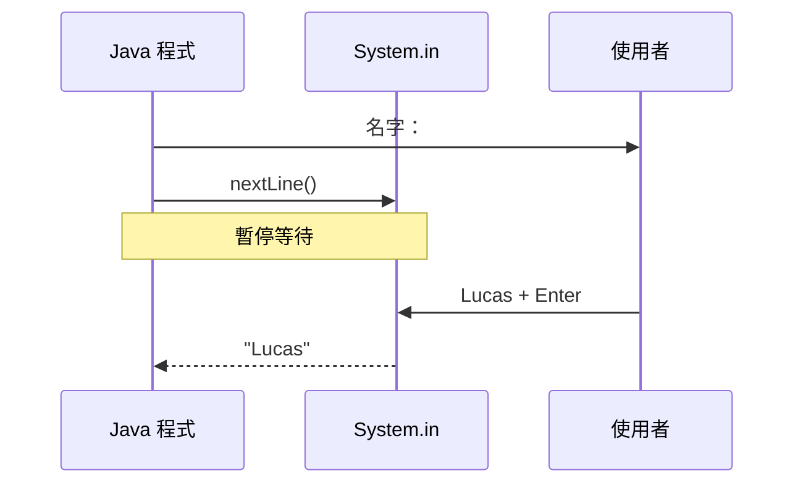

<div class="cover-glow"></div>
<div class="relative z-10">
  <div v-motion :initial="{ y: -20, opacity: 0 }" :enter="{ y: 0, opacity: 1 }" class="kicker">$ java InputLab --mode demo</div>
  <h1 v-motion :initial="{ y: 24, opacity: 0 }" :enter="{ y: 0, opacity: 1, transition: { delay: 180 } }">
    <span class="text-[#5382A1]">Scanner</span> 與 <span class="text-[#E76F00]">String[] args</span>
  </h1>
  <p class="text-xl text-gray-300 mt-4 font-mono">// 分清「啟動前」與「執行中」</p>
  <div class="mt-14 grid grid-cols-2 gap-5 text-sm">
    <div v-click class="concept-card blue"><b>args</b><br><span>啟動時一次帶入</span></div>
    <div v-click class="concept-card orange"><b>Scanner</b><br><span>執行中逐次讀取</span></div>
  </div>
</div>

<!--
開場先不要談 API。請大家只記住一條時間界線：程式啟動。
界線左邊是啟動參數，右邊才是 Scanner 的互動輸入。
-->

---
layout: default
---

# 先分類：它在哪個時間點出現？

<div class="grid grid-cols-2 gap-5 mt-6">
  <div class="drop-zone blue">
    <div class="font-bold text-[#79c0ff]">🚀 啟動程式時</div>
    <div v-click class="quiz-chip">輸出檔案路徑</div>
    <div v-click class="quiz-chip">--debug</div>
  </div>
  <div class="drop-zone orange">
    <div class="font-bold text-[#ffa657]">⌨️ 程式執行中</div>
    <div v-click class="quiz-chip">玩家輸入答案</div>
    <div v-click class="quiz-chip">重複詢問下一筆資料</div>
  </div>
</div>

<div v-click class="callout mt-6">判斷關鍵不是「文字或數字」，而是<b>輸入時機</b>。</div>

<!--
先遮住答案，請學員口頭分類四個情境，再逐項揭曉。
檔案路徑也可以互動詢問；這題問的是常見設計，而不是唯一寫法。
-->

---
layout: default
---

# 一條輸入時間軸

<div class="timeline mt-14">
  <div v-click class="time-node"><b>Shell</b><span>輸入 java A --debug</span></div>
  <div v-click class="time-arrow">→</div>
  <div v-click class="time-node hot"><b>JVM 啟動</b><span>建立 args[]</span></div>
  <div v-click class="time-arrow">→</div>
  <div v-click class="time-node"><b>main()</b><span>程式開始跑</span></div>
  <div v-click class="time-arrow">→</div>
  <div v-click class="time-node orange"><b>nextLine()</b><span>等待使用者</span></div>
</div>

<div class="grid grid-cols-2 gap-4 mt-12 text-sm">
  <div v-click class="concept-card blue">args：啟動後內容固定</div>
  <div v-click class="concept-card orange">Scanner：每次讀取都可能等待</div>
</div>

<!--
沿箭頭逐段說明。args 不是在 main 裡「問」使用者，而是 JVM 呼叫 main 時已經傳入。
Scanner 只有執行到讀取方法時才會阻塞。
-->

---
layout: two-cols
layoutClass: gap-8
---

# String[] args

```java {1|2-4|5-7|all}
public static void main(String[] args) {
    if (args.length == 0) {
        System.out.println("缺少名字");
        return;
    }
    System.out.println("Hello " + args[0]);
}
```

::right::

## 啟動方式

<div class="terminal mt-5">
<span class="muted">$</span> java A Lucas<br>
<span class="green">Hello Lucas</span>
</div>

<div v-click class="callout mt-5">
永遠先檢查 <code>args.length</code>，再取索引。
</div>

<!--
提醒 main 的參數名稱可以改，但型別與方法簽名必須符合入口點規則。
示範不帶參數時，保護條件避免 ArrayIndexOutOfBoundsException。
-->

---
layout: default
---

# 程式碼如何「變成」安全版本

````md magic-move {lines: true}
```java
System.out.println("Hello " + args[0]);
```

```java
if (args.length > 0) {
    System.out.println("Hello " + args[0]);
}
```

```java
String name = args.length > 0 ? args[0] : "guest";
System.out.println("Hello " + name);
```
````

<div v-click class="callout mt-4">Magic Move 呈現的是程式碼演進；每一步仍要能獨立解釋。</div>

<!--
第一版會在空參數時失敗；第二版避免例外但沒有輸出；第三版給預設值。
請強調這是三種設計選擇，不是語法花招。
-->

---
layout: two-cols
layoutClass: gap-6
---

# Scanner：執行中讀取

```java {1|4|5-7|8|all}
import java.util.Scanner;

public static void main(String[] args) {
    Scanner in = new Scanner(System.in);
    System.out.print("名字：");
    String name = in.nextLine();
    System.out.println("Hello " + name);
}
```

::right::



<!--
Scanner 包住 System.in，nextLine 讀到換行符號之前的內容。
不要把 close 當成這頁焦點；大型程式關閉 System.in 後通常不能再讀取。
-->

---
layout: default
---

# 經典陷阱：nextInt() + nextLine()

````md magic-move {lines: true}
```java
System.out.print("年齡：");
int age = in.nextInt();
System.out.print("姓名：");
String name = in.nextLine(); // 讀到剩下的換行
```

```java
System.out.print("年齡：");
int age = in.nextInt();
in.nextLine();               // 消耗換行
System.out.print("姓名：");
String name = in.nextLine();
```

```java
System.out.print("年齡：");
int age = Integer.parseInt(in.nextLine());
System.out.print("姓名：");
String name = in.nextLine(); // 統一整行讀取
```
````

<div v-click class="callout mt-3">推薦初學階段：<b>全部 nextLine，再自行轉型與驗證</b>。</div>

<!--
nextInt 只取走數字 token，不會取走按下 Enter 產生的換行。
第二版能修正；第三版讓輸入策略一致，也更容易顯示友善錯誤。
-->

---
layout: two-cols
layoutClass: gap-7
---

# 可編輯，但不是執行器

```java {monaco}
import java.util.Scanner;

class InputLab {
  public static void main(String[] args) {
    Scanner in = new Scanner(System.in);
    int age = Integer.parseInt(in.nextLine());
    System.out.println(age + 1);
  }
}
```

::right::

<div class="concept-card orange mt-12">
  <b>Monaco 編輯區</b>
  <ul class="mt-3 text-sm text-gray-300">
    <li>可修改、選取、練習重構</li>
    <li>可能提供語法編輯能力</li>
    <li class="text-[#fca5a5]">此簡報沒有 Java runtime，不會執行</li>
  </ul>
</div>

<!--
請學員把變數改名，或加上 try/catch。
明確說明這只是 Monaco 編輯器；要執行仍需 JDK、線上 IDE 或課堂環境。
-->

---
layout: default
---

# 親手驗證兩種輸入

<InputCompare />

<div v-click class="callout mt-3">
鍵盤：左右鍵切換分頁，Enter 驗證；最近三次結果可重播。
</div>

<!--
先在 args 模式輸入多個詞，觀察切割後的索引；再切 Scanner 模式。
故意送空字串展示錯誤狀態，最後用歷程重播，說明「重跑」與「繼續輸入」的差異。
-->

---
layout: default
---

# 設計題：該選哪一個？

<div class="grid grid-cols-2 gap-4 mt-6">
  <div v-click class="scenario"><b>批次轉檔</b><span>輸入路徑、輸出格式</span><strong>args</strong></div>
  <div v-click class="scenario"><b>文字冒險</b><span>每回合選動作</span><strong>Scanner</strong></div>
  <div v-click class="scenario"><b>啟動模式</b><span>--safe / --verbose</span><strong>args</strong></div>
  <div v-click class="scenario"><b>註冊表單</b><span>逐欄詢問資料</span><strong>Scanner</strong></div>
</div>

<div v-click class="callout mt-5">同一個程式可以同時使用：args 負責設定，Scanner 負責互動。</div>

<!--
逐題請學員先投票，再揭曉右下角答案。
實務上也可能使用 GUI、檔案或網路；此處只比較這兩種課堂工具。
-->

---
layout: default
---

# 放在一起：設定 + 互動

```java {1-3|5-7|9-12|all}
String mode = args.length > 0
    ? args[0]
    : "normal";

Scanner in = new Scanner(System.in);
System.out.print("你的名字：");
String name = in.nextLine();

if (name.isBlank()) {
    System.err.println("名字不可空白");
    return;
}
System.out.printf("[%s] Hello %s%n", mode, name);
```

<!--
mode 在啟動後不再改變；name 在程式跑到 nextLine 時才取得。
最後補上最基本的空白驗證，連結到互動元件中的錯誤狀態。
-->

---
layout: default
---

# 常見誤解快問快答

<div class="space-y-3 mt-5 text-sm">
  <div v-click class="qa"><b>args 是 Scanner 的縮寫？</b><span>不是；args 是 main 收到的字串陣列。</span></div>
  <div v-click class="qa"><b>nextInt 會吃掉 Enter？</b><span>不會；換行仍留在輸入緩衝。</span></div>
  <div v-click class="qa"><b>Monaco 的 Run 在哪裡？</b><span>本 deck 只提供編輯，不提供 Java 執行環境。</span></div>
  <div v-click class="qa"><b>Scanner 輸入一定來自鍵盤？</b><span>不一定；Scanner 也能讀字串或檔案。</span></div>
</div>

<!--
這頁用快速節奏檢核。每題先只顯示題目，再點一下揭示整張卡。
最後一題為後續 I/O 課程留伏筆。
-->

---
layout: center
class: text-center
---

# 一句話帶走

<div class="text-2xl mt-10 font-mono">
<span class="text-[#79c0ff]">args</span> 在啟動線之前，
<span class="text-[#ffa657]">Scanner</span> 在啟動線之後。
</div>

<div v-click class="mt-12 text-gray-400">先判斷時間點，再選 API。</div>

<!--
請學員合上筆記，用自己的話重述這句。
若能正確說明 nextInt 與 nextLine 的換行問題，本節目標就達成。
-->

---
layout: end
class: text-center
---

# 謝謝

<p class="text-gray-400 mt-5">下一步：輸入驗證、例外處理、檔案 I/O</p>
<div class="kicker mt-10">$ java InputLab --practice</div>

<!--
收尾並邀請提問。若現場有 JDK，可把 Monaco 中的版本複製到實際環境測試。
匯出 PDF 時互動會呈現靜態初始狀態，講者備註可另行保留。
-->
