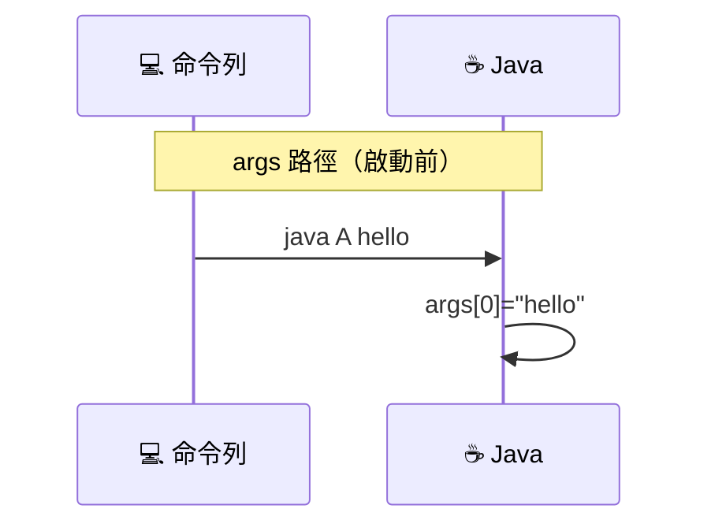
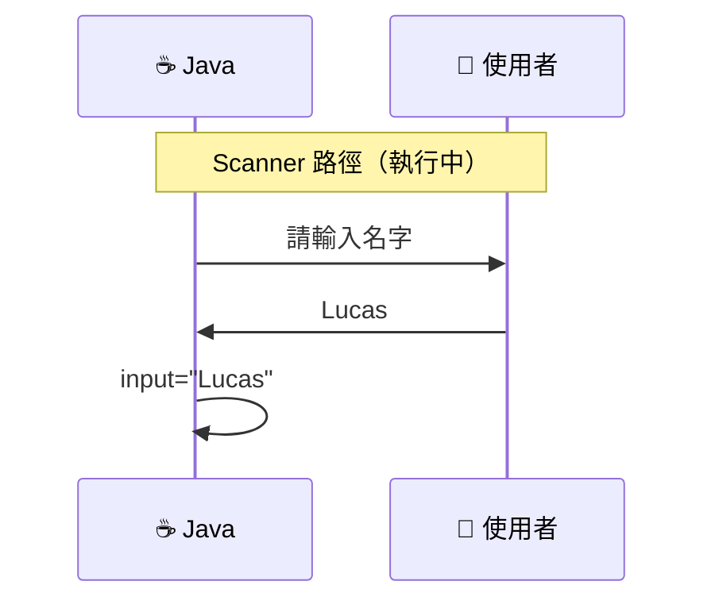

<div
  v-motion
  :initial="{ opacity: 0, scale: 0.9 }"
  :enter="{ opacity: 1, scale: 1, transition: { duration: 600 } }"
  class="absolute inset-0 bg-gradient-to-br from-[#0d1117] via-[#0d1117] to-[#1a2332]"
></div>

<div class="relative z-10">
  <div
    v-motion
    :initial="{ y: -20, opacity: 0 }"
    :enter="{ y: 0, opacity: 1, transition: { delay: 200, duration: 500 } }"
    class="font-mono text-sm text-[#7ee787] opacity-70 mb-6"
  >
    <span class="text-gray-500">$</span> java A hello world
  </div>

  <h1
    v-motion
    :initial="{ y: 30, opacity: 0 }"
    :enter="{ y: 0, opacity: 1, transition: { delay: 350, duration: 500 } }"
    class="text-5xl font-bold"
  >
    <span class="text-[#5382A1]">Scanner</span> <span class="text-white">與</span> <span class="text-[#E76F00]">String[] args</span>
  </h1>

  <p
    v-motion
    :initial="{ y: 30, opacity: 0 }"
    :enter="{ y: 0, opacity: 1, transition: { delay: 500, duration: 500 } }"
    class="text-xl text-gray-300 mt-4 font-mono"
  >
    <span class="text-gray-500">//</span> 兩種輸入方式，用途完全不同
  </p>

  <div
    v-motion
    :initial="{ y: 30, opacity: 0 }"
    :enter="{ y: 0, opacity: 1, transition: { delay: 700, duration: 500 } }"
    class="mt-16 font-mono text-sm text-gray-500 border-l-2 border-[#5382A1]/40 pl-4"
  >
    <p>
      <span class="text-[#E76F00]">args[0]</span> = <span class="text-[#7ee787]">"hello"</span>
      <span class="text-gray-600 ml-4">← 啟動時就確定</span>
    </p>
    <p class="mt-2">
      <span class="text-[#5382A1]">Scanner</span>.nextLine() <span class="text-gray-600">← 執行中等待輸入</span>
    </p>
  </div>

  <div
    v-motion
    :initial="{ opacity: 0 }"
    :enter="{ opacity: 1, transition: { delay: 1000, duration: 400 } }"
    class="mt-8 flex items-center gap-3 font-mono text-xs text-gray-600"
  >
    <carbon-location class="text-[#5382A1]" />
    <span>LucasHsu.dev — 2026</span>
    <carbon-time class="ml-4 text-[#E76F00]" />
    <span>約 20 分鐘</span>
  </div>
</div>

<!--
歡迎！今天的主題是 Java 兩種輸入方式：String[] args 和 Scanner。
很多初學者會混淆這兩者，其實它們的用途完全不同。
-->

---
layout: default
hideInToc: true
---

<div class="font-mono text-xs text-gray-500 mb-4">
  <span class="text-[#7ee787]">$</span> cat agenda.md
</div>

# 今日大綱

<div
  v-motion
  :initial="{ x: -20, opacity: 0 }"
  :enter="{ x: 0, opacity: 1, transition: { delay: 200 } }"
>
  <Toc maxDepth="1" />
</div>

<div v-click class="mt-8 p-4 bg-gradient-to-r from-[#5382A1]/10 to-transparent rounded-lg border border-[#5382A1]/30 text-sm">
  <span class="font-bold text-[#5382A1]">💡 核心觀念</span><br/>
  一個是「程式啟動前就給好的」，一個是「程式跑起來才跟你要的」。
</div>

---
layout: section
transition: fade
---

<div class="font-mono text-[#E76F00] text-sm mb-2">PART 01</div>

# String[] args

<p class="text-gray-400 text-lg font-mono mt-2">命令列參數 — 靜態輸入</p>

---
transition: slide-up
---

# 什麼是命令列參數？

`String[] args` 是 **main 方法的固定簽名**，用來接收程式啟動時從命令列傳入的參數：

<div class="grid grid-cols-2 gap-6 mt-6">

<div v-click="1" class="p-5 rounded-lg border border-[#5382A1]/40 bg-[#5382A1]/5">
  <div class="font-mono text-lg text-[#5382A1] mb-2">靜態輸入</div>
  <div class="text-sm text-gray-400">程式開始執行前就已經確定的值</div>
</div>

<div v-click="2" class="p-5 rounded-lg border border-[#E76F00]/40 bg-[#E76F00]/5">
  <div class="font-mono text-lg text-[#E76F00] mb-2">命令列傳遞</div>
  <div class="text-sm text-gray-400">透過終端機在啟動時傳入</div>
</div>

</div>

<div v-click="3" class="mt-8 font-mono text-sm bg-[#0d1117] p-4 rounded-lg border border-gray-700">
  <span class="text-gray-500">$</span> java A <span class="text-[#7ee787]">hello</span> <span class="text-[#7ee787]">world</span><br/>
  <span class="text-gray-600 mt-2 block">args[0] = "hello" &nbsp;·&nbsp; args[1] = "world"</span>
</div>

---

# 命令列參數範例

```java {1-5|all}
public static void main(String[] args) {
    if (args.length > 0) {
        System.out.println("Hello " + args[0]);
    }
}
```

<div v-click class="mt-4 grid grid-cols-2 gap-4">

<div class="p-4 rounded-lg bg-[#0d1117] border border-gray-700 font-mono text-sm">
  <span class="text-gray-500">$</span> java A<br/>
  <span class="text-gray-600">（無輸出，args 為空）</span>
</div>

<div class="p-4 rounded-lg bg-[#0d1117] border border-gray-700 font-mono text-sm">
  <span class="text-gray-500">$</span> java A <span class="text-[#7ee787]">Lucas</span><br/>
  <span class="text-[#E76F00]">Hello Lucas</span>
</div>

</div>

<div v-click="2" class="mt-4 p-3 bg-amber-500/10 rounded-lg border border-amber-500/30 text-sm">
⚠️ 即使不使用 args，main 方法的簽名也<b>必須保留</b> <code>String[] args</code>
</div>

---
layout: section
transition: fade
---

<div class="font-mono text-[#E76F00] text-sm mb-2">PART 02</div>

# Scanner

<p class="text-gray-400 text-lg font-mono mt-2">動態輸入 — 執行中互動</p>

---
transition: slide-up
---

# Scanner 的用途

`Scanner` 讓程式在**執行過程中**與使用者互動，暫停等待輸入：

<div class="grid grid-cols-3 gap-4 mt-8">

<div v-click="1" class="p-4 rounded-lg border border-[#7ee787]/40 bg-[#7ee787]/5 text-center">
<div class="text-2xl mb-2">⏸️</div>
<div class="text-sm font-bold text-[#7ee787]">暫停等待</div>
<div class="text-xs text-gray-500 mt-1">程式會停下來等使用者</div>
</div>

<div v-click="2" class="p-4 rounded-lg border border-[#5382A1]/40 bg-[#5382A1]/5 text-center">
<div class="text-2xl mb-2">⌨️</div>
<div class="text-sm font-bold text-[#5382A1]">即時輸入</div>
<div class="text-xs text-gray-500 mt-1">從控制台讀取內容</div>
</div>

<div v-click="3" class="p-4 rounded-lg border border-[#E76F00]/40 bg-[#E76F00]/5 text-center">
<div class="text-2xl mb-2">🔄</div>
<div class="text-sm font-bold text-[#E76F00]">動態互動</div>
<div class="text-xs text-gray-500 mt-1">可多次詢問不同資料</div>
</div>

</div>

---

# Scanner 範例

```java {1-7|all}
import java.util.Scanner;

public static void main(String[] args) {
    Scanner scanner = new Scanner(System.in);
    System.out.print("請輸入名字：");
    String input = scanner.nextLine();
    System.out.println("Hello " + input);
    scanner.close();
}
```

<div v-click class="mt-4 font-mono text-sm bg-[#0d1117] p-4 rounded-lg border border-gray-700">
  <span class="text-gray-500">執行流程：</span><br/>
  1. 印出 <span class="text-[#7ee787]">"請輸入名字："</span><br/>
  2. <span class="text-[#E76F00]">等待使用者輸入</span> ← 程式暫停<br/>
  3. 讀取輸入並印出結果
</div>

<div v-click="2" class="mt-4 p-3 bg-[#5382A1]/10 rounded-lg border border-[#5382A1]/30 text-sm">
💡 記得使用完畢後呼叫 <code>scanner.close()</code> 釋放資源
</div>

---
layout: section
transition: fade
---

<div class="font-mono text-[#E76F00] text-sm mb-2">PART 03</div>

# 兩者比較

<p class="text-gray-400 text-lg font-mono mt-2">同一個程式，兩種輸入時機</p>

---
layout: two-cols
layoutClass: gap-8
transition: slide-up
---

# 差異對照

| 特性 | String[] args | Scanner |
| ---- | ------------- | ------- |
| 輸入時機 | 程式啟動前 | 程式執行中 |
| 輸入方式 | 命令列傳遞 | 控制台互動 |
| 是否等待 | 否 | 是 |
| 可否修改 | 啟動後固定 | 每次執行可不同 |

::right::

<div v-click="1">

## 互動模擬

<InputCompare />

</div>

<div v-click="2" class="mt-4 p-3 bg-amber-500/10 rounded-lg border border-amber-500/30 text-sm">
🔑 切換上方分頁，親自感受兩種輸入的差異
</div>

---
layout: two-cols
layoutClass: gap-6 items-center
transition: slide-up
---

# 資料的流向



<div v-click class="mt-2 p-2 bg-[#5382A1]/10 rounded-lg border border-[#5382A1]/30 text-xs leading-snug">
📡 args 在程式「進場」時就帶好
</div>

::right::



<div v-click class="mt-2 p-2 bg-[#E76F00]/10 rounded-lg border border-[#E76F00]/30 text-xs leading-snug">
📡 Scanner 是程式「跑起來」才跟你要
</div>

---
layout: section
transition: fade
---

<div class="font-mono text-[#E76F00] text-sm mb-2">PART 04</div>

# 為什麼兩者都存在？

<p class="text-gray-400 text-lg font-mono mt-2">不是重複，而是互補</p>

---

# 它們可以同時使用

```java {1-10|all}
import java.util.Scanner;

public static void main(String[] args) {
    // args：啟動時傳入的設定
    String mode = args.length > 0 ? args[0] : "normal";

    // Scanner：執行中跟使用者互動
    Scanner scanner = new Scanner(System.in);
    System.out.print("請輸入名字：");
    String name = scanner.nextLine();
    System.out.println("[" + mode + "] Hello " + name);
    scanner.close();
}
```

<div v-click class="mt-4 grid grid-cols-2 gap-4">

<div class="p-4 rounded-lg border border-[#5382A1]/40 bg-[#5382A1]/5 text-sm">
  <span class="font-bold text-[#5382A1]">args</span> → 模式設定、檔案路徑、批次參數
</div>

<div class="p-4 rounded-lg border border-[#E76F00]/40 bg-[#E76F00]/5 text-sm">
  <span class="font-bold text-[#E76F00]">Scanner</span> → 互動式問答、表單輸入
</div>

</div>

---

# 今日重點回顧

<div class="grid grid-cols-2 gap-4 mt-6">

<div v-click="1" class="p-4 rounded-lg border border-[#5382A1]/40">
  <div class="font-bold text-[#5382A1] mb-2">String[] args</div>
  <ul class="text-sm text-gray-400 space-y-1">
    <li>命令列參數，啟動前確定</li>
    <li>main 方法固定簽名，必須存在</li>
    <li>適合批次處理、腳本傳參</li>
  </ul>
</div>

<div v-click="2" class="p-4 rounded-lg border border-[#E76F00]/40">
  <div class="font-bold text-[#E76F00] mb-2">Scanner</div>
  <ul class="text-sm text-gray-400 space-y-1">
    <li>動態輸入，執行中互動</li>
    <li>程式暫停等待使用者</li>
    <li>適合互動式應用、練習題</li>
  </ul>
</div>

</div>

<div v-click="3" class="mt-8 p-4 bg-gradient-to-r from-[#5382A1]/10 to-[#E76F00]/10 rounded-lg border border-gray-700 text-sm text-center">
兩者服務<b>不同的輸入需求</b>，可以同時存在於同一個程式中
</div>

---
layout: end
class: text-center
---

# 謝謝！

<p class="text-gray-400 mt-4">延伸閱讀：<a href="https://lucashsu95.github.io/LucasHsu.dev/java/basic/什麼是固定簽名" class="text-[#5382A1]">什麼是固定簽名</a></p>

<div class="mt-8 font-mono text-sm text-gray-600">
  <span class="text-[#7ee787]">$</span> java A --learn-more
</div>
