<div class="absolute inset-0 bg-gradient-to-br from-[#0d1117] via-[#0d1117] to-[#26240f]"></div>

<div class="relative z-10">
  <p class="font-mono text-sm text-[#7ee787] mb-6">$ node breakfast.js --mode=async</p>
  <h1 class="text-5xl">
    <span class="accent-brand">JavaScript</span>
    <span class="text-white"> 非同步</span>
  </h1>
  <p class="mt-4 text-xl text-gray-300 font-mono">
    <span class="muted">//</span> 用一頓早餐，搞懂 Promise 與 async/await
  </p>
  <div class="mt-14 grid grid-cols-4 gap-3 font-mono text-sm text-center">
    <div class="concept-card"><strong>sync</strong><br><span class="muted">排隊等待</span></div>
    <div class="concept-card"><strong>promise</strong><br><span class="muted">未來值容器</span></div>
    <div class="concept-card"><strong>await</strong><br><span class="muted">同步的外表</span></div>
    <div class="concept-card"><strong>event loop</strong><br><span class="muted">幕後調度</span></div>
  </div>
</div>

<!--
開場：JS 是單執行緒，卻要同時處理網路、計時器、使用者操作——非同步就是它的生存之道。
預計 30–40 分鐘。
-->

---
layout: default
hideInToc: true
---

<p class="font-mono text-xs text-gray-500"><span class="accent-green">$</span> cat menu.md</p>

# 今日菜單

<div class="grid grid-cols-2 gap-4 mt-7">
  <div v-click class="concept-card"><strong>01 / 早餐比喻</strong><br><span class="muted">同步阻塞 vs 非同步開工</span></div>
  <div v-click class="concept-card"><strong>02 / Promise</strong><br><span class="muted">三種狀態、then/catch、逾時保護</span></div>
  <div v-click class="concept-card"><strong>03 / async & await</strong><br><span class="muted">語法糖、串行 vs 並行</span></div>
  <div v-click class="concept-card"><strong>04 / Event Loop</strong><br><span class="muted">VIP 通道與執行順序測驗</span></div>
</div>

<div v-click class="mt-6 terminal-card text-sm">
  <span class="accent-orange">目標：</span>看懂任何一段 async 程式碼的「實際執行順序」。
</div>

---
layout: section
transition: fade
---

<p class="font-mono accent-orange">PART 01</p>

# 早餐比喻

<p class="font-mono muted">同步：等咖啡煮好才烤吐司</p>

---
layout: two-cols
layoutClass: gap-8
---

# 同步：主執行緒被鎖死

```js {all|3-4|all}
function makeCoffee() {
    console.log("開始煮咖啡...");
    const start = Date.now();
    while (Date.now() - start < 2000) {} // 阻塞！
    console.log("咖啡好了！");
}

function prepareBreakfastSync() {
    makeCoffee(); // 2s
    makeToast();  // 1.5s
    fryEgg();     // 1s
}
```

::right::

<div class="terminal-card mt-14">
  <p class="terminal-label">CONSOLE — 4.5s</p>
  <div v-click>開始煮咖啡...</div>
  <div v-click>咖啡好了！</div>
  <div v-click>開始烤吐司...</div>
  <div v-click>吐司烤好了！</div>
  <div v-click class="accent-orange">（這段期間頁面完全卡死）</div>
</div>

<!--
while 迴圈霸佔主執行緒：按鈕點不動、動畫停格。這就是「阻塞」。
-->

---
layout: two-cols
layoutClass: gap-8
---

# 非同步：全部同時開工

```js {all|2-7|11-14|all}
function makeCoffee() {
    return new Promise((resolve) => {
        console.log("開始煮咖啡...");
        setTimeout(() => {
            resolve("咖啡好了！");
        }, 2000); // 交給背景計時
    });
}

async function prepareBreakfastAsync() {
    const coffee = await makeCoffee();
    console.log(coffee);
    // ...吐司、蛋
}
```

::right::

<div class="terminal-card mt-14">
  <p class="terminal-label">CONSOLE — ~2s</p>
  <div v-click>開始煮咖啡...</div>
  <div v-click>開始烤吐司...</div>
  <div v-click>開始煎蛋...</div>
  <div v-click class="accent-green">咖啡好了！吐司烤好了！蛋煎好了！</div>
  <div v-click class="mt-2">主執行緒全程<span class="accent-brand">沒有被卡住</span></div>
</div>

<!--
setTimeout 是非同步函數：把計時交給背景，主執行緒繼續往下跑。
-->

---
---

# 親眼比一次

<BreakfastRace />

<!--
先跑同步（4.5 秒）再跑非同步（2 秒）。
重點：非同步的總時間 = 最慢的那件事，不是所有事情的總和。
-->

---
layout: section
transition: fade
---

<p class="font-mono accent-orange">PART 02</p>

# Promise

<p class="font-mono muted">一個裝著「未來值」的容器</p>

---
---

# 三種狀態，單向變化

<div class="grid grid-cols-3 gap-4 mt-8 text-center">
  <div v-click class="concept-card"><strong>pending</strong><br><span class="muted">待定：還在煮</span></div>
  <div v-click class="concept-card"><strong>fulfilled</strong><br><span class="muted">已解決：resolve("成功")</span></div>
  <div v-click class="concept-card"><strong>rejected</strong><br><span class="muted">已拒絕：reject("失敗")</span></div>
</div>

```js {all|2|4-8|all}
let myPromise = new Promise((resolve, reject) => {
    let success = true;
    setTimeout(() => {
        if (success) resolve("成功！");
        else reject("失敗！");
    }, 2000);
});

myPromise.then(result => console.log(result))
         .catch(error => console.log(error));
```

<!--
狀態一旦離開 pending 就不可逆。then 收 resolve、catch 收 reject。
-->

---
---

# 逾時保護：Promise.race + AbortController

```js {1|3-6|8|10-13|all}
const delay = (ms) => new Promise((resolve) => setTimeout(resolve, ms));

const fetchWithTimeout = (url, { timeout = 3000 } = {}) => {
    const controller = new AbortController();
    const timer = delay(timeout).then(() => controller.abort());

    const request = fetch(url, { signal: controller.signal });

    return Promise.race([request, timer]).catch((error) => {
        if (error.name === "AbortError") return Promise.reject("請求逾時");
        return Promise.reject(error.message || "未知錯誤");
    });
};
```

<div class="mt-4 grid grid-cols-2 gap-4 text-sm">
  <div v-click class="concept-card"><strong>Promise.race</strong><br><span class="muted">誰先完成聽誰的 —— 拿來做逾時</span></div>
  <div v-click class="concept-card"><strong>AbortController</strong><br><span class="muted">真的取消請求，不浪費資源</span></div>
</div>

---
layout: section
transition: fade
---

<p class="font-mono accent-orange">PART 03</p>

# async / await

<p class="font-mono muted">非同步的裡子，同步的外表</p>

---
transition: fade
---

# then 鏈 → await

````md magic-move
```js
fetch("https://hp-api.onrender.com/api/spells")
    .then((res) => res.json())
    .then((data) => {
        console.log("spells", data.length);
    })
    .catch((err) => {
        console.error(err.message);
    });
```

```js
async function loadSpells() {
    try {
        const res = await fetch("https://hp-api.onrender.com/api/spells");
        const data = await res.json();
        console.log("spells", data.length);
    } catch (err) {
        console.error(err.message);
    }
}
```
````

<div v-click class="mt-5 terminal-card text-sm">
  兩者<span class="accent-brand">完全等價</span>：await 只是把 then 的後續「攤平」成同步的樣子。
  長流程用 async/await，簡單鏈結用 then。
</div>

---
layout: two-cols
layoutClass: gap-7
---

# 串行：有相依才排隊

```js
async function serial() {
    const coffee = await makeCoffee();
    const toast = await makeToast();
    return [coffee, toast];
}
```

<div v-click class="mt-4 terminal-card text-sm">
  <p class="terminal-label">TOTAL TIME</p>
  ≈ 所有任務時間<span class="accent-orange">總和</span>（2 + 1.5 = 3.5s）
</div>

<div v-click class="mt-3 concept-card text-sm">
  <strong>適用</strong><br><span class="muted">先拿 token 再打 API —— 後者依賴前者</span>
</div>

::right::

# 並行：沒相依就同開

```js
async function parallel() {
    const [coffee, toast] = await Promise.all([
        makeCoffee(),
        makeToast(),
    ]);
    return [coffee, toast];
}
```

<div v-click class="mt-4 terminal-card text-sm">
  <p class="terminal-label">TOTAL TIME</p>
  ≈ <span class="accent-green">最慢任務</span>（max(2, 1.5) = 2s）
</div>

<div v-click class="mt-3 concept-card text-sm">
  <strong>適用</strong><br><span class="muted">多支互不相干的列表 API</span>
</div>

<!--
最常見的效能 bug：把可以並行的請求寫成串行 await。
-->

---
---

# Promise.all vs allSettled

| | `Promise.all` | `Promise.allSettled` |
| --- | --- | --- |
| 一個失敗時 | 立刻 reject，全軍覆沒 | 照樣等所有完成 |
| 回傳 | 值的陣列 | `{status, value/reason}` 陣列 |
| 適合 | 缺一不可的資料 | 「盡量收集」的儀表板 |

<div v-click class="mt-6 terminal-card text-sm">
  <span class="accent-green">$</span> 面試常考：all 是「全有或全無」，allSettled 是「盡力而為」。
</div>

---
layout: section
transition: fade
---

<p class="font-mono accent-orange">PART 04</p>

# Event Loop

<p class="font-mono muted">微任務是 VIP 通道，宏任務排普通隊</p>

---
---

# 幕後調度：兩條佇列

```mermaid {theme: 'dark', scale: 0.55}
flowchart LR
  CS["Call Stack<br/>同步代碼跑完清空"] --> EL{Event Loop}
  EL -->|"1. 先清空"| MT["Microtask Queue（VIP）<br/>Promise.then / await 後續"]
  EL -->|"2. 才輪到"| TQ["Task Queue（普通）<br/>setTimeout / setInterval"]
  MT --> CS
  TQ --> CS
  style MT fill:#13251a,stroke:#7ee787
  style TQ fill:#2d1c13,stroke:#e76f00
  style CS fill:#13202a,stroke:#5382a1
```



<div class="mt-5 grid grid-cols-2 gap-4 text-sm">
  <div v-click class="concept-card"><strong>微任務（VIP）</strong><br><span class="muted">每回合先清空整條佇列</span></div>
  <div v-click class="concept-card"><strong>宏任務（普通）</strong><br><span class="muted">微任務全空後，一次取一個</span></div>
</div>

<!--
所以 setTimeout(cb, 0) 也不會「立刻」執行——它永遠排在微任務後面。
-->

---
---

# 執行順序測驗

```js
console.log("1");
setTimeout(() => console.log("2"), 0);
Promise.resolve().then(() => console.log("3"));
console.log("4");
```

<div class="mt-6">
  <div v-click class="terminal-card text-sm">
    <p class="terminal-label">ANSWER</p>
    <div>1 → 4（同步代碼先跑完，Call Stack 清空）</div>
    <div v-click class="mt-1">→ 3（微任務 VIP 通道優先）</div>
    <div v-click class="mt-1">→ 2（宏任務最後，即使延遲是 0）</div>
  </div>
</div>

<div v-click class="mt-5 text-center text-lg font-mono">
  輸出順序：<span class="accent-brand">1 → 4 → 3 → 2</span>
</div>

<!--
先讓學員猜再逐步揭示。錯最多的是 2 和 3 的順序。
-->

---
---

# 今日重點

<div class="grid grid-cols-2 gap-4 mt-5">
  <div v-click class="concept-card"><strong>非同步</strong><br><span class="muted">耗時工作交給背景，主流程不阻塞</span></div>
  <div v-click class="concept-card"><strong>Promise</strong><br><span class="muted">未來值容器：pending → fulfilled / rejected</span></div>
  <div v-click class="concept-card"><strong>串行 vs 並行</strong><br><span class="muted">有相依才 await 排隊，沒相依用 Promise.all</span></div>
  <div v-click class="concept-card"><strong>Event Loop</strong><br><span class="muted">微任務全清空，才輪到宏任務</span></div>
</div>

<div v-click class="mt-7 text-center text-lg font-mono">
  非同步的總時間 = <span class="accent-orange">最慢的那件事</span>，不是所有事的總和。
</div>

---
layout: end
class: text-center
---

# Breakfast served.

<p class="mt-5 font-mono muted">下一步：fetch 與 AbortController 的實戰練習題</p>

<div class="mt-10 terminal-card inline-block text-left text-sm">
  <div><span class="accent-green">$</span> node breakfast.js --mode=async</div>
  <div class="accent-orange mt-2">promise → await → race → event loop</div>
</div>

<!--
延伸閱讀回文章：fetch 教學、axios、MDN Event loop，與文章內三題實戰練習。
-->
