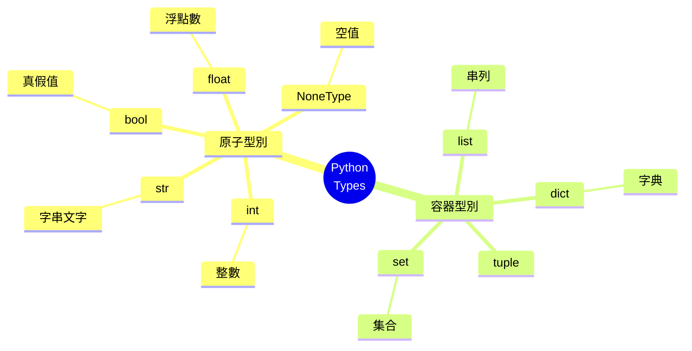
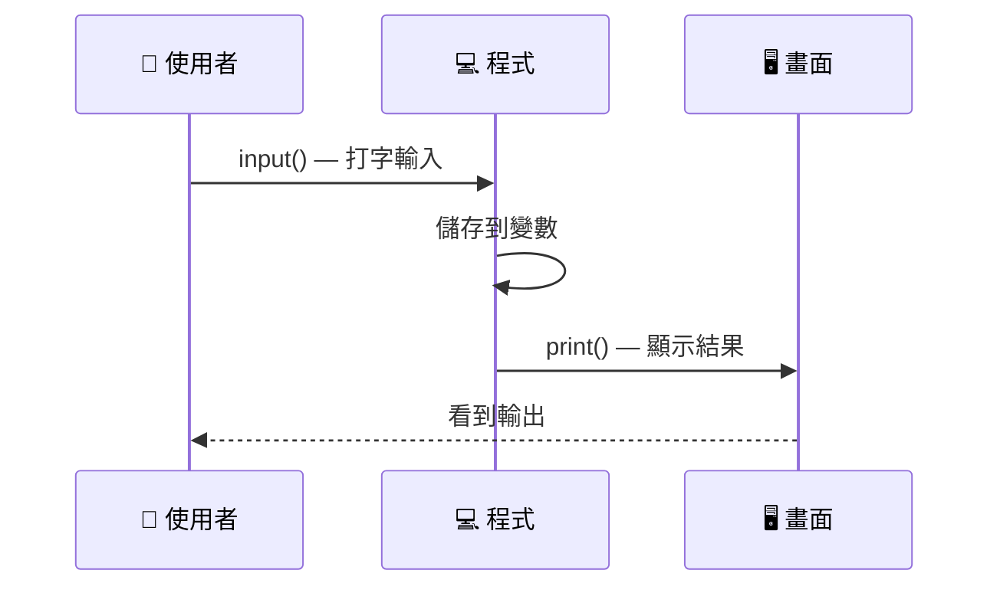

<div
  v-motion
  :initial="{ opacity: 0, scale: 0.9 }"
  :enter="{ opacity: 1, scale: 1, transition: { duration: 600 } }"
  class="absolute inset-0 bg-gradient-to-br from-[#0d1117] via-[#0d1117] to-[#13202c]"
></div>

<div class="relative z-10">
  <div
    v-motion
    :initial="{ y: -20, opacity: 0 }"
    :enter="{ y: 0, opacity: 1, transition: { delay: 200, duration: 500 } }"
    class="font-mono text-sm text-[#7ee787] opacity-70 mb-6"
  >
    <span class="text-gray-500">$</span> python3 day01.py
  </div>

  <h1
    v-motion
    :initial="{ y: 30, opacity: 0 }"
    :enter="{ y: 0, opacity: 1, transition: { delay: 350, duration: 500 } }"
    class="text-6xl font-bold"
  >
    <span class="text-[#4B8BBE]">Py</span><span class="text-[#FFD43B]">thon</span> <span class="text-white">Day01</span>
  </h1>

  <p
    v-motion
    :initial="{ y: 30, opacity: 0 }"
    :enter="{ y: 0, opacity: 1, transition: { delay: 500, duration: 500 } }"
    class="text-xl text-gray-300 mt-4 font-mono"
  >
    <span class="text-gray-500">#</span> 變數・型別・輸入輸出
  </p>

  <div
    v-motion
    :initial="{ y: 30, opacity: 0 }"
    :enter="{ y: 0, opacity: 1, transition: { delay: 700, duration: 500 } }"
    class="mt-20 font-mono text-sm text-gray-500 border-l-2 border-[#4B8BBE]/40 pl-4"
  >
    <p>
      <span class="text-[#FFD43B]">&gt;&gt;&gt;</span>
      print(<span class="text-[#7ee787]">"從今天開始，學會跟程式對話"</span>)
    </p>
    <p class="mt-1 text-gray-600">
      <span class="text-[#7ee787]">&nbsp;&nbsp;&nbsp;&nbsp;從今天開始，學會跟程式對話</span>
    </p>
  </div>

  <div
    v-motion
    :initial="{ opacity: 0 }"
    :enter="{ opacity: 1, transition: { delay: 1000, duration: 400 } }"
    class="mt-8 flex items-center gap-3 font-mono text-xs text-gray-600"
  >
    <carbon-location class="text-[#4B8BBE]" />
    <span>LucasHsu.dev — 2026</span>
    <carbon-time class="ml-4 text-[#FFD43B]" />
    <span>約 45 分鐘</span>
  </div>
</div>

<div class="abs-br m-6 flex gap-2 z-10">
  <a href="https://github.com" target="_blank" alt="GitHub" class="text-xl icon-btn opacity-50 !border-none !hover:text-white">
    <carbon-logo-github />
  </a>
</div>

<!--
歡迎來到 Python Day01！
今天的主軸：先建立「型別」的心智模型，再學變數、輸入輸出，最後用數學運算子跟條件判斷串起來。

不需要學生有任何程式基礎。今天的所有內容都是從零開始。
-->

---
layout: default
hideInToc: true
---

<div class="font-mono text-xs text-gray-500 mb-4">
  <span class="text-[#7ee787]">$</span> cat agenda.md
</div>

# 今日大綱

<div
  v-motion
  :initial="{ x: -20, opacity: 0 }"
  :enter="{ x: 0, opacity: 1, transition: { delay: 200 } }"
>
  <Toc maxDepth="1" />
</div>

<div v-click class="mt-8 p-4 bg-gradient-to-r from-[#4B8BBE]/10 to-transparent rounded-lg border border-[#4B8BBE]/30 text-sm">
  <span class="font-bold text-[#4B8BBE]">💡 今天的順序</span><br/>
  跟教科書不太一樣：我們先懂「資料長什麼樣子」，再學怎麼跟使用者要資料、怎麼把資料印出來。
</div>

<!--
今天的順序跟教科書不太一樣：我們先懂「資料長什麼樣子」，再學怎麼跟使用者要資料、怎麼把資料印出來。
這樣等一下講 input() 的時候，你才會懂為什麼它「永遠」回傳字串——因為你已經知道字串長什麼樣子了。
-->

---
layout: section
transition: fade
---

<div class="font-mono text-[#FFD43B] text-sm mb-2">PART 01</div>

# 資料型別

<p class="text-gray-400 text-lg font-mono mt-2">程式眼中的世界，只有幾種「形狀」</p>

---
transition: slide-up
---

# 一個容器，五種形狀

Python 把資料分成幾種基本「形狀」(type)，每種形狀能做的事情不一樣：

<div class="grid grid-cols-5 gap-3 mt-8">

<div v-click="1" class="p-4 rounded-lg border border-[#4B8BBE]/40 bg-[#4B8BBE]/5 text-center transition transform hover:scale-105">
<div class="text-2xl font-mono text-[#4B8BBE]">10</div>
<div class="text-xs text-gray-400 mt-2 font-mono">int</div>
<div class="text-xs text-gray-500">整數</div>
</div>

<div v-click="2" class="p-4 rounded-lg border border-[#FFD43B]/40 bg-[#FFD43B]/5 text-center transition transform hover:scale-105">
<div class="text-2xl font-mono text-[#FFD43B]">12.3</div>
<div class="text-xs text-gray-400 mt-2 font-mono">float</div>
<div class="text-xs text-gray-500">浮點數</div>
</div>

<div v-click="3" class="p-4 rounded-lg border border-[#7ee787]/40 bg-[#7ee787]/5 text-center transition transform hover:scale-105">
<div class="text-lg font-mono text-[#7ee787]">'hi'</div>
<div class="text-xs text-gray-400 mt-2 font-mono">str</div>
<div class="text-xs text-gray-500">字串</div>
</div>

<div v-click="4" class="p-4 rounded-lg border border-pink-400/40 bg-pink-400/5 text-center transition transform hover:scale-105">
<div class="text-lg font-mono text-pink-400">True</div>
<div class="text-xs text-gray-400 mt-2 font-mono">bool</div>
<div class="text-xs text-gray-500">布林</div>
</div>

<div v-click="5" class="p-4 rounded-lg border border-gray-500/40 bg-gray-500/5 text-center transition transform hover:scale-105">
<div class="text-lg font-mono text-gray-400">None</div>
<div class="text-xs text-gray-400 mt-2 font-mono">NoneType</div>
<div class="text-xs text-gray-500">空值</div>
</div>

</div>

<div v-click="6" class="mt-10 font-mono text-sm bg-[#0d1117] p-4 rounded-lg border border-gray-700">
  <span class="text-[#FFD43B]">&gt;&gt;&gt;</span> type(10) <span class="text-gray-500"># &lt;class 'int'&gt;</span><br/>
  <span class="text-[#FFD43B]">&gt;&gt;&gt;</span> type(<span class="text-[#7ee787]">'hi'</span>) <span class="text-gray-500"># &lt;class 'str'&gt;</span>
</div>

<!--
這頁是整堂課的地基。先讓學生對五種型別有畫面，後面所有內容都是在這五種形狀上做事情。
每張卡片都有 hover 放大效果增加互動感。
-->

---
transition: slide-up
---

# 型別的層級關係

資料型別可以分成兩大類：「原子」和「容器」——理解這個分類，後面的學習會更有方向：



<div v-click class="mt-2 p-3 bg-amber-500/10 rounded-lg border border-amber-500/30 text-sm">
🔑 今天只談<span class="font-bold text-amber-300">原子型別</span>（左半邊），容器型別是之後課程的主題
</div>

<!--
這頁用 mindmap 圖形化展示 Python 型別的層級關係。
讓學生對未來要學的內容也有個輪廓。
-->

---
transition: slide-up
---

# 看起來像，但不是同一種

這是初學者最容易踩的坑——**看起來一樣的資料，形狀不同就不能混用**：

<div class="p-4 bg-[#0d1117] rounded-lg border border-gray-700 text-sm font-mono">
  <span class="text-gray-500"># 引號決定型別</span><br/>
  <span class="text-[#FFD43B]">'123'</span><span class="text-gray-500"> ~ 字串</span><br/>
  <span class="text-[#4B8BBE]">123</span><span class="text-gray-500"> ~ 整數</span><br/>
  <span class="text-red-400">'123' == 123 → False</span>
</div>

<div class="grid grid-cols-2 gap-6 mt-4">

<div v-click="1" class="p-5 rounded-lg border border-[#7ee787]/40 bg-[#7ee787]/5">
  <div class="font-mono text-lg text-[#7ee787]">'123'</div>
  <div class="text-sm text-gray-400 mt-2">
    有引號包住 → <span class="font-bold text-[#7ee787]">字串</span>
  </div>
  <div class="text-xs text-gray-500 mt-1">電話、身分證字號常用這個</div>
</div>

<div v-click="2" class="p-5 rounded-lg border border-[#4B8BBE]/40 bg-[#4B8BBE]/5">
  <div class="font-mono text-lg text-[#4B8BBE]">123</div>
  <div class="text-sm text-gray-400 mt-2">
    沒有引號 → <span class="font-bold text-[#4B8BBE]">數字</span>
  </div>
  <div class="text-xs text-gray-500 mt-1">可以拿來做加減乘除</div>
</div>

</div>

<div v-click="3" class="mt-3 font-mono text-sm bg-[#0d1117] p-4 rounded-lg border border-gray-700">
  <span class="text-[#FFD43B]">&gt;&gt;&gt;</span> '123' == 123<br/>
  <span class="text-red-400">False</span> <span class="text-gray-500"># 形狀不同，永遠不相等</span>
</div>

<div v-click="4" class="mt-4 p-3 bg-amber-500/10 rounded-lg border border-amber-500/30 text-sm">
🔑 <span class="font-bold text-amber-300">記住這個結論</span>：等一下講 <code>input()</code> 時會用到它
</div>

<!--
這頁建立「引號決定型別」的心智模型。
從外觀上完全一樣的東西，在程式眼裡是完全不同的存在。

等第四部分講 input() 回來看這頁，學生就會懂了。
-->

---
layout: section
transition: fade
---

<div class="font-mono text-[#FFD43B] text-sm mb-2">PART 02</div>

# 變數

<p class="text-gray-400 text-lg font-mono mt-2">幫資料貼上一張可以重複使用的標籤</p>

---

# 變數宣告

用 `=` 把一個值「貼標籤」存起來，之後就能用這個名字取代它：

```python {1-5|7-10|all}
int_val = 10
float_val = 12.3
str_val = 'hello python'
boolean_val = True
nv = None

print(int_val, float_val, str_val, boolean_val)
print(type(int_val))   # <class 'int'>
print(type(str_val))   # <class 'str'>
print(nv)              # None
```

<div v-click class="mt-2 p-3 bg-[#4B8BBE]/10 rounded-lg border border-[#4B8BBE]/30 text-sm">
💡 變數名字是你取的，但型別是 Python 自己根據「值長什麼樣子」判斷出來的
</div>

<div v-click="2" class="mt-1 p-3 bg-purple-500/10 rounded-lg border border-purple-500/30 text-sm">
🤔 試試看在下方編輯器中修改變數的值，看看輸出怎麼變：
</div>

<div v-click="2">

```python {height: '160px'}
# ✏️ 試著修改這些值！
int_val = 10
float_val = 12.3
str_val = 'hello python'
boolean_val = True

print(int_val, float_val, str_val, boolean_val)
print(type(int_val))
```

</div>

<!--
強調：= 在這裡不是數學的「等於」，而是「把右邊的值貼上左邊的標籤」。

Monaco 編輯器讓學生可以立刻動手試，不用離開簡報。
-->

---

# 命名小提醒

<div class="grid grid-cols-2 gap-6 mt-6">

<div v-click="1" class="p-4 rounded-lg border border-[#7ee787]/40 bg-[#7ee787]/5">

### ✅ 好的命名

```python
age = 18
user_name = 'Lucas'
total_price = 299
```

語意清楚，看名字就懂用途

</div>

<div v-click="2" class="p-4 rounded-lg border border-red-400/40 bg-red-400/5">

### ❌ 避免這樣

```python
a = 18
x1 = 'Lucas'
data = 299
```

過幾天連自己都看不懂

</div>

</div>

<div v-click="3" class="mt-6 font-mono text-sm p-4 bg-[#0d1117] rounded-lg border border-gray-700">
  <span class="text-gray-500"># 慣例：變數名用小寫 + 底線</span>
  <br/>
  <span class="text-[#FFD43B]">&gt;&gt;&gt;</span> <span class="text-[#7ee787]">user_name</span> <span class="text-gray-500">← snake_case（Python 標準）</span>
  <br/>
  <span class="text-[#FFD43B]">&gt;&gt;&gt;</span> <span class="text-red-400">userName</span> <span class="text-gray-500">← camelCase（Python 不常用）</span>
</div>

<div v-click="4" class="mt-4 p-3 bg-amber-500/10 rounded-lg border border-amber-500/30 text-sm">
⚠️ 不能以數字開頭、不能包含特殊符號（除了 <code>_</code>）、不能是保留字（如 <code>if</code>, <code>for</code>, <code>while</code>）
</div>

---

# 進階：同時賦值

一次把多個變數「同時」貼上標籤：

::code-group

```python [同時賦值]
a, b = 10, 20
print(a)  # 10
print(b)  # 20
```

```python [交換變數]
a, b = b, a
print(a)  # 20  🔄 交換了！
print(b)  # 10
```

```python [相同值]
x = y = z = 0
print(x, y, z)  # 0 0 0
```

::

<div v-click class="mt-6 p-4 bg-gradient-to-r from-purple-500/10 to-transparent rounded-lg border border-purple-500/30 text-sm">
✨ <span class="font-bold">變數交換</span>是 Python 的特色語法——其他語言通常需要一個「暫存變數」才能做到
</div>

<!--
同時賦值和變數交換是 Python 很實用的語法糖。
其他語言交換變數通常要寫：
  temp = a
  a = b
  b = temp
Python 一行搞定。
-->

---
layout: section
transition: fade
---

<div class="font-mono text-[#FFD43B] text-sm mb-2">PART 03</div>

# Output

<p class="text-gray-400 text-lg font-mono mt-2">用 print() 把資料說出來</p>

---
transition: slide-up
---

# 從「印出」到「組合」

```python {1-3|5-9|all}
print('hi')
print('hi')       # 預設換行，所以 hi 印兩行
```

<div v-click="1">

輸出結果：
```sh
hi
hi
```

</div>

<div v-click="2" class="mt-6">

但只會印「固定內容」是不夠的——來看看變數怎麼跟文字結合：

</div>

<div v-click="2">
<div class="grid grid-cols-2 gap-4">

<div>

```python
# 😵 用逗號 — 變亂了
name = 'Lucas'
age = 18
print('Hello,', name, 'you are', age, 'years old')
```

</div>

<div>

```python
# 😊 用 f-string — 乾淨多了
name = 'Lucas'
age = 18
print(f'Hello, {name}! You are {age} years old.')
```

</div>

<div>

```python
# 🤯 f-string 裡還能放運算式
name = 'Lucas'
age = 18
print(f'Hello, {name}! Next year you will be {age + 1}.')
```

</div>

</div>

</div>

<div v-click="3" class="mt-6 p-3 bg-[#7ee787]/10 rounded-lg border border-[#7ee787]/30 text-sm">
💡 <code>f"..."</code> 或 <code>f'...'</code>，把變數包進 <code>{}</code>，裡面甚至可以直接放運算式
</div>

<!--
用逗號版本和 f-string 版本的對比，讓學生親眼看到 f-string 的簡潔。
第三階段展示 {} 裡可以放運算式，為後面的計算鋪路。
-->

---

# 控制輸出格式

`print()` 的完整面貌——它其實有很多參數可以用：

::code-group

```python [預設換行]
print('hi')
print('hi')
# 輸出:
# hi
# hi
```

```python [取消換行]
print('hi', end='')
print('hi', end='')
# 輸出:
# hihi
```

```python [自訂分隔]
print(1, 2, 3, sep=' - ')
print(1, 2, 3, sep=', ')
# 輸出:
# 1-2-3
# 1, 2, 3
```

```python [全部自訂]
print(1, 2, 3, sep=' - ', end='!\n')
# 輸出:
# 1 - 2 - 3!
```

::

<div v-click class="mt-6 p-4 bg-gradient-to-r from-purple-500/10 to-transparent rounded-lg border border-purple-500/30 text-sm">
🔑 關鍵參數：<code>end</code> — 控制結尾（預設 <code>'\n'</code>）· <code>sep</code> — 控制分隔（預設 <code>' '</code>）
</div>

---

# f-string 格式化技巧

f-string 不只能放變數，還能控制「怎麼顯示」：

```python {1-2|4-7|9-10|all}
# 基本用法
print(f'{變數}')

# 數字格式化：控制小數位數
pi = 3.14159265
print(f'π ≈ {pi:.2f}')   # π ≈ 3.14
print(f'π ≈ {pi:.4f}')   # π ≈ 3.1416

# 數字補零
print(f'{42:05d}')        # 00042
```

<div v-click class="mt-3 grid grid-cols-3 gap-4">

<div class="p-4 rounded-lg bg-[#4B8BBE]/10 border border-[#4B8BBE]/30 font-mono text-sm">
  <div class="text-[#4B8BBE] font-bold mb-2">格式語法</div>
  <code class="text-gray-300">{值:<span class="text-[#7ee787]">格式</span>}</code><br/>
  <code class="text-gray-400">:.<span class="text-[#7ee787]">2f</span></code> — 兩位小數<br/>
  <code class="text-gray-400">:<span class="text-[#7ee787]">05d</span></code> — 五碼補零
</div>

<div class="p-3 rounded-lg bg-[#FFD43B]/10 border border-[#FFD43B]/30 font-mono text-sm">
  <div class="text-[#FFD43B] font-bold mb-2">✏️ 互動練習</div>
  <span class="text-gray-400">修改下方數字，看格式變化：</span>
</div>


<div v-click="1">

```python {height: '140px'}
pi = 3.14159265
print(f'π ≈ {pi:.2f}')
print(f'π ≈ {pi:.4f}')
print(f'{42:05d}')
```

</div>
</div>

<!--
這頁是延伸內容，如果進度較趕可以跳過。
重點是讓學生知道 f-string 不只是「組字串」，還能做格式化輸出。
-->

---
layout: section
transition: fade
---

<div class="font-mono text-[#FFD43B] text-sm mb-2">PART 04</div>

# Input

<p class="text-gray-400 text-lg font-mono mt-2">讓程式可以「聽」使用者說話</p>

---
transition: slide-up
---

# 資料的流向

程式如何跟使用者互動？資料從鍵盤流進變數，再從變數流到畫面：



<div v-click class="mt-6 p-4 bg-[#4B8BBE]/10 rounded-lg border border-[#4B8BBE]/30 text-sm">
📡 程式的「輸入」和「輸出」，就是這堂課最核心的兩個工具
</div>

---
layout: two-cols
layoutClass: gap-8
transition: slide-up
---

# 單行輸入

用 `input()` 接收使用者從鍵盤打的內容：

```python {*|1|2|*}
n = input()
nn = input('請輸入一些字：')
```

<div v-click class="mt-4 p-3 bg-red-500/10 rounded-lg border border-red-500/30 text-sm">
⚠️ <code>input()</code> 不管你輸入什麼，回傳的<b>永遠是字串</b><br/>
（還記得 <code>'123' != 123</code> 嗎？）
</div>

::right::

## 範例

```python {height: '200px'}
# ✏️ 點擊執行後在下方輸入
name = input('你的名字？ ')
print(f'Hello, {name}!')

# input() 回傳的是字串！
age_str = input('幾歲？ ')
print(type(age_str))  # <class 'str'>

age = int(age_str)     # 轉成整數
print(f'明年你就 {age + 1} 歲了')
```

<!--
這頁是整堂課前後呼應的關鍵：
因為先講過型別，這裡的 int(input()) 就不再是「背起來的咒語」，而是有道理的轉換。
-->

---

# 多行輸入

當你需要處理多筆資料時，有三種常見做法：

::code-group

```python [sys.stdin]
import sys

for line in sys.stdin:
    line = line.strip()
    print(line)
```

```python [while + try]
while True:
    try:
        n = input()
        print(n)
    except EOFError:
        break
```

```python [固定行數]
n = int(input())          # 第一行告訴你有幾行
for _ in range(n):
    line = input()
    print(line)
```

::

<div v-click class="mt-6 grid grid-cols-3 gap-4">

<div class="p-3 rounded bg-[#4B8BBE]/10 border border-[#4B8BBE]/30 text-xs font-mono">
  <span class="text-[#4B8BBE] font-bold text-sm">📂 sys.stdin</span><br/>
  最常用<br/>適合競賽程式
</div>

<div class="p-3 rounded bg-[#7ee787]/10 border border-[#7ee787]/30 text-xs font-mono">
  <span class="text-[#7ee787] font-bold text-sm">🔄 while+try</span><br/>
  明確控制<br/>適合互動輸入
</div>

<div class="p-3 rounded bg-[#FFD43B]/10 border border-[#FFD43B]/30 text-xs font-mono">
  <span class="text-[#FFD43B] font-bold text-sm">📋 固定行數</span><br/>
  最直觀<br/>適合已知數量
</div>

</div>

---
transition: slide-up
---

# 檔案輸入：用 < 餵資料給程式

<div class="grid grid-cols-2 gap-4">

<div>

建立 `a.py`：

```python
a = input()
b = input()
print(a, b)
```

建立 `in.txt`：

```txt
Everything will get better
12345
```

</div>

<div v-click="1">

**終端機執行：**

```sh
python a.py < in.txt
```

**輸出結果：**

```sh
Everything will get better 12345
```

<div class="mt-4 p-3 bg-[#4B8BBE]/10 rounded-lg border border-[#4B8BBE]/30 text-sm">
💡 <code>&lt;</code> 把檔案內容導向成標準輸入，等於自動幫你打字
</div>

</div>

</div>

<div v-click="2" class="mt-4 p-3 bg-amber-500/10 rounded-lg border border-amber-500/30 text-sm">
⚠️ 這是競賽程式和自動化測試的常見做法，習慣它之後就不用每次都手打輸入
</div>

---

# 中文字元的編碼陷阱

如果 `in.txt` 裡有中文字元，預設編碼可能會出問題：

```python {1-2|4-5|7-8|all}
import sys

# 明確指定 UTF-8 編碼
sys.stdin.reconfigure(encoding='utf-8')

for line in sys.stdin:
    line = line.strip()
    print(line)
```

<div v-click class="mt-6">

輸出結果存成檔案：

```sh
python a.py < in.txt > out.txt
```

<div class="mt-4 p-4 bg-gradient-to-r from-red-500/10 to-transparent rounded-lg border border-red-500/30 text-sm">
⚠️ 沒設定 UTF-8 編碼時，中文字元在某些系統（尤其 Windows）上可能會變亂碼
</div>

</div>

<!--
如果學生的環境是 Windows，這頁非常重要。
macOS 和 Linux 通常預設就是 UTF-8，但 Windows 可能會是 Big5 或其他編碼。
-->

---
layout: section
transition: fade
---

<div class="font-mono text-[#FFD43B] text-sm mb-2">PART 05</div>

# 數學運算子

<p class="text-gray-400 text-lg font-mono mt-2">讓數字動起來</p>

---
transition: slide-up
---

# 運算子總覽

| 運算 | 程式碼 | 說明 | 範例結果 |
| --- | --- | --- | --- |
| 加法 | `n + 2` | Addition | <span class="text-gray-500 font-mono">n=10 → 12</span> |
| 減法 | `n - 2` | Subtraction | <span class="text-gray-500 font-mono">n=10 → 8</span> |
| 乘法 | `n * 2` | Multiplication | <span class="text-gray-500 font-mono">n=10 → 20</span> |
| 除法 | `n / 2` | Division（一律回傳 float） | <span class="text-gray-500 font-mono">n=10 → 5.0</span> |
| 整數除法 | `n // 2` | 無條件捨去取整數 | <span class="text-gray-500 font-mono">n=10 → 5</span> |
| 次方 | `n ** 6` | Power | <span class="text-gray-500 font-mono">n=10 → 1000000</span> |
| 取餘數 | `n % 6` | Modulo（常用來判斷奇偶、倍數） | <span class="text-gray-500 font-mono">n=10 → 4</span> |

<div v-click class="mt-6 p-4 bg-gradient-to-r from-amber-500/10 to-transparent rounded-lg border border-amber-500/30 text-sm">
🧠 最值得記下來的三個：
<code><span class="text-[#FFD43B] font-bold">/</span></code>（小數除法） ·
<code><span class="text-[#FFD43B] font-bold">//</span></code>（整數除法） ·
<code><span class="text-[#FFD43B] font-bold">%</span></code>（取餘數）
</div>

---

# 實際範例

```python
n = 10
```

<div class="grid grid-cols-2 gap-3 mt-4">

<div v-click="1" class="p-3 rounded border border-gray-600 font-mono">
  <span class="text-gray-500">n + 2</span>  →  <span class="text-[#7ee787] font-bold text-lg">12</span>
</div>
<div v-click="2" class="p-3 rounded border border-gray-600 font-mono">
  <span class="text-gray-500">n - 2</span>  →  <span class="text-[#7ee787] font-bold text-lg">8</span>
</div>
<div v-click="3" class="p-3 rounded border border-gray-600 font-mono">
  <span class="text-gray-500">n * 2</span>  →  <span class="text-[#7ee787] font-bold text-lg">20</span>
</div>
<div v-click="4" class="p-3 rounded border border-gray-600 font-mono">
  <span class="text-gray-500">n / 2</span>  →  <span class="text-[#7ee787] font-bold text-lg">5.0</span>
  <span class="text-xs text-gray-500 ml-2">← float！</span>
</div>
<div v-click="5" class="p-3 rounded border border-gray-600 font-mono">
  <span class="text-gray-500">n // 2</span>  →  <span class="text-[#7ee787] font-bold text-lg">5</span>
</div>
<div v-click="6" class="p-3 rounded border border-gray-600 font-mono">
  <span class="text-gray-500">n ** 6</span>  →  <span class="text-[#7ee787] font-bold text-lg">1000000</span>
</div>
<div v-click="7" class="p-3 rounded border border-gray-600 col-span-2 font-mono">
  <span class="text-gray-500">n % 6</span>  →  <span class="text-[#7ee787] font-bold text-lg">4</span>
  <span class="text-xs text-gray-500 ml-2">← 10 ÷ 6 的餘數</span>
</div>

</div>

<div v-click="8" class="mt-4 p-3 bg-[#4B8BBE]/10 rounded-lg border border-[#4B8BBE]/30 text-sm">
💡 <code>/</code> 一律回傳 <code>float</code>，<code>//</code> 回傳無條件捨去的整數
</div>

---

# 算術指定運算子

把運算和指定合併成一行：

::code-group

```python [一般寫法]
x = 10
x = x + 5   # x 變成 15
x = x * 2   # x 變成 30
print(x)
```

```python [簡寫]
x = 10
x += 5      # x 變成 15
x *= 2      # x 變成 30
print(x)
```

```python [全部運算子]
x = 10
x += 5   # x = 15
x -= 3   # x = 12
x *= 2   # x = 24
x /= 4   # x = 6.0
x //= 2  # x = 3.0
x %= 2   # x = 1.0
print(x)
```

::

<div v-click class="mt-6 p-4 bg-gradient-to-r from-[#7ee787]/10 to-transparent rounded-lg border border-[#7ee787]/30 text-sm">
⚡ <code>x += 1</code> 是最常用的寫法——不管是計數器、累加值還是迴圈控制都會用到它
</div>

<!--
算術指定運算子（augmented assignment）在實際開發中非常常用。
尤其是 += 1（遞增）和 -= 1（遞減），在迴圈和計數器裡無所不在。
-->

---
layout: section
transition: fade
---

<div class="font-mono text-[#FFD43B] text-sm mb-2">PART 06</div>

# 比較與條件判斷

<p class="text-gray-400 text-lg font-mono mt-2">讓程式自己做選擇</p>

---
layout: two-cols
layoutClass: gap-8
transition: slide-up
---

# 布林值與比較運算子

布林是只有兩個值的型別：

- <carbon-checkmark class="text-[#7ee787] inline"/> `True`（真）
- <carbon-close class="text-red-400 inline"/> `False`（假）

| 運算子 | 效果 |
| ------ | ---- |
| `<` | 小於 |
| `<=` | 小於等於 |
| `>` | 大於 |
| `>=` | 大於等於 |
| `==` | 等於 |
| `!=` | 不等於 |

::right::

<div v-click="1">

## 範例

```python
10 <= 60      # True
123 == 123    # True
20 == 40      # False
'123' == 123  # False  ⚠️
```

</div>

<div v-click="1">

<div class="mt-4 p-3 bg-red-500/10 rounded-lg border border-red-500/30 text-sm">
⚠️ 字串 <code>'123'</code> 與整數 <code>123</code><br/>型別不同，比較結果永遠是 <code>False</code>
</div>

</div>

---

# 邏輯運算子（Logical Operators）

把多個條件組合起來：

| 運算子   | 意思       |
| ----- | -------- |
| `and` | 兩個條件都要成立 |
| `or`  | 其中一個成立即可 |
| `not` | 反轉結果     |

```python
age = 18
has_id = True

age >= 18 and has_id     # True
age < 18 or has_id       # True
not has_id               # False
```

<div v-click class="mt-4 p-3 bg-[#4B8BBE]/10 rounded-lg border border-[#4B8BBE]/30 text-sm">
🧠 `and` = 全部要過 · `or` = 有一個過就好 · `not` = 翻轉
</div>

---

# Truthy / Falsy（重要觀念）

在 Python 中，不只有 True / False 才能當條件：

```python
bool(0)        # False
bool(1)        # True
bool("")       # False
bool("hi")     # True
bool(None)     # False
bool([])       # False
```

<div class="mt-4 grid grid-cols-2 gap-4">

<div>

### Falsy（視為 False）

- `0`
- `""`
- `None`
- `[]`
- `{}`

</div>

<div>

### Truthy（視為 True）

* 非 0 數字
* 非空字串
* 非空容器

</div>

</div>

---

# if 條件判斷

讓程式「做選擇」：

```python
age = 18

if age >= 18:
    print("可以進入")
```

<div v-click class="mt-4 p-3 bg-amber-500/10 border border-amber-500/30 rounded-lg text-sm">
⚠️ Python 用「縮排」決定程式區塊，不是大括號
</div>

---

# if / elif / else

多條件分支：

```python
score = 85

if score >= 90:
    print("A")
elif score >= 80:
    print("B")
elif score >= 70:
    print("C")
else:
    print("F")
```

<div v-click class="mt-4 p-3 bg-[#7ee787]/10 border border-[#7ee787]/30 rounded-lg text-sm">
💡 條件會「由上往下」檢查，第一個成立就停止
</div>

---

# 實戰：登入判斷

```python
username = input("帳號：")
password = input("密碼：")

if username == "admin" and password == "1234":
    print("登入成功")
else:
    print("登入失敗")
```

<div v-click class="mt-4 p-3 bg-[#4B8BBE]/10 border border-[#4B8BBE]/30 rounded-lg text-sm">
🔑 同時使用：input + 字串 + and 條件判斷
</div>

---

# 小練習（一定要做）

```python
n = int(input("請輸入一個數字："))

if n % 2 == 0:
    print("偶數")
else:
    print("奇數")
```

<div v-click class="mt-4 text-sm text-gray-400">
挑戰：改成判斷「是否為 3 的倍數」
</div>

---

# 今日重點回顧

* Python 的基本型別：int / float / str / bool / None
* `input()` 永遠回傳 **字串**
* `print()` 可以用 f-string 組字串
* `/`、`//`、`%` 差異
* 比較運算 + 邏輯運算
* `if / elif / else` 控制流程

---

# 下一步

你已經可以：

* 接收輸入
* 做計算
* 做條件判斷
* 輸出結果

👉 下一堂：**迴圈（Loop）與重複執行**
