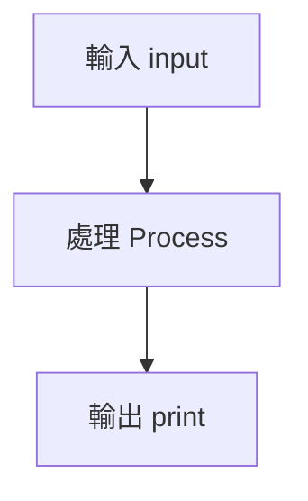

# Python Day01

`<v-clicks>`{=html}

- 變數（Variables）
- 輸入與輸出（Input / Output）
- 資料型別（Data Types）
- 布林與運算子

`</v-clicks>`{=html}

---

# 今天會學什麼？

\<layout: two-cols\>

## Python 基礎流程

`<v-clicks>`{=html}

1. 接收資料
2. 處理資料
3. 輸出結果

`</v-clicks>`{=html}

::right::

\`\`\`python {monaco} name = input("你的名字：")

print( f"你好 {name}" )

    </layout>

    ---

    # Input 輸入函式

    Python 使用 `input()` 取得使用者輸入：

    ```python
    name = input()

    print(name)

`<v-click>`{=html}

`input()` 回傳的資料預設是字串 `str`

`</v-click>`{=html}

---

# 輸入範例

\`\`\`python {monaco} age = input("年齡：")

print(age)

    <v-click>

    如果需要數字：

    ```python
    age = int(input())

`</v-click>`{=html}

---

# 多行輸入

## 使用 sys.stdin

```python
import sys

for line in sys.stdin:
    print(line)
```

`<v-click>`{=html}

適合競賽題目或大量資料處理

`</v-click>`{=html}

---

# Output 輸出

Python 使用 `print()`：

```python
print("Hello Python")
```

`<v-clicks>`{=html}

- 自動換行
- 可以使用 `end`
- 可以格式化字串

`</v-clicks>`{=html}

---

# Print 不換行

```python
print("Hello", end="")
print("Python")
```

輸出：

    HelloPython

---

# 變數 Variables

變數像是一個存放資料的盒子：

```python
name = "Lucas"

age = 20

score = 95.5
```

`<v-click>`{=html}

Python 不需要宣告型別

`</v-click>`{=html}

---

# Python 資料型別

```python
number = 100

price = 99.9

text = "hello"

ok = True

empty = None
```

`<v-clicks>`{=html}

- int 整數
- float 浮點數
- str 字串
- bool 布林值
- None 空值

`</v-clicks>`{=html}

---

# 字串 vs 數字

```python
"123"

123
```

`<v-click>`{=html}

兩者不同：

```python
"123" == 123
```

結果：

    False

`</v-click>`{=html}

---

# 布林值 Boolean

只有兩種：

`<v-clicks>`{=html}

- True
- False

`</v-clicks>`{=html}

---

# 比較運算子

運算子 意義

---

== 等於
!= 不等於
\> 大於
\< 小於
\>= 大於等於
\<= 小於等於

---

# 邏輯運算

```python
age >= 18 and age <= 60
```

`<v-clicks>`{=html}

- `and`：全部成立
- `or`：其中一個成立
- `not`：反轉

`</v-clicks>`{=html}

---

# 數學運算

```python
n = 10

print(n + 2)
print(n - 2)
print(n * 2)
print(n / 2)
print(n // 2)
print(n % 2)
```

---

# 流程圖



---

# 小練習

建立一個程式：

`<v-clicks>`{=html}

1. 輸入名字
2. 輸入年齡
3. 印出問候
4. 判斷奇偶數

`</v-clicks>`{=html}

---

# 範例解答

\`\`\`python {monaco} name = input("名字：")

age = int( input("年齡：") )

print( f"你好 {name}" )

print(age % 2 == 0) \`\`\`

---

# Summary

今天完成：

`<v-clicks>`{=html}

✓ input / print

✓ 變數與型別

✓ Boolean

✓ 運算子

✓ Python 基礎流程

`</v-clicks>`{=html}

---

# Thank You

## Python Day01 Complete
