<div class="absolute inset-0 bg-gradient-to-br from-[#0d1117] via-[#0d1117] to-[#14231a]"></div>

<div class="relative z-10">
  <p class="font-mono text-sm text-[#7ee787] mb-6">$ spring run DomainLab --defense=0..100</p>
  <h1 class="text-5xl">
    <span class="accent-spring">Spring Boot</span>
    <span class="text-white"> × DDD</span>
  </h1>
  <p class="mt-4 text-xl text-gray-300 font-mono">
    <span class="muted">//</span> 從貧血模型到完整領域防線
  </p>
  <div class="mt-14 grid grid-cols-5 gap-3 font-mono text-sm text-center">
    <div class="concept-card"><strong>0%</strong><br><span class="muted">貧血模型</span></div>
    <div class="concept-card"><strong>25%</strong><br><span class="muted">Value Object</span></div>
    <div class="concept-card"><strong>50%</strong><br><span class="muted">充血實體</span></div>
    <div class="concept-card"><strong>75%</strong><br><span class="muted">Aggregate</span></div>
    <div class="concept-card"><strong>100%</strong><br><span class="muted">Event / BC</span></div>
  </div>
</div>

<!--
開場定調：DDD 不是先畫架構圖，而是一道一道補上「領域防線」。
全程用同一個訂單模型。預計 35–45 分鐘。
-->

---
layout: default
hideInToc: true
---

<p class="font-mono text-xs text-gray-500"><span class="accent-green">$</span> cat defense-plan.md</p>

# 今日路線：一個訂單模型的五道防線

<div class="grid grid-cols-2 gap-4 mt-7">
  <div v-click class="concept-card"><strong>0% / 病灶盤點</strong><br><span class="muted">魔法字串、規則散落、非法狀態</span></div>
  <div v-click class="concept-card"><strong>25% / 值物件</strong><br><span class="muted">非法值建不出來</span></div>
  <div v-click class="concept-card"><strong>50% / 充血實體</strong><br><span class="muted">非法狀態不可能存在</span></div>
  <div v-click class="concept-card"><strong>75% → 100% / 邊界</strong><br><span class="muted">Aggregate、Event、Bounded Context</span></div>
</div>

<div v-click class="mt-6 terminal-card text-sm">
  <span class="accent-orange">目標：</span>每往右一格，就少一類「資料怎麼會變成這樣」的靈異事件。
</div>

---
layout: section
transition: fade
---

<p class="font-mono accent-orange">PART 01 — 0%</p>

# 貧血模型

<p class="font-mono muted">Entity 只是資料袋，規則沒有家</p>

---
layout: two-cols
layoutClass: gap-8
---

# Transaction Script 的日常

```java {all|3-4|10-13|14-15|all}
@Entity
public class Order {   // 只有資料，沒有行為
    private String status; // 魔法字串
    private double total;  // 精度看運氣
    // getter / setter 全開
}

@Service
public class OrderService { // 規則全塞在這
    public void pay(Long id, double amount) {
        Order order = repo.findById(id).get();
        if (!"PENDING".equals(order.getStatus()))
            throw new IllegalStateException();
        order.setStatus("PAID");
        order.setPaidAmount(amount); // 負數也照收
        emailService.send(order);
        repo.save(order);
    }
}
```

::right::

<div class="terminal-card mt-14">
  <p class="terminal-label">SMELL REPORT</p>
  <div v-click>× 「何時能付款」的規則寫在 Service</div>
  <div v-click>× 同一條規則在 12 個地方複製漂移</div>
  <div v-click>× <code>setStatus("SHIPPED")</code> 誰都能呼叫</div>
  <div v-click>× PM 說「付款」，程式寫 <code>setStatus</code></div>
  <div v-click class="mt-3 accent-orange">規則沒有家 → 非法狀態隨時出現</div>
</div>

<!--
重點：貧血模型不是「少寫了方法」，是把守護規則的責任丟給每一個呼叫端。
-->

---
layout: section
transition: fade
---

<p class="font-mono accent-orange">PART 02 — 25%</p>

# Value Object

<p class="font-mono muted">非法值，從此建不出來</p>

---
transition: fade
---

# 原始型別 → 值物件

````md magic-move
```java
@Entity
public class Order {
    private String status;  // "PENDING"? "pending"? "PENDNIG"?
    private double total;   // -100 也存得進去
}
```

```java
@Entity
public class Order {
    @Enumerated(EnumType.STRING)
    private OrderStatus status; // 打錯直接編譯不過

    @Embedded
    private Money total;        // 負數金額不存在
}
```
````

<div v-click class="mt-5">

```java
public record Money(BigDecimal amount, Currency currency) {
    public Money {
        if (amount.signum() < 0)
            throw new IllegalArgumentException("金額不可為負");
    }
}
```

</div>

<div v-click class="mt-4 terminal-card text-sm">
  驗證只寫一次、寫在型別裡 —— <span class="accent-orange">不是「每次記得檢查」，是「非法值不存在」</span>。
</div>

<!--
Value Object 三要求：不可變、以值比較、自帶驗證 —— 正好是 Java record 的預設行為。
-->

---
layout: section
transition: fade
---

<p class="font-mono accent-orange">PART 03 — 50%</p>

# 充血模型與領域語言

<p class="font-mono muted">行為搬回實體，程式碼說業務的話</p>

---
layout: two-cols
layoutClass: gap-7
---

# 實體自我守護

```java {all|8-14|16|all}
@Entity
public class Order {
    @Enumerated(EnumType.STRING)
    private OrderStatus status;
    @Embedded private Money total;

    protected Order() {} // 只給 JPA 用

    public void pay(Money amount) {
        if (status != OrderStatus.PENDING)
            throw new OrderNotPayableException(id);
        if (!amount.equals(total))
            throw new PaymentMismatchException();
        this.status = OrderStatus.PAID;
    }

    // 沒有 setStatus()
}
```

::right::

## Service 變薄

```java
@Service
public class OrderService {
    @Transactional
    public void pay(Long id, Money amount) {
        Order order = findOrder(id);
        order.pay(amount);
        // 找到人，請他做事
    }
}
```

<div v-click class="mt-4 concept-card text-sm">
  <strong>Ubiquitous Language</strong><br>
  <span class="muted">PM 說「訂單付款」，程式碼寫 order.pay() —— 翻譯損耗歸零</span>
</div>

<div v-click class="mt-3 terminal-card text-sm">
  狀態轉移必經守衛 → <span class="accent-green">非法狀態不可能存在</span>
</div>

---
---

# 測試也跟著解放

```java
@Test
void 已出貨的訂單不能取消() {
    Order order = shippedOrder(); // 純物件，不用 @SpringBootTest

    assertThatThrownBy(order::cancel)
        .isInstanceOf(OrderAlreadyShippedException.class);
}
```

<div class="mt-6 grid grid-cols-2 gap-4 text-sm">
  <div v-click class="concept-card"><strong>規則只有一份</strong><br><span class="muted">住在它所屬的物件裡，改一處全站生效</span></div>
  <div v-click class="concept-card"><strong>測規則不碰 DB</strong><br><span class="muted">領域邏輯 = 純物件行為，毫秒級驗證</span></div>
</div>

---
---

# 動手拉拉看

<DddMeter />

<!--
邀請學員逐格右移，觀察每一格「翻綠」的防線。
對應網站上的互動文章：/springboot/ddd-in-spring-boot
-->

---
layout: section
transition: fade
---

<p class="font-mono accent-orange">PART 04 — 75%</p>

# Aggregate 與 Repository

<p class="font-mono muted">一致性，終於有了邊界</p>

---
layout: two-cols
layoutClass: gap-7
---

# 聚合根是守門人

```java {all|5-10|12-14|all}
@Entity
public class Order { // Aggregate Root
    @OneToMany(cascade = ALL, orphanRemoval = true)
    private List<OrderItem> items = new ArrayList<>();

    public void addItem(Product product, int qty) {
        if (status != OrderStatus.PENDING)
            throw new OrderLockedException(id);
        items.add(OrderItem.of(product, qty));
        this.total = calculateTotal(); // 不變條件
    }

    public List<OrderItem> items() {
        return List.copyOf(items); // 唯讀副本
    }
}
```

::right::

<div class="terminal-card mt-14">
  <p class="terminal-label">AGGREGATE RULES</p>
  <div v-click>1. 想動邊界內的東西 → 跟 root 說</div>
  <div v-click>2. 一個聚合 = 一個交易（@Transactional 對齊）</div>
  <div v-click>3. 跨聚合只用 ID 參照，不抱整個物件圖</div>
  <div v-click class="mt-3 accent-green">Repository 只服務聚合根：<br>沒有 OrderItemRepository</div>
</div>

<!--
不變條件「total 恆等於明細加總」在交易結束時必然成立。
搭配 @Version 樂觀鎖保護整個聚合的併發。
-->

---
layout: section
transition: fade
---

<p class="font-mono accent-orange">PART 05 — 100%</p>

# Domain Event 與 Bounded Context

<p class="font-mono muted">模組之間，只透過事件說話</p>

---
layout: two-cols
layoutClass: gap-7
---

# 宣告「發生了什麼」

```java {all|5-6|all}
@Entity
public class Order
    extends AbstractAggregateRoot<Order> {

    public void pay(Money amount) {
        ensurePayable(amount);
        this.status = OrderStatus.PAID;
        registerEvent(new OrderPaid(id, total));
    }
}
```

<div v-click class="mt-4 concept-card text-sm">
  <strong>save() 時自動發布</strong><br>
  <span class="muted">@TransactionalEventListener 保證 commit 成功後才處理</span>
</div>

::right::

## 別的模組自己決定要不要關心

```java
@Component
class ShippingHandler {
    @TransactionalEventListener
    void on(OrderPaid event) {
        shippingService.prepare(event.orderId());
    }
}

@Component
class NotificationHandler {
    @TransactionalEventListener
    void on(OrderPaid event) {
        emailService.sendReceipt(event.orderId());
    } // 訂單模組完全不認識它
}
```

---
---

# Bounded Context：同名不同模型

```mermaid {theme: 'dark', scale: 0.7}
flowchart LR
  subgraph O["ordering"]
    P1["Product<br/>價格・庫存"]
  end
  subgraph S["shipping"]
    P2["Product<br/>重量・尺寸"]
  end
  subgraph B["billing"]
    P3["Product<br/>稅率・科目"]
  end
  O -- "OrderPaid" --> S
  O -- "OrderPaid" --> B
  style O fill:#13251a,stroke:#7ee787
  style S fill:#13202a,stroke:#5382a1
  style B fill:#2d1c13,stroke:#e76f00
```



<div v-click class="mt-5 terminal-card text-sm">
  同一個「Product」在不同上下文是不同的模型 ——
  <span class="accent-orange">這不是重複，是解耦</span>。不再用 50 個欄位的萬能 Entity 撐全站。
</div>

---
---

# 0% vs 100%

| 指標 | 0% | 100% |
| --- | --- | --- |
| 非法值 | 負數金額、錯字狀態照收 | Value Object：建構即驗證 |
| 非法狀態 | setter 全開，隨人改 | 狀態轉移必經守衛 |
| 規則位置 | 散落 N 個 Service | 唯一的家，在所屬物件裡 |
| 一致性 | 看緣分 | Aggregate 交易邊界內恆成立 |
| 業務語意 | setStatus("PAID") 要人腦翻譯 | order.pay() 與 PM 同語言 |
| 模組耦合 | 改一行，全站重測 | Event + Bounded Context 分家 |

---
---

# 常見疑慮

<div class="space-y-3 mt-5">
  <div v-click class="concept-card"><strong>JPA Entity 當領域模型，會被綁死嗎？</strong><br><span class="muted">務實折衷可接受：protected 建構子給 JPA、@Embedded 放值物件，領域行為照寫。完全隔離是 100% 之後的選修題。</span></div>
  <div v-click class="concept-card"><strong>跟 @Valid 是什麼關係？</strong><br><span class="muted">@Valid 守輸入格式（DTO），值物件與實體守商業規則。前者擋門口，後者守核心，兩層都要有。</span></div>
  <div v-click class="concept-card"><strong>小專案也要 100%？</strong><br><span class="muted">每一格都是穩定停靠點：CRUD 後台停在 25% 就划算；有真實商業規則的核心模組至少到 50%。</span></div>
</div>

---
---

# 今日重點

<div class="grid grid-cols-2 gap-4 mt-5">
  <div v-click class="concept-card"><strong>25%</strong><br><span class="muted">值物件：非法值建不出來</span></div>
  <div v-click class="concept-card"><strong>50%</strong><br><span class="muted">充血實體：非法狀態不可能存在</span></div>
  <div v-click class="concept-card"><strong>75%</strong><br><span class="muted">Aggregate：一致性有邊界</span></div>
  <div v-click class="concept-card"><strong>100%</strong><br><span class="muted">Event / BC：模組只透過事件說話</span></div>
</div>

<div v-click class="mt-7 text-center text-lg font-mono">
  完美不是「畫滿架構圖」，是<span class="accent-orange">每條規則有唯一的家</span>。
</div>

---
layout: end
class: text-center
---

# Defense complete.

<p class="mt-5 font-mono muted">下一步：互動版文章 /springboot/ddd-in-spring-boot</p>

<div class="mt-10 terminal-card inline-block text-left text-sm">
  <div><span class="accent-green">$</span> spring run DomainLab --defense=100</div>
  <div class="accent-orange mt-2">value object → entity → aggregate → event</div>
</div>

<!--
延伸閱讀回文章：Clean Architecture、@Transactional、樂觀鎖、Application Events，以及姊妹篇 Spring Boot × FP。
-->
