<div class="absolute inset-0 bg-gradient-to-br from-[#0d1117] via-[#0d1117] to-[#14231a]"></div>

<div class="relative z-10">
  <p class="font-mono text-sm text-[#7ee787] mb-6">$ spring run TransactionLab --propagation=REQUIRED</p>
  <h1 class="text-5xl">
    <span class="accent-spring">@Transactional</span>
    <span class="text-white"> 事務管理</span>
  </h1>
  <p class="mt-4 text-xl text-gray-300 font-mono">
    <span class="muted">//</span> 要嘛全做，要嘛全不做 —— 而且命名決定你的命運
  </p>
  <div class="mt-14 grid grid-cols-4 gap-3 font-mono text-sm text-center">
    <div class="concept-card"><strong>begin</strong><br><span class="muted">開啟事務</span></div>
    <div class="concept-card"><strong>commit</strong><br><span class="muted">觸發 flush</span></div>
    <div class="concept-card"><strong>rollback</strong><br><span class="muted">當作沒發生</span></div>
    <div class="concept-card"><strong>proxy</strong><br><span class="muted">幕後功臣</span></div>
  </div>
</div>

<!--
開場比喻：@Transactional 是資料庫界的婚禮主持人——宣布開始、見證過程、
確保雙方要嘛一起幸福，要嘛一起回到單身。預計 30–40 分鐘。
-->

---
layout: default
hideInToc: true
---

<p class="font-mono text-xs text-gray-500"><span class="accent-green">$</span> cat agenda.md</p>

# 今日路線

<div class="grid grid-cols-2 gap-4 mt-7">
  <div v-click class="concept-card"><strong>01 / 是什麼</strong><br><span class="muted">銀行轉帳與三大職責</span></div>
  <div v-click class="concept-card"><strong>02 / 命名即命運</strong><br><span class="muted">全域攔截器的兩套合約</span></div>
  <div v-click class="concept-card"><strong>03 / AOP 代理</strong><br><span class="muted">替身演員如何開關事務</span></div>
  <div v-click class="concept-card"><strong>04 / 陷阱與實踐</strong><br><span class="muted">自我呼叫、rollback 規則、FAQ</span></div>
</div>

<div v-click class="mt-6 terminal-card text-sm">
  <span class="accent-orange">目標：</span>不再問「為什麼我的 @Transactional 沒生效？」
</div>

---
layout: section
transition: fade
---

<p class="font-mono accent-orange">PART 01</p>

# @Transactional 是什麼？

<p class="font-mono muted">先從一筆會失敗的轉帳說起</p>

---
---

# 銀行轉帳的四個步驟

<div class="grid grid-cols-4 gap-3 mt-8 text-center text-sm">
  <div v-click class="concept-card"><strong>1. 開門</strong><br><span class="muted">開啟事務</span></div>
  <div v-click class="concept-card"><strong>2. A 扣錢</strong><br><span class="muted">UPDATE accounts...</span></div>
  <div v-click class="concept-card"><strong>3. B 加錢</strong><br><span class="muted">UPDATE accounts...</span></div>
  <div v-click class="concept-card"><strong>4. 完成</strong><br><span class="muted">Commit</span></div>
</div>

<div v-click class="mt-8 terminal-card">
  <p class="terminal-label">WHAT IF STEP 3 FAILS?</p>
  <div>錢不能憑空消失 —— 銀行說「當作沒發生過」（<span class="accent-orange">Rollback</span>），把錢還給 A。</div>
</div>

<div v-click class="mt-6 text-center text-lg font-mono">
  <code>@Transactional</code> 就是那個確保「<span class="accent-spring">要嘛全做，要嘛全不做</span>」的銀行經理。
</div>

---
---

# 三大職責（外加一個隱藏版）

| 職責 | 說明 | 比喻 |
| --- | --- | --- |
| 開啟合約 | 方法開始時確保有 `EntityManager` | 婚禮開場白 |
| 定義行為 | 「這是不可分割的業務」 | 「你願意嗎？」 |
| 觸發回滾 | 出錯時通知資料庫回滾 | 「我反對！」→ 婚禮取消 |
| <span class="accent-orange">強制同步</span> | 正常結束時觸發 `flush()` | 「我宣布你們...」→ 蓋章生效 |

<div v-click class="mt-5 terminal-card text-sm">
  <span class="accent-orange">最重要的一點：</span>方法正常結束 → commit → <strong>強制 flush()</strong>。
  這就是為什麼你改了 Entity 沒呼叫 save()，資料還是存進去了。
</div>

<!--
第四列是最多人踩坑的：dirty checking + commit 時的 flush。
延伸：持久化上下文那篇文章。
-->

---
layout: section
transition: fade
---

<p class="font-mono accent-orange">PART 02</p>

# 命名即命運

<p class="font-mono muted">全域事務攔截器的兩套合約</p>

---
layout: two-cols
layoutClass: gap-7
---

# 寫入合約

```java
// 這些方法名開頭
// 自動獲得事務保護
add*, save*, create*,
update*, delete*
```

<div v-click class="mt-4 terminal-card text-sm">
  <p class="terminal-label">PROPAGATION_REQUIRED</p>
  <div>「必須有事務！沒有就開一個，有就加入」</div>
  <div class="mt-2 accent-orange">遇 RuntimeException → 回滾</div>
</div>

::right::

# 唯讀合約

```java
// 這些方法名開頭
// 只能讀不能寫
find*, get*, search*,
getCount*, *（其他所有）
```

<div v-click class="mt-4 terminal-card text-sm">
  <p class="terminal-label">PROPAGATION_NOT_SUPPORTED</p>
  <div>「不需要事務，我只是來看看」</div>
  <div class="mt-2 accent-green">setReadOnly(true)：只看不摸</div>
</div>

<!--
為什麼 readOnly？資料庫省鎖、Hibernate 省 dirty checking。
為什麼 NOT_SUPPORTED？查詢不要意外開事務浪費資源。
-->

---
---

# 命名陷阱

```java {1-3|5-8|all}
// ✅ 有事務保護
public void saveUser() { ... }
public void updateOrder() { ... }

// ❌ 沒有事務保護（即使你加了 @Transactional）
public void processUser() { ... }  // 不符合命名規則
public void handleOrder() { ... }  // 被 * 攔截成唯讀
```

<div v-click class="mt-6 terminal-card">
  <p class="terminal-label">PRIORITY</p>
  就算手動打上 <code>@Transactional</code>，<span class="accent-orange">攔截器的優先級更高</span>，
  <code>process*</code> 還是被當成唯讀處理。
</div>

<div v-click class="mt-4 text-center text-lg font-mono">
  方法命名<span class="accent-orange">決定</span>你有沒有事務保護
</div>

---
---

<TxQuiz />

<p class="print-answer hidden mt-4 text-sm">
  列印版答案：C。攔截器以方法名決定事務行為；A 會被攔成唯讀、B 繞過代理。
</p>

<!--
答案 C。先讓學員投票再揭示。A 與 B 正是接下來兩個段落的坑。
-->

---
layout: section
transition: fade
---

<p class="font-mono accent-orange">PART 03</p>

# AOP 代理：幕後功臣

<p class="font-mono muted">Spring 沒有改你的程式碼，它派了替身</p>

---
---

# 替身演員的工作流程

```mermaid {theme: 'dark', scale: 0.75}
flowchart LR
  S["呼叫端<br/>userService.saveUser()"] --> P
  subgraph P["代理 userService$$EnhancerBySpring"]
    direction TB
    A["1. 開門營業<br/>TransactionManager 開連線"]
    B["2. 請君入甕<br/>呼叫真正的 saveUser()"]
    C["3. 結帳走人<br/>commit（觸發 flush）或 rollback"]
    A --> B --> C
  end
  style P fill:#13251a,stroke:#6db33f
  style S fill:#2d1c13,stroke:#e76f00
```



<div v-click class="mt-5 terminal-card text-sm">
  你注入的從來不是你寫的類別，而是 Spring 包了一層事務邏輯的<span class="accent-spring">代理物件</span>。
</div>

<!--
理解代理，後面的自我呼叫陷阱與 private 方法限制就都通了。
-->

---
layout: section
transition: fade
---

<p class="font-mono accent-orange">PART 04</p>

# 陷阱與最佳實踐

<p class="font-mono muted">90% 的「沒生效」都在這裡</p>

---
layout: two-cols
layoutClass: gap-7
---

# 自我呼叫陷阱

```java {all|4-7|10-12|all}
@Service
public class UserService {

    // 🚨 沒有獨立事務！
    public void processAndSave(User user) {
        validateUser(user);
        saveUser(user); // this.saveUser()
    }

    public void saveUser(User user) {
        userRepository.save(user);
    }
}
```

::right::

<div class="terminal-card mt-14">
  <p class="terminal-label">WHY</p>
  <div v-click><code>this.saveUser()</code> 呼叫的是<strong>自己</strong>，不是代理物件 —— AOP 完全沒機會插手。</div>
  <div v-click class="mt-4 accent-green">解法 1：把方法拆到不同 Service</div>
  <div v-click class="mt-2 accent-green">解法 2：注入自己，用 self.saveUser()</div>
</div>

---
---

# 「為什麼沒生效」四大原因

<div class="grid grid-cols-2 gap-4 mt-6">
  <div v-click class="concept-card"><strong>01 命名不符</strong><br><span class="muted">攔截器規則優先，process* 變唯讀</span></div>
  <div v-click class="concept-card"><strong>02 自我呼叫</strong><br><span class="muted">this. 繞過代理</span></div>
  <div v-click class="concept-card"><strong>03 不是 public</strong><br><span class="muted">private 是內心戲，代理看不到</span></div>
  <div v-click class="concept-card"><strong>04 Checked Exception</strong><br><span class="muted">預設只回滾 RuntimeException</span></div>
</div>

<div v-click class="mt-6 terminal-card text-sm">
  <span class="accent-green">$</span> 下次事務沒生效，照這四條依序排查，命中率 90%。
</div>

---
---

# 最佳實踐

<div class="grid grid-cols-2 gap-5 mt-6">
  <div class="terminal-card">
    <p class="terminal-label">DO</p>
    <div v-click>✓ 遵守命名規則：save* / update* / delete*</div>
    <div v-click class="mt-2">✓ 事務方法保持簡短，鎖越短越好</div>
    <div v-click class="mt-2">✓ 只在 Service 層使用</div>
  </div>
  <div class="terminal-card">
    <p class="terminal-label">DON'T</p>
    <div v-click>× 事務方法太長，其他請求排隊</div>
    <div v-click class="mt-2">× 在迴圈裡開事務，效能爆炸</div>
    <div v-click class="mt-2">× 混用不同資料源（那是分散式事務的故事）</div>
  </div>
</div>

---
---

# 今日重點

<div class="grid grid-cols-2 gap-4 mt-5">
  <div v-click class="concept-card"><strong>生命週期管理者</strong><br><span class="muted">開啟、監控、commit（觸發 flush）或 rollback</span></div>
  <div v-click class="concept-card"><strong>命名決定命運</strong><br><span class="muted">攔截器依方法名分配寫入／唯讀合約</span></div>
  <div v-click class="concept-card"><strong>代理是幕後功臣</strong><br><span class="muted">this. 呼叫與 private 方法都繞過它</span></div>
  <div v-click class="concept-card"><strong>唯讀優化</strong><br><span class="muted">查詢用 find* / get*，省鎖省 dirty checking</span></div>
</div>

<div v-click class="mt-7 text-center text-lg font-mono">
  要嘛全做，要嘛全不做 —— <span class="accent-orange">而且方法名說了算</span>。
</div>

---
layout: end
class: text-center
---

# Transaction committed.

<p class="mt-5 font-mono muted">下一步：JPA 持久化上下文，把 flush 與 dirty checking 釐清</p>

<div class="mt-10 terminal-card inline-block text-left text-sm">
  <div><span class="accent-green">$</span> spring run TransactionLab --status</div>
  <div class="accent-orange mt-2">begin → invoke → commit(flush) | rollback</div>
</div>

<!--
延伸閱讀回文章：@Transactional 事務管理、JPA 持久化上下文、樂觀鎖與悲觀鎖。
-->
